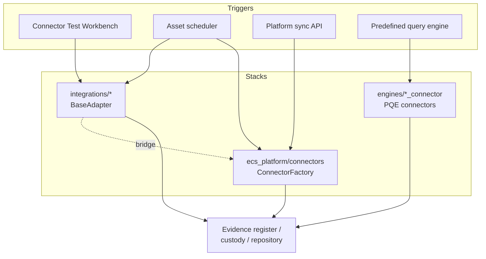
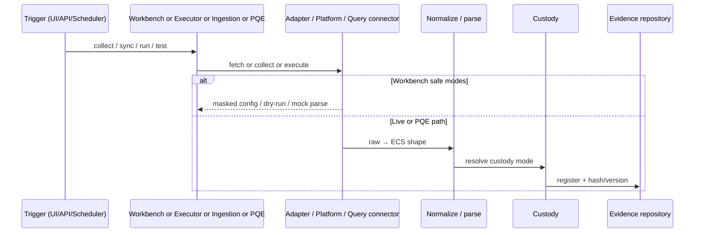

# ECS Connector Architecture (Phase 1)

Navigator for **connector architecture** of the frozen Phase-1 implementation:
framework structure, contracts, discovery/registration, execution lifecycle,
scheduler/PQE relationships, evidence handoff, and error/status handling.

> **Reuse note.** Deepening steps, env-var tables, and per-adapter fetch details
> stay in the connector guides — this page is the architectural map only.
>
> - Adapter framework & interface:
>   [`../connectors/INTEGRATION_ADAPTERS_GUIDE.md`](../connectors/INTEGRATION_ADAPTERS_GUIDE.md)
> - Skeleton → production deepening:
>   [`../connectors/CONNECTOR_DEEPENING_GUIDE.md`](../connectors/CONNECTOR_DEEPENING_GUIDE.md)
> - Workbench runtime:
>   [`../connectors/connector_test_workbench_design.md`](../connectors/connector_test_workbench_design.md)
> - Inventory / status:
>   [`../connectors/ECS_MASTER_INTEGRATION_MATRIX.md`](../connectors/ECS_MASTER_INTEGRATION_MATRIX.md)
> - Integration boundaries:
>   [`INTEGRATION_ARCHITECTURE.md`](INTEGRATION_ARCHITECTURE.md)

---

## 1. Connector framework structure (three stacks)

Phase 1 has **related but distinct** connector stacks. Do not collapse them into
one imaginary framework.

| Stack | Package | Contract center | Used by |
|-------|---------|-----------------|---------|
| **Audit-intelligence adapters** | `modules/operations/integrations/` | `BaseAdapter` in `_base.py`; MS Graph share `ms_graph_base.py` | Connector Test Workbench, scheduler routing, `connector_executor` |
| **Platform ingestion connectors** | `ecs_platform/connectors/` | `BaseConnector` + `ConnectorFactory` (`_REGISTRY` in `factory.py`) | `ecs_platform.ingestion.sync_connector`, platform health/sync APIs |
| **Predefined-query connectors** | `modules/operations/engines/*_connector.py` | Tech-specific execute/parse used by PQE | Predefined query engine / publisher |

Bridge: GitHub, Jenkins, Azure DevOps **adapters** reuse platform connector
clients via `_platform_bridge.py` (documented in Adapters Guide).



---

## 2. Interfaces / contracts

### 2.1 Audit-intelligence adapter contract

Every adapter module exposes (Adapters Guide §2 / Deepening Guide §4):

- `get_config()`, `is_configured()`, `masked_config()`, `health_check()`
- `fetch_*(…)`, `normalize_*(record)`
- `<Name>Client` accepting injectable `transport=` (tests never hit network)

**Standard response envelope:**

```json
{ "ok": true, "source": "jira", "status": "ok", "items": [], "errors": [] }
```

**Status vocabulary:** `ok` · `empty` · `not_configured` · `auth_error` ·
`timeout` · `connection_error` · `http_error` · `transport_error`.

Shared behavior: retry/backoff (bounded), pagination bounds, secret-safe repr.

### 2.2 Platform connector contract

- `ConnectorFactory` maps `type` → class via `_REGISTRY` (gitea, github,
  sonarqube, jenkins, jira, confluence, figma, servicenow, teams, sharepoint,
  prisma, azure_devops — as listed in `factory.py`).
- Config from `config/integrations.yaml` (enabled, base_url, auth_type, collect
  objects, credential env refs).
- Collection through connector `collect_evidence` / ingestion pipeline — see
  platform connector docs and Overview §9.

### 2.3 Predefined-query connector contract

- Technology detection (`TECH_SIGNATURES` / rules) routes to a tech connector.
- PostgreSQL path uses a **read-only allow-list**; other techs use API/subprocess
  / container exec as documented in PQE architecture.
- Detail: [`../operations/ECS_PREDEFINED_QUERY_ARCHITECTURE.md`](../operations/ECS_PREDEFINED_QUERY_ARCHITECTURE.md).

---

## 3. Discovery / registration

| Stack | How connectors are known |
|-------|--------------------------|
| Adapters | Package registry: `list_adapters()`, `masked_config_all()`, `health_check_all()` in `modules.operations.integrations`; Workbench lists via `connector_workbench.list_connectors()` |
| Platform | `ConnectorFactory._REGISTRY` + enabled blocks in `integrations.yaml` |
| PQE | Engine + `query_connectors` / per-tech modules; targets from env YAML (`predefined_query_targets`) |

REST surfaces (architectural pointers only):

- `GET /api/audit/integrations`, `…/health` (adapter health)
- `GET /api/connectors`, `…/config-status`, health/dry-run/parser-test (Workbench)
- `POST /api/platform/sync/{connector}`, `GET /api/platform/health` (platform)

Full endpoint tables: Workbench design + API reference docs.

---

## 4. Execution lifecycle



Lifecycle modes:

| Mode | Network? | Evidence persist? |
|------|----------|-------------------|
| `config_status` / `health_check` (config-based) | No (or probe only as implemented) | No |
| `dry_run` | No | No |
| `parser_test` | Mock transport only | No (preview) |
| Live executor (`ECS_CONNECTOR_EXECUTION_ENABLED`) | Yes | Yes (register/upload path) |
| Platform `sync_connector` | Yes when enabled | Yes via ingestion |
| PQE run | Against configured target | Via publisher / repository path |

---

## 5. Scheduler / PQE relationship

- **Scheduler** selects assets/tech, routes to adapters (and related execution
  services), then evidence registration. Call graph:
  [`../scheduler/runtime_call_graph.md`](../scheduler/runtime_call_graph.md).
- **PQE** does not use the adapter `BaseAdapter` contract; it uses tech query
  connectors and the control library Excel mapping.
- Workbench is for **safe validation** of adapters; scheduler/executor is for
  planned/live collection — see
  [`../scheduler/test_workbench_vs_scheduler.md`](../scheduler/test_workbench_vs_scheduler.md).

---

## 6. Evidence generation and handoff

1. Normalized items (adapter) or query results (PQE) or `EvidenceItem`s (platform).
2. Hashing / duplicate detection / version fields on repository register.
3. Custody `REFERENCE_ONLY` vs `SNAPSHOT` (object store) per
   `evidence_custody` — see Logical Architecture.
4. Optional downstream validation, observations, workflow enrollment, RAG index.

Do not document a second parallel evidence pipeline unless a specific Phase-1
use-case doc states otherwise (SharePoint mock path reuses the existing
pipeline).

---

## 7. Error / status handling (architectural)

| Mechanism | Behavior |
|-----------|----------|
| Adapter `status` field | Classifies auth/timeout/connection/HTTP/transport/not_configured |
| Retry policy | Timeouts/connection/HTTP retried (bounded); auth/not_configured not retried |
| Health surfaces | Adapter health APIs; `/api/platform/health`; Integration Health UI |
| Failure ops | [`../operations/ECS_CONNECTOR_FAILURE_PLAYBOOK.md`](../operations/ECS_CONNECTOR_FAILURE_PLAYBOOK.md), [`../operations/CONNECTOR_TROUBLESHOOTING_RUNBOOK.md`](../operations/CONNECTOR_TROUBLESHOOTING_RUNBOOK.md) |

---

## 8. External system and credential boundaries

- External systems sit outside the ECS container; Compose **profile** services
  (SonarQube, Gitea, Jenkins, ubuntu-demo, …) are optional local stand-ins —
  [`ecs_deployment_architecture.md`](ecs_deployment_architecture.md).
- Credentials: env / vault only; architectural rule set in Adapters + Deepening
  guides. UAT wiring:
  [`../connectors/uat_connector_credentials_guide.md`](../connectors/uat_connector_credentials_guide.md),
  [`../operations/environment-configuration/05_CONNECTOR_CONFIGURATION_GUIDE.md`](../operations/environment-configuration/05_CONNECTOR_CONFIGURATION_GUIDE.md).

---

## 9. Related views

| View | Document |
|------|----------|
| Integration architecture | [`INTEGRATION_ARCHITECTURE.md`](INTEGRATION_ARCHITECTURE.md) |
| Data flow | [`DATA_FLOW_ARCHITECTURE.md`](DATA_FLOW_ARCHITECTURE.md) |
| Evidence lifecycle | [`EVIDENCE_LIFECYCLE.md`](EVIDENCE_LIFECYCLE.md) |
| Logical end-to-end | [`LOGICAL_ARCHITECTURE.md`](LOGICAL_ARCHITECTURE.md) |
| Enterprise connector API | [`../connectors/enterprise_connector_api_reference.md`](../connectors/enterprise_connector_api_reference.md) |
| Microsoft Graph | [`../graph-api/MS_GRAPH_CONNECTOR_GUIDE.md`](../graph-api/MS_GRAPH_CONNECTOR_GUIDE.md) |

---

## Verification notes

- `_REGISTRY` membership verified against `ecs_platform/connectors/factory.py`
  (documentation lists those keys; enablement still config-dependent).
- Adapter list grows in Adapters Guide — treat that guide + Matrix as SoT for
  “which adapters exist,” not older fixed counts in the Architecture Index.
