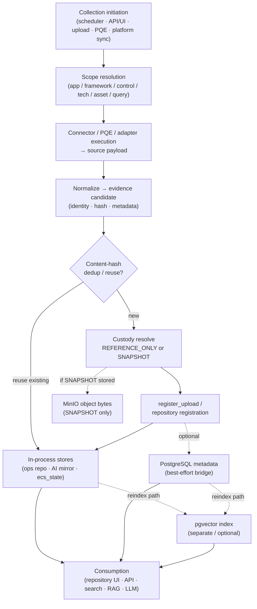

# ECS Data Flow Architecture (Phase 1)

End-to-end **data flow** view of the frozen Phase-1 implementation: how collection
triggers become normalized evidence, how custody and versioning apply, which
persistence planes are touched, and how dashboards/search/RAG consume results.

> **Reuse note.** Component relationships:
> [`LOGICAL_ARCHITECTURE.md`](LOGICAL_ARCHITECTURE.md). Integration triggers:
> [`INTEGRATION_ARCHITECTURE.md`](INTEGRATION_ARCHITECTURE.md),
> [`CONNECTOR_ARCHITECTURE.md`](CONNECTOR_ARCHITECTURE.md). Data model:
> [`ECS_DATA_ARCHITECTURE_REFERENCE.md`](ECS_DATA_ARCHITECTURE_REFERENCE.md).
> Lifecycle stages/states:
> [`EVIDENCE_LIFECYCLE.md`](EVIDENCE_LIFECYCLE.md).

> **Critical persistence rule.** Successful `register_upload` / in-process
> repository update does **not** automatically mean a PostgreSQL commit.
> Operations registration stamps outcomes such as `postgresql_persisted` /
> `postgres_action` (`SKIPPED_*` / `FAILED` / `REUSED` / success). Treat PG,
> MinIO, and pgvector as **optional / best-effort / gated** unless the path and
> environment establish otherwise.

---

## 1. Concept glossary (do not conflate)

| Concept | Meaning in Phase 1 |
|---------|-------------------|
| **Logical evidence record** | Application-level evidence identity used by UI/workflow (e.g. upload id / evidence id after `register_upload`) |
| **Evidence metadata** | Structured fields (source, app, control/framework tags, timestamps, hash, custody_mode, urls) held in process and/or SQL |
| **Evidence version** | Version chain for the same logical key (operations `record_version` / AI `EvidenceArtifact` version bumps on `store_evidence`) |
| **Physical evidence artifact** | Immutable bytes (file content) when SNAPSHOT custody stores them |
| **Custody / storage outcome** | `REFERENCE_ONLY` (metadata + source reference) vs `SNAPSHOT` (bytes stored) + reason/stored flags from `evidence_custody` |
| **Object-storage key / URI** | Location of SNAPSHOT bytes in MinIO/S3-compatible store (`object_uri` / bucket key) — only when snapshot succeeds |
| **Embedding / vector record** | Chunk row in pgvector (`evidence_embeddings`) for semantic retrieval — **separate** from collect/register |

---

## 2. End-to-end data flow (Phase 1)

One flowchart for the architecture (detail sequences live in linked docs):



---

## 3. Collection initiation

| Trigger | Typical entry | Scope inputs |
|---------|---------------|--------------|
| Asset-driven scheduler | Scheduler UI/API → `asset_scheduler` / execution services | Assets, technologies, planned jobs |
| Predefined query | `/mvp/predefined-queries` / PQE APIs → `predefined_queries_engine` | Framework/control/query + target tech |
| Evidence orchestrator | Audit-intelligence run APIs (`evidence_orchestrator` / `evidence_service`) | `technology` / `framework` / `control` / `asset` / `application` / `environment` / `all` |
| Connector Test Workbench | Safe config/dry-run/parser-test (usually **no** persist) | Named adapter |
| Live connector executor | Opt-in live collect → `register_upload` | Configured adapter + execution flag |
| Platform sync | `POST /api/platform/sync/{connector}` → `ecs_platform.ingestion` | Connector name from `integrations.yaml` |
| Manual / bulk upload | Upload routes → `register_upload` | File + framework/app/control context |

Deep links: [`SCHEDULER_ARCHITECTURE.md`](SCHEDULER_ARCHITECTURE.md),
[`../scheduler/`](../scheduler/README.md),
[`../operations/ECS_PREDEFINED_QUERY_ARCHITECTURE.md`](../operations/ECS_PREDEFINED_QUERY_ARCHITECTURE.md),
[`../evidence-management/EVIDENCE_COLLECTION_GUIDE.md`](../evidence-management/EVIDENCE_COLLECTION_GUIDE.md),
[`CONNECTOR_ARCHITECTURE.md`](CONNECTOR_ARCHITECTURE.md).

---

## 4. Collection and connector execution

```
Initiator → Scheduler | PQE | Executor | Ingestion
         → Query connector | Enterprise adapter | Platform connector
         → External system / demo target
         → Normalized items / query result / EvidenceItem list
```

- Returned source data is **normalized** into ECS shapes before registration
  (adapter envelope `{ok,status,items,errors}` or platform evidence items or PQE
  pass/fail + excerpt).
- External enablement is **configuration-dependent** (Matrix ⚙/🔵). Inventory:
  [`../connectors/ECS_MASTER_INTEGRATION_MATRIX.md`](../connectors/ECS_MASTER_INTEGRATION_MATRIX.md).

---

## 5. Evidence processing

| Step | Behavior (Phase 1) | Notes |
|------|--------------------|-------|
| Creation / normalization | Build candidate metadata + content excerpt/bytes | Secrets must not be stored in AI repository paths |
| Identity | Evidence id allocation; keys such as `asset::control` in AI repo | Operations upload ids vs AI `evidence_key` coexist |
| Dedup | SHA-256 content-hash reuse can short-circuit new storage | `find_upload_by_sha256` / AI `find_by_content_hash`; `postgres_action=REUSED` possible |
| Registration | Canonical bridge: `operations.evidence_repository.register_upload` | Mirrors into audit-intelligence `store_evidence` where wired |
| Metadata | Source, app, control/framework tags, custody fields, hashes | Carried on the in-process record; may also bridge to SQL |
| Versioning | New upload/re-exec can bump version / lineage | See PQE guide §13; AI `store_evidence` versions by key |
| Custody | `evidence_custody.resolve_custody` | Default `REFERENCE_ONLY`; `SNAPSHOT` when snapshot enabled |

---

## 6. Persistence boundaries (planes)

| Plane | What it holds | When it is written |
|-------|---------------|--------------------|
| **In-process operations repository** | Upload/search index for demo & runtime | On `register_upload` (primary happy path) |
| **In-process AI evidence repository** | Versioned `EvidenceArtifact` metadata + hashes | Mirror from upload / `store_evidence` / orchestrator |
| **`ecs_state`** | Workflow enrollments, demo registries | Demo/workflow paths |
| **PostgreSQL (`ecs_repository` / governance)** | Durable structured evidence, maps, reviews, sync history | **Best-effort** bridge from registration / platform repository init — check `postgresql_persisted` |
| **MinIO (`ecs-evidence`)** | Physical artifact bytes | **Only** when SNAPSHOT custody stores successfully |
| **pgvector (`ecs_vectors`)** | Embeddings for RAG | Index/reindex path — **not** implied by every register |
| **Audit persistence provider** | Optional durable AI entities | Defaults to **in-memory**; SQL backend pluggable (`sql_persistence`) — does not replace engines by itself |

Authoritative schema narrative:
[`ECS_DATA_ARCHITECTURE_REFERENCE.md`](ECS_DATA_ARCHITECTURE_REFERENCE.md).
Custody implementation:
`modules/audit_intelligence/services/evidence_custody.py`.
Registration bridge comments:
`modules/operations/engines/evidence_repository.py` (`_mirror_postgres` /
`postgresql_persisted` stamping).

---

## 7. Consumption flows

| Consumer | Reads from (typical) | Doc |
|----------|----------------------|-----|
| Evidence repository / explorer UI | In-process ops/AI repos; platform evidence APIs when DB present | [`../evidence-management/OBSERVATION_AND_REPOSITORY_GUIDE.md`](../evidence-management/OBSERVATION_AND_REPOSITORY_GUIDE.md) |
| Dashboards / drilldowns | Engines + `ecs_state` / analytics builders | Overview / HLD |
| Faceted search | Repository search APIs / `/mvp/search` | Evidence Reference Guide §10 |
| Semantic retrieval / RAG | pgvector + SQL fallback + grounding | [`../ai-sdlc/ECS_AI_ARCHITECTURE_REFERENCE.md`](../ai-sdlc/ECS_AI_ARCHITECTURE_REFERENCE.md) |
| Chatbot / audit LLM | RAG orchestrator / audit-LLM routes | AI Architecture + audit-intelligence docs |

---

## 8. Partial success and failure (data-flow significant)

| Outcome | Architectural meaning |
|---------|----------------------|
| Workbench dry-run / parser-test | No durable evidence expected |
| Connector `not_configured` / `auth_error` | No successful register |
| Orchestrator `Partially Completed` | Some controls succeeded; others failed/config-required |
| Dedup reuse | No new object bytes; metadata may reference existing hash |
| `postgresql_persisted=false` | In-process success possible **without** SQL commit |
| SNAPSHOT `stored=false` | Custody may remain reference-only with reason |
| Index skip | Evidence can be repository-visible without embeddings |

---

## 9. Related views

| View | Document |
|------|----------|
| Evidence lifecycle | [`EVIDENCE_LIFECYCLE.md`](EVIDENCE_LIFECYCLE.md) |
| Logical components | [`LOGICAL_ARCHITECTURE.md`](LOGICAL_ARCHITECTURE.md) |
| Deployment stores | [`ecs_deployment_architecture.md`](ecs_deployment_architecture.md) |
| Enterprise evidence diagram (bank context) | [`ENTERPRISE_ARCHITECTURE.md`](ENTERPRISE_ARCHITECTURE.md) §6 — prefer this doc for Phase-1 persistence caveats |

---

## Verification notes

- `register_upload` PostgreSQL outcome stamping verified in
  `modules/operations/engines/evidence_repository.py`.
- Audit-intelligence persistence foundation defaults to in-memory
  (`modules/audit_intelligence/services/persistence.py`).
- Do not silently merge older “Postgres is always the system of record on every
  collect” wording with demo/in-memory behavior.
