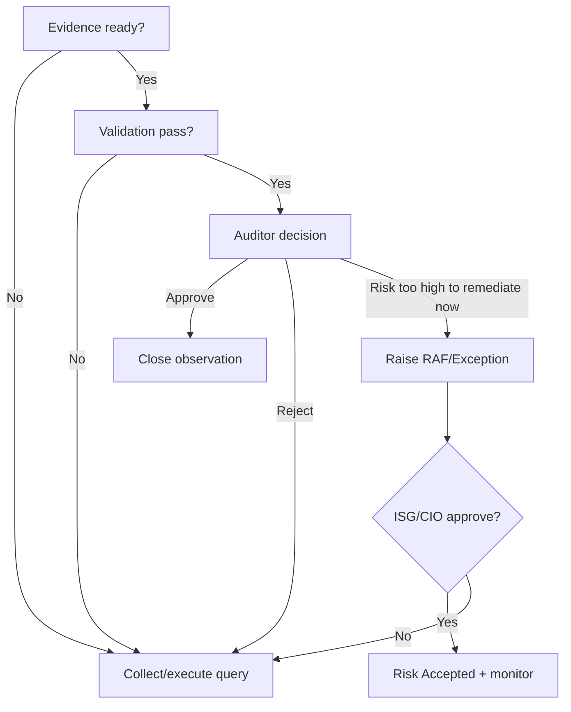
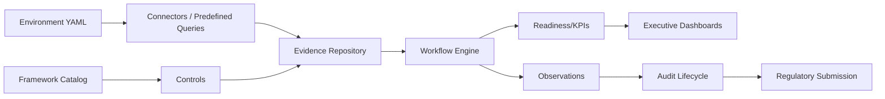
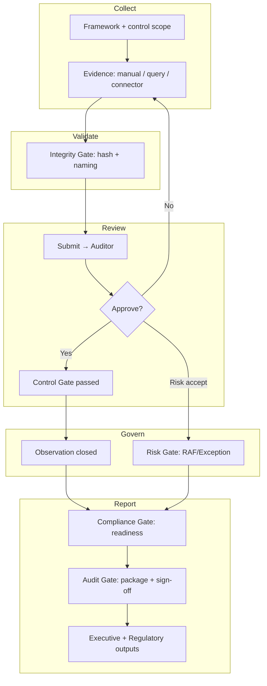

# ECS Business Process Model

**Type:** Enterprise architecture / BPMN-style model. No code modified.
**Date:** 2026-06-17
**Grounding:** ECS modules (`modules/`, `app/`, `ecs_platform/`),
`config/rbac.yaml`, workflow engines. Gates not enforced in code are marked
**(Inferred Enterprise Workflow)**.

**Navigation:** [Workflow Orchestration Guide](ECS_WORKFLOW_ORCHESTRATION_GUIDE.md) ·
[Role Action Matrix](ECS_ROLE_ACTION_MATRIX.md) ·
[State Transition Matrix](ECS_STATE_TRANSITION_MATRIX.md) ·
[SLA & Escalation](ECS_SLA_ESCALATION_MATRIX.md) ·
[Sequence Diagrams](ECS_SEQUENCE_DIAGRAMS.md)

---

## 1. Actors

| Actor | Role mapping | Responsibility |
|-------|--------------|----------------|
| Application Owner | `application_owner` | Collect/upload/submit evidence |
| Evidence/Control Owner | `control_owner` | Own control evidence |
| Auditor / Reviewer / Approver | `auditor` | Review, approve/reject, close, escalate |
| Function Head | `functional_head` | Function-level oversight & attestation |
| Vertical Head | `vertical_head` | Vertical consolidation & sign-off |
| CIO | `cio` | Enterprise readiness + exception approval |
| CISO | `security_officer` | Security findings, compensating controls, risk |
| ISG / Governance / Compliance / Risk | `compliance_officer` (+cio) | Policy, framework mgmt, RAF/exception governance |
| ECS Administrator | `admin`/`system_admin` | Platform administration |
| Automation | predefined queries / connectors | Machine evidence generation |

## 2. Inputs

- Framework catalog & control library (`framework_catalog.py`, control Excel)
- Application inventory (`applications.*` YAML)
- Manual evidence uploads, connector pulls, predefined-query outputs
- Environment configuration (`config/environments/*.yaml`)
- Regulatory requirements (PCI/RBI/NPCI/ISO/SOC2…)

## 3. Outputs

- Validated, versioned, reusable evidence (`evidence_repository`)
- Closed observations & findings
- Framework readiness scores & KPIs (`_framework_metrics`)
- Audit packages & reports (`reporting.export_path`)
- Executive dashboards & regulator submissions
- Durable audit trail (`audit_trail`, `app/audit`)

## 4. Business events

| Event | Source |
|-------|--------|
| Evidence uploaded / submitted / approved / rejected | workflow engine |
| Predefined query executed (Success/Failed) | predefined query engine |
| Observation opened / assigned / closed | governance engine |
| Exception / RAF raised / approved / expired | exception governance |
| Connector sync completed / failed | integration health |
| Framework readiness recomputed | framework workflow engine |
| Audit started / completed | audit lifecycle |

## 5. Decision points

## 6. Approvals

| Approval gate | Approver | Grounding |
|---------------|----------|-----------|
| Evidence approval | Auditor | `evidence.approve` |
| Observation closure | Auditor (auto on approval) | `observation.close` |
| Exception / RAF | ISG/Compliance + CIO | `exception.approve` |
| Framework onboarding | CIO/Compliance/Auditor | `can_review_framework_onboarding` |
| Function/Vertical sign-off | FH/VH | Inferred overlay |
| Platform admin actions | Admin | `can_admin_platform` |

## 7. Escalations
See [SLA & Escalation Matrix](ECS_SLA_ESCALATION_MATRIX.md). Ladder: Owner →
Auditor → Function Head → Vertical Head → CISO/Compliance/ISG → CIO → Risk/Audit
Committee (`can_escalate`).

## 8. Dependencies

## 9. Gates

| Gate type | Definition | Enforcement |
|-----------|------------|-------------|
| **Control Gate** | Control must have approved, current evidence | `_infer_control_state` + approval |
| **Compliance Gate** | Framework readiness ≥ target before "Completed/Approved" | `_framework_metrics` readiness |
| **Risk Gate** | Non-compliant control needs remediation or approved RAF | exception governance |
| **Audit Gate** | Audit package complete + findings remediated/accepted before sign-off | audit lifecycle |
| **Config Gate** | SIT/UAT/PROD startup fails on invalid config | `config_validation` startup hook |
| **Integrity Gate** | Evidence SHA-256 must validate | `integrity_check` |

## 10. End-to-end process (BPMN-style)

