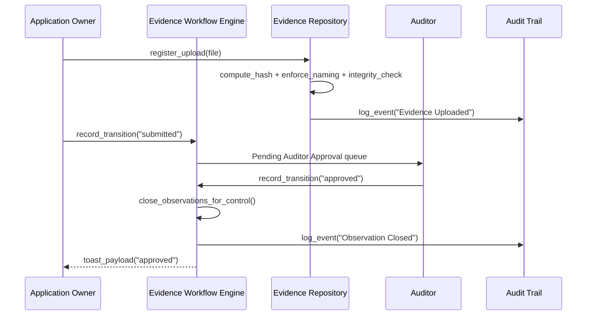
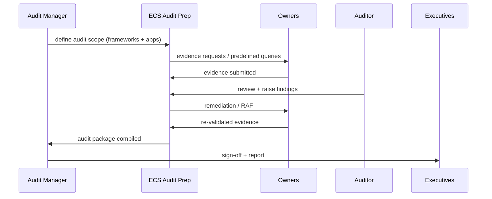
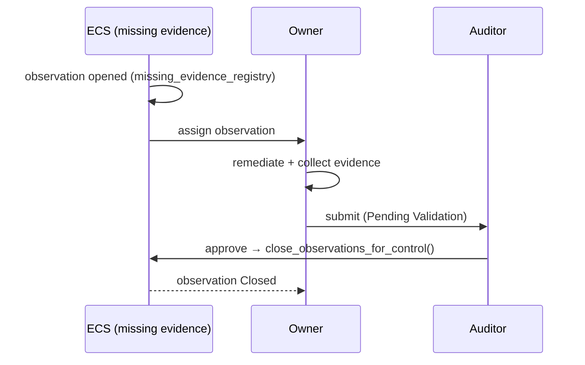
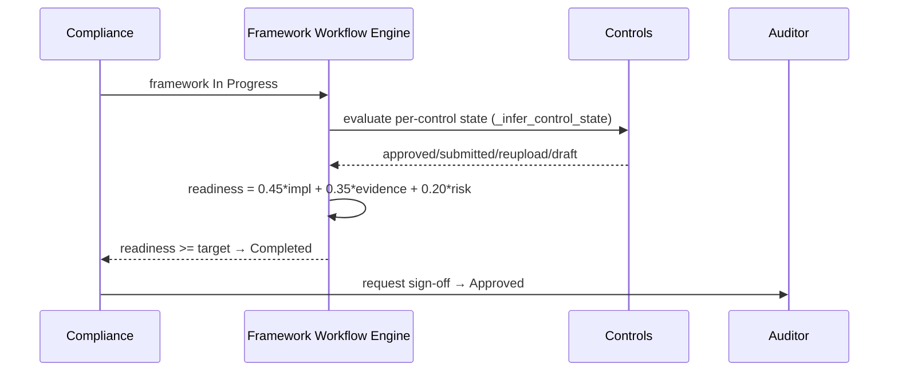
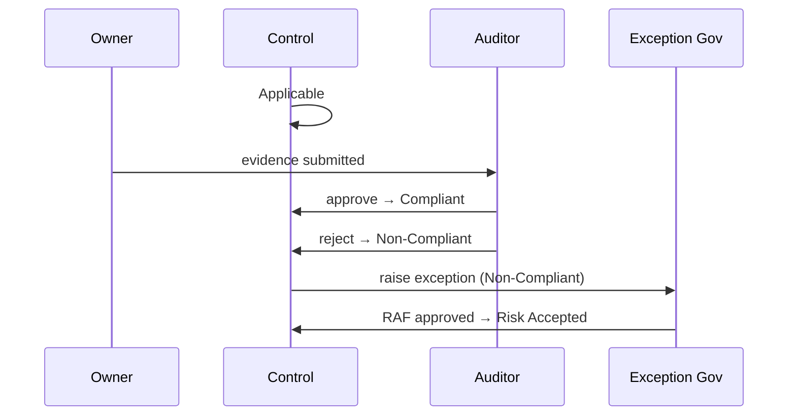
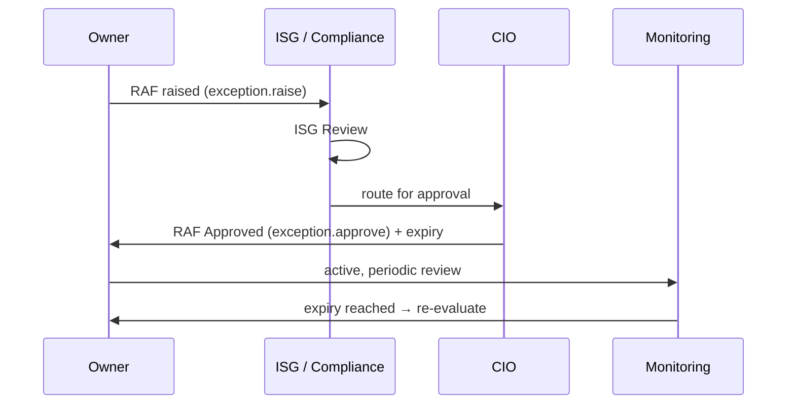
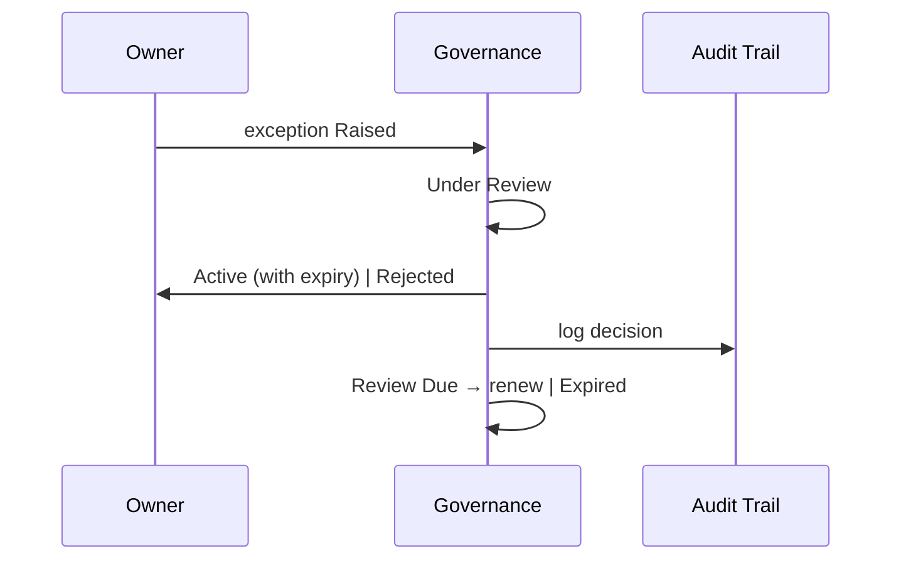
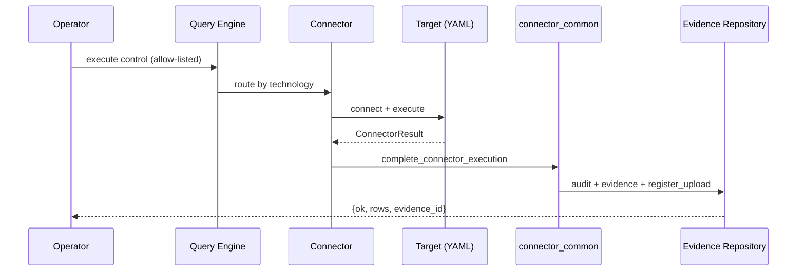
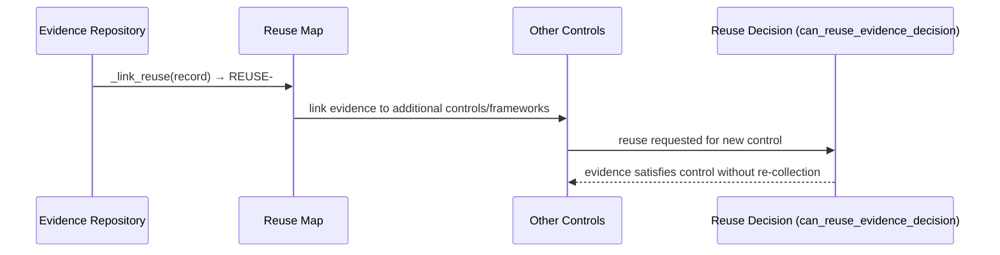
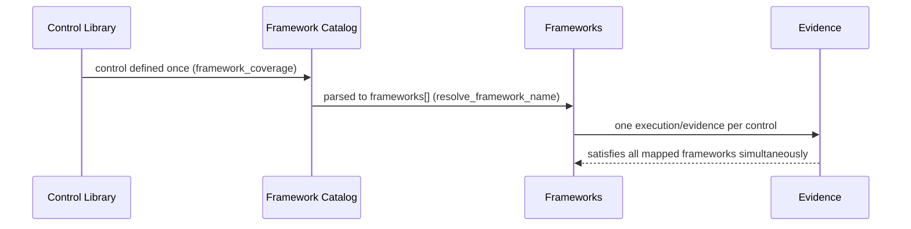

# ECS Sequence Diagram Library

**Type:** Architecture / auditor-grade sequence reference. No code modified.
**Date:** 2026-06-17
**Grounding:** workflow engines, evidence repository, predefined-query engines,
exception governance, framework workflow engine. Inferred interactions are noted.

**Navigation:** [Workflow Orchestration Guide](ECS_WORKFLOW_ORCHESTRATION_GUIDE.md) ·
[State Transition Matrix](ECS_STATE_TRANSITION_MATRIX.md) ·
[Role Action Matrix](ECS_ROLE_ACTION_MATRIX.md) ·
[Predefined Query Execution Workflow](../OPERATIONS/ECS_PREDEFINED_QUERY_EXECUTION_WORKFLOW.md)

---

## 1. Evidence lifecycle

## 2. Audit lifecycle

## 3. Observation lifecycle

## 4. Framework lifecycle

## 5. Control lifecycle

## 6. RAF lifecycle

## 7. Exception lifecycle

## 8. Predefined query lifecycle

## 9. Evidence reuse lifecycle

## 10. Control reuse lifecycle

