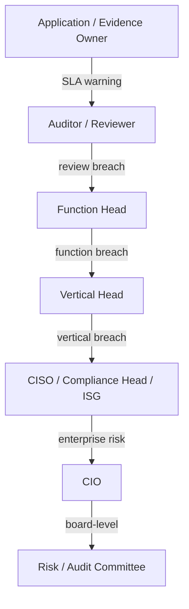

# ECS SLA & Escalation Matrix

**Type:** Enterprise / auditor-grade SLA reference. No code modified.
**Date:** 2026-06-17
**Grounding:** `evidence_workflow_engine.build_analytics` exposes live SLA
signals — `avg_review_days = 3.2`, `sla_compliance_pct = 94.5`, `pending_aging_days`,
and an "Auditor SLA — within 5-day target" card. Numeric SLA **targets** below
are enterprise-banking defaults (**Inferred Enterprise Workflow**) calibrated to
those signals; escalation paths use the grounded `can_escalate` capability.

**Navigation:** [Workflow Orchestration Guide](ECS_WORKFLOW_ORCHESTRATION_GUIDE.md) ·
[Role Action Matrix](ECS_ROLE_ACTION_MATRIX.md) ·
[State Transition Matrix](ECS_STATE_TRANSITION_MATRIX.md) ·
[Notification Matrix](ECS_NOTIFICATION_MATRIX.md)

---

## 1. SLA targets

| Workflow stage | Target SLA | Warning | Breach | Grounding |
|----------------|-----------|---------|--------|-----------|
| Evidence Submission (Owner) | 5 business days from request | 3 days | > 5 days | `pending_aging_days`; default |
| Auditor Review | 5 business days (target card) | 3 days | > 5 days | `sla_compliance_pct 94.5`, 5-day card |
| Function Head Approval | 3 business days | 2 days | > 3 days | Inferred |
| Vertical Head Approval | 3 business days | 2 days | > 3 days | Inferred |
| CIO Approval | 5 business days | 3 days | > 5 days | Inferred |
| RAF / Exception Approval | 7 business days (ISG review) | 5 days | > 7 days | `active_exceptions`; default |
| Observation Closure | 30 days (severity-scaled) | 20 days | > 30 days | `draft_age_days` ranges; default |
| Framework Assessment | per audit cycle (quarterly) | 80% of window | window end | readiness cadence; default |
| Control Validation | 10 business days | 7 days | > 10 days | `review_days` 1–10d; default |

Severity-scaled observation closure (default banking matrix):

| Severity | Closure SLA |
|----------|-------------|
| Critical | 7 days |
| High | 15 days |
| Medium | 30 days |
| Low | 60 days |

## 2. Escalation hierarchy

Grounded escalation actors (`can_escalate`: owner, auditor, cio, vertical_head,
compliance_head, enterprise_admin) arranged into the enterprise ladder:

## 3. Escalation trigger matrix

| Trigger | From → To | Action |
|---------|-----------|--------|
| Evidence submission overdue | Owner → Auditor | reminder + auditor flag |
| Auditor review overdue | Auditor → Function Head | escalate (`escalated_controls`) |
| Repeated re-upload (≥3) | Auditor → Compliance | quality escalation |
| Observation past closure SLA | Owner → Vertical Head | overdue escalation |
| RAF pending > 7 days | ISG → CIO | exception escalation |
| Critical finding open > 7 days | Auditor → CISO → CIO | severity escalation |
| Framework readiness < target near cycle end | Compliance → CIO | readiness escalation |

## 4. SLA monitoring signals (live)

From `build_analytics` (per role/framework):

| Signal | Source field | Meaning |
|--------|--------------|---------|
| Approval rate % | `approval_rate_pct` | closed / population |
| Avg review time | `avg_review_days` (3.2d demo) | submit→close mean |
| Pending aging | `pending_aging_days` | mean age in queue |
| Auditor SLA compliance | `sla_compliance_pct` (94.5%) | within 5-day target |
| Rejection trend | `rejection_trend` | re-upload pressure |

## 5. Escalation governance notes (Inferred)
- Escalations are state overlays (`Escalated` auditor state) plus audit-trail
  events; automated SLA timers/cron escalation are recommended Phase 2.
- Maker-checker: enforce that the escalation approver differs from the submitter
  (Phase 2 RBAC rationalization).
