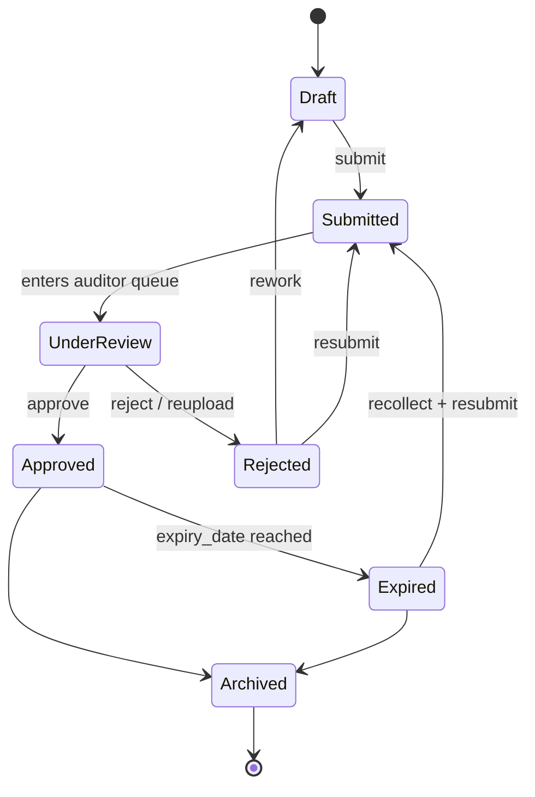
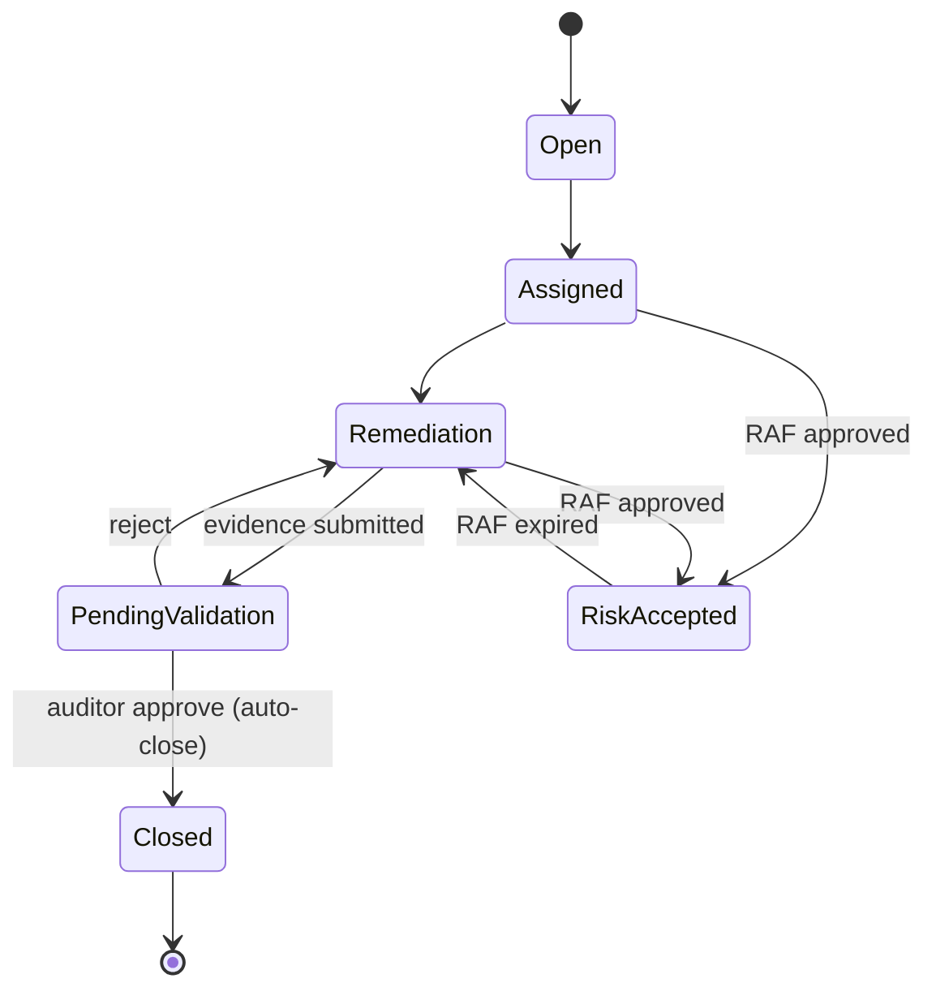
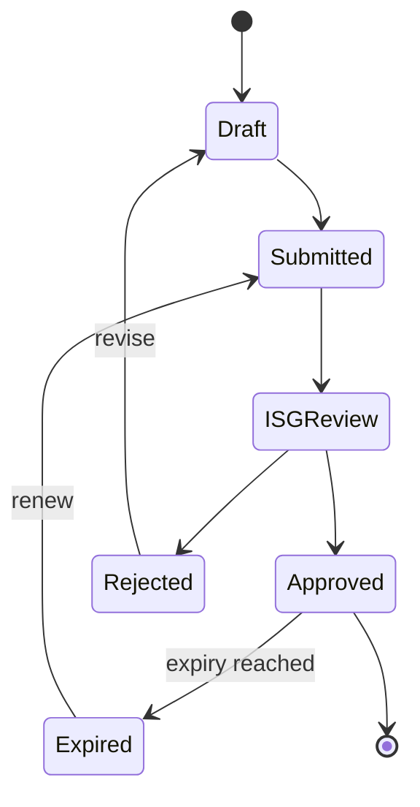
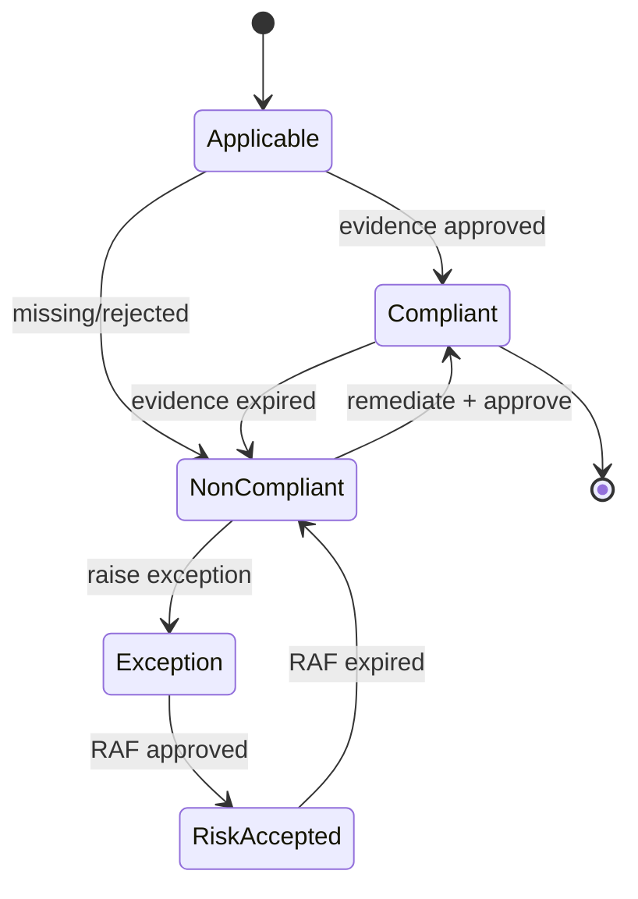
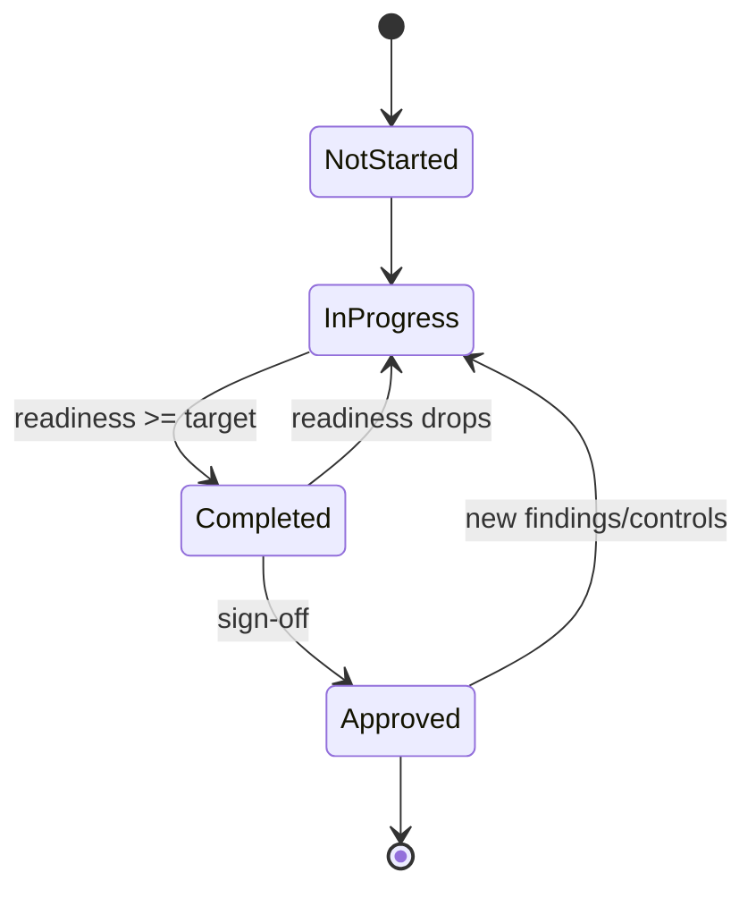

# ECS State Transition Matrix

**Type:** Auditor / architecture-grade state reference. No code modified.
**Date:** 2026-06-17
**Grounding:** `modules/shared/services/evidence_workflow_engine.py`
(`OWNER_STATES`, `AUDITOR_STATES`, `resolve_state`, `_action_to_status`),
`framework_workflow_engine.py` (`_infer_control_state`), `ecs_state` registries.
Requested states not represented 1:1 in code are mapped to the engine label and
marked **(Inferred)**.

**Navigation:** [Workflow Orchestration Guide](ECS_WORKFLOW_ORCHESTRATION_GUIDE.md) ·
[Role Action Matrix](ECS_ROLE_ACTION_MATRIX.md) ·
[SLA & Escalation](ECS_SLA_ESCALATION_MATRIX.md)

---

## 1. Evidence states

Requested: Draft, Submitted, Under Review, Approved, Rejected, Expired, Archived.
ECS engine labels (mapping shown):

| Requested state | ECS engine label | Source |
|-----------------|------------------|--------|
| Draft | `Draft` | OWNER_STATES.draft |
| Submitted | `Pending Auditor Approval` | OWNER_STATES.submitted |
| Under Review | `Pending Auditor Approval` (auditor queue) | AUDITOR_STATES.pending |
| Approved | `Closed` | OWNER_STATES.approved |
| Rejected | `Rejected By Auditor` / `Needs Rework` | OWNER_STATES.rejected/reupload |
| Expired | `Expired` (evidence `expiry_date`) **(Inferred)** | repository expiry |
| Archived | `Archived` **(Inferred Enterprise State)** | recommended Phase 2 |

### Valid transitions (evidence)

| From ↓ \ To → | Draft | Submitted | Under Review | Approved | Rejected | Expired | Archived |
|---------------|:-----:|:---------:|:------------:|:--------:|:--------:|:-------:|:--------:|
| Draft | — | ✅ submit | ➖ | ➖ | ➖ | ➖ | ➖ |
| Submitted | ✅ cancel | — | ✅ auto | ✅ approve | ✅ reject | ➖ | ➖ |
| Under Review | ➖ | ➖ | — | ✅ approve | ✅ reject/reupload | ➖ | ➖ |
| Approved (Closed) | ➖ | ➖ | ➖ | — | ➖ | ✅ on expiry | ✅ archive |
| Rejected/Needs Rework | ✅ rework | ✅ resubmit | ➖ | ➖ | — | ➖ | ➖ |
| Expired | ✅ recollect | ✅ resubmit | ➖ | ➖ | ➖ | — | ✅ archive |
| Archived | ➖ | ➖ | ➖ | ➖ | ➖ | ➖ | — |

## 2. Observation states

Requested: Open, Assigned, Remediation, Pending Validation, Closed, Risk Accepted.
Grounded in `missing_evidence_registry` statuses + `closed_observations` +
`close_observations_for_control`.

| From ↓ \ To → | Open | Assigned | Remediation | Pending Validation | Closed | Risk Accepted |
|---------------|:----:|:--------:|:-----------:|:------------------:|:------:|:-------------:|
| Open | — | ✅ assign | ➖ | ➖ | ➖ | ➖ |
| Assigned | ➖ | — | ✅ start remediation | ➖ | ➖ | ✅ raise RAF |
| Remediation | ➖ | ➖ | — | ✅ submit evidence | ➖ | ✅ raise RAF |
| Pending Validation | ➖ | ➖ | ✅ reject | — | ✅ approve | ✅ raise RAF |
| Closed | ➖ | ➖ | ➖ | ➖ | — | ➖ |
| Risk Accepted | ➖ | ➖ | ✅ on expiry | ➖ | ✅ remediate | — |

## 3. RAF states

Requested: Draft, Submitted, ISG Review, Approved, Rejected, Expired.
Grounded in `exception.raise`/`exception.approve` + `active`/`review due`/`expired`
exception statuses. RAF labelling is **(Inferred Enterprise Workflow)**.

| From ↓ \ To → | Draft | Submitted | ISG Review | Approved | Rejected | Expired |
|---------------|:-----:|:---------:|:----------:|:--------:|:--------:|:-------:|
| Draft | — | ✅ submit | ➖ | ➖ | ➖ | ➖ |
| Submitted | ✅ recall | — | ✅ route | ➖ | ➖ | ➖ |
| ISG Review | ➖ | ➖ | — | ✅ approve | ✅ reject | ➖ |
| Approved | ➖ | ➖ | ✅ renew review | — | ➖ | ✅ on expiry |
| Rejected | ✅ revise | ➖ | ➖ | ➖ | — | ➖ |
| Expired | ✅ renew | ✅ resubmit | ➖ | ➖ | ➖ | — |

## 4. Control states

Requested: Applicable, Compliant, Non-Compliant, Exception, Risk Accepted.
Grounded in `_infer_control_state` (approved/submitted/reupload/draft) + exception
overlays.

| From ↓ \ To → | Applicable | Compliant | Non-Compliant | Exception | Risk Accepted |
|---------------|:----------:|:---------:|:-------------:|:---------:|:-------------:|
| Applicable | — | ✅ evidence approved | ✅ missing/rejected | ➖ | ➖ |
| Compliant | ➖ | — | ✅ evidence expired/failed | ➖ | ➖ |
| Non-Compliant | ➖ | ✅ remediate+approve | — | ✅ raise exception | ➖ |
| Exception | ➖ | ✅ remediate | ✅ exception rejected | — | ✅ RAF approved |
| Risk Accepted | ➖ | ✅ remediate | ✅ RAF expired | ➖ | — |

## 5. Framework states

Requested: Not Started, In Progress, Completed, Approved.
Grounded in `_framework_metrics` readiness scoring + control buckets.

| From ↓ \ To → | Not Started | In Progress | Completed | Approved |
|---------------|:-----------:|:-----------:|:---------:|:--------:|
| Not Started | — | ✅ first evidence | ➖ | ➖ |
| In Progress | ➖ | — | ✅ readiness ≥ target | ➖ |
| Completed | ➖ | ✅ readiness drops | — | ✅ compliance sign-off |
| Approved | ➖ | ✅ new controls/findings | ➖ | — |

## 6. Cross-state guard rules (grounded)
- `can_approve` / `can_reject` only when `code == "submitted"` (`resolve_state`).
- `can_submit` only from `draft|rejected|reupload` and never when `approved`.
- `is_locked` when `approved` or `cancelled`.
- Observation auto-closes only when evidence is `approved` and observation still
  open (`can_close_observation`).
