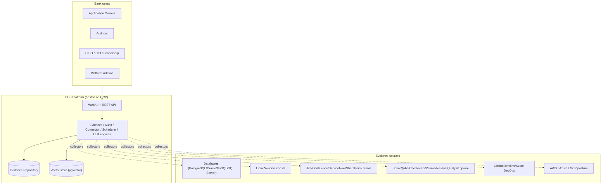
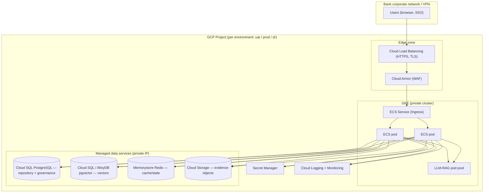
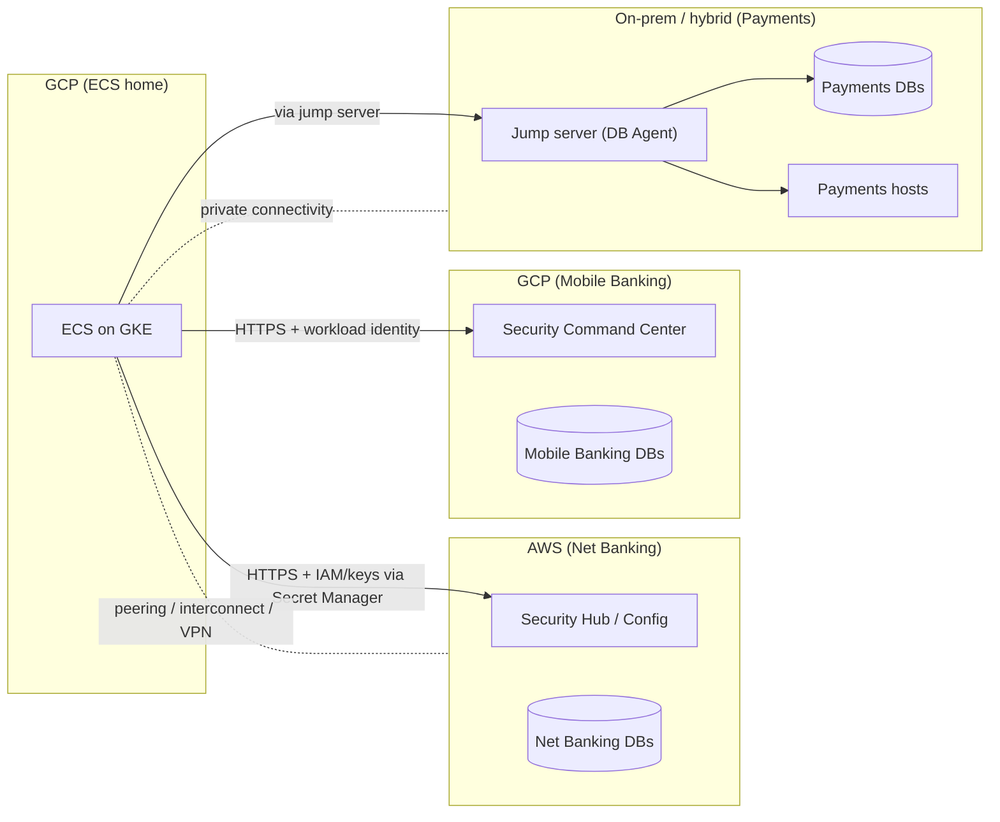
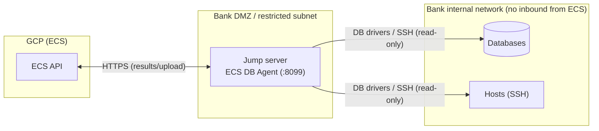
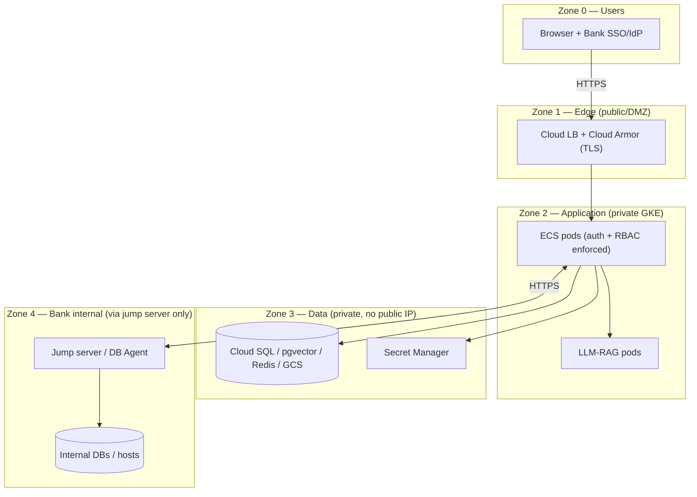
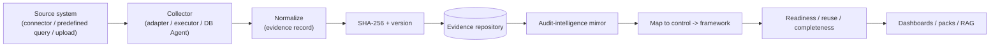
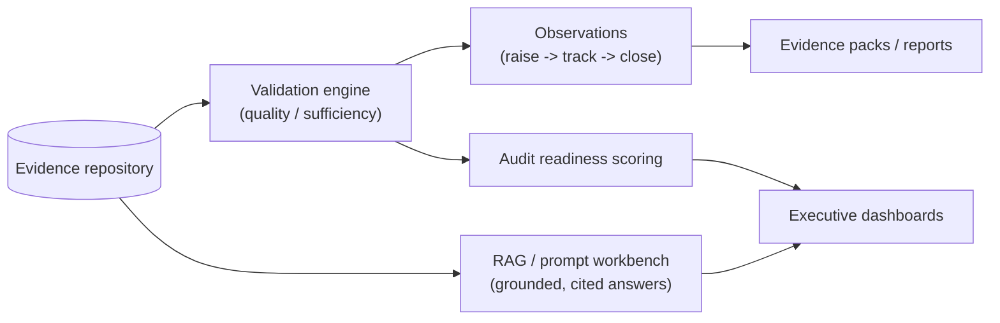
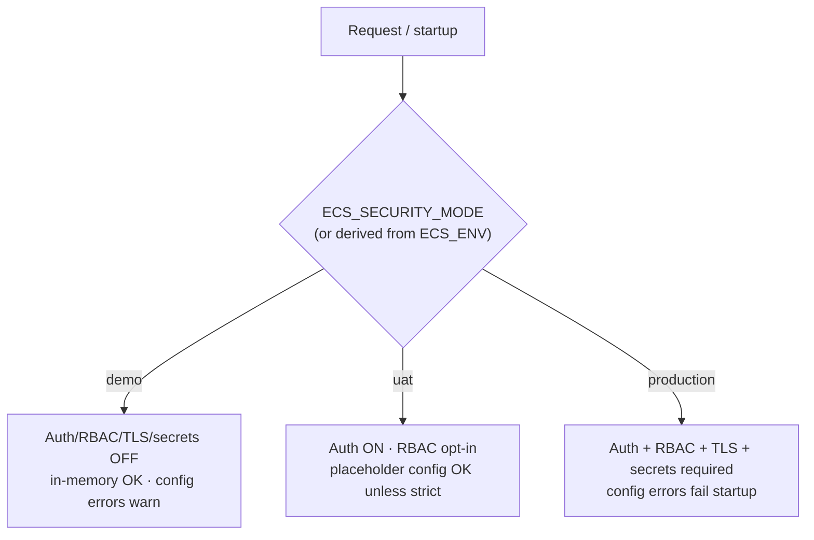

# ECS Enterprise Architecture (Bank Deployment)

End-to-end enterprise architecture for deploying ECS inside a bank: GCP hosting
model, cross-cloud application connectivity (AWS/GCP), the jump-server model for
internal targets, security zones, and the evidence/audit data flows.

> **Scope & status.** This document is the **bank-deployment topology** view. It
> complements — and does not duplicate — the existing architecture docs:
> - Current-state, code-grounded design: [`ecs_enterprise_architecture_review.md`](ecs_enterprise_architecture_review.md)
> - Container / runtime / generic K8s-HA-DR: [`ecs_deployment_architecture.md`](ecs_deployment_architecture.md)
> - HLD (Mermaid, non-C4): [`ecs_hld.md`](ecs_hld.md) · LLD: [`ecs_lld.md`](ecs_lld.md)
> - GCP provisioning detail: [`../deployment/GCP_DEPLOYMENT_GUIDE.md`](../../03-development/deployment/GCP_DEPLOYMENT_GUIDE.md)
> - C4 model: [`HIGH_LEVEL_DESIGN.md`](HIGH_LEVEL_DESIGN.md)
>
> Items marked **[TARGET]** are recommended target-state (bank-specific) and are
> not all present in the repo today; the platform's config framework
> (`ECS_ENV`, `config/environments/*`) makes them configuration, not code, changes.

---

## 1. Enterprise context

ECS is the Enterprise Evidence Collection System: it collects compliance evidence
from bank systems (databases, hosts, SaaS/DevSecOps tools, cloud posture),
validates and versions it, maps it to controls/frameworks, and serves audit
intelligence (dashboards, RAG Q&A, prompt workbench).

See [`00-start-here/ARCHITECTURE_OVERVIEW.md`](../../01-product/00-start-here/ARCHITECTURE_OVERVIEW.md)
for the code-grounded module tour.

---

## 2. GCP hosting model **[TARGET]**

ECS is hosted on Google Cloud. The web tier is stateless (once `ecs_state` is
externalized — see the architecture review) and runs on GKE behind a managed
load balancer; state lives in managed data services.

Provisioning specifics (GKE, Cloud SQL + pgvector, GCS, IAM, secrets, logging,
CI/CD, env promotion) are in
[`../deployment/GCP_DEPLOYMENT_GUIDE.md`](../../03-development/deployment/GCP_DEPLOYMENT_GUIDE.md).

---

## 3. Cross-cloud application connectivity (AWS / GCP)

Bank applications span clouds. ECS collects posture/evidence from each via the
connector framework (config-driven; credentials from a secret manager) — see
[`../connectors/INTEGRATION_ADAPTERS_GUIDE.md`](../../03-development/developer-manual/connectors/INTEGRATION_ADAPTERS_GUIDE.md).

| Application (example) | Cloud | ECS connectivity |
|---|---|---|
| **Net Banking** | AWS | AWS posture connector (Security Hub / Config via a collector endpoint) + DB/host evidence via the jump server |
| **Mobile Banking** | GCP | GCP posture connector (Security Command Center / Asset Inventory) + DB/host evidence |
| **Payments** | On-prem / hybrid | DB + host (SSH) evidence via the jump server; SaaS/DevSecOps connectors as applicable |

> **Connectivity assumptions [TARGET].** Cross-cloud traffic uses private
> connectivity where available (Cloud Interconnect / VPN to AWS Direct Connect;
> VPC Service Controls around GCP data services). AWS access uses least-privilege
> IAM (read-only Security Hub/Config) with keys/roles in Secret Manager; GCP
> cross-project access uses workload identity / least-privilege service accounts.
> Payments connectivity assumes ECS reaches on-prem targets **only** through the
> jump server (§4) — ECS never holds direct network routes to production DBs.

---

## 4. Bank jump-server model

For internal bank targets (databases, hosts) that must not be exposed to the ECS
web tier, evidence collection runs through a **jump server** inside the secured
internal network. The **ECS DB Agent** (a prototype micro-service) runs there and
performs DB/host connectivity checks and predefined-query execution, uploading
results to ECS. Network isolation is the primary control.

- The DB Agent depends on **no** enterprise security infrastructure to run (mTLS,
  JWT, OIDC, Vault are optional, off-by-default extension points). See
  [`../developer-manual/DATABASE_AGENT_GUIDE.md`](../../03-development/developer-manual/DATABASE_AGENT_GUIDE.md).
- The ECS platform's own security framework (auth/RBAC/OIDC) is separate and
  unaffected — see [`../production/ECS_SECURITY_REFERENCE.md`](../../03-development/production/ECS_SECURITY_REFERENCE.md).

---

## 5. Security zones **[TARGET]**

| Zone | Contents | Controls |
|---|---|---|
| 0 Users | Browsers, bank IdP | SSO/OIDC/JWT (production mode) |
| 1 Edge | Load balancer, WAF | TLS termination, Cloud Armor, rate limiting |
| 2 App | ECS + RAG pods (private GKE) | Auth middleware, RBAC enforcement, security headers, request-ID |
| 3 Data | Cloud SQL, pgvector, Redis, GCS, Secret Manager | Private IP, IAM, encryption at rest, no public exposure |
| 4 Bank internal | Jump server + internal targets | Network isolation; read-only accounts; no inbound from ECS |

Security modes (demo / uat / production) that gate auth/RBAC/TLS/secrets are
documented in [`../operations/PROTOTYPE_DEMO_RUN_MODE.md`](../../03-development/operations/PROTOTYPE_DEMO_RUN_MODE.md)
and the [security-mode flow](#8-security-mode-flow) below.

---

## 6. Evidence flow

Detailed lifecycle sequences: [`ECS_SEQUENCE_DIAGRAMS.md`](ECS_SEQUENCE_DIAGRAMS.md)
(§ evidence, § reuse) and
[`../evidence-management/ECS_EVIDENCE_REFERENCE_GUIDE.md`](../../03-development/evidence-management/ECS_EVIDENCE_REFERENCE_GUIDE.md).

---

## 7. Audit flow

Audit workflow + observation lifecycle sequences:
[`ECS_SEQUENCE_DIAGRAMS.md`](ECS_SEQUENCE_DIAGRAMS.md) and
[`ECS_WORKFLOW_ORCHESTRATION_GUIDE.md`](ECS_WORKFLOW_ORCHESTRATION_GUIDE.md).

---

## 8. Security-mode flow

ECS resolves a single security mode (`demo | uat | production`) that gates every
enforcement layer; production/DR stay strict, demo is non-blocking for prototype.

Reference: [`../operations/PROTOTYPE_DEMO_RUN_MODE.md`](../../03-development/operations/PROTOTYPE_DEMO_RUN_MODE.md)
· [`../production/ECS_SECURITY_REFERENCE.md`](../../03-development/production/ECS_SECURITY_REFERENCE.md)
· [`../production/ECS_SSO_OIDC_IMPLEMENTATION_PLAN.md`](../../03-development/production/ECS_SSO_OIDC_IMPLEMENTATION_PLAN.md).

---

## Related documents

- [`SOLUTION_ARCHITECTURE.md`](SOLUTION_ARCHITECTURE.md) — functional/runtime/integration/data/AI layers
- [`HIGH_LEVEL_DESIGN.md`](HIGH_LEVEL_DESIGN.md) — C4 context/container/component
- [`LOW_LEVEL_DESIGN.md`](LOW_LEVEL_DESIGN.md) — service/module LLD + sequences
- [`../deployment/GCP_DEPLOYMENT_GUIDE.md`](../../03-development/deployment/GCP_DEPLOYMENT_GUIDE.md) — GCP provisioning
- [`ecs_enterprise_architecture_review.md`](ecs_enterprise_architecture_review.md) — current-state review + gaps
- [`ARCHITECTURE_INDEX.md`](ARCHITECTURE_INDEX.md) — full architecture doc index
