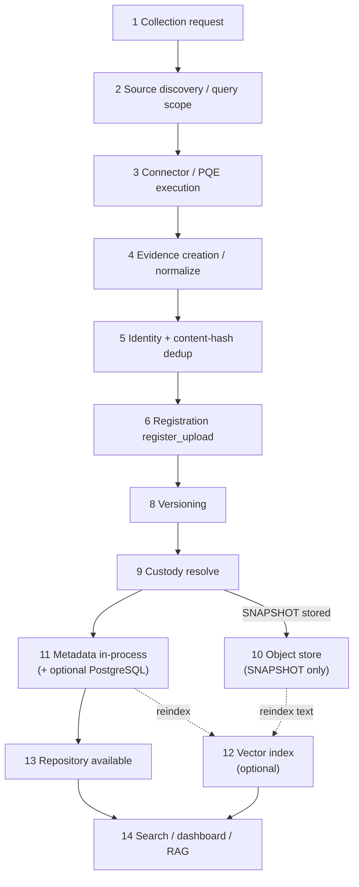
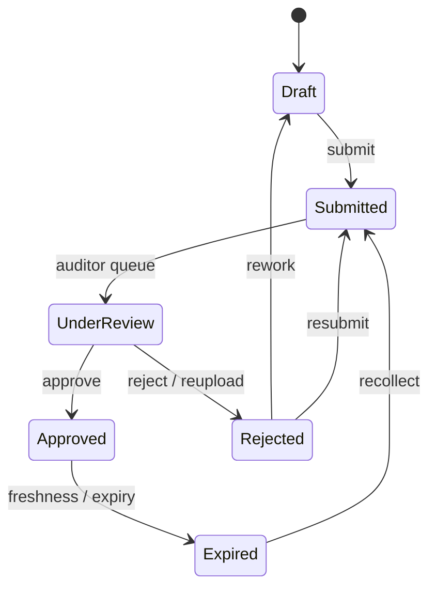
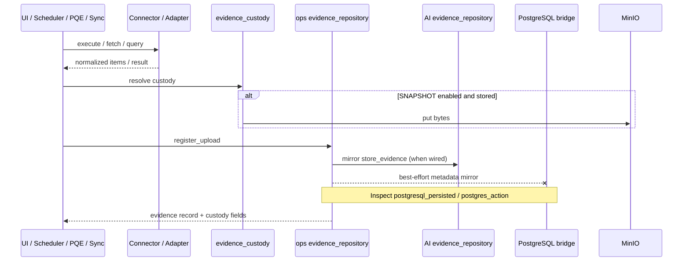

# ECS Evidence Lifecycle (Phase 1)

Lifecycle architecture for evidence in the frozen Phase-1 implementation: from
collection request through registration, persistence planes, versioning/custody,
repository availability, and retrieval/RAG consumption — including
architecturally significant partial-success states.

> **Reuse note.** End-to-end data movement:
> [`DATA_FLOW_ARCHITECTURE.md`](DATA_FLOW_ARCHITECTURE.md). Workflow/review state
> labels:
> [`ECS_STATE_TRANSITION_MATRIX.md`](ECS_STATE_TRANSITION_MATRIX.md),
> [`ECS_WORKFLOW_ORCHESTRATION_GUIDE.md`](ECS_WORKFLOW_ORCHESTRATION_GUIDE.md).
> Product/reference lifecycle narrative:
> [`../evidence-management/ECS_EVIDENCE_REFERENCE_GUIDE.md`](../evidence-management/ECS_EVIDENCE_REFERENCE_GUIDE.md).
> Reuse workbench (page-specific):
> [`../evidence-management/evidence_reuse_lifecycle_functional_design.md`](../evidence-management/evidence_reuse_lifecycle_functional_design.md).

> **Do not conflate** (1) **collection/repository lifecycle** (create → register →
> version → custody → index) with (2) **governance review lifecycle** (submit →
> review → approve/reject) or (3) **observation lifecycle**. All three exist in
> Phase 1 and use different engines/stores.

---

## 1. Lifecycle stages (collection → consumption)

| # | Stage | What happens | Primary code / doc |
|---|-------|--------------|--------------------|
| 1 | Collection request | User/API/scheduler/orchestrator requests collect or upload | Scheduler, PQE, upload routes, `evidence_orchestrator` |
| 2 | Source discovery / query | Resolve controls/tech/targets; build query or fetch plan | PQE, fingerprint/mapping, adapter config |
| 3 | Connector execution | Call external system or local target (or mock transport) | Adapters / platform connectors / query connectors |
| 4 | Evidence creation | Normalize payload → candidate metadata + content/hash inputs | Connector normalize / PQE publisher |
| 5 | Identity / deduplication | Allocate id; SHA-256 reuse may attach to existing artifact | `register_upload`, `find_*_by_*hash` |
| 6 | Registration | Canonical enroll via `register_upload` (+ AI mirror) | `operations.evidence_repository` |
| 7 | Persistence (multi-plane) | In-process always on happy path; PG/MinIO/pgvector conditional | See Data Flow §6 |
| 8 | Versioning | Version bump / `record_version` / AI version chain | PQE guide §13; AI `store_evidence` |
| 9 | Custody | `REFERENCE_ONLY` or `SNAPSHOT` outcome | `evidence_custody` |
| 10 | Object storage | Bytes written only if SNAPSHOT stored | MinIO bucket `ecs-evidence` |
| 11 | Metadata persistence | Structured fields in process and/or PostgreSQL bridge | `postgresql_persisted` flag |
| 12 | Vector indexing | Optional embed/upsert | `ecs_platform` vectorstore / RAG reindex |
| 13 | Repository availability | Searchable in ops/AI repository APIs; packs/timeline | Observation & Repository Guide |
| 14 | Retrieval / search / RAG | Faceted search, semantic retrieval, grounded LLM answers | Evidence Reference §10; AI Architecture |

---

## 2. End-to-end lifecycle flowchart

*(Stages 7 persistence planes are expanded in
[`DATA_FLOW_ARCHITECTURE.md`](DATA_FLOW_ARCHITECTURE.md) §6 — not redrawn here.)*

---

## 3. Governance review lifecycle (separate axis)

After registration, evidence may enter **owner/auditor workflow** states driven by
`evidence_workflow_engine` / review UIs. Engine labels differ from casual names
(see State Transition Matrix):

Authoritative mapping of requested vs engine labels:
[`ECS_STATE_TRANSITION_MATRIX.md`](ECS_STATE_TRANSITION_MATRIX.md) §1.
Freshness/expiring/stale surfaces: Evidence Health / Lifecycle screens
(Evidence Reference Guide §1) — **do not** assume automated archival (marked
**[Inferred/Target]** there).

---

## 4. Sequence — major component handoffs

One sequence for the live collect → register path (Workbench safe modes omit
persist):

---

## 5. Failure, skip, and partial-success states

| State | Lifecycle impact |
|-------|------------------|
| `Configuration Required` / `Connector Missing` (orchestrator) | Record does not become successful evidence |
| `Partially Completed` run | Mixed per-control outcomes in one run |
| Workbench dry-run / parser-test | Stops before registration |
| Content-hash reuse | Lifecycle attaches to existing artifact; may skip new object write |
| `postgres_action=SKIPPED_*` / `FAILED` | Repository may still be available **in-process** |
| Custody `stored=false` | Remains reference-oriented; reason retained |
| Observation generated from FAIL/WARNING | Parallel observation lifecycle (in-memory by default) — Observation Guide |

Orchestrator status vocabulary:
[`../evidence-management/EVIDENCE_COLLECTION_GUIDE.md`](../evidence-management/EVIDENCE_COLLECTION_GUIDE.md) §3.

---

## 6. Multiple repository meanings (avoid doc conflicts)

| Name in docs | Phase-1 reality |
|--------------|-----------------|
| Operations `evidence_repository.register_upload` | Primary enrollment bridge for uploads/connectors/PQE publishers |
| Audit-intelligence `engines/evidence_repository.store_evidence` | Versioned **in-memory** (by default) artifact store + search/timeline/packs |
| `ecs_platform/repository` PostgreSQL | Durable schema; init best-effort; not every demo path writes here |
| “Evidence Lifecycle” **screen** | UI route(s) for freshness/governance views — not a separate engine |

If an older document says “the repository is PostgreSQL” without qualification,
read it as **target durable SoR / platform schema**, and use
[`DATA_FLOW_ARCHITECTURE.md`](DATA_FLOW_ARCHITECTURE.md) for what a given collect
actually wrote.

---

## 7. Related views

| Topic | Document |
|-------|----------|
| Data flow + persistence planes | [`DATA_FLOW_ARCHITECTURE.md`](DATA_FLOW_ARCHITECTURE.md) |
| Validation | [`../evidence-management/EVIDENCE_VALIDATION_GUIDE.md`](../evidence-management/EVIDENCE_VALIDATION_GUIDE.md) |
| Observations & packs | [`../evidence-management/OBSERVATION_AND_REPOSITORY_GUIDE.md`](../evidence-management/OBSERVATION_AND_REPOSITORY_GUIDE.md) |
| Reuse functional design | [`../evidence-management/evidence_reuse_lifecycle_functional_design.md`](../evidence-management/evidence_reuse_lifecycle_functional_design.md) |
| Sequences library | [`ECS_SEQUENCE_DIAGRAMS.md`](ECS_SEQUENCE_DIAGRAMS.md) |

---

## Verification notes

- Registration + PG outcome flags: `modules/operations/engines/evidence_repository.py`.
- Custody modes: `modules/audit_intelligence/services/evidence_custody.py`.
- AI repository guide correctly documents **in-memory** working store
  ([`OBSERVATION_AND_REPOSITORY_GUIDE.md`](../evidence-management/OBSERVATION_AND_REPOSITORY_GUIDE.md) §7).
- Evidence Reference Guide remains useful for product lifecycle narrative; where
  it implies always-on Postgres for every collect, defer to Data Flow persistence
  boundaries for Phase-1 architecture truth.
