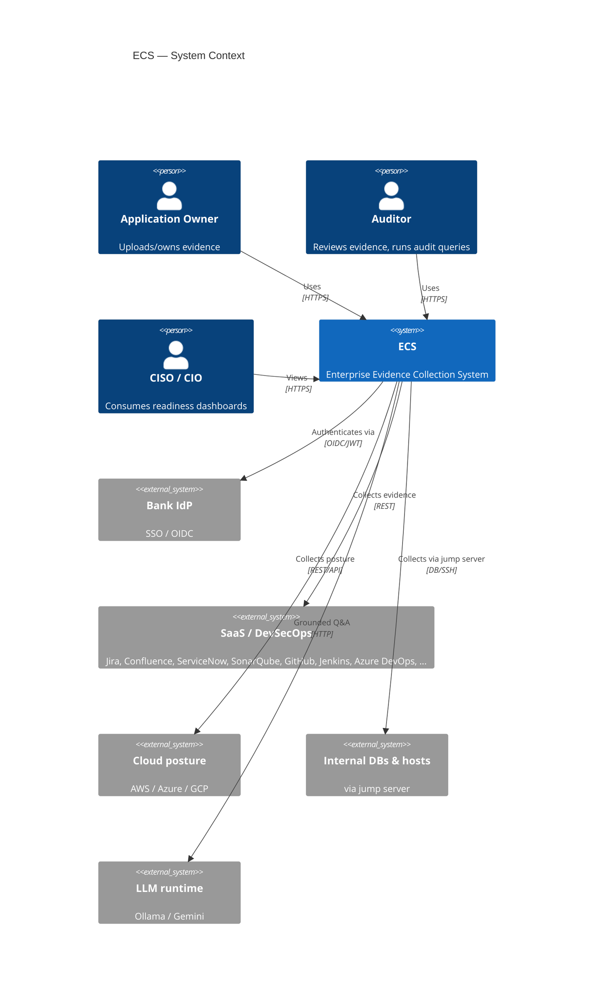
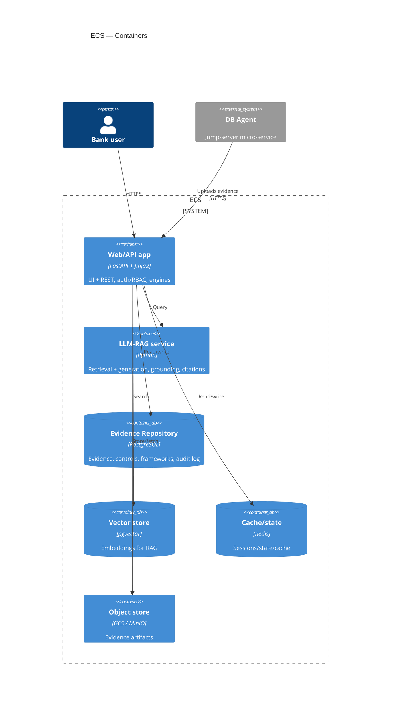
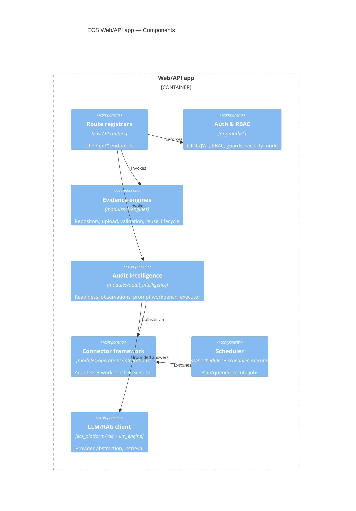

# ECS High-Level Design (C4)

C4-model view of ECS (Context → Container → Component). This complements the
existing Mermaid HLD, which covers business capabilities, data/integration/
security/deployment layers in depth.

> **Reuse note.** The detailed, non-C4 HLD already exists —
> [`ecs_hld.md`](ecs_hld.md) (8 Mermaid sections). This document adds the **C4
> diagrams** (the one thing missing from the architecture set) and links out for
> everything else. Deeper views: [`ecs_lld.md`](ecs_lld.md) (LLD),
> [`ENTERPRISE_ARCHITECTURE.md`](ENTERPRISE_ARCHITECTURE.md) (bank/GCP topology),
> [`ECS_SEQUENCE_DIAGRAMS.md`](ECS_SEQUENCE_DIAGRAMS.md) (flows).

---

## C4 Level 1 — System Context

---

## C4 Level 2 — Containers

---

## C4 Level 3 — Components (Web/API app)

> If your Mermaid renderer does not support the `C4*` shorthand, the same
> structure is expressed as standard flowcharts in [`ecs_hld.md`](ecs_hld.md).

---

## Related
- [`ecs_hld.md`](ecs_hld.md) · [`LOW_LEVEL_DESIGN.md`](LOW_LEVEL_DESIGN.md) · [`SOLUTION_ARCHITECTURE.md`](SOLUTION_ARCHITECTURE.md) · [`ENTERPRISE_ARCHITECTURE.md`](ENTERPRISE_ARCHITECTURE.md) · [`ARCHITECTURE_INDEX.md`](ARCHITECTURE_INDEX.md)
