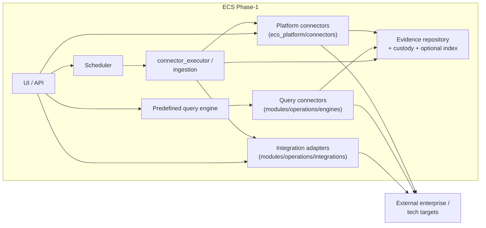

# ECS Integration Architecture (Phase 1)

Navigator for **integration architecture** of the frozen Phase-1 implementation:
boundaries between ECS and external systems, the two connector planes, scheduler
/ predefined-query interaction, execution → evidence handoff, and
auth/config boundaries.

> **Reuse note.** This page does **not** replace the inventory or adapter guides.
> Authoritative integration inventory:
> [`../connectors/ECS_MASTER_INTEGRATION_MATRIX.md`](../connectors/ECS_MASTER_INTEGRATION_MATRIX.md).
> Adapter contracts:
> [`../connectors/INTEGRATION_ADAPTERS_GUIDE.md`](../connectors/INTEGRATION_ADAPTERS_GUIDE.md).
> Per-connector how-to: [`../connectors/`](../connectors/README.md).
> Legacy per-connector index (still useful for individual guides):
> [`../connectors/_legacy_INTEGRATIONS_index.md`](../connectors/_legacy_INTEGRATIONS_index.md).

> When inventories disagree, **prefer the Master Integration Matrix** status
> column (✅ / ⚙ / 🔵 / 🟡). Do not invent support to reconcile older counts.

---

## 1. Integration boundary



| Boundary | What crosses it | What must not |
|----------|-----------------|---------------|
| Config / secrets | Env vars, `config/integrations.yaml`, env YAML `connectors:` blocks | Secrets committed in YAML; secrets in logs (`masked_config`) |
| Network | Adapter/connector HTTP (or injected transport); PQE target execution | Live calls in unit tests (mock transport) |
| Evidence | Normalized items → register/upload → metadata (+ optional SNAPSHOT bytes) | Parallel undocumented persistence paths |

Logical handoff detail:
[`LOGICAL_ARCHITECTURE.md`](LOGICAL_ARCHITECTURE.md) §3.3–§3.5.

---

## 2. Two integration planes (Phase 1)

Documented and implemented as **two planes** (see Matrix intro):

| Plane | Purpose | Primary code | Typical trigger |
|-------|---------|--------------|-----------------|
| **SaaS / enterprise evidence ingestion** | Pull artifacts from enterprise systems | `modules/operations/integrations/*` (+ some `ecs_platform/connectors`) | Scheduler, Connector Test Workbench, `/api/platform/sync/{connector}` |
| **Predefined-query control testing** | Execute control-linked queries/commands against tech targets | `modules/operations/engines/*_connector.py`, `predefined_queries_engine.py` | Predefined Queries UI/API, scheduler/asset plans where wired |

**Important stacking note** (from Adapters Guide / Matrix):

- Audit-intelligence **adapters** power Workbench + scheduler + executor.
- Platform **connectors** (`ecs_platform/connectors` + `ConnectorFactory` registry
  in `factory.py`) power config-driven ingestion (`ingestion.sync_connector`).
- GitHub / Jenkins / Azure DevOps adapters are **thin wrappers** reusing platform
  clients via `_platform_bridge.py` (no duplicated HTTP/auth).
- Gitea / Figma are called out on the Matrix as present on the **platform
  ingestion** stack; treat enablement as config-dependent (⚙).

---

## 3. Supported Phase-1 integrations (how to read status)

Do **not** copy a static full table here — it drifts. Use:

[`../connectors/ECS_MASTER_INTEGRATION_MATRIX.md`](../connectors/ECS_MASTER_INTEGRATION_MATRIX.md)

Status legend (Matrix):

| Mark | Meaning |
|------|---------|
| ✅ | Implemented and executable in the documented path |
| ⚙ | Implemented; enable/configure (often `enabled: false` until env set) |
| 🟡 | Partial / validate |
| 🔵 | Target / to-build — **not** Phase-1 complete |

Examples of **🔵** (not to be documented as live Phase-1): Windows WinRM PQE,
Oracle/MySQL/SQL Server PQE “to build”, and other Matrix 🔵 rows.

HLD §4 (`ecs_hld.md`) is a short overview diagram only — prefer Matrix + this
navigator for integration truth.

---

## 4. Scheduler and predefined-query interaction

| Path | Flow (architectural) | Detail docs |
|------|----------------------|-------------|
| Scheduler → adapters | Asset/plan → executor → adapter `fetch_*` → normalize → evidence register | [`SCHEDULER_ARCHITECTURE.md`](SCHEDULER_ARCHITECTURE.md), [`../scheduler/runtime_call_graph.md`](../scheduler/runtime_call_graph.md), [`../scheduler/scheduler_runtime_flow.md`](../scheduler/scheduler_runtime_flow.md) |
| Workbench → adapters | Config-status / health / dry-run / parser-test (safe; mock transport) | [`../connectors/connector_test_workbench_design.md`](../connectors/connector_test_workbench_design.md) |
| Live collection gate | Opt-in: `ECS_CONNECTOR_EXECUTION_ENABLED` **and** configured adapter | Adapters Guide §5 |
| PQE → query connectors | Control library → tech detect → connector → parse → evidence | [`../operations/ECS_PREDEFINED_QUERY_ARCHITECTURE.md`](../operations/ECS_PREDEFINED_QUERY_ARCHITECTURE.md) |
| Platform sync | `POST /api/platform/sync/{connector}` → `ecs_platform.ingestion` | Overview / platform routes |

Workbench vs scheduler:
[`../scheduler/test_workbench_vs_scheduler.md`](../scheduler/test_workbench_vs_scheduler.md).

---

## 5. Evidence handoff (integration → persistence / indexing)

Canonical Matrix flow:

```
Integration execution → normalized items → Evidence generated
  → control/framework maps → workflow → Repository → Dashboard/KPIs
```

Architecturally (Phase 1):

1. Adapter/connector returns standard envelope
   `{ok, source, status, items, errors}` (adapters) or platform `EvidenceItem`s.
2. Executor / publisher / `register_upload` path applies hashing and repository
   registration (SHA-256 + audit-repo mirror as documented in Adapters Guide).
3. Custody: `REFERENCE_ONLY` (default) or `SNAPSHOT` → object store when enabled
   (`evidence_custody`).
4. Optional RAG indexing into pgvector is a **separate** path from collection
   (see AI Architecture) — not every collect implies immediate reindex.

See also:
[`LOGICAL_ARCHITECTURE.md`](LOGICAL_ARCHITECTURE.md),
[`../evidence-management/EVIDENCE_COLLECTION_GUIDE.md`](../evidence-management/EVIDENCE_COLLECTION_GUIDE.md).

---

## 6. Authentication and configuration boundaries

| Concern | Phase-1 approach |
|---------|------------------|
| Credentials | Environment / secret store only; YAML references `*_env` names |
| Enablement | Many SaaS integrations default **disabled** until `enabled: true` + env |
| Auth models | Per integration: PAT, Basic, OAuth2 client-credentials, API keys, etc. (Matrix Auth column) |
| Masking | `masked_config()` → `SET`/`MISSING`; never log secrets |
| Timeouts / retries | Adapter base + per-connector env (`*_TIMEOUT_SECONDS`, `*_MAX_RETRIES`) |

Variable tables live in
[`../connectors/INTEGRATION_ADAPTERS_GUIDE.md`](../connectors/INTEGRATION_ADAPTERS_GUIDE.md)
and UAT credential guides — not duplicated here.

---

## 7. Related views

| View | Document |
|------|----------|
| Connector framework (structure/lifecycle) | [`CONNECTOR_ARCHITECTURE.md`](CONNECTOR_ARCHITECTURE.md) |
| Deployment (Compose + externals) | [`ecs_deployment_architecture.md`](ecs_deployment_architecture.md) |
| Solution layer map | [`SOLUTION_ARCHITECTURE.md`](SOLUTION_ARCHITECTURE.md) |
| Failure ops | [`../operations/ECS_CONNECTOR_FAILURE_PLAYBOOK.md`](../operations/ECS_CONNECTOR_FAILURE_PLAYBOOK.md) |

---

## Verification notes

- Two-plane model and wrapper/bridge notes are grounded in the Master
  Integration Matrix and Integration Adapters Guide.
- Older phrases like “11 enterprise adapters” / “13 query connectors” /
  “12 source-system connectors” are **count snapshots** — use Matrix rows, not
  those integers, as SoT.
