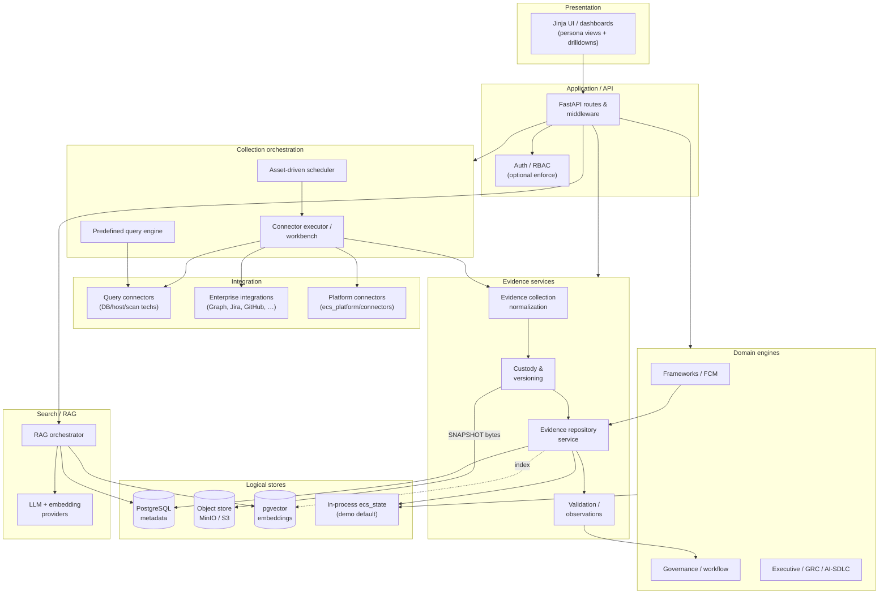
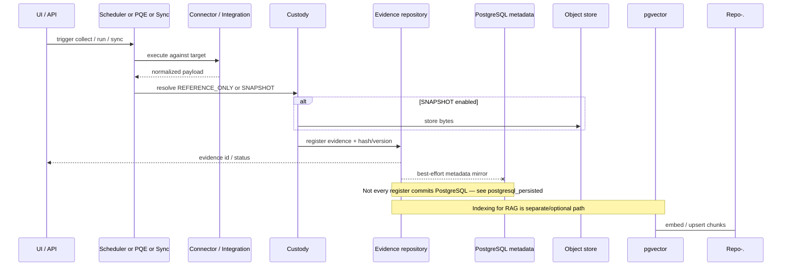

# ECS Logical Architecture (Phase 1)

Logical component view of the **frozen Phase-1** ECS implementation: how UI,
API, scheduler, predefined queries, connectors, evidence services, persistence,
and AI/search collaborate. Technology choices appear only where they define a
logical store boundary (e.g. metadata vs object bytes vs embeddings).

> **Reuse note.** This document fills the gap of a single logical-component
> diagram. Deep design remains in the linked sources — do not treat this as a
> second HLD/LLD.

---

## 1. Logical layers

| Layer | Responsibility | Primary code |
|-------|----------------|--------------|
| Presentation | Jinja dashboards, persona UI, drilldowns | `modules/*/templates`, `modules/shared/static` |
| Application / API | Route registrars, auth middleware, JSON APIs | `app/main.py`, `app/routes_*.py`, `modules/*/routes` |
| Domain engines | Evidence, frameworks, governance, GRC, AI-SDLC, ops | `modules/*/engines`, `modules/*/services` |
| Collection orchestration | Asset scheduler, connector executor, workbench | `asset_scheduler.py`, `connector_executor.py`, `connector_workbench.py` |
| Query automation | Predefined query engine + query connectors | `predefined_queries_engine.py`, `*_connector.py` |
| Integration adapters | Enterprise SaaS/DevSecOps/Graph integrations | `modules/operations/integrations/*`, `ecs_platform/connectors/*` |
| Evidence services | Repository registration, custody, validation, reuse | `evidence_repository.py`, `evidence_custody.py`, validation/reuse services |
| Persistence | Metadata, artifacts, embeddings, cache | PostgreSQL, MinIO, pgvector, Redis (optional in demo) |
| Intelligence | RAG, embeddings, LLM provider abstraction | `ecs_platform/rag.py`, `llm_engine/`, `vectorstore/` |

---

## 2. End-to-end logical component diagram

---

## 3. Component relationships (verified)

### 3.1 UI / dashboard → API

- Browser loads server-rendered HTML from FastAPI route handlers.
- KPI drilldowns and many actions call `/api/*` JSON endpoints consumed by
  shared JS (`drilldown_engine.js`).
- Detail: [`../00-start-here/ARCHITECTURE_OVERVIEW.md`](../00-start-here/ARCHITECTURE_OVERVIEW.md)
  §12–§13; sequences in [`ECS_SEQUENCE_DIAGRAMS.md`](ECS_SEQUENCE_DIAGRAMS.md).

### 3.2 API → scheduler & predefined query engine

- Scheduler UI/API drives asset-scoped plans via
  `modules/audit_intelligence/services/asset_scheduler.py` and related execution
  services.
- Predefined Queries UI/API uses
  `modules/operations/engines/predefined_queries_engine.py` (control library →
  technology detection → connector).
- Detail: [`../scheduler/runtime_call_graph.md`](../scheduler/runtime_call_graph.md),
  [`../operations/ECS_PREDEFINED_QUERY_ARCHITECTURE.md`](../operations/ECS_PREDEFINED_QUERY_ARCHITECTURE.md).

### 3.3 Scheduler / PQE → connector framework → collection

- Scheduled jobs and workbench runs invoke
  `connector_executor` / integration adapters / query connectors.
- Platform sync path: `POST /api/platform/sync/{connector}` →
  `ecs_platform.ingestion.sync_connector` (when platform connectors are used).
- Normalized items enter the evidence registration path (`register_upload` /
  repository services).
- Detail: [`../connectors/`](../connectors/README.md),
  [`LOW_LEVEL_DESIGN.md`](LOW_LEVEL_DESIGN.md).

### 3.4 Evidence repository, versioning, and custody

| Concern | Logical behavior | Code / doc |
|---------|------------------|------------|
| Metadata persistence | Evidence records, maps, reviews, sync history | PostgreSQL via `ecs_platform/repository` + audit-intelligence persistence; demo may stay in `ecs_state` |
| Versioning | Content hash / version fields; duplicate detection | `evidence_repository`, predefined-query publisher; [`../operations/ECS_PREDEFINED_QUERY_EXECUTION_GUIDE.md`](../operations/ECS_PREDEFINED_QUERY_EXECUTION_GUIDE.md) §13 |
| Custody REFERENCE_ONLY | Metadata + source URL; no object bytes | `modules/audit_intelligence/services/evidence_custody.py` (default) |
| Custody SNAPSHOT | Immutable bytes in object store when enabled | Same module; gated by `ECS_EVIDENCE_SNAPSHOT_ENABLED` / repository custody config |
| Object artifacts | Raw files under evidence bucket | MinIO (`ecs-evidence`) per data architecture |

Data model:
[`ECS_DATA_ARCHITECTURE_REFERENCE.md`](ECS_DATA_ARCHITECTURE_REFERENCE.md).

### 3.5 PostgreSQL · MinIO · pgvector

| Store | Logical role |
|-------|--------------|
| PostgreSQL (`ecs_repository` / governance schema) | System of record for structured evidence, controls/framework maps, audit log, schedules/sync runs |
| MinIO | Object bytes for SNAPSHOT custody / artifacts |
| pgvector (`ecs_vectors`) | Chunk embeddings for semantic retrieval |
| Redis | Cache/queue (compose service; usage is optional/config-dependent) |
| In-process `ecs_state` | Default demo workflow/runtime state when durable stores are not required |

Wiring and ports:
[`ecs_deployment_architecture.md`](ecs_deployment_architecture.md),
[`../00-start-here/ARCHITECTURE_OVERVIEW.md`](../00-start-here/ARCHITECTURE_OVERVIEW.md) §11.

### 3.6 Search / RAG → LLM & embeddings

1. RAG orchestrator (`ecs_platform/rag.py`) applies RBAC scope, retrieves from
   pgvector (and/or deterministic SQL fallback), enriches, grounds, then
   generates.
2. Embeddings default to local `nomic-embed-text` (768-dim); generation defaults
   to Ollama `qwen3:8b` unless `ECS_LLM_PROVIDER` selects a cloud provider.
3. Detail: [`../ai-sdlc/ECS_AI_ARCHITECTURE_REFERENCE.md`](../ai-sdlc/ECS_AI_ARCHITECTURE_REFERENCE.md).

### 3.7 External enterprise integrations

Logical external systems (enabled via config/env, not hard-coded on):

- Query/tech connectors (e.g. PostgreSQL, Linux, SonarQube, Trivy, Gitleaks, …)
- Enterprise adapters (Jira, Confluence, ServiceNow, SharePoint/Teams via Graph,
  GitHub, Azure DevOps, …)
- Platform connectors in `ecs_platform/connectors` (Gitea, Jenkins, SonarQube, …)

Inventory:
[`../connectors/ECS_MASTER_INTEGRATION_MATRIX.md`](../connectors/ECS_MASTER_INTEGRATION_MATRIX.md).
Which connectors are live in a given environment is **configuration-dependent** —
do not assume all are enabled.

---

## 4. Canonical evidence flow (logical)

> Persistence-plane detail:
> [`DATA_FLOW_ARCHITECTURE.md`](DATA_FLOW_ARCHITECTURE.md).
> Lifecycle stages:
> [`EVIDENCE_LIFECYCLE.md`](EVIDENCE_LIFECYCLE.md).

---

## 5. Related views

| View | Document |
|------|----------|
| System | [`SYSTEM_ARCHITECTURE.md`](SYSTEM_ARCHITECTURE.md) |
| Functional | [`FUNCTIONAL_ARCHITECTURE.md`](FUNCTIONAL_ARCHITECTURE.md) |
| Technical | [`TECHNICAL_ARCHITECTURE.md`](TECHNICAL_ARCHITECTURE.md) |
| Data flow | [`DATA_FLOW_ARCHITECTURE.md`](DATA_FLOW_ARCHITECTURE.md) |
| Evidence lifecycle | [`EVIDENCE_LIFECYCLE.md`](EVIDENCE_LIFECYCLE.md) |
| Solution navigator | [`SOLUTION_ARCHITECTURE.md`](SOLUTION_ARCHITECTURE.md) |
| C4 | [`HIGH_LEVEL_DESIGN.md`](HIGH_LEVEL_DESIGN.md) |
| LLD map | [`LOW_LEVEL_DESIGN.md`](LOW_LEVEL_DESIGN.md) |

---

## Verification notes

- Custody modes and flags verified against
  `modules/audit_intelligence/services/evidence_custody.py`.
- Route composition verified against `app/main.py` registrars (MVP, evidence,
  platform, governance, AI-SDLC, GRC demo, benchmark, nav aggregators, audit
  intelligence / UI / LLM). Older docs that list only “six registrars” are
  incomplete relative to current `app/main.py`.
- Exact connector counts (query vs enterprise vs platform) vary by document
  generation date; use the Integration Matrix as the inventory source of truth.
- Observation durable tables exist in schema; some observation workflows still
  use in-memory state — marked **partial wiring** in the Data Architecture
  Reference.
