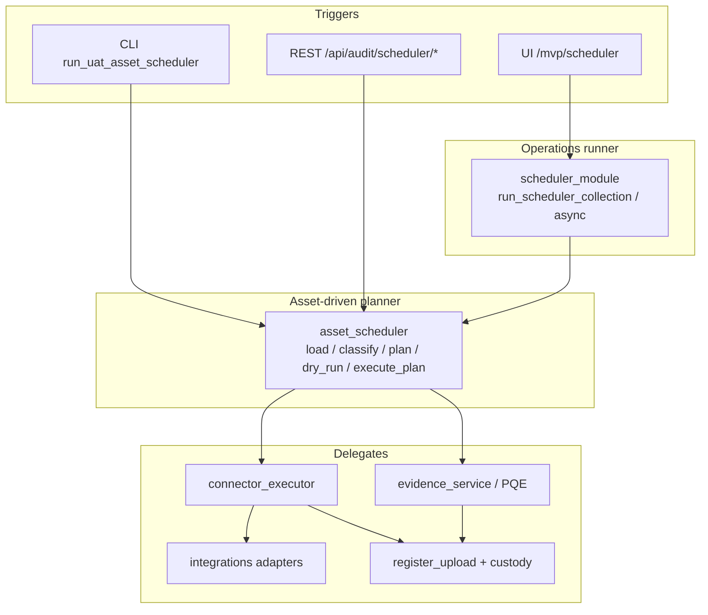
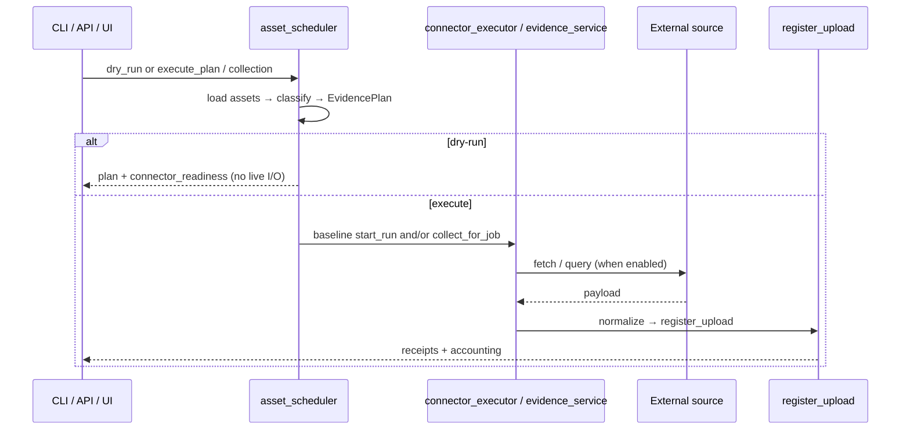

# ECS Scheduler Architecture (Phase 1)

Canonical Phase-1 **scheduler architecture** for the frozen implementation.
This navigator unifies the asset-driven planner and the operations collection
runner, defines ownership boundaries, and points to deeper runtime docs without
duplicating Data Flow / Evidence Lifecycle persistence detail.

> **Reuse note.** Runtime stage detail:
> [`../scheduler/scheduler_runtime_flow.md`](../scheduler/scheduler_runtime_flow.md).
> Design intent (asset inventory → plan):
> [`../scheduler/UAT_ASSET_DRIVEN_SCHEDULER_DESIGN.md`](../scheduler/UAT_ASSET_DRIVEN_SCHEDULER_DESIGN.md).
> Workbench vs scheduler:
> [`../scheduler/test_workbench_vs_scheduler.md`](../scheduler/test_workbench_vs_scheduler.md).
> Call graph:
> [`../scheduler/runtime_call_graph.md`](../scheduler/runtime_call_graph.md).
> Persistence planes:
> [`DATA_FLOW_ARCHITECTURE.md`](DATA_FLOW_ARCHITECTURE.md),
> [`EVIDENCE_LIFECYCLE.md`](EVIDENCE_LIFECYCLE.md).

> **Ops reference caveat.**
> [`../operations/ECS_SCHEDULER_REFERENCE.md`](../operations/ECS_SCHEDULER_REFERENCE.md)
> describes a broader product scheduler taxonomy (many rows **[Inferred/Target]**).
> Prefer **this document** + the `docs/scheduler/` runtime guides for Phase-1
> implemented behavior.

---

## 1. Scheduler responsibilities and boundaries

Phase 1 has **two cooperating surfaces** (not separate microservices):

| Surface | Module | Owns |
|---------|--------|------|
| **Asset-driven planner** | `modules/audit_intelligence/services/asset_scheduler.py` | Load asset inventory, fingerprint/classify, route to connector vs baseline, build `EvidencePlan`, dry-run readiness, `execute_plan` orchestration |
| **Operations collection runner** | `modules/operations/engines/scheduler_module.py` | UI/async collection runs (`COLL-…` run ids), progress events, run summary accounting (discovered / new / duplicates / PG / object-storage / pgvector tallies), history for `/mvp/scheduler` |

| Delegates to | Why |
|--------------|-----|
| `asset_discovery` / `technology_fingerprint` / `technology_control_mapping` | Classification & control scope |
| `evidence_service` / `evidence_orchestrator` | Baseline (PQE) runs |
| `connector_executor` + `modules/operations/integrations/*` | Enterprise connector collect → `register_upload` |
| `evidence_repository.register_upload` / AI mirror | Evidence enrollment, custody, optional PG/MinIO/index |
| `scheduler_execution` | Optional bounded parallel execute over planned jobs |

**Not owned by the scheduler:** connector HTTP/auth business logic; MinIO/Postgres
drivers; embedding model internals; RAG answer generation; governance review UI
state machines (those consume evidence after handoff).

---

## 2. Run initiation

| Mode | Entry | Behavior |
|------|-------|----------|
| **Dry-run (no side effects)** | CLI `--dry-run`; `POST /api/audit/scheduler/dry-run`; `asset_scheduler.dry_run` | Classify + plan + config-only connector readiness — **no** live connector calls, **no** PQE execution |
| **Plan only** | `GET /api/audit/scheduler/plan` | Returns `EvidencePlan` without execution |
| **Execute (opt-in)** | `asset_scheduler.execute_plan` / `POST /api/audit/scheduler/execute` (+ parallel variant) | Baseline jobs via evidence service; connector jobs via executor when enabled |
| **UI collection run** | `/mvp/scheduler` → `start_scheduler_collection_async` / `run_scheduler_collection` | Allocates `COLL-YYYYMMDD-HHMMSS-NNN`, publishes progress, merges accounting summary |
| **Enqueue hooks** | `evidence_orchestrator.enqueue_scheduled_run` / `due_runs` | In-memory run queue hooks — **not** a full cron worker by themselves |

**Enablement / config boundaries**

- Asset inventory: `config/uat_assets*.yaml` (env expansion; never hardcodes secrets).
- Live connectors: `ECS_CONNECTOR_EXECUTION_ENABLED` **and** adapter configured
  (or injected transport in tests) — see Connector Architecture.
- Baseline executor: must be injected outside production/test contexts so live
  queries are not implicit (`execute_plan` contract).
- Demo UI metrics may render deterministically even when durable scheduling is
  not active (ops Scheduler Reference).

> Older note in `scheduler_runtime_flow.md` that claimed “no dedicated
> `/api/audit/scheduler` REST route” is **outdated** — routes exist in
> `routes_audit_intelligence.py` (`plan`, `dry-run`, `execute`, history, queue/DLQ,
> execute-parallel).

---

## 3. Collection scope

| Scope dimension | How it is applied |
|-----------------|-------------------|
| **Application** | Scheduler UI / `scheduler_scope` selected applications; passed into collection as `selected_applications` |
| **Framework** | Selected frameworks filter / tagging on runs (`selected_frameworks`) |
| **Asset / technology** | Asset inventory → fingerprint → `classify_asset` |
| **Control** | Baseline route: `control_ids` from `controls_for_technology` / `resolve_scope` |
| **Predefined query** | Baseline route → `evidence_service.start_run` → PQE |
| **Connector / integration** | Enterprise route via `_CONNECTOR_ROUTES` → named adapter |

Route precedence (`classify_asset`):

1. `enterprise_connector` (asset_type/tech → adapter)
2. `baseline_collector` (tech has predefined-query controls)
3. `unsupported` → manual review (never crashes)

Inventory of adapters/connectors: Master Integration Matrix (not fixed historic
counts such as “11 connectors” in older design prose).

---

## 4. Execution orchestration

- **Parallelism:** connector jobs in `execute_plan` may run with a small thread
  pool (≤4); each job owns its own ingest. Baselines remain sequential.
- **scheduler_execution:** bounded parallel wrapper over one-job plans — does not
  replace `execute_plan`.

Deep stage list: [`../scheduler/scheduler_runtime_flow.md`](../scheduler/scheduler_runtime_flow.md).

---

## 5. Evidence pipeline handoff

Scheduler **hands off** to the shared evidence pipeline; it does not reimplement
persistence.

Typical connector path: `collect_for_job` → normalize → `register_upload` →
custody / versioning / optional PG mirror / optional MinIO SNAPSHOT / optional
pgvector index (gated — see Data Flow).

Typical baseline path: `evidence_service.start_run` → PQE → publisher /
`register_upload` (as wired) → same enrollment bridge.

**Do not duplicate** store semantics here — see:

- [`DATA_FLOW_ARCHITECTURE.md`](DATA_FLOW_ARCHITECTURE.md) §5–§8
- [`EVIDENCE_LIFECYCLE.md`](EVIDENCE_LIFECYCLE.md)

---

## 6. Run state and accounting

### 6.1 Identifiers and statuses

| Id / state | Meaning |
|------------|---------|
| `COLL-…` run_id | Operations async/UI collection run (`start_scheduler_collection_async`) |
| Progress status | `running` → terminal `success` / `completed` / `partial` / `failed` (`_TERMINAL_RUN_STATUSES`) |
| Orchestrator run statuses | `Queued` / `Running` / `Completed` / `Failed` / `Partially Completed` / … (Evidence Collection Guide) |
| Plan job routes | `enterprise_connector` / `baseline_collector` / unsupported |

### 6.2 Summary counters (operations runner)

Merged by `_merge_run_summary` in `scheduler_module` (representative keys):

| Counter | Represents |
|---------|------------|
| `files_discovered` | Objects/files discovered from sources during the run |
| `new_evidence` | Newly enrolled evidence items |
| `duplicates_skipped` | Content-hash / duplicate short-circuits |
| `versions_created` | Version bumps recorded for re-collections |
| `failures` | Failed source/job outcomes tallied into the run |
| `postgresql_count` | Count of items where PostgreSQL persist outcome succeeded (bridge) — **not** a synonym for “in-process register succeeded” |
| `object_storage_count` | Honest object-storage successes (MinIO or local file backend) via `classify_object_storage_outcome` |
| `object_storage_minio_stored` / `_reused` / `_local_stored` / `_reference_only` / `_failed` | Custody/backend breakdown — reference-only is **not** counted as a MinIO write |
| `pgvector_count` | Indexed embedding outcomes tallied for the run |
| `sources_executed` / `connector_ingested` | Source/connector execution vs ingested counts |

**Precision rules (Phase 1):**

- In-process / connector `persisted` / `ingested` style fields mean enrollment
  through the repository bridge path — **check** `postgresql_persisted` /
  `postgres_action` on the upload record before claiming a SQL commit.
- `object_storage_*` counters are derived from custody observability, not from
  the mere presence of a logical `object_key`.
- pgvector may be `indexed` / `skipped` / `failed` / provider-unavailable;
  indexing is often skipped when PostgreSQL persist failed.

---

## 7. Failure handling

| Failure class | Established behavior |
|---------------|----------------------|
| Unsupported asset | Flagged for manual review; plan continues |
| Connector not configured / auth | Dry-run reports readiness; live executor returns structured status — no crash |
| Live execution disabled | Executor safe-by-default without `ECS_CONNECTOR_EXECUTION_ENABLED` / transport |
| Partial connector success | Run may complete `partial`; per-job receipts retained |
| Evidence PG bridge failure | Upload path continues in-process; `postgresql_persisted=false`; pgvector typically skipped |
| Object SNAPSHOT failure | Tallied in `object_storage_failed` / reference-only fallback as classified |
| Indexing failure/skip | `pgvector_status` / search_index reasons; does not undo enrollment |
| Async worker exception | Progress marked `failed` with error string |

Ops playbooks: [`../runbooks/SCHEDULER_FAILURE_RUNBOOK.md`](../runbooks/SCHEDULER_FAILURE_RUNBOOK.md),
[`../operations/ECS_CONNECTOR_FAILURE_PLAYBOOK.md`](../operations/ECS_CONNECTOR_FAILURE_PLAYBOOK.md).

---

## 8. Scheduler dependencies

| Dependency | Role relative to scheduler |
|------------|----------------------------|
| Predefined query engine | Baseline route execution |
| Connector framework (adapters + executor) | Enterprise route execution |
| Evidence repository / custody | Enrollment after collect |
| PostgreSQL | Optional durable metadata bridge |
| MinIO / object store | SNAPSHOT bytes when stored |
| PGVector | Optional semantic index after successful PG persist path |
| External enterprise systems | Targets of adapters (config-dependent) |
| Asset YAML / env config | Inventory + secrets boundary |

Deployment topology for stores:
[`ecs_deployment_architecture.md`](ecs_deployment_architecture.md).

---

## 9. Explicit non-ownership

The scheduler does **not** own:

- Per-adapter fetch/normalize/auth implementations
- Physical storage backends (MinIO SDK, Postgres driver, vectorstore internals)
- Embedding model selection / RAG grounding / chatbot UX
- Full bank cron / HA worker fabric (**[TARGET]** / baseline backlog items such as
  Celery workers are not Phase-1 runtime)
- Connector Test Workbench (sibling orchestration — same adapters, different
  intent)

---

## 10. Consistency with Phase-1 architecture set

| View | Relationship |
|------|----------------|
| System / Logical / Technical | Scheduler is an in-process orchestration capability inside the modular monolith |
| Deployment | No separate scheduler container; uses Compose data plane optionally |
| Integration / Connector | Planner routes to adapters; live calls gated |
| Data Flow / Evidence Lifecycle | Scheduler initiates; persistence semantics live there |
| Functional | “Scheduler operations” capability maps here |

---

## Related documents

- [`../scheduler/README.md`](../scheduler/README.md)
- [`INTEGRATION_ARCHITECTURE.md`](INTEGRATION_ARCHITECTURE.md)
- [`CONNECTOR_ARCHITECTURE.md`](CONNECTOR_ARCHITECTURE.md)
- [`DATA_FLOW_ARCHITECTURE.md`](DATA_FLOW_ARCHITECTURE.md)
- [`EVIDENCE_LIFECYCLE.md`](EVIDENCE_LIFECYCLE.md)

---

## Verification notes

- REST scheduler routes verified in
  `modules/audit_intelligence/routes/routes_audit_intelligence.py`.
- `execute_plan` baseline vs connector behavior verified in
  `asset_scheduler.py`.
- Run accounting / object-storage honesty verified in `scheduler_module.py` +
  `classify_object_storage_outcome` in operations `evidence_repository.py`.
