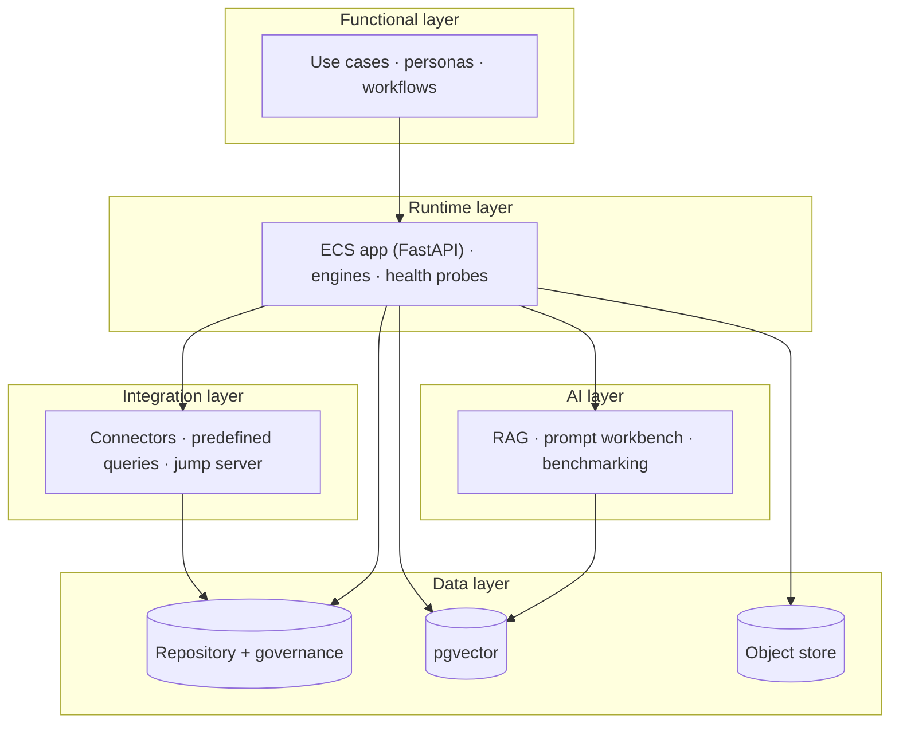

# ECS Solution Architecture

A single entry point that ties the ECS solution together across five layers —
functional, runtime, integration, data, and AI — by linking the authoritative
per-layer documents (which already exist). This is a **navigator**, not a
duplicate.

> **Reuse note.** Each layer below has a detailed source doc. This page exists so
> "solution architecture" resolves to one place; it summarizes and links.

---

## Layer map

| Layer | What it covers | Authoritative doc(s) |
|-------|----------------|----------------------|
| **Functional** | Business capabilities, personas, workflows, use cases | [`ecs_hld.md`](ecs_hld.md), [`ECS_BUSINESS_PROCESS_MODEL.md`](ECS_BUSINESS_PROCESS_MODEL.md), [`../product/ECS_MASTER_USE_CASE_CATALOG.md`](../../01-product/product/ECS_MASTER_USE_CASE_CATALOG.md) |
| **Runtime** | Process/container model, request path, startup, health | [`ecs_deployment_architecture.md`](ecs_deployment_architecture.md), [`ecs_lld.md`](ecs_lld.md) |
| **Integration** | Connector framework, predefined queries, Graph, jump server | [`INTEGRATION_ARCHITECTURE.md`](INTEGRATION_ARCHITECTURE.md), [`CONNECTOR_ARCHITECTURE.md`](CONNECTOR_ARCHITECTURE.md), [`../connectors/ECS_MASTER_INTEGRATION_MATRIX.md`](../../03-development/developer-manual/connectors/ECS_MASTER_INTEGRATION_MATRIX.md), [`../connectors/INTEGRATION_ADAPTERS_GUIDE.md`](../../03-development/developer-manual/connectors/INTEGRATION_ADAPTERS_GUIDE.md) |
| **Deployment** | Compose runtime, stores, profiles, host LLM | [`ecs_deployment_architecture.md`](ecs_deployment_architecture.md) (bank/GCP **[TARGET]**: [`ENTERPRISE_ARCHITECTURE.md`](ENTERPRISE_ARCHITECTURE.md)) |
| **Data** | Repository, governance schema, vectors, object store, lineage | [`ECS_DATA_ARCHITECTURE_REFERENCE.md`](ECS_DATA_ARCHITECTURE_REFERENCE.md), [`DATA_FLOW_ARCHITECTURE.md`](DATA_FLOW_ARCHITECTURE.md), [`../diagrams/ecs_er_diagrams.md`](../diagrams/ecs_er_diagrams.md) |
| **Evidence lifecycle** | Collect → register → custody/version → consume | [`EVIDENCE_LIFECYCLE.md`](EVIDENCE_LIFECYCLE.md), [`../evidence-management/ECS_EVIDENCE_REFERENCE_GUIDE.md`](../../03-development/evidence-management/ECS_EVIDENCE_REFERENCE_GUIDE.md) |
| **Scheduler** | Asset plan + collection runner + accounting | [`SCHEDULER_ARCHITECTURE.md`](SCHEDULER_ARCHITECTURE.md), [`../scheduler/scheduler_runtime_flow.md`](../../03-development/developer-manual/phase1/scheduler/scheduler_runtime_flow.md) |
| **AI** | RAG, prompt library/workbench, grounding, benchmarking, model abstraction | [`../ai-sdlc/ECS_AI_ARCHITECTURE_REFERENCE.md`](../../03-development/ai-sdlc/ECS_AI_ARCHITECTURE_REFERENCE.md), [`../developer-manual/PROMPT_TESTING_GUIDE.md`](../../03-development/developer-manual/PROMPT_TESTING_GUIDE.md) |

---

## Solution overview

---

## Cross-cutting concerns
- **Security:** [`../production/ECS_SECURITY_REFERENCE.md`](../../03-development/production/ECS_SECURITY_REFERENCE.md), [`../operations/PROTOTYPE_DEMO_RUN_MODE.md`](../../03-development/operations/PROTOTYPE_DEMO_RUN_MODE.md)
- **Configuration:** [`../operations/environment-configuration/00_ENVIRONMENT_CONFIGURATION_GUIDE.md`](../../03-development/operations/environment-configuration/00_ENVIRONMENT_CONFIGURATION_GUIDE.md)
- **Deployment:** [`../deployment/GCP_DEPLOYMENT_GUIDE.md`](../../03-development/deployment/GCP_DEPLOYMENT_GUIDE.md)
- **Operations:** [`../operations/OPERATIONS_MANUAL.md`](../../03-development/operations/OPERATIONS_MANUAL.md) · [`../runbooks/README.md`](../../03-development/runbooks/README.md)

## Phase-1 architecture views
- [`SYSTEM_ARCHITECTURE.md`](SYSTEM_ARCHITECTURE.md) · [`FUNCTIONAL_ARCHITECTURE.md`](FUNCTIONAL_ARCHITECTURE.md) · [`LOGICAL_ARCHITECTURE.md`](LOGICAL_ARCHITECTURE.md) · [`TECHNICAL_ARCHITECTURE.md`](TECHNICAL_ARCHITECTURE.md)
- [`ecs_deployment_architecture.md`](ecs_deployment_architecture.md) · [`INTEGRATION_ARCHITECTURE.md`](INTEGRATION_ARCHITECTURE.md) · [`CONNECTOR_ARCHITECTURE.md`](CONNECTOR_ARCHITECTURE.md)
- [`DATA_FLOW_ARCHITECTURE.md`](DATA_FLOW_ARCHITECTURE.md) · [`EVIDENCE_LIFECYCLE.md`](EVIDENCE_LIFECYCLE.md) · [`SCHEDULER_ARCHITECTURE.md`](SCHEDULER_ARCHITECTURE.md)

## See also
- [`HIGH_LEVEL_DESIGN.md`](HIGH_LEVEL_DESIGN.md) (C4) · [`LOW_LEVEL_DESIGN.md`](LOW_LEVEL_DESIGN.md) · [`ARCHITECTURE_INDEX.md`](ARCHITECTURE_INDEX.md)
