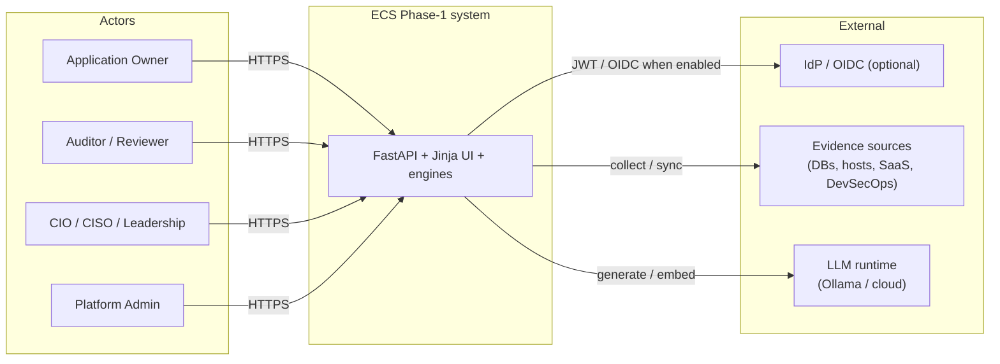

# ECS System Architecture (Phase 1)

Single entry point for the **system architecture** view of the frozen Phase-1
implementation. This is a **navigator**: detailed content already lives in the
linked documents. It does not redesign or invent capabilities.

> **Reuse note.** System context and container views are in
> [`HIGH_LEVEL_DESIGN.md`](HIGH_LEVEL_DESIGN.md) (C4). The code-grounded module
> tour is [`../00-start-here/ARCHITECTURE_OVERVIEW.md`](../00-start-here/ARCHITECTURE_OVERVIEW.md).
> Current-state assessment is
> [`ecs_enterprise_architecture_review.md`](ecs_enterprise_architecture_review.md).

---

## 1. What “system architecture” means here

| Concern | Authoritative doc |
|---------|-------------------|
| System context (actors + external systems) | [`HIGH_LEVEL_DESIGN.md`](HIGH_LEVEL_DESIGN.md) — C4 Level 1 |
| Runtime containers (app, stores, RAG) | [`HIGH_LEVEL_DESIGN.md`](HIGH_LEVEL_DESIGN.md) — C4 Level 2 |
| In-app components | [`HIGH_LEVEL_DESIGN.md`](HIGH_LEVEL_DESIGN.md) — C4 Level 3 |
| Modular monolith + module map | [`../00-start-here/ARCHITECTURE_OVERVIEW.md`](../00-start-here/ARCHITECTURE_OVERVIEW.md) |
| Implemented boundaries & risks | [`ecs_enterprise_architecture_review.md`](ecs_enterprise_architecture_review.md) |
| Bank / GCP deployment topology | [`ENTERPRISE_ARCHITECTURE.md`](ENTERPRISE_ARCHITECTURE.md) (items marked **[TARGET]** are not all present in-repo) |
| Solution layer map | [`SOLUTION_ARCHITECTURE.md`](SOLUTION_ARCHITECTURE.md) |

---

## 2. System identity (Phase 1)

ECS is a **modular monolith**: one FastAPI ASGI process (`app.main:app`) that
composes domain packages under `modules/` and infrastructure under
`ecs_platform/`. There are no separate microservices for evidence, scheduler, or
connectors in Phase 1.

| System element | Role in Phase 1 |
|----------------|-----------------|
| Browser / Jinja UI | Server-rendered dashboards, workqueues, drilldowns |
| FastAPI application | Auth middleware, route registrars, engines/services |
| Optional data plane | PostgreSQL evidence repository, pgvector, MinIO, Redis |
| External sources | Connectors / integrations / predefined-query targets |
| LLM runtime | Ollama (local default) or cloud providers via config |

Demo mode runs with deterministic in-memory state and does not require the
optional data plane. See
[`../00-start-here/ARCHITECTURE_OVERVIEW.md`](../00-start-here/ARCHITECTURE_OVERVIEW.md)
§2–§11.

---

## 3. System context (summary)

Full C4 Context diagram:
[`HIGH_LEVEL_DESIGN.md`](HIGH_LEVEL_DESIGN.md).

---

## 4. Major subsystems (implemented)

| Subsystem | Primary location | See also |
|-----------|------------------|----------|
| UI / dashboards | Jinja templates under `modules/*/templates`, `app/templates` | Overview §13 |
| API / application | `app/main.py` + route registrars | Overview §12 |
| Scheduler | `modules/audit_intelligence/services/asset_scheduler.py` | [`SCHEDULER_ARCHITECTURE.md`](SCHEDULER_ARCHITECTURE.md) |
| Predefined query engine | `modules/operations/engines/predefined_queries_engine.py` | [`../operations/ECS_PREDEFINED_QUERY_ARCHITECTURE.md`](../operations/ECS_PREDEFINED_QUERY_ARCHITECTURE.md) |
| Connector framework | `modules/operations/integrations/*`, `ecs_platform/connectors/*` | [`../connectors/`](../connectors/README.md) |
| Evidence collection & repository | `evidence_repository`, `ecs_platform/repository` | [`../evidence-management/`](../evidence-management/README.md) |
| Custody / versioning | `evidence_custody.py`, repository versioning | Logical Architecture |
| Search / RAG / LLM | `ecs_platform/rag.py`, `llm_engine/`, `vectorstore/` | [`../ai-sdlc/ECS_AI_ARCHITECTURE_REFERENCE.md`](../ai-sdlc/ECS_AI_ARCHITECTURE_REFERENCE.md) |

End-to-end **logical** relationships:
[`LOGICAL_ARCHITECTURE.md`](LOGICAL_ARCHITECTURE.md).

---

## 5. Related views

| View | Document |
|------|----------|
| Functional | [`FUNCTIONAL_ARCHITECTURE.md`](FUNCTIONAL_ARCHITECTURE.md) |
| Logical | [`LOGICAL_ARCHITECTURE.md`](LOGICAL_ARCHITECTURE.md) |
| Technical | [`TECHNICAL_ARCHITECTURE.md`](TECHNICAL_ARCHITECTURE.md) |
| Index | [`ARCHITECTURE_INDEX.md`](ARCHITECTURE_INDEX.md) |

---

## Verification notes

- Facts above are grounded in existing architecture docs and `app/main.py` /
  `modules/` / `ecs_platform/` paths cited there.
- Bank-specific hosting (GKE, Cloud Armor, jump-server only paths) in
  [`ENTERPRISE_ARCHITECTURE.md`](ENTERPRISE_ARCHITECTURE.md) includes **[TARGET]**
  items — treat those as deployment intent, not guaranteed Phase-1 runtime.
