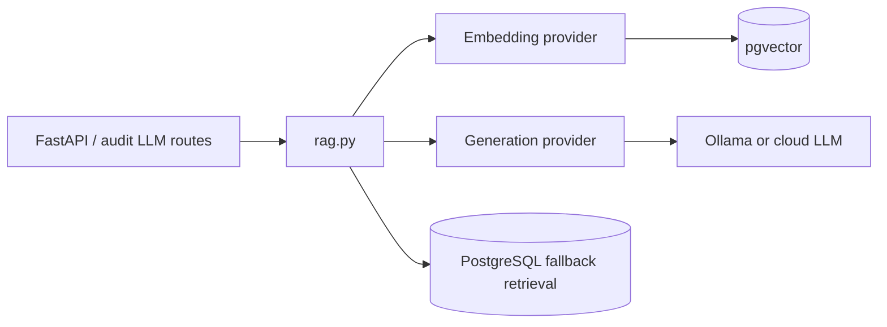
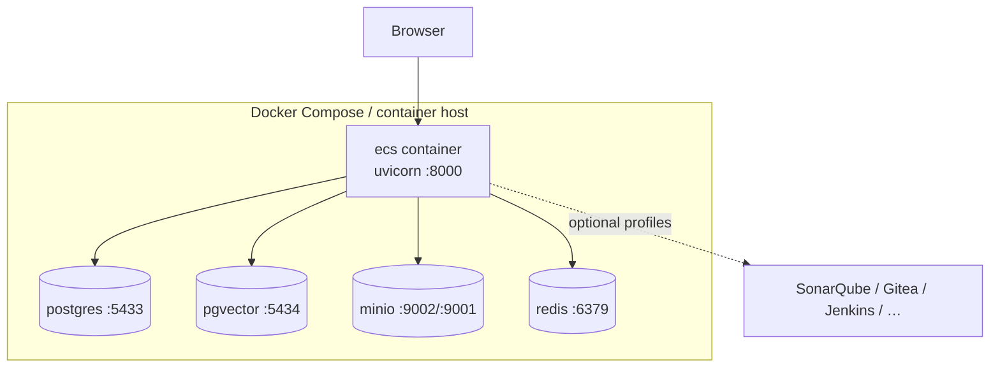

# ECS Technical Architecture (Phase 1)

Single entry point for the **technical architecture** of the frozen Phase-1
implementation: runtime stack, persistence technologies, AI services, and
deployment topology. This navigator prefers current code-grounded docs over
older baseline text.

> **Reuse note.** Full **Deployment Architecture** (Compose, profiles, host
> LLM, config boundaries):
> [`ecs_deployment_architecture.md`](ecs_deployment_architecture.md).
> **Integration / Connector Architecture:**
> [`INTEGRATION_ARCHITECTURE.md`](INTEGRATION_ARCHITECTURE.md),
> [`CONNECTOR_ARCHITECTURE.md`](CONNECTOR_ARCHITECTURE.md).
> Data stores/schemas:
> [`ECS_DATA_ARCHITECTURE_REFERENCE.md`](ECS_DATA_ARCHITECTURE_REFERENCE.md).
> AI/RAG stack:
> [`../ai-sdlc/ECS_AI_ARCHITECTURE_REFERENCE.md`](../ai-sdlc/ECS_AI_ARCHITECTURE_REFERENCE.md).
> Module/LLD map: [`LOW_LEVEL_DESIGN.md`](LOW_LEVEL_DESIGN.md),
> [`ecs_lld.md`](ecs_lld.md).

> **Supersession.** Root [`ECS_ARCHITECTURE_BASELINE.md`](../../ECS_ARCHITECTURE_BASELINE.md)
> §9 (“Technical Architecture”) describes an earlier demo-only snapshot that
> incorrectly states “there is no database.” Prefer **this document** and the
> links above for Phase-1 technical truth.

---

## 1. Runtime stack

| Layer | Technology (implemented) | Notes |
|-------|--------------------------|-------|
| Language | Python 3.12 | `python:3.12-slim` in `Dockerfile` |
| Web framework | FastAPI + Uvicorn | Entry `app.main:app` |
| UI | Jinja2 + Bootstrap + vanilla JS | No SPA / Node build |
| Auth | Azure AD / OIDC JWT (pluggable); demo bypass | `app/auth/*`, `config/auth.yaml` |
| Config | YAML under `config/` + env resolution | `ecs_platform/config/loader.py` |
| Process model | Modular monolith (single app process) | Optional compose sidecars |

Code tour:
[`../00-start-here/ARCHITECTURE_OVERVIEW.md`](../00-start-here/ARCHITECTURE_OVERVIEW.md).

---

## 2. Persistence & infrastructure services

| Service | Tech | Host port (compose defaults) | Purpose |
|---------|------|------------------------------|---------|
| Evidence repository DB | PostgreSQL 16 | 5433 | Structured evidence / maps / audit |
| Vector store | pgvector (PG 16) | 5434 | `evidence_embeddings` (dim 768) |
| Object store | MinIO | 9002 API / 9001 console | Evidence artifact bytes |
| Cache | Redis 7 | 6379 | Cache / queueing |
| Demo connectors DB | PostgreSQL 16 | 5432 | Demo-connector subsystem |

- Schema init is **best-effort** at startup (`init_repository`,
  `init_governance_schema`); the app can run in demo mode without these stores.
- Custody SNAPSHOT writes immutable bytes to the object store; metadata remains
  in SQL / repository services. See
  [`LOGICAL_ARCHITECTURE.md`](LOGICAL_ARCHITECTURE.md) §3.4.

Authoritative detail:
[`ECS_DATA_ARCHITECTURE_REFERENCE.md`](ECS_DATA_ARCHITECTURE_REFERENCE.md),
[`ecs_deployment_architecture.md`](ecs_deployment_architecture.md).

---

## 3. Collection & integration technology

| Concern | Technical mechanism | Doc |
|---------|---------------------|-----|
| Asset-driven scheduler | Python services + schedule/sync records | [`SCHEDULER_ARCHITECTURE.md`](SCHEDULER_ARCHITECTURE.md), [`../scheduler/`](../scheduler/README.md) |
| Predefined queries | Excel control library + tech signatures + connectors | [`../operations/ECS_PREDEFINED_QUERY_ARCHITECTURE.md`](../operations/ECS_PREDEFINED_QUERY_ARCHITECTURE.md) |
| Query connectors | Per-tech Python connectors under `modules/operations/engines/` | Same + LLD |
| Enterprise integrations | Adapters under `modules/operations/integrations/` | [`../connectors/`](../connectors/README.md) |
| Platform connectors | `ecs_platform/connectors` + `integrations.yaml` | Overview §9 |
| Microsoft Graph | Shared MS Graph base / SharePoint-Teams paths | [`../graph-api/`](../graph-api/README.md) |

---

## 4. AI / search technical stack

| Component | Default / config | Code |
|-----------|------------------|------|
| RAG orchestrator | Grounded retrieve → generate → cite | `ecs_platform/rag.py` |
| LLM provider abstraction | `ECS_LLM_PROVIDER` (`ollama` default) | `ecs_platform/llm_engine/` |
| Local LLM | Ollama `qwen3:8b` | `config/llm.yaml` |
| Embeddings | `nomic-embed-text`, 768-dim | `config/vectorstore.yaml` |
| Vector DB | pgvector cosine search | `ecs_platform/vectorstore/pgvector_store.py` |
| Optional cloud LLMs | Gemini / OpenAI / Azure OpenAI / Claude | Provider registry |

Full reference:
[`../ai-sdlc/ECS_AI_ARCHITECTURE_REFERENCE.md`](../ai-sdlc/ECS_AI_ARCHITECTURE_REFERENCE.md).

---

## 5. Deployment topology (summary)

- Production/bank hosting (GKE, Cloud SQL, GCS, Armor) is documented as
  **[TARGET]** in [`ENTERPRISE_ARCHITECTURE.md`](ENTERPRISE_ARCHITECTURE.md) and
  [`../deployment/GCP_DEPLOYMENT_GUIDE.md`](../deployment/GCP_DEPLOYMENT_GUIDE.md) —
  not all of that topology is required for the Phase-1 in-repo runtime.
- Health: `/healthz` (liveness), `/readyz` (readiness incl. Postgres check when
  wired).

---

## 6. Cross-cutting technical concerns

| Concern | Where documented |
|---------|------------------|
| Security / authn / authz | [`../production/ECS_SECURITY_REFERENCE.md`](../production/ECS_SECURITY_REFERENCE.md) |
| Environment configuration | [`../operations/environment-configuration/00_ENVIRONMENT_CONFIGURATION_GUIDE.md`](../operations/environment-configuration/00_ENVIRONMENT_CONFIGURATION_GUIDE.md) |
| Operations / runbooks | [`../operations/OPERATIONS_MANUAL.md`](../operations/OPERATIONS_MANUAL.md), [`../runbooks/`](../runbooks/README.md) |
| API surface | [`../developer-manual/ECS_API_REFERENCE.md`](../developer-manual/ECS_API_REFERENCE.md) |

---

## 7. Related views

| View | Document |
|------|----------|
| System | [`SYSTEM_ARCHITECTURE.md`](SYSTEM_ARCHITECTURE.md) |
| Functional | [`FUNCTIONAL_ARCHITECTURE.md`](FUNCTIONAL_ARCHITECTURE.md) |
| Logical | [`LOGICAL_ARCHITECTURE.md`](LOGICAL_ARCHITECTURE.md) |
| Solution | [`SOLUTION_ARCHITECTURE.md`](SOLUTION_ARCHITECTURE.md) |
| Index | [`ARCHITECTURE_INDEX.md`](ARCHITECTURE_INDEX.md) |

---

## Verification notes

- Ports and compose services: `docker-compose.yml` as summarized in
  [`ecs_deployment_architecture.md`](ecs_deployment_architecture.md).
- Do **not** use baseline §9 claims of “no database / no SQL” for Phase-1
  technical architecture — those stores exist and are optional behind demo mode.
- Exact “always-on” vs “profile-gated” sidecar sets depend on compose profiles;
  see the deployment architecture doc.
