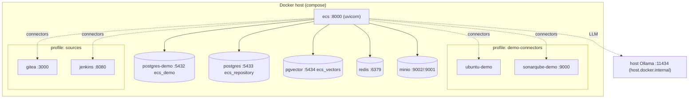
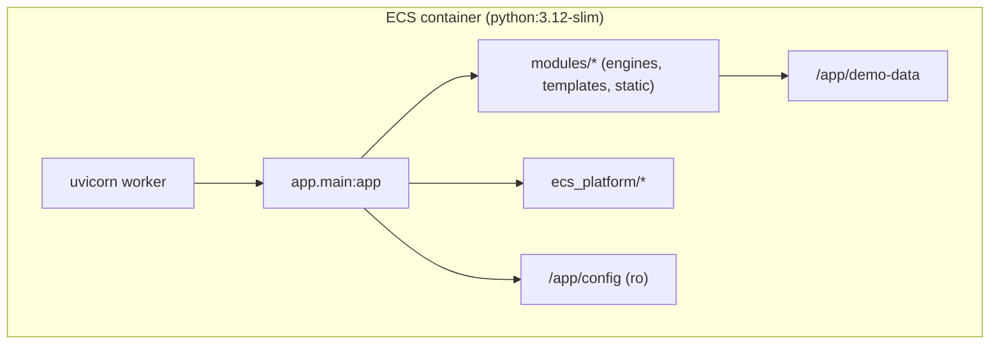
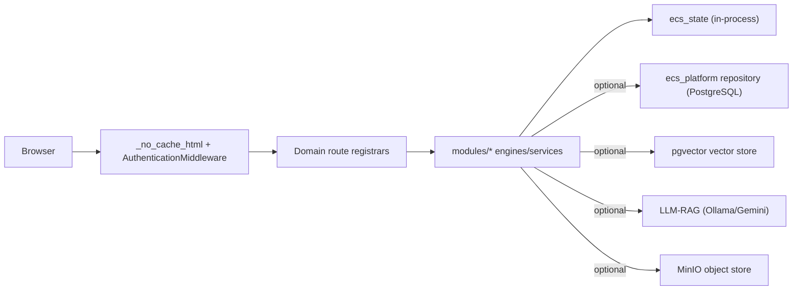
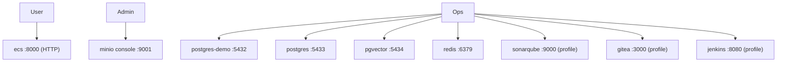
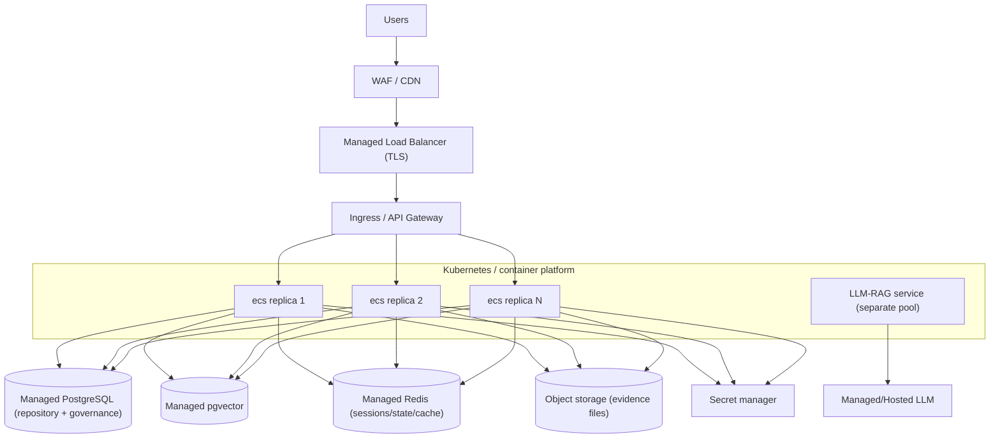
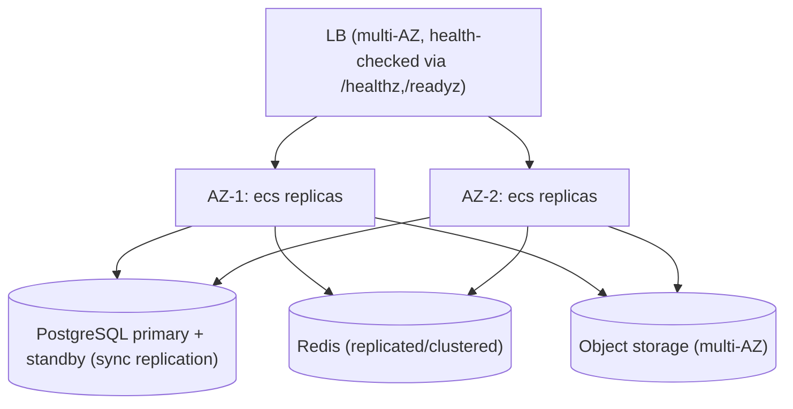
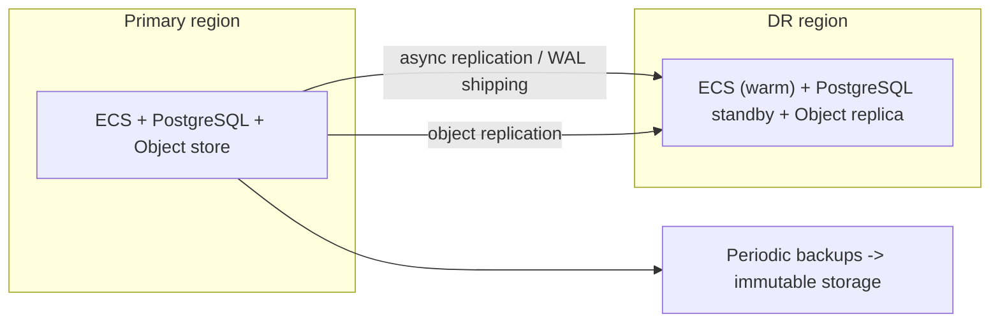

# ECS Deployment Architecture

> **Current** sections are sourced strictly from `Dockerfile`, `docker-compose.yml`, `config/`,
> and `app/routes_platform.py`. **Future / HA / DR** sections are explicitly
> **[RECOMMENDATION]** — they are target-state designs, not present in the repo today.

---

## 1. Current Deployment Model

ECS ships as a single container image built from `python:3.12-slim` (`Dockerfile`) running
`uvicorn app.main:app --host 0.0.0.0 --port 8000`. `docker-compose.yml` orchestrates the app plus
backing services for local/demo use.

**Image build (`Dockerfile`):** installs `docker.io` + pip `requirements.txt`; copies `app/`,
`modules/`, `demo-data/`, `ecs_platform/`, `config/`; exposes `8000`.

**Compose services (`docker-compose.yml`):**

| Service | Image | Host port | Role | Profile |
|---|---|---|---|---|
| `ecs` | `build: .` | 8000 | FastAPI app (dev `--reload`, source bind-mounts) | default |
| `postgres-demo` | `postgres:16` | 5432 | Demo DB `ecs_demo` | default |
| `postgres` | `postgres:16` | 5433 | Evidence repository `ecs_repository` (healthcheck, volume) | default |
| `pgvector` | `pgvector/pgvector:pg16` | 5434 | Vector store `ecs_vectors` (healthcheck, volume) | default |
| `redis` | `redis:7-alpine` | 6379 | Cache/queue (persisted) | default |
| `minio` | `minio/minio:latest` | 9002 (API), 9001 (console) | Object store (healthcheck, volume) | default |
| `ubuntu-demo` | `ubuntu:22.04` | — | Linux connector target | `demo-connectors` |
| `sonarqube-demo` | `sonarqube:lts-community` | 9000 | SonarQube connector target | `demo-connectors` |
| `gitea` | `gitea/gitea:1.22` | 3000, 2222 | Git source system | `sources` |
| `jenkins` | `jenkins/jenkins:lts` | 8080, 50000 | CI source system | `sources` |

`ecs` `depends_on`: `postgres-demo`, `postgres`, `pgvector`; mounts the host Docker socket
(`/var/run/docker.sock`) and `extra_hosts: host.docker.internal:host-gateway` to reach a host-local
Ollama LLM. Named volumes: `ecs_repo_data`, `ecs_vector_data`, `ecs_redis_data`, `ecs_minio_data`,
`ecs_gitea_data`, `ecs_jenkins_data`.

**Config plane:** `config/` (`auth.yaml`, `rbac.yaml`) mounted read-only at `/app/config`
(`ECS_CONFIG_DIR=/app/config`). Connector/LLM credentials are injected via host environment (compose
uses `${VAR:-default}` and never hardcodes SaaS secrets).

---

## 2. Container Architecture

- **Single process / single worker** by default (`CMD` has no `--workers`); compose dev adds
  `--reload`. **[NOTE]** because business state is in-process (`ecs_state`), multi-worker scaling is
  not safe until state is externalized (see Enterprise Architecture Review, R1).
- Docker socket mount enables container-aware connectors (e.g. Linux connector targeting
  `ubuntu-demo`).

---

## 3. Runtime Architecture

- **Startup lifespan** (`app/main.py`): seeds demo workflow state, refreshes repository from
  frameworks, self-heals governance, validates predefined queries, best-effort initializes DB schema,
  warms LLM models in background.
- **Health/readiness:** `GET /healthz` (liveness), `GET /readyz` (readiness incl. PostgreSQL),
  `GET /api/platform/health` (connector health) — `app/routes_platform.py`.

---

## 4. Network Architecture (current)

- All services share the default compose bridge network; ECS reaches them by service DNS name
  (`postgres-demo`, `pgvector`, `minio`, `redis`, `sonarqube-demo`, `gitea`, `jenkins`).
- **No TLS termination in the container** — HTTP on 8000. TLS is expected at an ingress/LB in
  non-local deployments **[ASSUMPTION]**.
- LLM reached out-of-network via `host.docker.internal:11434`.

---

## 5. Future Cloud Deployment Architecture **[RECOMMENDATION]**

Target state externalizes state and runs the stateless web tier behind managed services.

Prerequisites (from current gaps): externalize `ecs_state` to PostgreSQL/Redis, enforce RBAC,
integrate a secret manager, pin dependencies, run multiple stateless replicas with `--workers`.

---

## 6. High Availability (HA) Architecture **[RECOMMENDATION]**

- **Stateless replicas** across ≥2 AZs; LB uses existing `/healthz` and `/readyz` probes.
- **PostgreSQL** primary/standby with automatic failover; **Redis** replication; **object storage**
  multi-AZ redundancy.
- No single point of failure in the web tier once state is externalized.

---

## 7. Disaster Recovery (DR) Architecture **[RECOMMENDATION]**

- **Replication:** async PostgreSQL replication / WAL shipping + object-store cross-region replication.
- **Backups:** scheduled PostgreSQL dumps + evidence object snapshots to immutable storage (supports
  banking retention requirements).
- **Targets:** define RPO/RTO **[RECOMMENDATION]**; suggested starting point RPO ≤ 15 min, RTO ≤ 1 hr.
- **Runbook:** see `docs/03-development/operations/ecs_runbook.md` for backup/recovery procedures.
