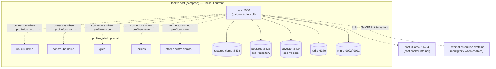
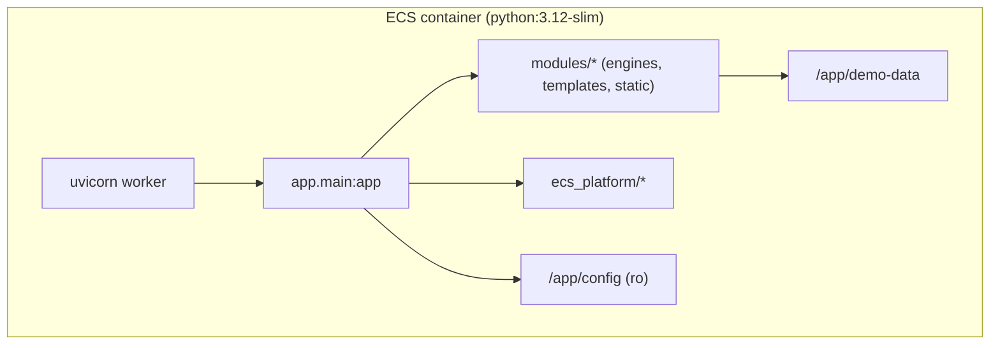
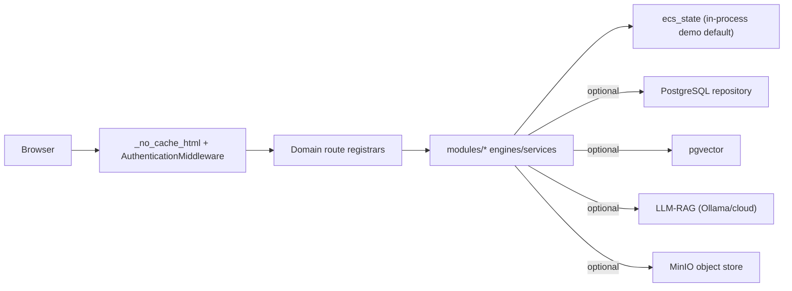
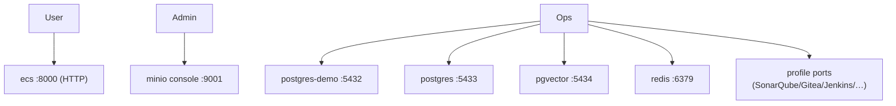
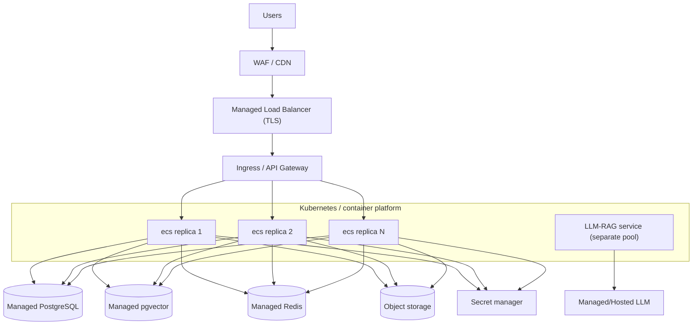
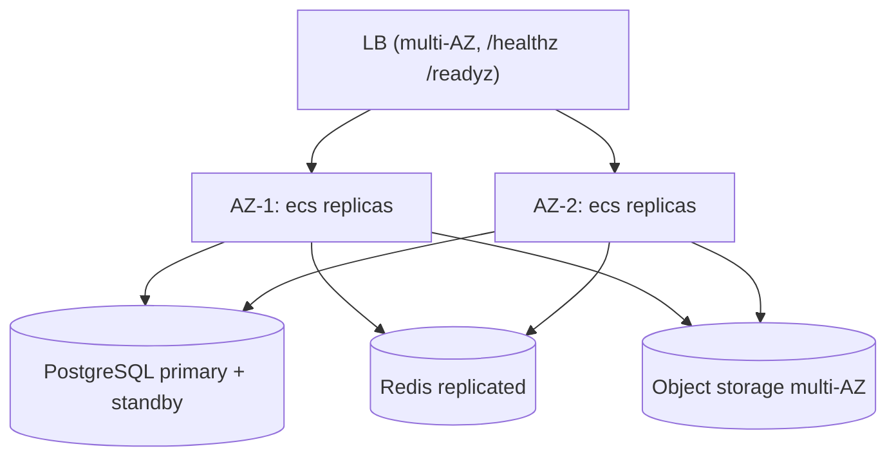
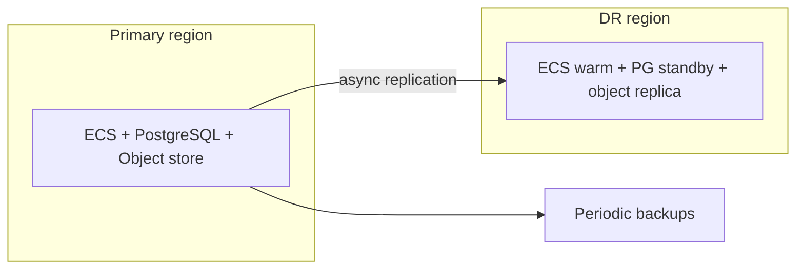

# ECS Deployment Architecture (Phase 1)

**Canonical Phase-1 deployment architecture** for the frozen implementation.
Current-state sections are sourced from `Dockerfile`, `docker-compose.yml`,
`config/`, and health routes. Sections marked **[RECOMMENDATION]** / **[TARGET]**
are **not** Phase-1 runtime.

> **Do not** treat [`ENTERPRISE_ARCHITECTURE.md`](ENTERPRISE_ARCHITECTURE.md) or
> [`../deployment/GCP_DEPLOYMENT_GUIDE.md`](../deployment/GCP_DEPLOYMENT_GUIDE.md)
> as the implemented Phase-1 topology. Those documents describe bank/GCP target
> deployment.

> **Related Phase-1 views:** [`TECHNICAL_ARCHITECTURE.md`](TECHNICAL_ARCHITECTURE.md)
> · [`SYSTEM_ARCHITECTURE.md`](SYSTEM_ARCHITECTURE.md) ·
> [`LOGICAL_ARCHITECTURE.md`](LOGICAL_ARCHITECTURE.md)

---

## 1. Current deployment model (implemented)

ECS ships as a **single container image** built from `python:3.12-slim`
(`Dockerfile`) running:

`uvicorn app.main:app --host 0.0.0.0 --port 8000`

`docker-compose.yml` orchestrates the app plus backing and optional target
services for local/demo/UAT-style use.

**Image build (`Dockerfile`):** installs `docker.io` + pip `requirements.txt`;
copies `app/`, `modules/`, `demo-data/`, `ecs_platform/`, `config/`; exposes
`8000`.

**Frontend / UI:** Server-rendered Jinja2 templates and static assets are served
**from the same `ecs` process** (no separate frontend container or Node build).

### 1.1 Default Compose services (always defined; no profile)

| Service | Image | Host port | Role |
|---|---|---|---|
| `ecs` | `build: .` | 8000 | FastAPI app + Jinja UI (dev often uses `--reload` + source bind-mounts) |
| `postgres-demo` | `postgres:16` | 5432 | Demo DB `ecs_demo` |
| `postgres` | `postgres:16` | 5433 | Evidence repository `ecs_repository` (healthcheck, volume) |
| `pgvector` | `pgvector/pgvector:pg16` | 5434 | Vector store `ecs_vectors` (healthcheck, volume) |
| `redis` | `redis:7-alpine` | 6379 | Compose dependency; `REDIS_URL` injected into `ecs` |
| `minio` | `minio/minio:latest` | 9002 (API), 9001 (console) | Object store (healthcheck, volume) |

`ecs` `depends_on`: `postgres-demo`, `postgres`, `pgvector`; mounts the host
Docker socket (`/var/run/docker.sock`) and
`extra_hosts: host.docker.internal:host-gateway` to reach a **host-local**
Ollama LLM. Named volumes (default plane): `ecs_repo_data`, `ecs_vector_data`,
`ecs_redis_data`, `ecs_minio_data`.

### 1.2 Profile-gated / optional Compose services

These exist in `docker-compose.yml` but start only when the matching Compose
**profile** is enabled. They are **not** required for core ECS boot.

| Service | Profile(s) | Role |
|---|---|---|
| `ubuntu-demo` | `demo-connectors` | Linux connector target |
| `sonarqube-demo` | `demo-connectors` | SonarQube connector target (`:9000`) |
| `gitea` | `sources` | Git source system (`:3000`, `:2222`) |
| `jenkins` | `sources` | CI source system (`:8080`, `:50000`) |
| `yugabyte` | `db-targets` | Optional DB target |
| `mysql-demo` | `db-targets` | Optional MySQL target |
| `aerospike` | `aerospike`, `demo` | Optional Aerospike target |
| `nginx-demo` | `nginx-demo`, `infra-demo` | Optional middleware target |
| `rhel8-demo` / `rhel9-demo` | `rhel-demo`, `infra-demo` | Optional OS targets |
| `oracle-demo` | `oracle-demo` | Optional Oracle target |
| `apache-demo` / `tomcat-demo` | `apache-demo` / `tomcat-demo`, `infra-demo-extended` | Optional middleware |
| `mongodb-demo` | `mongodb-demo`, `db-demo-extended` | Optional DB target |
| `sqlserver-demo` | `sqlserver-demo` | Optional SQL Server target |
| `local-graph-poc` | *(see compose)* | Local Graph POC helper service |

> Exact ports and image tags: read `docker-compose.yml` — do not invent
> additional services beyond what Compose defines.

```mermaid
graph TD
  subgraph Host["Docker host (compose) — Phase-1 current"]
    ECS["ecs :8000\n(uvicorn + Jinja UI)"]
    PGD[("postgres-demo :5432")]
    PGR[("postgres :5433\necs_repository")]
    PGV[("pgvector :5434\necs_vectors")]
    RDS[("redis :6379")]
    OBJ[("minio :9002/:9001")]
    subgraph Profiles["profile-gated optional"]
      UB["ubuntu-demo"]
      SQ["sonarqube-demo"]
      GIT["gitea"]
      JEN["jenkins"]
      OTHER["other db/infra demos…"]
    end
  end
  OLL["host Ollama :11434\n(host.docker.internal)"]
  EXT["External enterprise systems\n(config/env when enabled)"]
  ECS --> PGD & PGR & PGV & RDS & OBJ
  ECS -. connectors when profile/env on .-> UB & SQ & GIT & JEN & OTHER
  ECS -. LLM .-> OLL
  ECS -. SaaS/API integrations .-> EXT
```

---

## 2. Configuration boundaries

| Boundary | Mechanism | Notes |
|----------|-----------|-------|
| App config | `config/` YAML (`auth`, `rbac`, `integrations`, `llm`, `repository`, `vectorstore`, …) | Env-resolved via `ecs_platform/config/loader.py` (`${VAR:-default}`) |
| Compose → container | Environment on `ecs` service | e.g. `OLLAMA_URL`, `REDIS_URL`, connector `ECS_*` vars |
| Secrets | Environment / `.env` (git-ignored) — **not** committed YAML values | SaaS connectors default `enabled: false` until env + flag set |
| Config mount | Often mounted read-only at `/app/config` (`ECS_CONFIG_DIR`) | See local/UAT env guides |

Authoritative ops detail:
[`../operations/environment-configuration/00_ENVIRONMENT_CONFIGURATION_GUIDE.md`](../operations/environment-configuration/00_ENVIRONMENT_CONFIGURATION_GUIDE.md),
[`../operations/environment-configuration/01_DEPLOYMENT_CONFIGURATION_GUIDE.md`](../operations/environment-configuration/01_DEPLOYMENT_CONFIGURATION_GUIDE.md).

---

## 3. Container architecture (ECS image)

```mermaid
graph TD
  subgraph Image["ECS container (python:3.12-slim)"]
    UV["uvicorn worker"]
    APP["app.main:app"]
    MODS["modules/* (engines, templates, static)"]
    PLAT["ecs_platform/*"]
    CFG["/app/config (ro)"]
    DEMO["/app/demo-data"]
  end
  UV --> APP --> MODS
  APP --> PLAT
  APP --> CFG
  MODS --> DEMO
```

- **Single process / single worker** by default (`CMD` has no `--workers`);
  compose dev may add `--reload`. Because business state can live in-process
  (`ecs_state`), multi-worker scaling is **not safe** until state is
  externalized (see [`ecs_enterprise_architecture_review.md`](ecs_enterprise_architecture_review.md) R1).
- Docker socket mount enables container-aware connectors (e.g. Linux connector
  targeting `ubuntu-demo`).

---

## 4. Runtime architecture (in-process + optional stores)

```mermaid
graph LR
  Client["Browser"] --> MW["_no_cache_html + AuthenticationMiddleware"]
  MW --> Routes["Domain route registrars"]
  Routes --> Engines["modules/* engines/services"]
  Engines --> State["ecs_state (in-process demo default)"]
  Engines -->|optional| Repo["PostgreSQL repository"]
  Engines -->|optional| Vec["pgvector"]
  Engines -->|optional| RAG["LLM-RAG (Ollama/cloud)"]
  Engines -->|optional| ObjS["MinIO object store"]
```

| Dependency | Phase-1 role |
|------------|--------------|
| PostgreSQL (`postgres` / `postgres-demo`) | Evidence/governance metadata and demo DB; schema init best-effort at startup |
| MinIO | Object bytes for evidence SNAPSHOT custody / artifacts |
| pgvector | Embeddings for RAG (`evidence_embeddings`, dim 768) |
| Redis | Present in Compose + `REDIS_URL`; also a predefined-query / diagnostic target (`redis_connector`). **Do not assume** a fully externalized session cache is the primary Phase-1 state store — demo state remains in-process by default |
| Ollama (host) | Default local LLM/embeddings via `OLLAMA_URL` → `host.docker.internal:11434` |
| External enterprise systems | Reachable when connector/integration env + `enabled` are set — see Integration Architecture |

- **Startup lifespan** (`app/main.py`): seeds demo workflow state, refreshes
  repository from frameworks, self-heals governance, validates predefined
  queries, best-effort DB schema init, background LLM warm.
- **Health/readiness:** `GET /healthz`, `GET /readyz` (incl. PostgreSQL when
  wired), `GET /api/platform/health` — `app/routes_platform.py`.

Data model detail:
[`ECS_DATA_ARCHITECTURE_REFERENCE.md`](ECS_DATA_ARCHITECTURE_REFERENCE.md).
AI/LLM detail:
[`../ai-sdlc/ECS_AI_ARCHITECTURE_REFERENCE.md`](../ai-sdlc/ECS_AI_ARCHITECTURE_REFERENCE.md).

---

## 5. Network architecture (current)

```mermaid
graph TD
  User --> P8000["ecs :8000 (HTTP)"]
  Admin --> P9001["minio console :9001"]
  Ops --> P5432["postgres-demo :5432"]
  Ops --> P5433["postgres :5433"]
  Ops --> P5434["pgvector :5434"]
  Ops --> P6379["redis :6379"]
  Ops --> Profiles["profile ports\n(SonarQube/Gitea/Jenkins/…)"]
```

- Services share the default compose bridge network; ECS reaches them by
  service DNS name (`postgres`, `pgvector`, `minio`, `redis`, …).
- **No TLS termination in the container** — HTTP on 8000. TLS is expected at
  an ingress/LB in non-local deployments **[ASSUMPTION]**.
- LLM reached out-of-network via `host.docker.internal:11434`.

---

## 6. External systems (deployment perspective)

From a deployment view, external systems are **not** Compose default services.
They are reached over the network when integrations/connectors are configured:

- SaaS / DevSecOps / Graph / cloud posture APIs (integration adapters + platform
  connectors)
- Predefined-query targets (DBs, hosts, scanners) — local demos via profiles or
  real UAT hosts via env YAML

Inventory (status semantics ✅/⚙/🔵):
[`../connectors/ECS_MASTER_INTEGRATION_MATRIX.md`](../connectors/ECS_MASTER_INTEGRATION_MATRIX.md).
Architecture view:
[`INTEGRATION_ARCHITECTURE.md`](INTEGRATION_ARCHITECTURE.md).

---

## 7. Future cloud / HA / DR **[RECOMMENDATION] — not Phase-1**

The following diagrams are **target-state recommendations**. They are retained
for planning continuity and must **not** be read as the frozen Phase-1 runtime.

### 7.1 Cloud deployment **[RECOMMENDATION]**

```mermaid
graph TD
  Users --> WAF["WAF / CDN"]
  WAF --> LB["Managed Load Balancer (TLS)"]
  LB --> ING["Ingress / API Gateway"]
  subgraph K8s["Kubernetes / container platform"]
    ECS1["ecs replica 1"]
    ECS2["ecs replica 2"]
    ECSn["ecs replica N"]
    RAGSVC["LLM-RAG service (separate pool)"]
  end
  ING --> ECS1 & ECS2 & ECSn
  ECS1 & ECS2 & ECSn --> PG[("Managed PostgreSQL")]
  ECS1 & ECS2 & ECSn --> PGV[("Managed pgvector")]
  ECS1 & ECS2 & ECSn --> CACHE[("Managed Redis")]
  ECS1 & ECS2 & ECSn --> OBJ[("Object storage")]
  ECS1 & ECS2 & ECSn --> SM["Secret manager"]
  RAGSVC --> LLM["Managed/Hosted LLM"]
```

Prerequisites called out in the enterprise review: externalize `ecs_state`,
enforce RBAC, secret manager, pin dependencies, then scale replicas.

Bank/GCP narrative (also largely **[TARGET]**):
[`ENTERPRISE_ARCHITECTURE.md`](ENTERPRISE_ARCHITECTURE.md),
[`../deployment/GCP_DEPLOYMENT_GUIDE.md`](../deployment/GCP_DEPLOYMENT_GUIDE.md).

### 7.2 High availability **[RECOMMENDATION]**

```mermaid
graph TD
  LB["LB (multi-AZ, /healthz /readyz)"]
  LB --> AZ1["AZ-1: ecs replicas"]
  LB --> AZ2["AZ-2: ecs replicas"]
  AZ1 & AZ2 --> PGHA[("PostgreSQL primary + standby")]
  AZ1 & AZ2 --> REDISHA[("Redis replicated")]
  AZ1 & AZ2 --> OBJHA[("Object storage multi-AZ")]
```

### 7.3 Disaster recovery **[RECOMMENDATION]**

```mermaid
graph LR
  subgraph Primary["Primary region"]
    P["ECS + PostgreSQL + Object store"]
  end
  subgraph DR["DR region"]
    D["ECS warm + PG standby + object replica"]
  end
  P -- "async replication" --> D
  Backup["Periodic backups"]
  P --> Backup
```

- **Replication:** async PostgreSQL replication / WAL shipping + object-store cross-region replication.
- **Backups:** scheduled PostgreSQL dumps + evidence object snapshots to immutable storage (supports
  banking retention requirements).
- **Targets:** define RPO/RTO **[RECOMMENDATION]**; suggested starting point RPO ≤ 15 min, RTO ≤ 1 hr.
- **Runbook:** see [`ECS_BACKUP_AND_RECOVERY_GUIDE.md`](../../03-development/operations/ECS_BACKUP_AND_RECOVERY_GUIDE.md)
  and related runbooks. Suggested RPO/RTO numbers remain **[RECOMMENDATION]** only.

---

## Verification notes

- Service/profile inventory verified against `docker-compose.yml` (default vs
  profile-gated split).
- Older summaries that say only “SonarQube/Gitea/Jenkins/Ubuntu” understate the
  full set of **optional** Compose profiles now present.
- [`ECS_Architecture_and_Deployment_Guide.md`](ECS_Architecture_and_Deployment_Guide.md)
  §14 is a broader product/deployment narrative — prefer **this file** for
  Phase-1 Compose topology truth.

