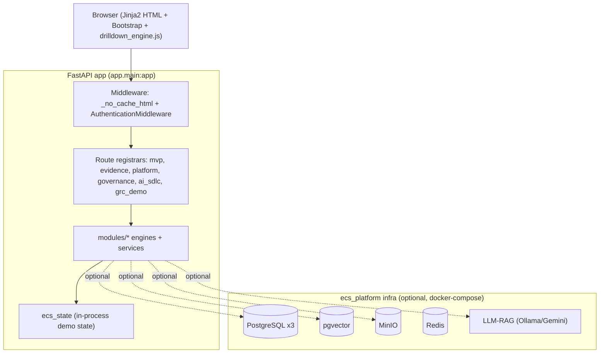

# ECS Enterprise Architecture Review

> **Scope & sourcing.** This review documents the **current implemented architecture** of the ECS
> (Evidence & Compliance System) platform, derived strictly from the repository at
> `/Users/nikhil/Documents/ECS`. Facts are cited to file paths. Statements that go beyond what is in
> code are explicitly tagged **[ASSUMPTION]** or **[RECOMMENDATION]**.

---

## 1. Current-State Architecture

### 1.1 Architectural style

ECS is a **modular monolith**: a single FastAPI application (`app/main.py`, entry `app.main:app`)
that composes domain packages under `modules/` and an infrastructure package `ecs_platform/`.

- **Web framework:** FastAPI (`requirements.txt`, `app/main.py`).
- **Templating / UI:** Server-rendered Jinja2 with a `ChoiceLoader` across eight template
  directories (`app/main.py` lines 223–237). UI is HTML + Bootstrap + vanilla JS
  (`modules/shared/static/js/drilldown_engine.js`).
- **Runtime:** `uvicorn app.main:app --host 0.0.0.0 --port 8000` (`Dockerfile`), Python 3.12
  (`python:3.12-slim`).
- **State:** Primarily **in-process Python state** (`modules/shared/services/ecs_state.py`) seeded
  with deterministic demo data, with **optional** PostgreSQL / pgvector / MinIO / Redis backing
  services defined in `docker-compose.yml` and wired through `ecs_platform/`.

### 1.2 Request lifecycle

1. **Middleware** — `_no_cache_html` sets `Cache-Control: no-cache` on HTML responses
   (`app/main.py` lines 180–198); `AuthenticationMiddleware` enforces JWT/OIDC (pass-through when
   disabled) via `register_authentication(app)` (`app/auth/middleware.py`).
2. **Routing** — Routes are registered by domain registrars (`app/main.py` lines 1477–1494):
   `register_mvp_routes`, `register_evidence_routes`, `register_platform_routes`,
   `register_governance_routes`, `register_ai_sdlc_routes`, `register_grc_demo_routes`.
3. **Engines/services** compute view models from `ecs_state` and mock-data engines.
4. **Rendering** — Jinja2 templates render HTML; JSON APIs (drilldowns, demo feeds) return data
   consumed by `drilldown_engine.js`.

### 1.3 Startup (lifespan)

`ecs_lifespan` (`app/main.py` lines 94–174) performs deterministic seeding and self-healing:
`refresh_repository_from_frameworks`, `seed_demo_workflow_state`, `self_heal_governance`,
`validate_startup`, best-effort `init_repository` / `init_governance_schema`, optional observation
hydration, and background LLM-RAG `warm_models`.

---

## 2. Module Decomposition

| Module | Path | Capability | Key engines |
|---|---|---|---|
| **executive_overview** | `modules/executive_overview/` | Enterprise/Pan-India KPIs, ROI center, trends, report catalog, demo metrics | `executive_analytics_engine.py`, `reporting_module.py`, `demo_metrics.py`, `enterprise_mock_service.py` |
| **governance** | `modules/governance/` | Evidence health, approval analytics, completeness, lifecycle, search, audit prep, exceptions, gap export | `evidence_approval_engine.py`, `evidence_health_engine.py`, `governance_lifecycle_engine.py`, `missing_evidence_engine.py`, `governance_relational_model.py` |
| **operations** | `modules/operations/` | Evidence collection scheduler, bulk upload, connectors/integrations, onboarding, predefined queries, AI ops assistant | `scheduler_module.py`, `evidence_repository.py`, `integrations_module.py`, connectors (`linux_/postgresql_/sonarqube_/trivy_/gitleaks_connector.py`), `predefined_queries_engine.py` |
| **frameworks** | `modules/frameworks/` | Framework catalog & dashboards, control validation, onboarding/loader, KPI/workflow drills, ITPP | `framework_catalog.py`, `framework_dashboards.py`, `framework_workflow_engine.py`, `control_validation_engine.py`, `itpp_module.py` |
| **enterprise_grc** | `modules/enterprise_grc/` | Risk register, CMDB, exceptions/TD, regulatory mapping, heatmaps, correlation, governance analytics | `grc_module_demo.py`, `correlation_engine.py`, `ecs_governance_framework.py`, `ecs_governance_qa_engine.py` |
| **ai_sdlc** | `modules/ai_sdlc/` | SDLC stage gates, evidence collection, findings/remediation, AI governance posture, control tower, reports | `ai_sdlc_workflow_engine.py`, `ai_sdlc_governance_mock.py`, `ai_sdlc_control_tower_engine.py`, `ai_sdlc_controlled_documents.py` |
| **shared** | `modules/shared/` | Cross-cutting state, RBAC helpers, universal drilldown, persona UI, evidence workflow, nav | `ecs_state.py`, `evidence_workflow_engine.py`, `drilldown_engine.py`, `drilldowns/ecs_universal_drill_engine.py`, `role_permissions.py`, `persona_display.py` |
| **ecs_platform** | `ecs_platform/` | Config loader, ingestion, repository, vectorstore, RAG, governance schema, connectors | `config/loader.py`, `ingestion.py`, `governance.py`, `rag.py` |
| **app/** subsystems | `app/` | Auth, audit, observations, connectivity, ROI, sufficiency, evidence_analytics, evidence_intel | `auth/`, `evidence_intel/models.py`, `evidence_analytics/models.py`, `roi/models.py`, `connectivity/models.py` |

**Observation:** Several files under `app/` (e.g. `app/ecs_state.py`, `app/routes_mvp.py`,
`app/governance_mock_data.py`) are **shims** that re-export the canonical implementations in
`modules/*`. Canonical state is `modules/shared/services/ecs_state.py`.

---

## 3. Domain Model (current)

The domain is implemented partly as **typed models** (dataclasses / Pydantic in `app/evidence_intel/`,
`app/evidence_analytics/`, `app/roi/`, `app/connectivity/`, `app/auth/`) and partly as **dict/list
structures** in mock-data engines and `ecs_state`. Core concepts:

- **User / Role** — `AuthenticatedUser`, `RoleDef`, `CANONICAL_ROLES` (`app/auth/context.py`,
  `app/auth/roles.py`).
- **Application** — banking application catalogs (`ecs_state.BANKING_APPLICATIONS`,
  `framework_catalog.APPLICATIONS`); no dedicated `Application` dataclass.
- **Framework / Control** — `FRAMEWORK_CATALOG` + `_control()` (`framework_catalog.py`); relational
  control in `governance_relational_model.py`.
- **Evidence** — multiple representations: catalog evidence (`framework_catalog._make_evidence`),
  analytics rows (`ecs_state.build_evidence_analytics`), relational evidence, and typed
  `EvidenceVersion` / `EvidenceStatus` (`app/evidence_intel/models.py`).
- **Finding / Observation** — relational `finding` (`governance_relational_model.py`), missing-evidence
  observation (`missing_evidence_engine.py`), closed observation (`evidence_workflow_engine.py`).
- **Audit** — dict structures via `audit_schedule_engine.py` / lifecycle engine; no dedicated dataclass.
- **Report** — catalog entries (`reporting_module._REPORT_DEFS`, 30 definitions).
- **Risk** — risk register rows (`grc_module_demo._generate_risk_rows`).
- **AI SDLC entities** — stages, stage artifacts, evidence queue, findings (`ai_sdlc_workflow_engine.py`).

Full entity attribute lists and ER diagrams are in `docs/02-architecture/diagrams/ecs_er_diagrams.md`.

---

## 4. Architectural Strengths

1. **Clean modular decomposition** by business domain (`modules/*`), each with its own engines and
   templates — supports independent evolution.
2. **Single universal drilldown contract** — `drill_metric()` (`modules/shared/services/drilldown_engine.py`)
   and `ecs_universal_drill_engine.py` provide a consistent `{ok, title, rows, columns, sections,
   metric_trace}` response shape across KPI/chart/row/heatmap/workflow scopes, with a guaranteed
   non-empty `_fallback_body()`. This is a strong, reusable explainability pattern.
3. **Deterministic, self-seeding demo state** (`demo_seed.py`, `seed_demo_workflow_state`,
   `self_heal_governance`) makes the platform reliably demonstrable without external dependencies.
4. **Pluggable authentication** — Azure AD / generic OIDC / dev-bypass providers behind a single
   middleware (`app/auth/`), config-driven via `config/auth.yaml`.
5. **Explicit persona model** — role → dashboard/KPIs/tabs mapping (`demo_metrics.py`,
   `persona_display.py`) plus role-scoped data filtering (`role_filter_scope.py`).
6. **Real connector scaffolding** — `modules/operations/engines/*_connector.py` (Linux, PostgreSQL,
   SonarQube, Trivy, Gitleaks) and `ecs_platform/` ingestion provide a path from demo to live evidence.
7. **Health endpoints** — `/healthz` (liveness) and `/readyz` (readiness incl. PostgreSQL)
   (`app/routes_platform.py`) support container orchestration.
8. **Cache-correctness hardening** — `_no_cache_html` middleware + versioned static assets (`asset_ver`)
   prevent stale-UI defects.

---

## 5. Architectural Risks

| # | Risk | Evidence | Impact |
|---|---|---|---|
| R1 | **In-process mutable state** is the primary store (`ecs_state` module-level dicts). Not shared across workers/replicas; lost on restart. | `modules/shared/services/ecs_state.py` | Horizontal scaling & durability |
| R2 | **Demo/mock data is the default data plane**; live persistence (PostgreSQL) is best-effort/optional. | `ecs_lifespan` best-effort `init_repository`; mock engines | Production data integrity |
| R3 | **RBAC not fully enforced** — canonical roles exist but are noted as not fully wired into enforcement; two RBAC layers coexist. | `app/auth/roles.py`, `config/rbac.yaml` | Authorization gaps |
| R4 | **DEMO_MODE bypasses authentication entirely** for all routes. | `app/auth/demo.py`, `app/auth/middleware.py` | Must be off in production |
| R5 | **Unpinned dependencies** in `requirements.txt`. | `requirements.txt` | Reproducibility / supply-chain |
| R6 | **Code duplication** between `app/*` shims and `modules/*` canonical engines. | `app/ecs_state.py` etc. | Maintenance drift |
| R7 | **No automated DB migrations**; schema init is best-effort at startup. | `ecs_platform/governance.py` init | Schema evolution |
| R8 | **Secrets via environment** with example defaults; no secret manager integration in repo. | `docker-compose.yml`, `.env.example` | Secret hygiene |
| R9 | **Large inline `<style>`/`<script>` in templates** increases page weight and coupling. | `enterprise_theme.html` | Front-end maintainability |
| R10 | **No evidence of test coverage gates / CI config** in the documented surface (tests exist under `tests/` but pipeline not defined here). | `tests/` present; no CI manifest cited | Release quality |

---

## 6. Technical Debt Assessment

- **State layer debt (high):** Business state lives in module-level dicts (R1). Migrating to the
  PostgreSQL/repository layer that already exists in `ecs_platform/` is the largest single piece of
  debt to retire for production.
- **Shim duplication (medium):** `app/*` re-export shims should be collapsed to a single import
  surface to avoid drift (R6).
- **RBAC convergence (medium):** Two RBAC layers (`rbac:` legacy + `rbac_catalog:` additive in
  `config/rbac.yaml`) plus `app/auth/roles.py` should converge into one enforced model (R3).
- **Dependency pinning (low-medium):** Pin and hash dependencies (R5).
- **Template asset extraction (low):** Move inline CSS/JS to versioned static files (R9) — partially
  begun via `asset_ver` for the drilldown engine.

---

## 7. Scalability Assessment

- **Current ceiling:** Single-process, in-memory state means **vertical scaling only**; multiple
  uvicorn workers/replicas would not share `ecs_state` and would diverge (R1).
- **Stateless front door:** Routing/rendering are otherwise stateless and could scale horizontally
  **once state is externalized** to PostgreSQL/Redis (both already present in `docker-compose.yml`).
- **Read-heavy workload:** Dashboards/drilldowns are read-mostly; introducing Redis caching and
  read replicas would scale reads well. **[RECOMMENDATION]** externalize session/workflow state to
  Redis/PostgreSQL, then run N replicas behind a load balancer.
- **RAG/LLM:** `warm_models()` runs in background; heavy LLM/RAG should be a separate service to
  avoid blocking the web tier (`ecs_platform/rag.py`).

---

## 8. Security Assessment

| Area | Current state | Source |
|---|---|---|
| AuthN | Azure AD / OIDC JWT (RS256, JWKS) with dev-bypass; enabled by default | `app/auth/providers.py`, `jwt_validator.py`, `config/auth.yaml` |
| AuthZ | Page/mutation/scope guards exist; canonical RBAC not fully wired | `app/auth/page_guard.py`, `mutation_guard.py`, `roles.py` |
| Demo bypass | `DEMO_MODE=true` disables auth platform-wide | `app/auth/demo.py` |
| Transport | TLS not terminated in-app (expected at ingress/LB) **[ASSUMPTION]** | — |
| Secrets | Env-var based; example defaults present | `docker-compose.yml`, `.env.example` |
| Input handling | Drilldown count param hardened (`_safe_count`); HTML escaping in JS (`esc`) | `routes_mvp.py`, `drilldown_engine.js` |
| Public paths | `/`, `/login`, `/healthz`, `/readyz`, `/static*` are unauthenticated | `config/auth.yaml` |
| Connectors | Credentials for SonarQube/Gitea/Jenkins/SaaS via env | `docker-compose.yml` |

**Key actions:** enforce RBAC end-to-end (R3), ensure `DEMO_MODE=false` in production (R4),
integrate a secret manager (R8), and pin dependencies for supply-chain assurance (R5).

---

## 9. Banking / Regulatory Readiness Assessment

ECS is **purpose-built for banking compliance evidence governance**, evidenced by:

- **Framework catalog** spanning banking-relevant standards: **PCI DSS, RBI Cyber Security, DPSC,
  CSITE, ITPP, ITDRM, SOC2, ISO27001, VAPT, AppSec, OS/DB/Nginx Baselining, ISG, ASST**
  (`modules/frameworks/engines/framework_catalog.py`).
- **Banking application portfolio** (Net/Mobile/Internet Banking, UPI, Payments, Core Banking/CBS,
  Treasury, Loan Origination, AML, Fraud Monitoring) (`ecs_state.BANKING_APPLICATIONS`).
- **Evidence lifecycle with auditor workflow** (submit → review → approve/reject/reupload, observation
  closure) (`evidence_workflow_engine.py`), supporting audit-trail expectations.
- **Pan-India regional posture** model (`ecs_state.PAN_INDIA_REGIONS`) aligned to distributed banking
  operations.
- **Audit preparation and packaging** (`audit_schedule_engine.py`, `/audit/package/generate`,
  `/audit/package/export`).

**Readiness gaps for production regulatory use** (must-address):
1. **Durable, tamper-evident storage** of evidence and audit trails (currently in-process;
   `EvidenceVersion.hash` exists in `evidence_intel/models.py` but the durable store is optional) — R1, R2.
2. **Enforced RBAC & segregation of duties** between owner and auditor (model exists; enforcement
   incomplete) — R3.
3. **Immutable audit logging** and retention policies (workflow history is in `ecs_state`) — R1.
4. **Data residency & encryption-at-rest** controls (depends on externalized PostgreSQL/MinIO config) —
   **[RECOMMENDATION]**.
5. **Disabling DEMO_MODE** and verified AuthN/AuthZ in regulated environments — R4.

**Verdict:** Strong **functional** alignment to banking compliance governance; **infrastructure and
control-enforcement maturation** (durable storage, enforced RBAC, immutable audit) is required before
regulated production use.

---

## 10. Summary

ECS is a well-structured **modular monolith** that delivers a broad banking-compliance governance
feature set (evidence lifecycle, framework assessment, AI-SDLC governance, GRC, executive analytics)
with a strong universal drilldown/explainability pattern and pluggable enterprise authentication. The
dominant maturation themes are **state externalization to the already-present PostgreSQL/Redis layer**,
**end-to-end RBAC enforcement**, and **immutable/durable audit & evidence storage** to reach regulated
production readiness.

See: `docs/02-architecture/architecture/ecs_hld.md`, `docs/02-architecture/architecture/ecs_lld.md`, `docs/02-architecture/diagrams/ecs_er_diagrams.md`,
`docs/02-architecture/diagrams/ecs_sequence_diagrams.md`, `docs/02-architecture/architecture/ecs_deployment_architecture.md`.
