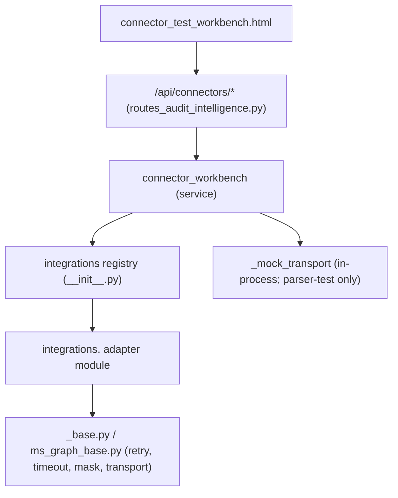
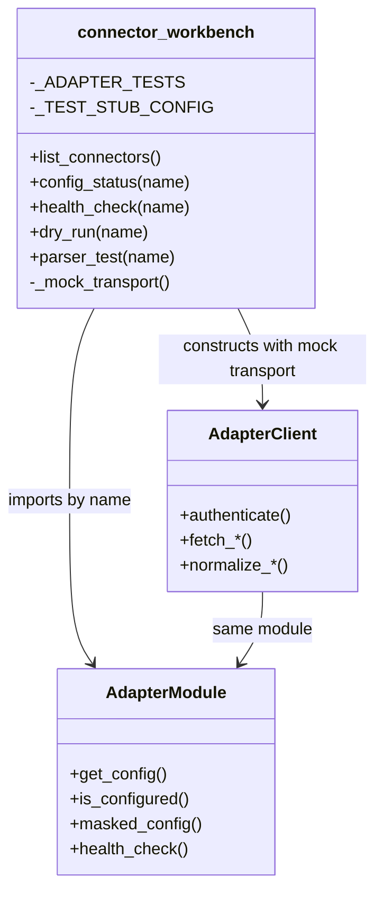

# Connector Test Workbench — Design & Runtime

**Status:** Current · **Owner:** Audit Intelligence / Integrations
**Route:** `GET /connectors/test-workbench` (alias `GET /mvp/connectors/test-workbench`)

> Derived from repository inspection. Sources:
> `modules/audit_intelligence/services/connector_workbench.py`,
> `modules/audit_intelligence/routes/routes_audit_intelligence.py`,
> `modules/audit_intelligence/templates/audit/connector_test_workbench.html`,
> `modules/operations/integrations/*`. Tests:
> `tests/test_connector_test_workbench.py`.

The workbench exposes **existing** connector capability through a safe UI + REST
surface. It does **not** duplicate connector logic — it orchestrates the
integration registry and each adapter's existing
`is_configured()` / `masked_config()` / `health_check()` / `fetch_*` methods. All
actions are read-only / config-only / dry-run / mock-transport; no destructive
writes; no secrets are returned or rendered.

---

## 1. End-to-end code path

```
User clicks a button
        ↓
Frontend page  (audit/connector_test_workbench.html — Bootstrap + fetch())
        ↓
FastAPI route  (/api/connectors/{name}/{action} in routes_audit_intelligence.py)
        ↓
Connector Workbench Service  (connector_workbench.<action>())
        ↓
Connector Adapter  (modules.operations.integrations.<name> — registry)
        ↓
Authentication  (adapter authenticate(); mock token in parser-test)
        ↓
API Call  (adapter fetch_*(); injected MOCK transport in parser-test)
        ↓
Parser  (adapter normalize_*())
        ↓
Evidence Metadata  (normalized items)
        ↓
Preview  (source_object_count, evidence_objects_detected, parser_output_preview)
        ↓
Response  (standard JSON envelope; rendered in the result panel)
```

---

## 2. Files involved

| Layer | File | Role |
| --- | --- | --- |
| UI | `modules/audit_intelligence/templates/audit/connector_test_workbench.html` | Self-contained page (select connector + env, buttons, KPI, result panel, safe errors) |
| Route (UI) | `routes_audit_intelligence.py` → `connector_test_workbench()` | Serves the page via a self-contained `Jinja2Templates` |
| Route (API) | `routes_audit_intelligence.py` → `api_connectors`, `api_connector_config_status`, `api_connector_health_check`, `api_connector_dry_run`, `api_connector_parser_test` | 5 REST endpoints |
| Service | `modules/audit_intelligence/services/connector_workbench.py` | `list_connectors`, `config_status`, `health_check`, `dry_run`, `parser_test` |
| Registry | `modules/operations/integrations/__init__.py` | `list_adapters`, adapter import |
| Adapters | `modules/operations/integrations/<name>.py` | Existing connector code (reused) |

---

## 3. REST endpoints

| Method + Path | Service call | Notes |
| --- | --- | --- |
| `GET /api/connectors` | `list_connectors()` | name, label, auth, configured, testable |
| `GET /api/connectors/{name}/config-status` | `config_status(name)` | masked config; 404 unknown |
| `POST /api/connectors/{name}/health-check` | `health_check(name)` | adapter config-based probe; 404 unknown |
| `POST /api/connectors/{name}/dry-run` | `dry_run(name)` | reports `would_call`; no network; 404 unknown |
| `POST /api/connectors/{name}/parser-test` | `parser_test(name)` | runs primary parser vs MOCK transport; 404 unknown |

Responses use the audit envelope (`_ok`/`_err` in `routes_audit_intelligence.py`).

---

## 4. Per-action code path

### 4.1 Config Status
`GET /api/connectors/{name}/config-status` → `connector_workbench.config_status(name)`
→ `integrations.<name>.masked_config()` + `is_configured()`. Returns masked
`SET`/`MISSING` config only. **No network.**

### 4.2 Health Check
`POST /api/connectors/{name}/health-check` → `connector_workbench.health_check(name)`
→ `integrations.<name>.health_check()` (the adapter's own config-based probe). It
reports `configured` and any `errors`; **no live call** in the skeleton.

### 4.3 Dry Run
`POST /api/connectors/{name}/dry-run` → `connector_workbench.dry_run(name)` →
`config_status(name)` + the adapter's declared primary method
(`_ADAPTER_TESTS[name].method`). Reports `would_call`, `auth`, `configured`, masked
config, and a note that **no network call** was made.

### 4.4 Parser Test
`POST /api/connectors/{name}/parser-test` → `connector_workbench.parser_test(name)`:

```mermaid
sequenceDiagram
    participant UI as Workbench UI
    participant API as /api/connectors/{name}/parser-test
    participant WB as connector_workbench.parser_test
    participant MOD as integrations.<name>
    participant CLI as Adapter client class
    participant MT as _mock_transport (in-process)
    UI->>API: POST parser-test
    API->>WB: parser_test(name)
    WB->>MOD: get_config() (+ non-secret stub if not configured)
    WB->>MT: build mock transport (returns synthetic payload; token for auth/login)
    WB->>CLI: client = ClientClass(config, transport=mock)
    opt authenticate() present
        CLI->>MT: POST token/login -> "WORKBENCH-MOCK"
    end
    WB->>CLI: <primary fetch method>()
    CLI->>MT: GET <endpoint>
    MT-->>CLI: deterministic synthetic payload
    CLI->>CLI: normalize_*()
    CLI-->>WB: { ok, status, items }
    WB-->>API: { ok, method, source_object_count, evidence_objects_detected, parser_output_preview }
    API-->>UI: JSON (rendered in result panel)
```

- The mock transport answers OAuth/`login` with a synthetic token and data calls
  with a deterministic synthetic payload — so the adapter's **real** parse path
  runs with **no network** and **no secrets**. The mock token never appears in any
  output (verified by tests).
- Primary method per connector (`_ADAPTER_TESTS` in `connector_workbench.py`) —
  **19 adapters**: ServiceNow→`fetch_servers`, Archer→`fetch_mapped_controls`,
  SharePoint→`fetch_drive_items`, Teams→`fetch_channels`,
  Outlook→`fetch_mail_folders`, Jira→`fetch_projects`,
  Confluence→`fetch_spaces`, SonarQube→`fetch_projects`,
  Checkmarx→`fetch_scans`, Prisma→`fetch_alerts`, Tripwire→`fetch_policy_results`,
  AWS→`fetch_findings`, GCP→`fetch_findings`, Azure→`fetch_security_assessments`,
  Nessus→`fetch_scans`, Qualys→`fetch_host_detections`, GitHub→`fetch_repositories`,
  Jenkins→`fetch_jobs`, Azure DevOps→`fetch_repositories`. The connector list is
  registry-driven (`integrations.list_adapters()`), so the workbench always
  reflects the current adapter set.

### 4.6 Demo placeholder stubs (`_TEST_STUB_CONFIG`)

When an adapter is **not yet configured**, `parser_test` merges a per-adapter
**non-secret placeholder stub** (`_TEST_STUB_CONFIG` in `connector_workbench.py`)
so the parse path still runs end-to-end offline. These are deliberately
self-describing so a demo reviewer sees exactly what each field is:

- URLs use the reserved demo domain, e.g. `https://servicenow.example.internal`.
- Identifiers/secrets use `${VAR}` tokens naming the real env var, e.g.
  `${SERVICENOW_CLIENT_ID}`, `${JIRA_API_TOKEN}`, `${AWS_SECRET_ACCESS_KEY}`.

They are **never real secrets**, the injected mock transport answers every call so
the values never leave the process, and they never surface in any response
(masked config still shows real secrets only as `SET`/`MISSING`). To run a **real**
parser test, set the adapter's actual environment variables — the stub is then
ignored because `is_configured()` returns true.

### 4.5 Live Test (future)
Live connectivity is **not** performed by the workbench by design (it stays
mock-only so it is always safe to click). A future live test would inject a real
transport at the adapter level and reuse the exact same `fetch_*`/`normalize_*`
path — the difference is the transport, not the connector code. For live
collection today, use the scheduler / evidence-run path with real credentials
(see `docs/03-development/developer-manual/phase1/scheduler/scheduler_runtime_flow.md`).

---

## 5. Service dependency graph



---

## 6. Class interaction (parser-test)



---

## 7. Safety guarantees

- Read-only only; no destructive writes to any external system.
- No live network by default (parser-test uses an in-process mock transport;
  health-check is config-based).
- No secrets: only masked `SET`/`MISSING` config; the mock token never surfaces
  (asserted in `tests/test_connector_test_workbench.py`).
- Unknown connectors return HTTP 404.

---

## 8. Related documentation

- Connector reference: `docs/03-development/developer-manual/connectors/enterprise_connector_api_reference.md`
- Graph reference: `docs/03-development/developer-manual/connectors/microsoft_graph_connector_api_reference.md`
- Frontend testing matrix + manual steps: `docs/03-development/developer-manual/connectors/connector_frontend_testing_matrix.md`,
  `docs/03-development/developer-manual/connectors/connector_frontend_manual_testing.md`
- Scheduler vs workbench: `docs/03-development/developer-manual/phase1/scheduler/test_workbench_vs_scheduler.md`
- Call graph: `docs/03-development/developer-manual/phase1/scheduler/runtime_call_graph.md`
