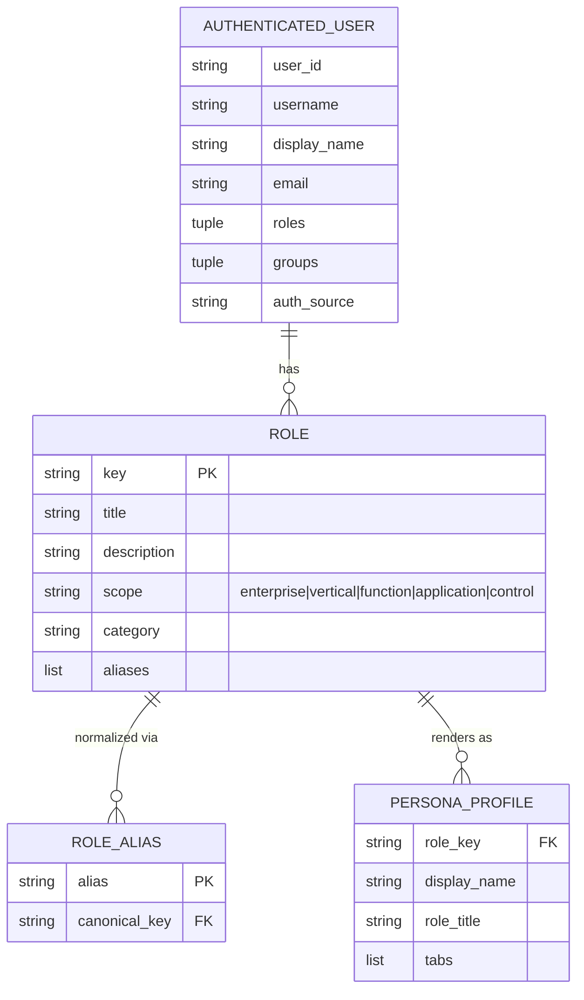
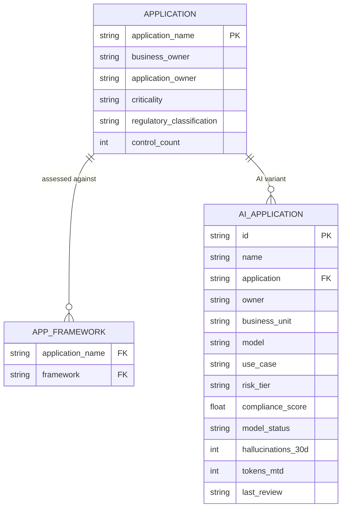
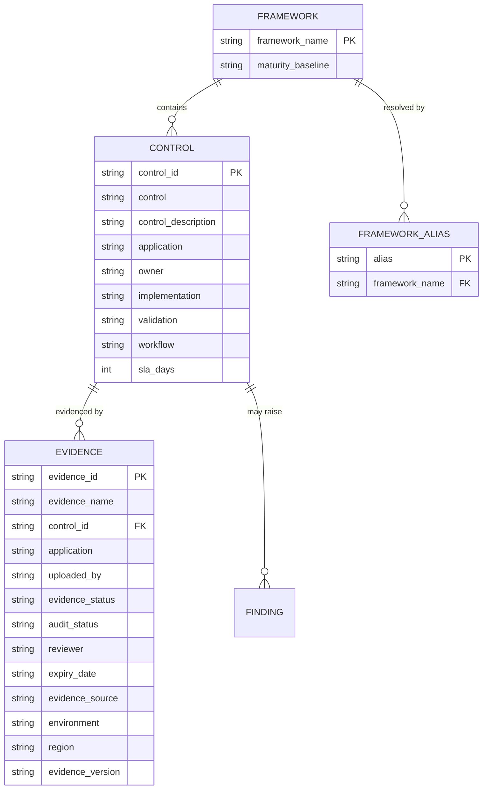
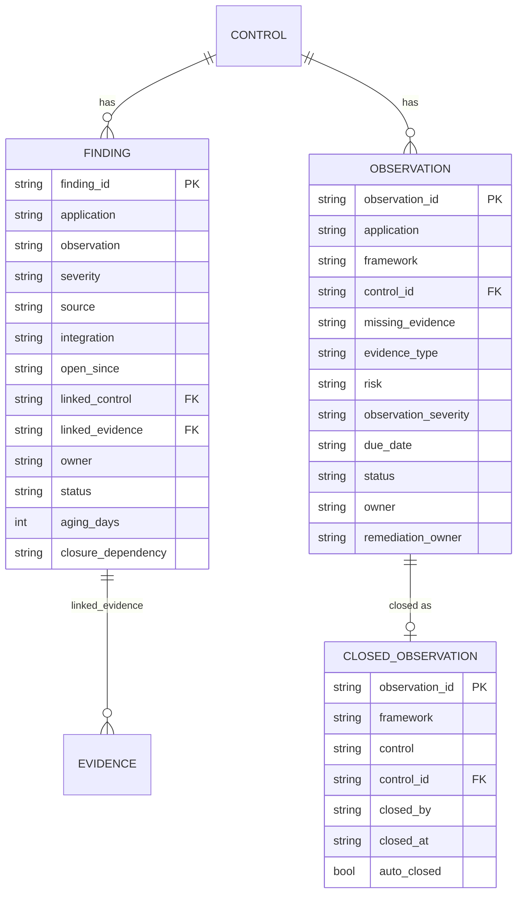
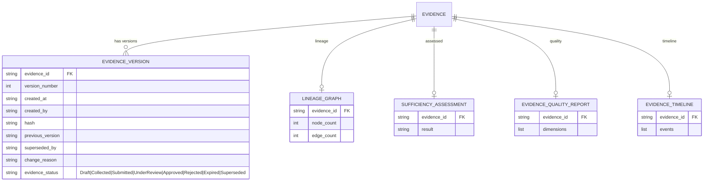
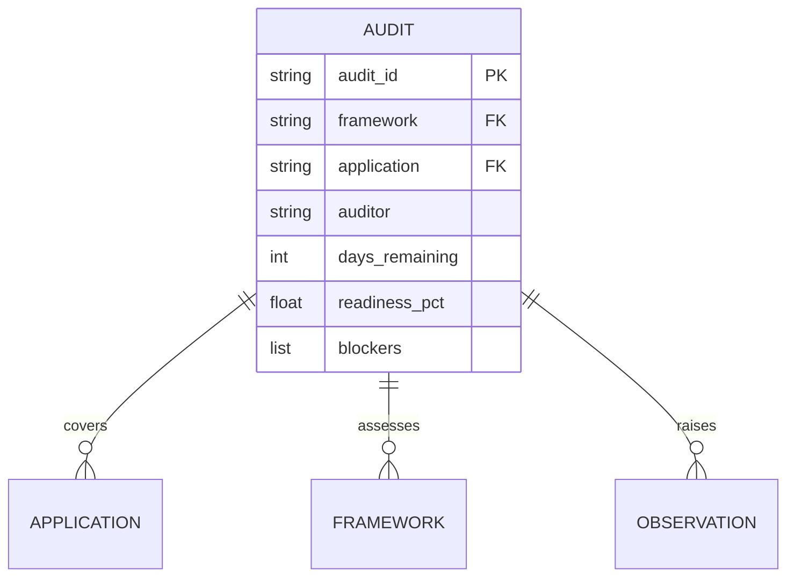
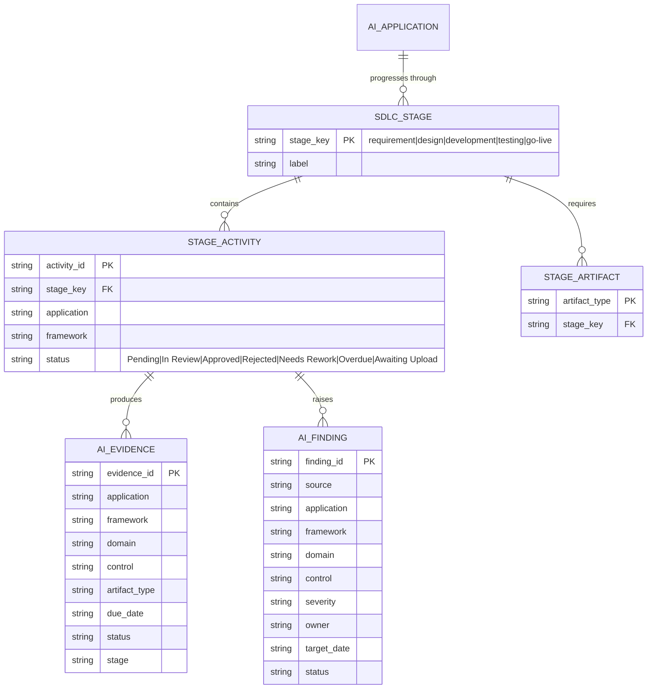
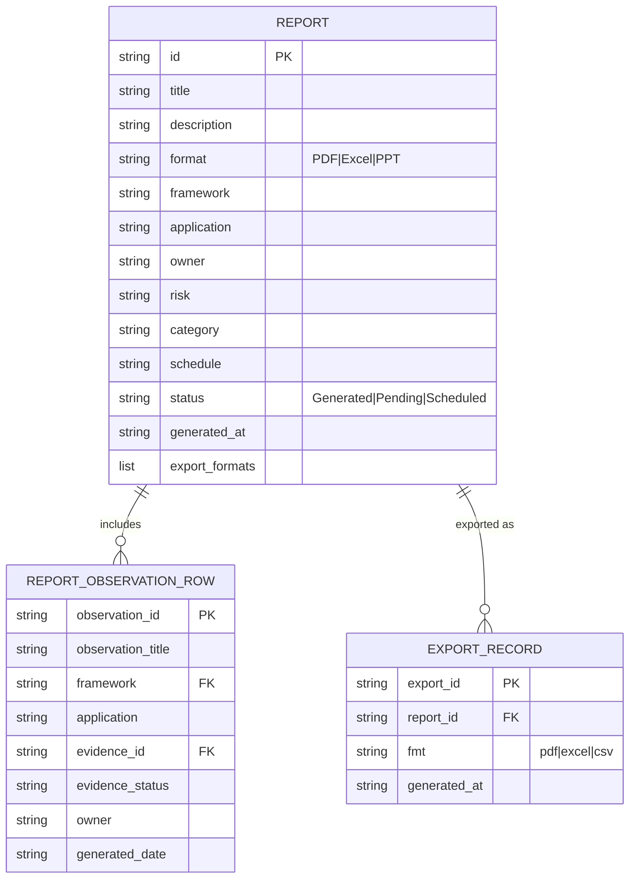
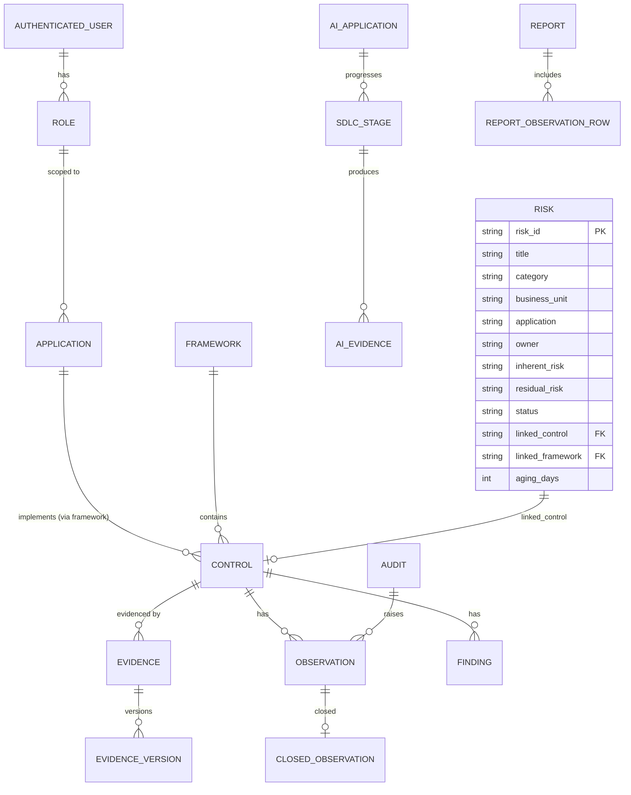

# ECS Entity-Relationship Diagrams

> Entities and attributes are reconstructed from actual code structures (dataclasses, Pydantic
> models, and the dict/tuple shapes used by mock-data engines and `ecs_state`). Because ECS uses a
> mixed typed/dict model and runs primarily on in-process state, these ER diagrams are a **logical
> model** of the implemented domain, not a physical SQL schema. Source files are cited per section.
> **[ASSUMPTION]** marks relationship cardinalities inferred from linkage fields (e.g. `linked_control`).

---

## 1. Users & Roles

Source: `app/auth/context.py`, `app/auth/roles.py`, `modules/shared/services/persona_display.py`.

---

## 2. Applications

Source: `modules/shared/services/ecs_state.py` (`BANKING_APPLICATIONS`),
`modules/frameworks/engines/framework_catalog.py` (`APPLICATIONS`),
`modules/ai_sdlc/engines/ai_sdlc_workflow_engine.py` (`_onboarded_applications`),
`modules/ai_sdlc/engines/ai_sdlc_governance_mock.py` (`AI_APPLICATIONS`).

---

## 3. Frameworks & Controls

Source: `modules/frameworks/engines/framework_catalog.py`,
`modules/governance/engines/governance_relational_model.py`,
`modules/shared/services/ecs_state.py`.

---

## 4. Findings & Observations

Source: `modules/governance/engines/governance_relational_model.py`,
`modules/governance/engines/missing_evidence_engine.py`,
`modules/shared/services/evidence_workflow_engine.py` (`close_observations_for_control`).

---

## 5. Evidence (versioning / lineage / sufficiency)

Source: `app/evidence_intel/models.py`, `app/evidence_analytics/models.py`.

---

## 6. Audits

Source: `modules/governance/engines/audit_schedule_engine.py`,
`modules/governance/engines/governance_lifecycle_engine.py`, `ecs_state.operational_mock_audits`.
**[ASSUMPTION]** modeled from dict fields consumed in `module_capabilities.py`.

---

## 7. AI SDLC Entities

Source: `modules/ai_sdlc/engines/ai_sdlc_workflow_engine.py`,
`modules/ai_sdlc/engines/ai_sdlc_governance_mock.py`.

---

## 8. Reports

Source: `modules/executive_overview/engines/reporting_module.py`.

---

## 9. Consolidated logical model (high level)

Risk source: `modules/enterprise_grc/engines/grc_module_demo.py` (`_generate_risk_rows`).
