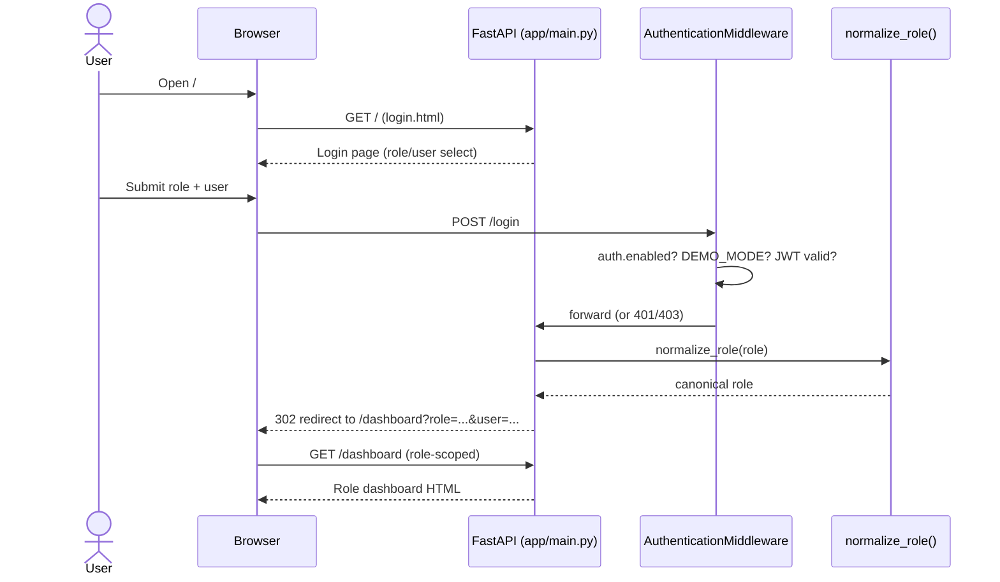
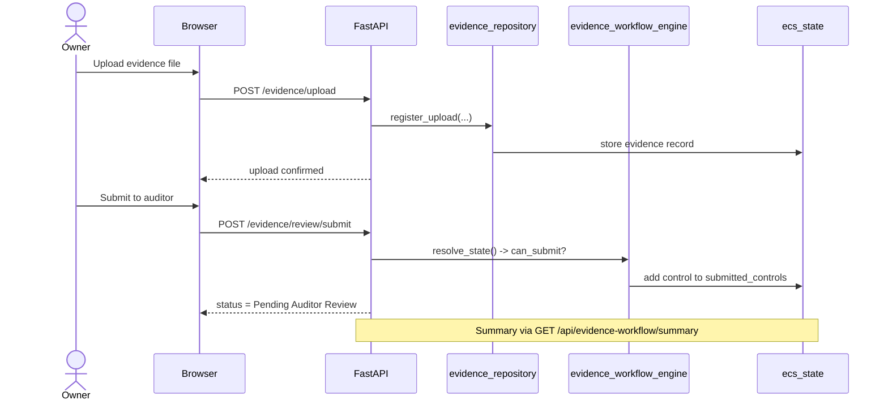
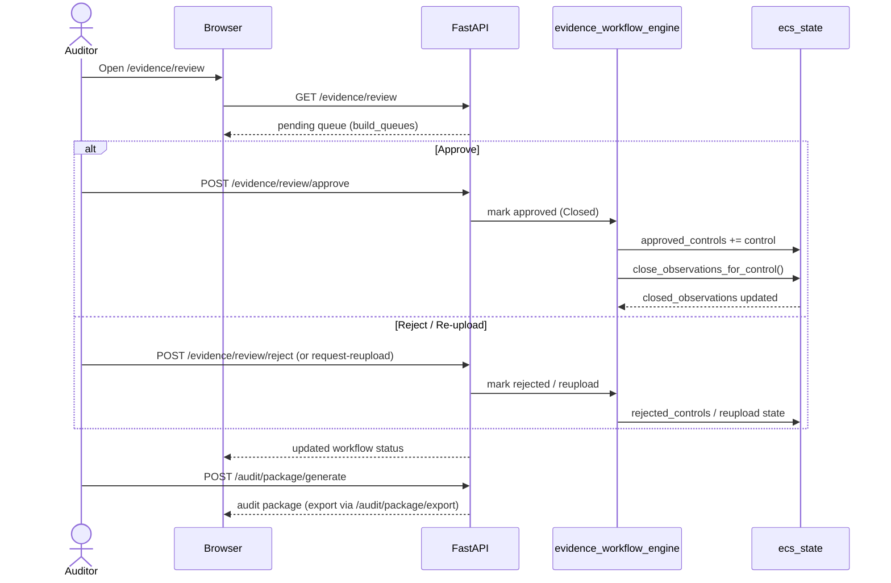
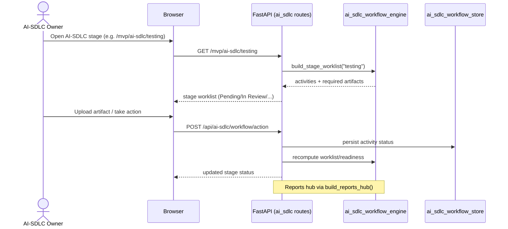
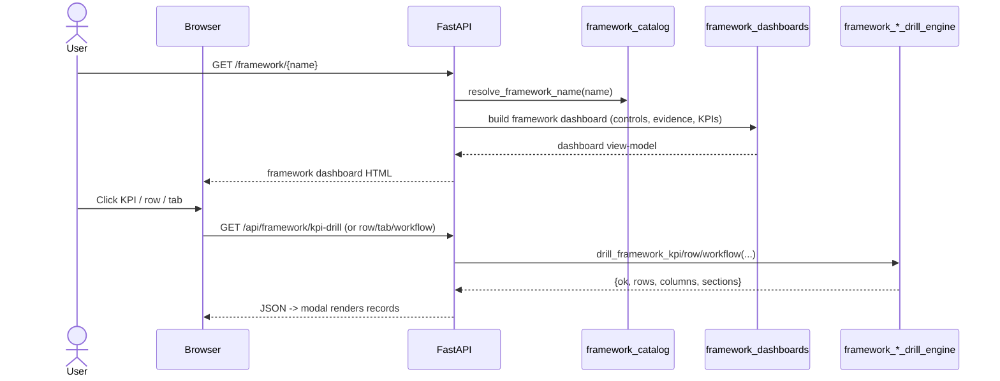
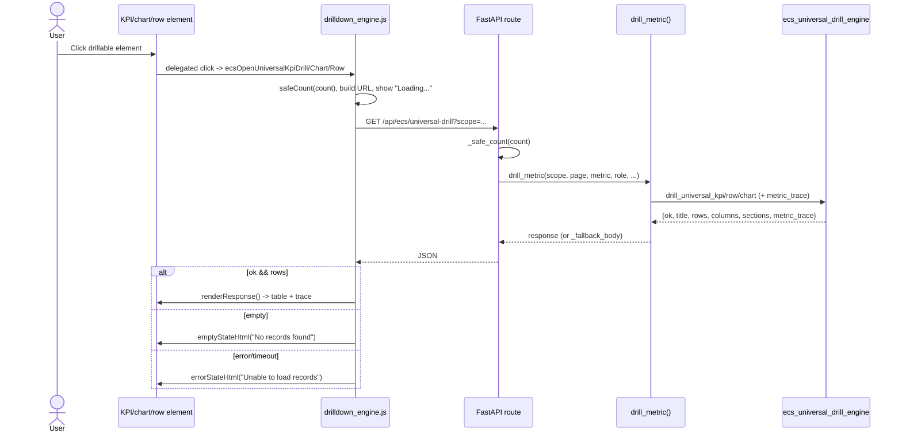
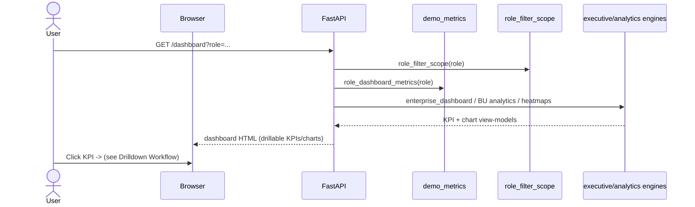
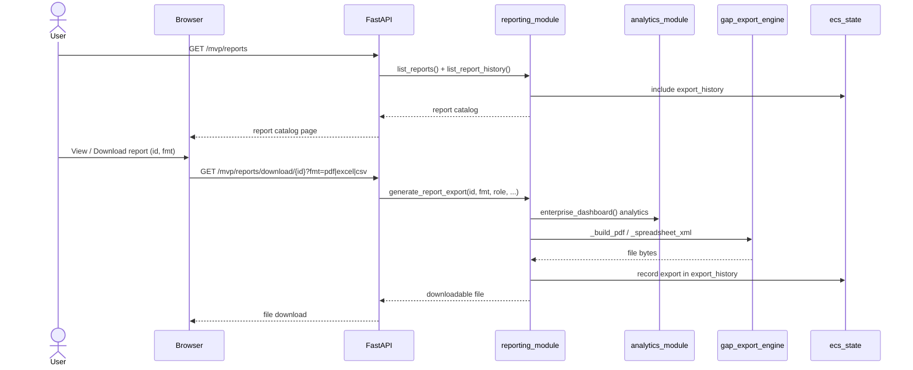

# ECS System Sequence Diagrams

> Flows reconstructed from actual routes, engines, and the frontend drilldown engine in
> `/Users/nikhil/Documents/ECS`. File/endpoint citations appear under each diagram.

---

## 1. User Login

Routes: `GET /` and `POST /login` (`app/main.py`); role normalization
(`modules/shared/services/role_permissions.py`); auth (`app/auth/middleware.py`).

**Note:** When `DEMO_MODE=true`, auth is bypassed (`app/auth/demo.py`).

---

## 2. Evidence Submission (owner → auditor)

Routes: `/evidence/upload`, `/evidence/submit` (`evidence_routes.py`), `/evidence/review/*`
(`app/main.py`); engine `evidence_workflow_engine.py`; state `ecs_state`.

---

## 3. Audit Lifecycle (review → decision → observation closure → packaging)

Routes: `/evidence/review/approve|reject|request-reupload` (`app/main.py`);
`/audit/package/generate`, `/audit/package/export` (`evidence_routes.py`);
engines `evidence_workflow_engine.py` (`close_observations_for_control`), `audit_schedule_engine.py`.

---

## 4. AI SDLC Assessment (stage gate)

Routes: `/mvp/ai-sdlc/{stage}`, `/api/ai-sdlc/workflow/review`, `/api/ai-sdlc/workflow/action`
(`routes_ai_sdlc_governance.py`); engine `ai_sdlc_workflow_engine.py`; store `ai_sdlc_workflow_store.py`.

---

## 5. Framework Assessment

Routes: `/framework/{name}`, `/api/framework/kpi-drill`, `/workflow-drill`, `/row-drill`, `/tab-drill`
(`app/main.py`); engines `framework_catalog.py`, `framework_dashboards.py`,
`framework_kpi_drill_engine.py`, `framework_workflow_engine.py`, `ecs_row_drill_engine.py`.

---

## 6. Drilldown Workflow (universal)

Frontend `modules/shared/static/js/drilldown_engine.js`; routes `/api/ecs/universal-drill`,
`/api/ecs/workflow-drill`, `/api/module-kpi/drill` (`routes_mvp.py`); services
`drilldown_engine.py` (`drill_metric`) → `ecs_universal_drill_engine.py`.

---

## 7. Dashboard Analytics

Routes: `/dashboard*`, `/mvp/enterprise`, `/mvp/pan-india`, `/mvp/trends` (`routes_mvp.py`,
`app/main.py`); engines `demo_metrics.py`, `executive_analytics_engine.py`, `analytics_module.py`;
data scope `role_filter_scope.py`.

---

## 8. Report Generation & Export

Routes: `/mvp/reports`, `/mvp/reports/view/{type}`, `/mvp/reports/download/{id}` (`routes_mvp.py`);
engines `reporting_module.py` (`list_reports`, `generate_report_content`, `generate_report_export`),
`gap_export_engine.py` (PDF/Excel builders); analytics via `analytics_module.enterprise_dashboard`.

