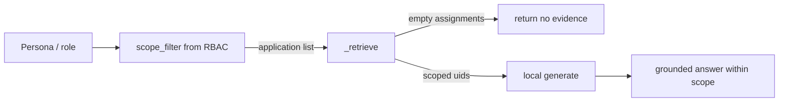

# ECS Local LLM Banking Use Cases & Persona Mapping (Phase 4 + Phase 5)

**Release tag:** `ecs-local-llm-readiness-enterprise-v1`

Why local LLM matters for banking: **audit evidence, governance, compliance, and risk data never
leave the bank's network**. ECS already defaults to Ollama (keyless, on-prem) with pgvector, so all
of the cases below run **air-gapped** with no third-party data egress.

Data-residency anchors: provider is credential-optional and local-first (`provider.py:157-227`),
RAG enforces RBAC scope on retrieval (`rag.py:467-495`), vector store is local Postgres
(`pgvector_store.py`).

---

## 1. Banking-specific use cases

| # | Banking use case | Sensitive data class | Why local LLM | Frameworks |
|---|---|---|---|---|
| B1 | RBI Cyber Security Framework evidence readiness | Compliance | No egress of regulator evidence | RBI Cyber Security |
| B2 | PCI DSS cardholder-control evidence review | Card / PCI | Card-scope data stays on-prem | PCI DSS |
| B3 | VAPT finding triage & remediation narrative | Security | Vuln details kept internal | VAPT, App Security |
| B4 | OS/DB/Middleware baseline gap explanation | Config | Infra config kept internal | OS/DB/Middleware Baselining |
| B5 | ITDRM / DR drill evidence summarization | Resilience | BCP/DR data internal | ITDRM |
| B6 | ITPP problem RCA for critical banking apps | Operational | Incident data internal | ITPP |
| B7 | Cross-framework reuse (PCI↔ISO27001↔SOC2) | Compliance | Reuse without external mapping svc | multi |
| B8 | Exception governance for regulatory exceptions | Risk | Exception rationale internal | all |
| B9 | Audit-readiness narrative for RBI/internal audit | Audit | Audit posture internal | all |
| B10 | Executive board narrative on compliance posture | Executive | Board comms internal | all |
| B11 | Evidence sufficiency for net-banking/UPI controls | Compliance | Txn-platform evidence internal | PCI DSS, RBI |
| B12 | Connector failure analysis (core banking integrations) | Operational | Integration internals internal | — |

## 2. Applications in scope

From `ecs_state.BANKING_APPLICATIONS` / catalog (e.g. Net Banking, Mobile Banking, UPI, Payments,
CBS, Cards, Treasury, API Gateway, Middleware, Authentication Services). Each banking use case above
applies per application via the same local pipeline; retrieval is filtered by `application`
(`rag.py:452-453`) and by RBAC scope so an Application Owner only sees their own apps.

## 3. Banking deployment guarantees

| Requirement | How ECS local LLM meets it |
|---|---|
| Air-gapped | Ollama keyless + vendored models; pgvector local (`docker-compose.yml:144-153`) |
| No data egress | `ECS_LLM_PROVIDER=ollama`; block AI egress at network layer |
| Data residency | All inference + vectors on-prem |
| RBAC on AI answers | Retrieval scoped by role assignments (`rag.py:470-495`) |
| Graceful degradation | Deterministic fallback if model down (`rag.py:599-653`) |
| Auditability | Status/connectivity endpoints (`routes_governance.py:334-347`) |

---

# Phase 5 — Persona Mapping

Personas map to ECS canonical roles (`app/auth/roles.py`) and the persona/navigation matrix. Each row:
the highest-value local-LLM uses for that persona, grounded in their existing module access.

| Persona | Local-LLM uses (from catalog) | Primary modules | RBAC note |
|---|---|---|---|
| **Application Owner** | Evidence Classification, Recommendation, Similar Evidence, Onboarding Gap (UC 1,16,17,28) | Evidence Gov, Onboarding | Scoped to assigned apps (`rag.py:470-474`) |
| **Auditor** | Audit Copilot, Observation Analysis, Quality Review, Rejection Drafting, Sufficiency (UC 4,5,20,26,27) | Evidence Approval, Audit Prep | Read-broad, evidence-scoped |
| **Audit Lead** | Audit Readiness Assessment, cross-app posture (UC 9) | Audit Prep, Reports | Enterprise scope |
| **Governance Team** | Governance Copilot, Policy Summarization, KB Assistant (UC 14,22,25) | Governance, Completeness | Enterprise scope |
| **Compliance Team** | Control Gap Detection, Framework Mapping, Cross-Framework Correlation, Exception Analysis (UC 6,7,8,13) | Frameworks, Governance | Enterprise scope |
| **Control Owner** | Control Recommendation, Evidence Sufficiency (UC 19,27) | Frameworks, Evidence Gov | Control-scoped |
| **Risk Owner** | Risk Summarization, Exception Analysis (UC 10,13) | Risk Register, Enterprise GRC | Enterprise scope |
| **Operations Team** | Operations Copilot, RCA, Integration/Connector Troubleshooting, SOP Summarization (UC 12,15,21,23,24) | Operations, Integrations | Ops scope |
| **CISO / Security Officer** | Risk Summarization, VAPT triage, posture narrative (UC 10, B3) | Enterprise GRC, Risk | Enterprise scope |
| **CIO** | Executive Narratives, ROI narrative (UC 11) | Executive Overview | Enterprise scope |
| **Executive Management** | Executive Dashboard Narratives, board commentary (UC 11, B10) | Executive Overview, Reports | Read-only enterprise |

### Persona → data-scope enforcement (local LLM safe)

Even with a local model, ECS does **not** let a model bypass RBAC: retrieval restricts evidence to the
caller's assigned applications before any generation. A restricted role with no assignments retrieves
**nothing** (explicit deny), so the model cannot synthesize answers from out-of-scope data
(`rag.py:470-474`).

