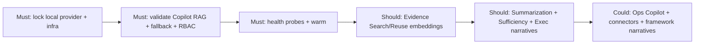

# ECS Local LLM — Phase 1 Roadmap & Recommendations (Phase 7)

**Release tag:** `ecs-local-llm-readiness-enterprise-v1`
**Scope:** Documentation only. MoSCoW prioritization of local-LLM capabilities to enable first.

ECS is **already local-LLM-capable** (Ollama default + pgvector). "Phase 1" is therefore mostly
**enable, validate, and harden** existing capability, plus a few high-value enhancements — not a
greenfield build.

Effort: S (config/validation) · M (prompt + RAG wiring on existing data) · L (new pipeline).

---

## Must Have (Phase 1 core)

| Capability | What | Effort | Dependencies |
|---|---|---|---|
| Lock local provider | Default + enforce `ECS_LLM_PROVIDER=ollama`; align code default to `ollama` (`provider.py:241`) | S | none |
| Local infra baseline | Ollama (`qwen3:8b`) + `nomic-embed-text` + pgvector standing in UAT | S | Ollama, Postgres |
| RAG health in probes | Wire `/api/platform/rag/status` + `/llm` into readiness/alerting | S | endpoints exist (`routes_governance.py:334-347`) |
| Audit/Governance/KB Copilot (UC 20,22,25) | Validate existing local RAG assistant end-to-end | S | infra |
| Fallback resilience | Verify deterministic fallback with model down | S | `rag.py:599-653` |
| RBAC scope validation | Prove per-persona retrieval scoping | S | `rag.py:470-495` |
| Warm + keep-alive | Operationalize warm endpoint + `keep_alive=30m` | S | `provider.warm()` |

## Should Have (Phase 1 enhancements)

| Capability | What | Effort | Dependencies |
|---|---|---|---|
| Evidence Search → embeddings (UC 18) | Replace heuristic search with `provider.embed()` + pgvector | M | embeddings, index |
| Similar Evidence / Reuse (UC 17) | Embedding-based similarity for reuse | M | embeddings |
| Evidence Summarization (UC 2) | Local summary on evidence detail | M | provider.generate |
| Evidence Quality / Sufficiency narrative (UC 4,27) | Narrative atop deterministic sufficiency engine | M | sufficiency engine |
| Executive narratives (UC 11) | Board-ready KPI commentary | M | dashboard data |

## Could Have (Phase 1.5)

| Capability | What | Effort | Dependencies |
|---|---|---|---|
| Operations Copilot upgrade (UC 21) | `/mvp/ai-ops-assistant` keyword → local RAG | M | RAG wiring |
| Connector/Integration troubleshooting (UC 23,24) | Failure-analysis assistant | M | connector status data |
| Control Gap / Framework Mapping narratives (UC 6,7) | Local generation over catalog | M | framework catalog |
| RCA generation (UC 12) | Draft RCA from problem data | M | ITPP data |
| Quality model tier | Add larger model for high-stakes summaries | M | GPU capacity |

## Future (post Phase 1)

| Capability | What | Effort | Dependencies |
|---|---|---|---|
| Evidence Classification/Tagging at ingest (UC 1) | Auto-classify on ingestion | L | ingestion pipeline |
| Cross-framework correlation automation (UC 8) | Automated reuse suggestions | L | crosswalk + embeddings |
| AI SDLC / AI Governance live narratives | Replace mock with local generation | L | mock→live wiring |
| Multi-model routing | Route by task to model tiers | L | capacity + policy |
| Fine-tuned/banking-tuned local model | Domain-tuned model | L | data + MLOps |

---

## Phase 1 sequencing

## Acceptance for Phase 1 "done"

- ECS runs UAT fully on local Ollama with **zero cloud calls** (network-verified).
- Audit/Governance/KB Copilot return `mode:rag, grounded:true`; fallback verified.
- Evidence Search/Reuse upgraded to local embeddings (Should-have target).
- RBAC scoping proven per persona; admin-only reindex/warm enforced.
- Health endpoints integrated into monitoring.

## Key risks & mitigations

| Risk | Mitigation |
|---|---|
| Code default provider is `gemini`, YAML is `ollama` | Align code default to `ollama`; enforce env in prod (Must-have) |
| Embedding dim mismatch on model swap | Change-control: rebuild index + `ECS_VECTOR_DIM` together |
| Cold-start latency | Warm + keep-alive |
| Accuracy variance across models | Use Compatibility/Benchmark docs to pin model tier |
| Accidental cloud egress | Lock provider + network egress policy (banking) |
