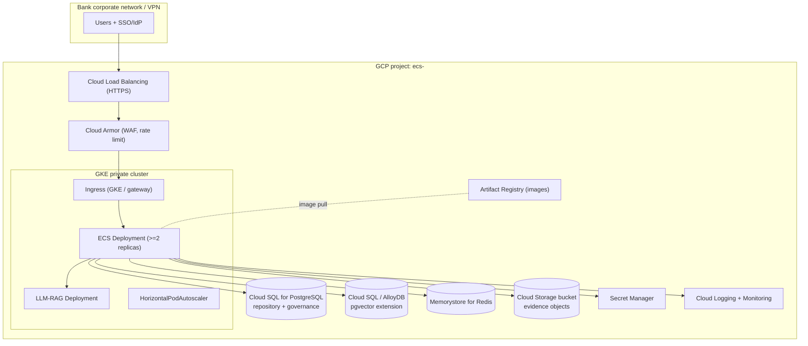
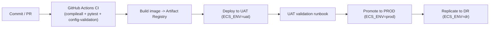

# ECS GCP Deployment Guide

How to deploy ECS on Google Cloud: GKE, Cloud SQL (PostgreSQL + pgvector), Cloud
Storage, IAM, load balancing, secrets, logging/monitoring, CI/CD, and
environment promotion (uat → prod → dr).

> **Status.** Target-state, bank-oriented GCP blueprint. It builds on the
> generic, code-grounded deployment docs and does not duplicate them:
> - Container/runtime + generic K8s/HA/DR: [`../architecture/ecs_deployment_architecture.md`](../../02-architecture/architecture/ecs_deployment_architecture.md)
> - Enterprise topology + security zones: [`../architecture/ENTERPRISE_ARCHITECTURE.md`](../../02-architecture/architecture/ENTERPRISE_ARCHITECTURE.md)
> - Example manifests (K8s/nginx/systemd/compose): `deploy/` ([`deploy/README.md`](../../deploy/README.md))
> - Env config framework: [`../operations/environment-configuration/00_ENVIRONMENT_CONFIGURATION_GUIDE.md`](../operations/environment-configuration/00_ENVIRONMENT_CONFIGURATION_GUIDE.md)
> - Deploy/rollback runbooks: [`../operations/DEPLOYMENT_RUNBOOK.md`](../operations/DEPLOYMENT_RUNBOOK.md), [`../operations/ROLLBACK_RUNBOOK.md`](../operations/ROLLBACK_RUNBOOK.md)
>
> ECS is **environment-only**: moving LOCAL → UAT → PROD → DR changes
> configuration (`ECS_ENV`, `config/environments/*`, secrets), never source code.

---

## 1. Target topology



---

## 2. Prerequisites

- A GCP project per environment (`ecs-uat`, `ecs-prod`, `ecs-dr`) or shared
  project with per-env namespaces + separate data instances.
- APIs enabled: GKE, Cloud SQL Admin, Memorystore, Cloud Storage, Secret Manager,
  Artifact Registry, Cloud Logging, Cloud Monitoring, Cloud Load Balancing.
- A VPC with a **private** subnet for GKE nodes and **private service access** for
  Cloud SQL / Memorystore (no public IPs on data services).
- Least-privilege service accounts (see [§6 IAM](#6-iam)).
- `gcloud`, `kubectl`, and (optionally) Terraform/Helm.

---

## 3. GKE (compute tier)

- **Private cluster**, nodes without public IPs; authorized networks limited to
  the bank's admin ranges.
- Deploy ECS as a `Deployment` with **≥2 replicas** and `--workers` once
  `ecs_state` is externalized to Redis/PostgreSQL (see the architecture review's
  R1). Use the example manifests in
  [`deploy/kubernetes/`](../../deploy/kubernetes/) as a starting point.
- **Probes** (already implemented in `app/routes_platform.py`): liveness
  `GET /healthz` (no I/O), readiness `GET /readyz` (checks PostgreSQL). Map these
  in the Deployment (the K8s example uses them).
- **Autoscaling:** HPA on CPU/RPS; cap by Cloud SQL connection limits.
- Run the **LLM-RAG** workload as a separate pool (different resource profile).

```bash
# Illustrative — connect and deploy (adapt to your manifests/Helm)
gcloud container clusters get-credentials ecs-<env> --region <region>
kubectl apply -f deploy/kubernetes/ecs-configmap.example.yaml
kubectl apply -f deploy/kubernetes/ecs-secret.example.yaml     # from Secret Manager
kubectl apply -f deploy/kubernetes/ecs-deployment.example.yaml
kubectl apply -f deploy/kubernetes/ecs-service.example.yaml
```

---

## 4. Cloud SQL (PostgreSQL + pgvector)

ECS uses PostgreSQL for the evidence repository + governance schema and pgvector
for RAG vectors.

- Provision **Cloud SQL for PostgreSQL** (private IP). Apply the ECS schema —
  see [`../architecture/ECS_DATA_ARCHITECTURE_REFERENCE.md`](../../02-architecture/architecture/ECS_DATA_ARCHITECTURE_REFERENCE.md)
  and `ecs_platform/repository/schema.sql` / `governance_schema.sql`.
- **pgvector:** enable the `vector` extension (Cloud SQL supports it) or use
  **AlloyDB**; point `ECS_VECTOR_PG_*` at it.
- Connect via the **Cloud SQL Auth Proxy** / private IP; never expose publicly.
- Configure `ECS_REPO_PG_*` (repository) and `ECS_VECTOR_PG_*` (vectors) from
  Secret Manager. HA: enable a regional (multi-zone) instance + automated backups
  + PITR for banking retention.

```sql
-- On the vector database
CREATE EXTENSION IF NOT EXISTS vector;
```

---

## 5. Cloud Storage (evidence objects)

- Create a bucket per environment for evidence artifacts; enable **uniform
  bucket-level access**, **CMEK** encryption, object **versioning**, and a
  retention/lifecycle policy aligned to audit retention.
- Point the object-store settings (`ECS_OBJECT_STORE_*` / `MINIO_*`-equivalent)
  at GCS (S3-compatible/GCS client) with `secure: true`.

---

## 6. IAM

- **Workload Identity:** bind the ECS Kubernetes service account to a GCP service
  account; grant only what each needs:
  - Cloud SQL Client, Secret Manager Secret Accessor, Storage Object Admin
    (scoped to the ECS bucket), Logging/Monitoring writer.
- **Cross-cloud (AWS Net Banking):** read-only AWS IAM (Security Hub/Config)
  credentials stored in Secret Manager; rotate regularly.
- **GCP Mobile Banking (cross-project):** least-privilege SA with Security
  Command Center / Cloud Asset viewer on the target project.
- Enforce **separation of duties**: deploy identity ≠ runtime identity.

---

## 7. Load balancer & TLS

- **Cloud Load Balancing** (HTTPS) terminates TLS with a Google-managed or
  bank-provided certificate; attach **Cloud Armor** for WAF + rate limiting.
- Route to the GKE Ingress; health checks use `/healthz`.
- In production the app trusts `X-Forwarded-Proto: https` (the security-headers
  middleware emits HSTS only over HTTPS) — see
  [`../production/ECS_SECURITY_REFERENCE.md`](../production/ECS_SECURITY_REFERENCE.md).

---

## 8. Secrets

- Store all credentials in **Secret Manager** (DB, connectors, IdP client secret,
  cross-cloud keys). ECS reads secrets by env-var name (`*_env` convention); never
  commit real values. See
  [`../operations/environment-configuration/06_SECRETS_MANAGEMENT_GUIDE.md`](../operations/environment-configuration/06_SECRETS_MANAGEMENT_GUIDE.md).
- Mount secrets into pods via the Secret Manager CSI driver or synced K8s Secrets.

---

## 9. Logging & monitoring

- **Cloud Logging:** ECS logs to stdout (structured tags via `ecs_logging`);
  GKE ships them to Cloud Logging automatically. Correlate with `X-Request-ID`.
- **Cloud Monitoring:** alert on the golden signals + ECS KPIs described in
  [`../operations/ECS_PRODUCTION_MONITORING_GUIDE.md`](../operations/ECS_PRODUCTION_MONITORING_GUIDE.md)
  (readiness failures, connector health, scheduler failures, LLM latency).
- Uptime checks against `/healthz` and `/readyz`.

---

## 10. CI/CD & environment promotion



- CI workflows exist: `.github/workflows/ci.yml`,
  `.github/workflows/config-validation.yml`. See the
  [CI/CD & release notes](#ci) below and the [Testing Guide](../../04-testing/testing/TESTING_GUIDE.md).
- **Promotion is config-only:** the same image runs in each env; only `ECS_ENV`,
  `config/environments/<env>.yaml`, and secrets differ. Validate before deploy:
  `ECS_ENV=prod ECS_VALIDATE_SECRETS=1 python -m config.config_validation prod --check-secrets`.
- Rollback: [`../operations/ROLLBACK_RUNBOOK.md`](../operations/ROLLBACK_RUNBOOK.md)
  and [`../operations/environment-configuration/08_ROLLBACK_GUIDE.md`](../operations/environment-configuration/08_ROLLBACK_GUIDE.md).

<a id="ci"></a>
### CI/CD building blocks
- `Makefile` targets (`make ci`, `make test`, `make smoke`, `make compile`) mirror
  the CI gates — see [`../00-start-here/COMMON_COMMANDS.md`](../../01-product/00-start-here/COMMON_COMMANDS.md).
- Pre-commit: `.pre-commit-config.yaml`. Requirements lockfile: `requirements.lock`.

---

## 11. DR on GCP

- Warm-standby ECS in a DR region/project (`ECS_ENV=dr`,
  [`../operations/environment-configuration/04_DR_CONFIGURATION_GUIDE.md`](../operations/environment-configuration/04_DR_CONFIGURATION_GUIDE.md)).
- Cloud SQL cross-region replica + GCS dual-region/turbo replication; targets
  RPO ≤ 15 min, RTO ≤ 1 hr (see
  [`../operations/ECS_DISASTER_RECOVERY_PLAN.md`](../operations/ECS_DISASTER_RECOVERY_PLAN.md)).

---

## 12. Go-live checklist (GCP)

- [ ] Private GKE cluster + ≥2 ECS replicas; probes wired to `/healthz` + `/readyz`.
- [ ] Cloud SQL (repository + governance schema applied) + pgvector enabled, private IP, HA + backups/PITR.
- [ ] GCS evidence bucket: CMEK, versioning, retention/lifecycle.
- [ ] Secrets in Secret Manager; `ECS_ENV=prod`, `ECS_SECURITY_MODE=production`.
- [ ] Auth + RBAC enforced (`ECS_AUTH_ENABLED=true`, RBAC flags on); IdP wired.
- [ ] Cloud Armor + TLS at the LB; HSTS confirmed.
- [ ] Cross-cloud IAM (AWS/GCP) least-privilege in Secret Manager.
- [ ] Logging/Monitoring alerts + uptime checks.
- [ ] `python -m config.config_validation prod --check-secrets` passes.
- [ ] Run [`../operations/ECS_GO_LIVE_CHECKLIST.md`](../operations/ECS_GO_LIVE_CHECKLIST.md) + production smoke.

---

## Related documents

- [`../architecture/ENTERPRISE_ARCHITECTURE.md`](../../02-architecture/architecture/ENTERPRISE_ARCHITECTURE.md)
- [`../architecture/ecs_deployment_architecture.md`](../../02-architecture/architecture/ecs_deployment_architecture.md)
- [`../operations/DEPLOYMENT_RUNBOOK.md`](../operations/DEPLOYMENT_RUNBOOK.md)
- [`../production/PRODUCTION_HARDENING_GUIDE.md`](../production/PRODUCTION_HARDENING_GUIDE.md)
- [`../runbooks/README.md`](../runbooks/README.md)
