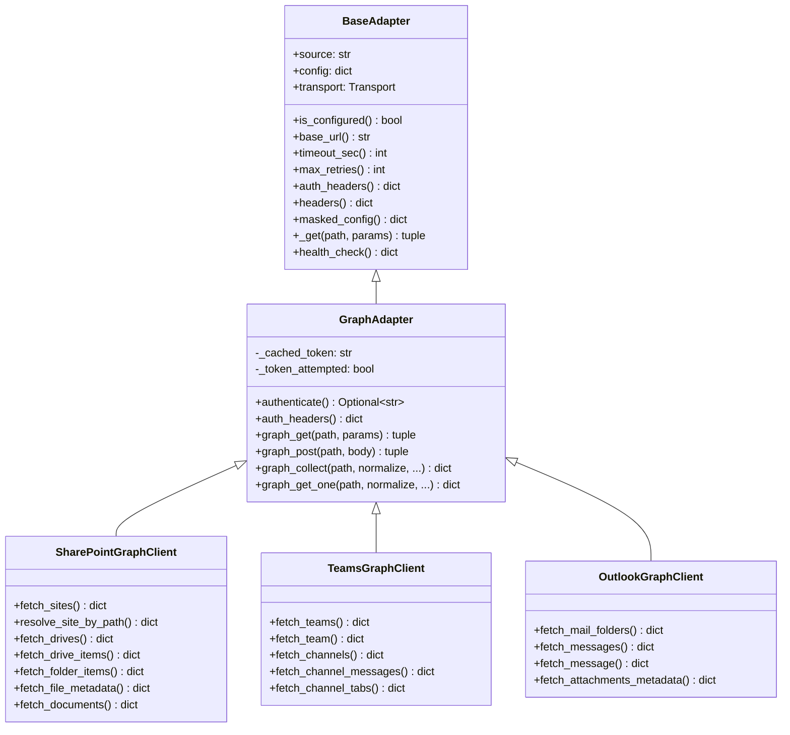
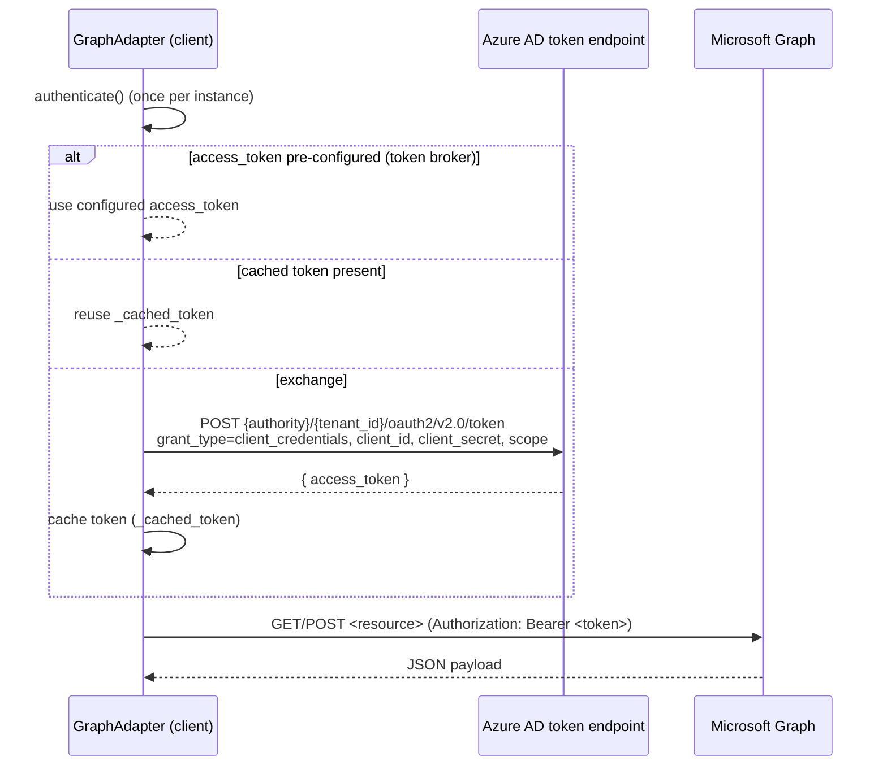
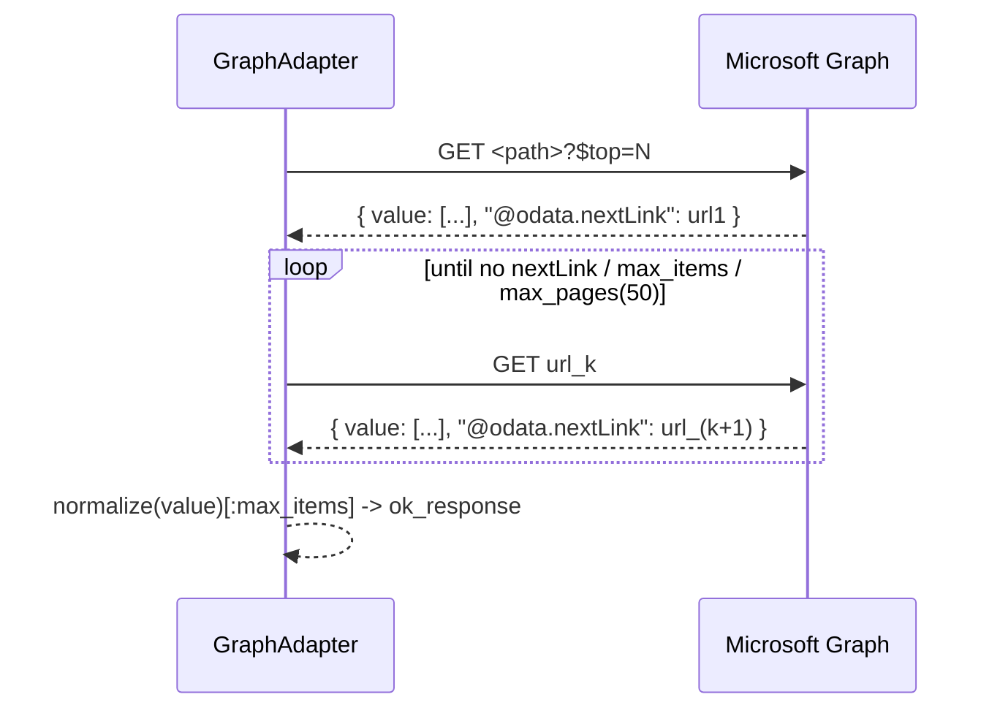
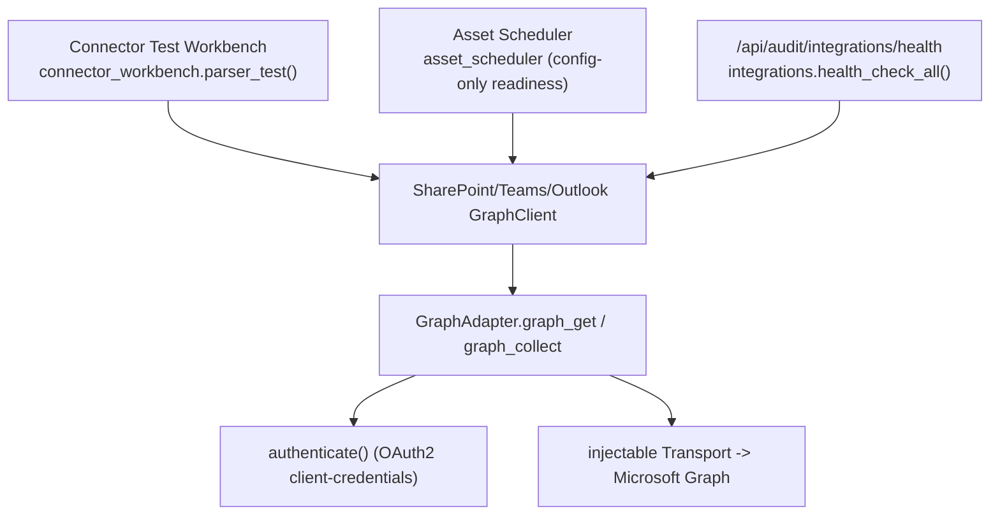

# Microsoft Graph Connector — API Reference

**Status:** Current · **Owner:** Platform / Integrations
**Scope:** SharePoint, Teams, and Outlook evidence connectors built on the shared
Microsoft Graph foundation.

> Everything in this document is derived from repository inspection. Source files:
> `modules/operations/integrations/ms_graph_base.py`,
> `modules/operations/integrations/sharepoint_graph.py`,
> `modules/operations/integrations/teams_graph.py`,
> `modules/operations/integrations/outlook_graph.py`,
> `modules/operations/integrations/_base.py`.

---

## 1. Architecture

The three Graph connectors share a single foundation, `GraphAdapter` (in
`ms_graph_base.py`), which itself extends `BaseAdapter` (in `_base.py`). No HTTP
library is hard-wired — the transport is **injectable** (mocked in tests; a real
HTTP client in production). The default transport refuses live calls.



Key constants (`ms_graph_base.py`):

| Constant | Value |
| --- | --- |
| `GRAPH_BASE` | `https://graph.microsoft.com/v1.0` |
| `DEFAULT_AUTHORITY` | `https://login.microsoftonline.com` |
| `TOKEN_URL_TEMPLATE` | `{authority}/{tenant_id}/oauth2/v2.0/token` |
| `GRAPH_SCOPE` | `https://graph.microsoft.com/.default` |
| `DEFAULT_MAX_PAGES` | `50` |

---

## 2. Authentication flow (OAuth2 client-credentials)

Implemented in `GraphAdapter.authenticate()`.



- **Grant:** `client_credentials` (app-only; no user context).
- **Token endpoint:** `authority/{tenant_id}/oauth2/v2.0/token` (or an explicit
  `token_url` override).
- **Scope:** default `https://graph.microsoft.com/.default`.
- **Caching:** the token is cached per client instance; acquisition is attempted
  **at most once** (`_token_attempted`), success and failure both cached.
- **`auth_headers()`** applies a configured/cached bearer only (no implicit token
  exchange). `graph_get`/`graph_post` call `authenticate()` first.
- The client secret and token are **never logged**; `masked_config()` shows
  `SET`/`MISSING` only.

### Azure App Registration (prerequisite)

1. Register an application in Entra ID (Azure AD).
2. Add **application** (app-only) Microsoft Graph permissions and grant admin
   consent (see §3).
3. Create a client secret; store it in your secret manager (never in Git).
4. Provide `tenant_id`, `client_id`, and the secret to ECS via env / YAML (§10).

### Access tokens vs refresh tokens

The client-credentials grant returns an **access token** only; there is **no
refresh token** in this flow (the app re-requests a token when needed). ECS caches
the access token per client instance and re-exchanges on a new instance. A
pre-issued token may be injected via `ECS_GRAPH_ACCESS_TOKEN` (token broker
pattern), in which case no exchange occurs.

---

## 3. Required Graph permissions (application / app-only)

Grant + admin-consent the least privilege needed per connector:

| Connector | Typical application permissions |
| --- | --- |
| SharePoint | `Sites.Read.All`, `Files.Read.All` |
| Teams | `Team.ReadBasic.All`, `Channel.ReadBasic.All`, `ChannelMessage.Read.All` |
| Outlook | `Mail.Read` (app-only), `MailboxSettings.Read` (if folders enumerated) |

> ECS reads **metadata only** and never downloads file/attachment contents by
> default; grant read-only permissions.

---

## 4. Discovery & retrieval operations

All methods return the standard response shape (`{ok, source, status, items,
errors}`) and never raise. Endpoints below are the exact Graph paths issued
(relative to `GRAPH_BASE`).

### SharePoint (`SharePointGraphClient`)

| Method | Graph endpoint | Normalizer / `evidence_type` |
| --- | --- | --- |
| `fetch_sites(search, max_items)` | `GET /sites` (`?search=` or `?$top=`) | `normalize_site` / `sharepoint_site` |
| `resolve_site_by_path(hostname, site_path)` | `GET /sites/{hostname}:/{site_path}` | `normalize_site` / `sharepoint_site` |
| `fetch_drives(site_id, max_items)` | `GET /sites/{site_id}/drives` | `normalize_drive` / `sharepoint_drive` |
| `fetch_drive_items(drive_id, max_items)` | `GET /drives/{drive_id}/root/children` or `GET /sites/{site_id}/drive/root/children` | `normalize_item` / `sharepoint_document` |
| `fetch_folder_items(folder_path, drive_id, max_items)` | `GET /drives/{drive_id}/root:/{folder_path}:/children` | `normalize_item` / `sharepoint_document` |
| `fetch_file_metadata(item_id, drive_id)` | `GET /drives/{drive_id}/items/{item_id}` | `normalize_item` / `sharepoint_document` |
| `download_file_metadata_only(item_id, drive_id)` | (metadata only; delegates to `fetch_file_metadata`) | `normalize_item` |
| `fetch_documents(page_size, max_items)` | `GET /drives/{drive}/root/children` (`$top`) | `normalize_document` (legacy shape) |

`normalize_item` output keys: `source, item_id, name, web_url, size,
created_datetime, modified_datetime, created_by, modified_by, mime_type,
parent_reference, is_folder, evidence_type`.

### Teams (`TeamsGraphClient`)

| Method | Graph endpoint | Normalizer / `evidence_type` |
| --- | --- | --- |
| `fetch_teams(max_items)` | `GET /teams` | `normalize_team` / `teams_team` |
| `fetch_team(team_id)` | `GET /teams/{team_id}` | `normalize_team` / `teams_team` |
| `fetch_channels(team_id, max_items)` | `GET /teams/{team_id}/channels` | `normalize_channel` / `teams_channel` |
| `fetch_channel_messages(team_id, channel_id, limit)` | `GET /teams/{team_id}/channels/{channel_id}/messages` (`$top`) | `normalize_message` / `teams_message` |
| `fetch_channel_tabs(team_id, channel_id)` | `GET /teams/{team_id}/channels/{channel_id}/tabs` | `normalize_tab` / `teams_tab` |

### Outlook (`OutlookGraphClient`)

| Method | Graph endpoint | Normalizer / `evidence_type` |
| --- | --- | --- |
| `fetch_mail_folders(user_id, max_items)` | `GET /users/{user_id}/mailFolders` | `normalize_folder` / `outlook_folder` |
| `fetch_messages(user_id, folder, limit)` | `GET /users/{user_id}/mailFolders/{folder}/messages` (`$top`) | `normalize_message` / `outlook_message` |
| `fetch_message(user_id, message_id)` | `GET /users/{user_id}/messages/{message_id}` | `normalize_message` / `outlook_message` |
| `fetch_attachments_metadata(user_id, message_id)` | `GET /users/{user_id}/messages/{message_id}/attachments` (`$select` excludes `contentBytes`) | `normalize_attachment_metadata` / `outlook_attachment` |

---

## 5. Pagination

`GraphAdapter.graph_collect(path, normalize, ...)` follows Graph's
`@odata.nextLink`:



- Items are read from each page's `value` array.
- Stops at the last page, `max_items` (default 1000), or `max_pages` (default 50).
- `graph_get_one` fetches a single resource (no pagination).

---

## 6. Retry logic & rate limits

Retries are handled by `_base.call_with_retry` (shared by every adapter):

- Total attempts = `1 + max_retries` (`max_retries` default 2).
- Backoff = `backoff_base * 2**i` (base defaults to 0 in tests; production
  transports can raise it via `backoff_base_sec` config).
- **Non-retryable:** `auth_error`, `not_configured` (they will not self-heal).
- **Retryable:** `timeout`, `connection_error`, `http_error`, `transport_error`.
- Rate limiting (HTTP 429) is classified as an `http_error` and retried within the
  bounded attempts; honoring `Retry-After` is a responsibility of the injected
  production transport (the skeleton transport makes no live calls).

---

## 7. Common errors

Statuses come from `_base.classify_exception` (never leak secret detail):

| Status | Meaning |
| --- | --- |
| `not_configured` | Required tenant/client/secret (and connector id) missing |
| `auth_error` | 401/403 / token exchange failed (not retried) |
| `timeout` | Request timed out |
| `connection_error` | DNS / connection refused |
| `http_error` | 4xx/5xx (incl. 429) |
| `transport_error` | Unclassified transport failure |
| `empty` | Call succeeded but returned no items |

`normalize_error(status, detail)` produces a uniform, secret-free error record.

---

## 8. Sample request / response

**Request (conceptual — issued via the injected transport):**

```
GET https://graph.microsoft.com/v1.0/sites/{site_id}/drive/root/children?$top=100
Authorization: Bearer <access_token>
Accept: application/json
```

**Raw Graph response (page):**

```json
{
  "value": [
    {"id": "01ABC", "name": "policy.pdf", "size": 20480,
     "webUrl": "https://contoso.sharepoint.com/.../policy.pdf",
     "createdDateTime": "2026-01-05T10:00:00Z",
     "lastModifiedDateTime": "2026-02-01T09:30:00Z",
     "file": {"mimeType": "application/pdf"}}
  ],
  "@odata.nextLink": "https://graph.microsoft.com/v1.0/..."
}
```

**Normalized ECS item (`normalize_item`):**

```json
{
  "source": "sharepoint_graph",
  "item_id": "01ABC",
  "name": "policy.pdf",
  "web_url": "https://contoso.sharepoint.com/.../policy.pdf",
  "size": 20480,
  "created_datetime": "2026-01-05T10:00:00Z",
  "modified_datetime": "2026-02-01T09:30:00Z",
  "created_by": "Jane Doe",
  "modified_by": "Jane Doe",
  "mime_type": "application/pdf",
  "parent_reference": { "...": "..." },
  "is_folder": false,
  "evidence_type": "sharepoint_document"
}
```

---

## 9. Call flow (ECS services that call Microsoft Graph)



ECS entry points that construct/call the Graph connectors:

- **Connector Test Workbench** — `modules/audit_intelligence/services/connector_workbench.py`
  (`parser_test`, `health_check`, `config_status`, `dry_run`) via the registry.
- **Integrations registry** — `modules/operations/integrations/__init__.py`
  (`health_check_all`, `masked_config_all`) surfaced by
  `GET /api/audit/integrations`, `GET /api/audit/integrations/health`,
  `GET /api/audit/integrations/{name}/health`.
- **Asset Scheduler** — `modules/audit_intelligence/services/asset_scheduler.py`
  routes Graph asset types to these adapters and reports config-only readiness
  (no live Graph calls in dry-run).

---

## 10. Configuration & environment variables

Shared Graph credentials (from `get_graph_config`):

| Env var | Purpose |
| --- | --- |
| `ECS_GRAPH_TENANT_ID` | Azure AD tenant id |
| `ECS_GRAPH_CLIENT_ID` | App (client) id |
| `ECS_GRAPH_CLIENT_SECRET` | Client secret (via secret manager) |
| `ECS_GRAPH_SCOPE` | Scope (default `https://graph.microsoft.com/.default`) |
| `ECS_GRAPH_AUTHORITY_URL` | Authority (default `https://login.microsoftonline.com`) |
| `ECS_GRAPH_BASE_URL` | Graph base override (sovereign clouds / mocks) |
| `ECS_GRAPH_TOKEN_URL` | Explicit token URL override |
| `ECS_GRAPH_ACCESS_TOKEN` | Pre-issued token (token broker; skips exchange) |
| `ECS_GRAPH_TIMEOUT_SECONDS` | Per-call timeout |
| `ECS_GRAPH_MAX_RETRIES` | Retry count |

Connector-specific:

| Connector | Env vars |
| --- | --- |
| SharePoint | `ECS_GRAPH_SITE_ID`, `ECS_GRAPH_DRIVE_ID`, `ECS_SHAREPOINT_SITE_HOSTNAME`, `ECS_SHAREPOINT_SITE_PATH`, `ECS_SHAREPOINT_FOLDER_PATH` |
| Teams | `ECS_TEAMS_TEAM_ID`, `ECS_TEAMS_CHANNEL_ID`, `ECS_TEAMS_MESSAGE_LIMIT` |
| Outlook | `ECS_OUTLOOK_USER_ID`, `ECS_OUTLOOK_MAIL_FOLDER`, `ECS_OUTLOOK_MESSAGE_LIMIT` |

YAML blocks are resolved from the `connectors`/`integrations` sections
(`ms_graph`, `graph`, `sharepoint_graph`, `sharepoint`, `teams_graph`, `teams`,
`outlook_graph`, `outlook`) via `_base.yaml_block`. Secrets are referenced by
`*_env` keys, never inlined.

`is_configured()`:
- SharePoint: tenant + client + secret **+ `site_id`**.
- Teams: tenant + client + secret (Graph creds).
- Outlook: tenant + client + secret **+ `user_id`**.

---

## 11. Related documentation

- Developer setup: `docs/03-development/developer-manual/connectors/MS_GRAPH_CONNECTOR_GUIDE.md`,
  `docs/03-development/developer-manual/connectors/ENTERPRISE_CONNECTOR_UAT_SETUP.md`
- UAT testing: `docs/03-development/developer-manual/connectors/microsoft_graph_sharepoint_teams_uat_testing.md`
- Per-connector reference: `docs/03-development/developer-manual/connectors/enterprise_connector_api_reference.md`
- Workbench: `docs/03-development/developer-manual/connectors/connector_test_workbench_design.md`
- Scheduler: `docs/03-development/developer-manual/phase1/scheduler/scheduler_runtime_flow.md`
- Tests: `tests/test_ms_graph_connectors.py`,
  `tests/test_sharepoint_graph_connector.py`,
  `tests/test_teams_graph_connector.py`, `tests/test_outlook_graph_connector.py`
