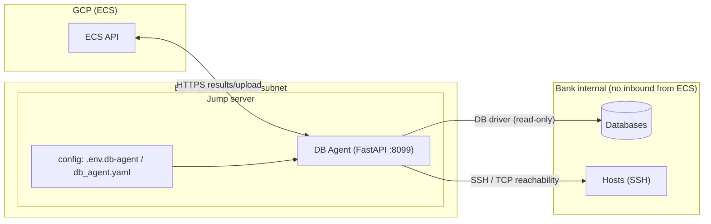
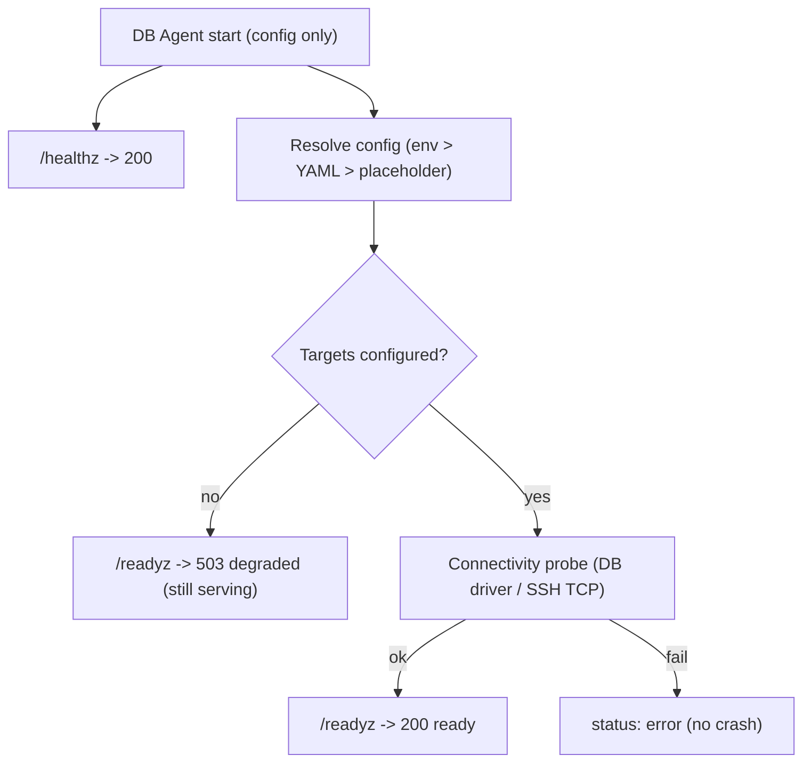

# ECS Database Agent Guide

The **ECS DB Agent** is a small, self-contained FastAPI micro-service that runs on
a **jump server inside the secured internal bank network** and validates
**database** and **host (SSH)** connectivity — and executes predefined queries —
using **simple configuration only**, uploading results to ECS.

> # ⚠️ THIS IS A PROTOTYPE. THIS IS NOT PRODUCTION SECURE.
> It runs with no enterprise security enforced; network isolation (jump server) is
> the control. It is **independent of** the ECS platform's own security framework
> and does not modify or weaken it.

> **Source of truth.** The package-level readme
> [`db_agent/README.md`](../../db_agent/README.md) is the canonical, always-current
> reference. This guide is its home in the docs tree (jump-server placement,
> enterprise context, diagrams) and links back to it. See also the enterprise
> jump-server model in [`../architecture/ENTERPRISE_ARCHITECTURE.md`](../../../02-architecture/architecture/ENTERPRISE_ARCHITECTURE.md) §4.

---

## 1. Architecture & jump-server placement



The DB Agent **reuses ECS's existing database connectors** (e.g.
`PostgreSQLConnector`) for execution — it adds no new HTTP/DB client.

---

## 2. Configuration (config-only, no hardcoded IPs/creds)

Everything is configurable via environment variables and/or a YAML file; env vars
take precedence, and unset values fall back to safe, non-secret placeholders.

```bash
cp .env.db-agent.example .env.db-agent          # local prototype
cp .env.db-agent.uat.example .env.db-agent.uat  # UAT on the jump server
```

| Group | Variables |
|-------|-----------|
| Database | `DB_HOST` `DB_PORT` `DB_NAME` `DB_USERNAME` `DB_PASSWORD` `DB_SSLMODE` `DB_TIMEOUT_SEC` |
| Host (SSH) | `SSH_HOST` `SSH_PORT` `SSH_USERNAME` `SSH_PASSWORD` `SSH_TIMEOUT_SEC` |
| Agent service | `DB_AGENT_HOST` `DB_AGENT_PORT` |
| Optional YAML | `DB_AGENT_CONFIG` (default `config/db_agent.yaml`) |

YAML shape: [`config/db_agent.yaml`](../../config/db_agent.yaml). The agent starts
even if every value is blank — unconfigured targets report `configured: false` and
connectivity checks degrade gracefully (never crash).

---

## 3. Running

```bash
set -a; source .env.db-agent; set +a
python -m db_agent
# or:
uvicorn db_agent.app:app --host 0.0.0.0 --port 8099
```

### Endpoints

| Method + Path | Purpose |
|---------------|---------|
| `GET /` | Banner + prototype warning |
| `GET /healthz` | Liveness (always 200; no I/O) |
| `GET /readyz` | Readiness (200 when configured targets reachable, else **503 degraded** — never blocks startup) |
| `GET /config` | Resolved config, secrets masked (`SET`/`MISSING`) |
| `GET /security` | Prototype security posture + optional `ENABLE_*` flags |
| `GET /connectivity` | DB + SSH connectivity summary |
| `GET /connectivity/database` | DB connectivity (reuses ECS `PostgreSQLConnector`) |
| `GET /connectivity/ssh` | SSH host reachability (TCP probe) |

`/readyz` returning **503 (degraded)** before targets are configured/reachable is
expected — it is a signal, not a startup gate.

---

## 4. Health / readiness / dry-run flow



---

## 5. ECS upload flow

Collected evidence is uploaded to ECS through the standard evidence path (SHA-256
hashing + audit-repository mirror), identical to the connector executor's bridge —
see the [evidence flow](../architecture/ENTERPRISE_ARCHITECTURE.md#6-evidence-flow)
and [`../evidence-management/ECS_EVIDENCE_REFERENCE_GUIDE.md`](../evidence-management/ECS_EVIDENCE_REFERENCE_GUIDE.md).

---

## 6. Prototype security notes

The agent depends on **none** of the following to run; their absence never blocks
startup: mTLS, TLS certificates, PKI, JWT, OIDC, OAuth, Vault, enterprise SSO,
Azure AD, Keycloak, HSM. Each is an **optional, off-by-default** extension point
(`ENABLE_MTLS`, `ENABLE_JWT`, `ENABLE_VAULT`, `ENABLE_OIDC`, `ENABLE_CERT_AUTH`),
with `TODO(prod-security)` hooks in `db_agent/security.py`.

---

## 7. Production hardening checklist

Before any production deployment (from [`db_agent/README.md`](../../db_agent/README.md)):

- [ ] Enable **TLS/mTLS** (`ENABLE_MTLS`) with real certificates.
- [ ] Enable **JWT/OIDC** authentication (`ENABLE_JWT` / `ENABLE_OIDC`).
- [ ] Enable **Vault / enterprise secret management** (`ENABLE_VAULT`) — no plaintext creds.
- [ ] Enable **certificate authentication** (`ENABLE_CERT_AUTH`).
- [ ] Integrate **centralized identity** (SSO / Azure AD / Keycloak).
- [ ] Add **audit logging enhancements** for every connectivity/query action.
- [ ] Restrict network exposure; least-privilege, **read-only** DB accounts.

---

## 8. Testing

```bash
PYTHONPATH=. pytest tests/test_db_agent.py -q
```

See the [Testing Guide](../../../04-testing/testing/TESTING_GUIDE.md) for the full test map.

---

## Related documents

- [`db_agent/README.md`](../../db_agent/README.md) — canonical package reference
- [`../architecture/ENTERPRISE_ARCHITECTURE.md`](../../../02-architecture/architecture/ENTERPRISE_ARCHITECTURE.md) §4 — jump-server model
- [`PREDEFINED_DATABASE_QUERY_MODULE.md`](PREDEFINED_DATABASE_QUERY_MODULE.md) — predefined DB queries
- [`../runbooks/DB_AGENT_FAILURE_RUNBOOK.md`](../runbooks/DB_AGENT_FAILURE_RUNBOOK.md) — failure runbook
