# ECS Runtime Call Graph & Sequence Diagrams

**Status:** Current · **Owner:** Audit Intelligence / Platform

> Derived from repository inspection. Every endpoint, service, and class named
> below exists in the repository (see the connector/scheduler/workbench references
> for source paths). No APIs are invented.

This document maps ECS runtime from FastAPI endpoint → service → repository →
connector → parser → validation → observation → dashboard → LLM, and provides
sequence diagrams for the key flows.

---

## 1. High-level call graph

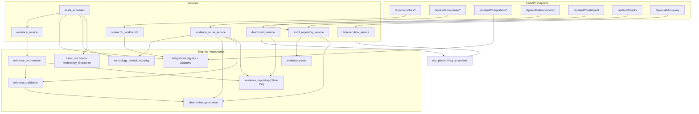

## 2. Endpoint → service → downstream (reference table)

| Endpoint | Service | Downstream |
| --- | --- | --- |
| `GET /api/connectors` | `connector_workbench.list_connectors` | integrations registry |
| `GET /api/connectors/{name}/config-status` | `connector_workbench.config_status` | `integrations.<name>.masked_config` |
| `POST /api/connectors/{name}/health-check` | `connector_workbench.health_check` | `integrations.<name>.health_check` |
| `POST /api/connectors/{name}/dry-run` | `connector_workbench.dry_run` | adapter primary method (no call) |
| `POST /api/connectors/{name}/parser-test` | `connector_workbench.parser_test` | adapter `fetch_*`/`normalize_*` (mock) |
| `GET /connectors/test-workbench` | `connector_test_workbench` (route) | `connector_workbench.list_connectors` |
| `GET /api/evidence-reuse/records` | `evidence_reuse_service.records` | `evidence_repository.search` |
| `POST /api/evidence-reuse/analyze` | `evidence_reuse_service.analyze` | repository + `technology_control_mapping` |
| `POST /api/evidence-reuse/validate-completeness` | `evidence_reuse_service.validate_completeness` | repository + mapping |
| `POST /api/evidence-reuse/generate-observations` | `evidence_reuse_service.generate_observations` | `observation_generation` |
| `POST /api/evidence-reuse/check-closure` | `evidence_reuse_service.check_closure` | `observation_generation.transition` |
| `GET /api/evidence-reuse/readiness` | `evidence_reuse_service.readiness` | repository + mapping |
| `GET /api/evidence-reuse/observations` | `evidence_reuse_service.observations` | `observation_generation` |
| `GET /api/audit/integrations` | (route) | `integrations.masked_config_all` |
| `GET /api/audit/integrations/health` | (route) | `integrations.health_check_all` |
| `GET /api/audit/integrations/{name}/health` | (route) | `integrations.<name>.health_check` |
| `GET /api/audit/observations` | `audit_repository_service.list_observations` | `observation_generation.list_observations` |
| `POST /api/audit/observations/{id}/transition` | `audit_repository_service.transition_observation` | `observation_generation.transition` |
| `GET /api/audit/dashboard` | `dashboard_service` | repository + observations |
| `GET /api/audit/packs` | `audit_repository_service` | `evidence_packs` |
| `POST /api/audit-llm/query` | `llm/execution_service.execute` | `ecs_platform/rag.py::answer` |

> CLI (not REST): `scripts/run_uat_asset_scheduler.py` → `asset_scheduler.dry_run`.

---

## 3. Sequence diagrams

Connector fetches (1–7) share the pattern from
`docs/03-development/developer-manual/connectors/enterprise_connector_api_reference.md §3`; each is shown with its concrete
endpoints. In the **workbench** context the transport is an in-process mock; in
**scheduler execution** it is a real transport. Adapters never raise (errors are
classified into the standard status vocabulary).

### 3.1 SharePoint fetch

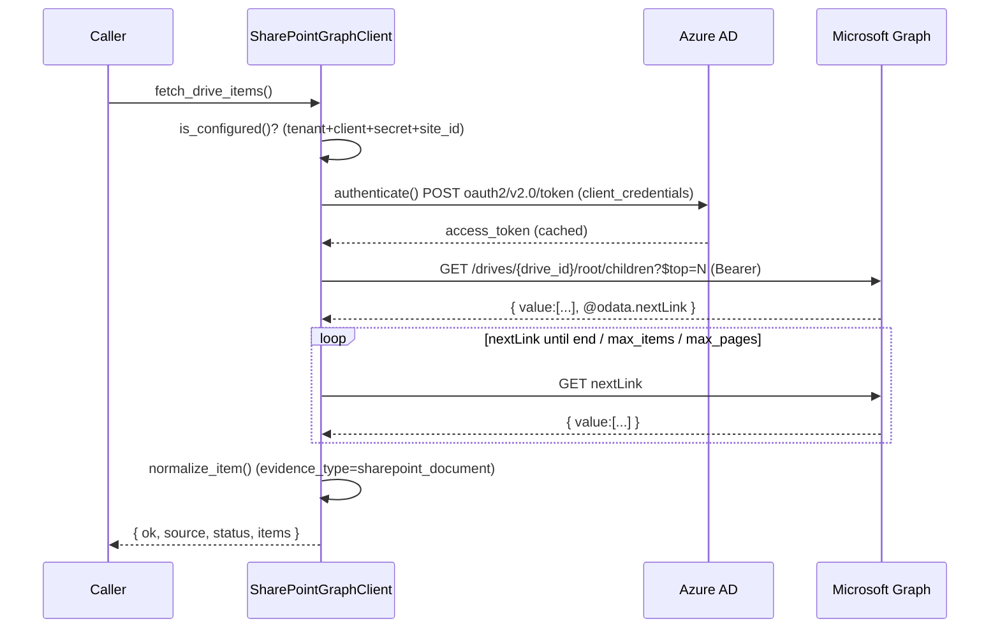

### 3.2 Teams fetch

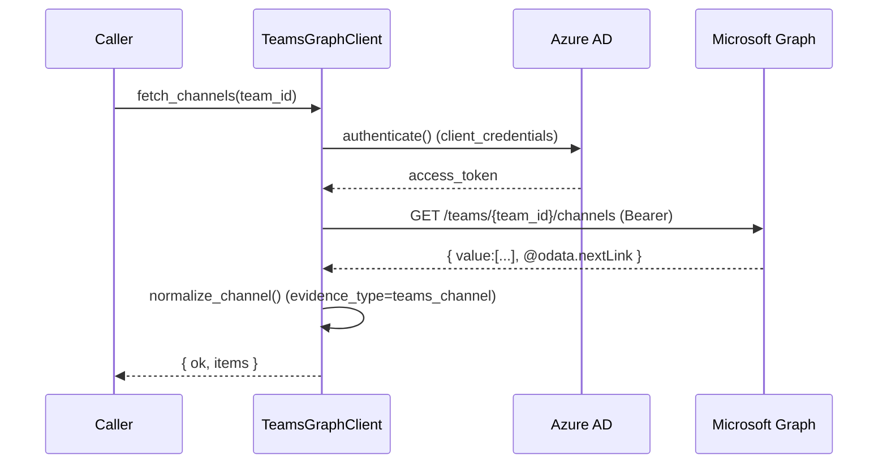

### 3.3 Outlook fetch

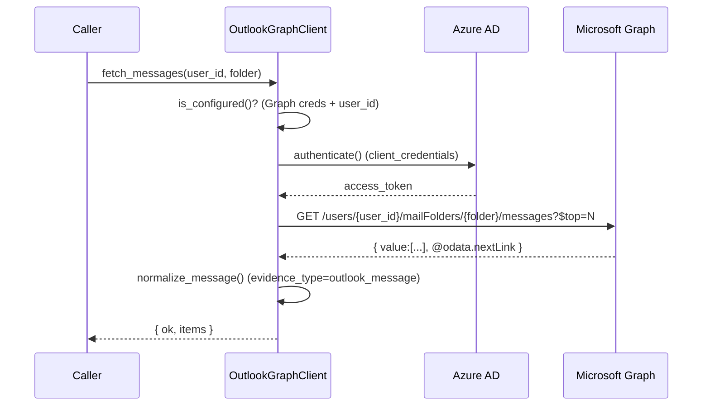

### 3.4 Jira fetch

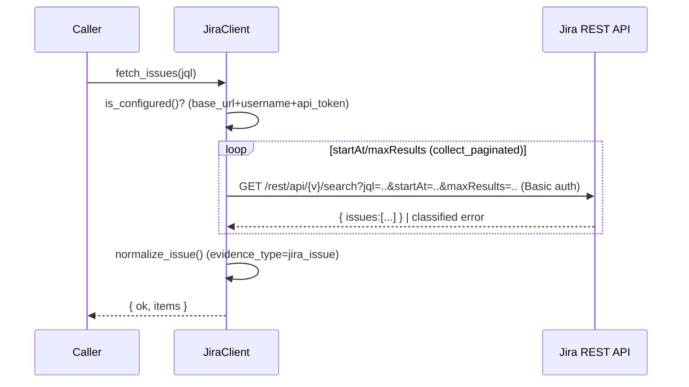

### 3.5 Confluence fetch

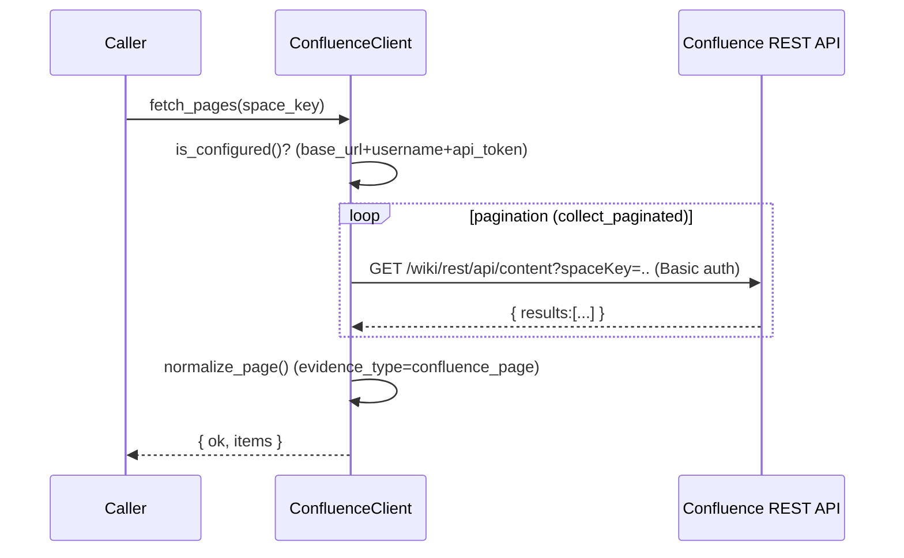

### 3.6 Prisma Cloud fetch

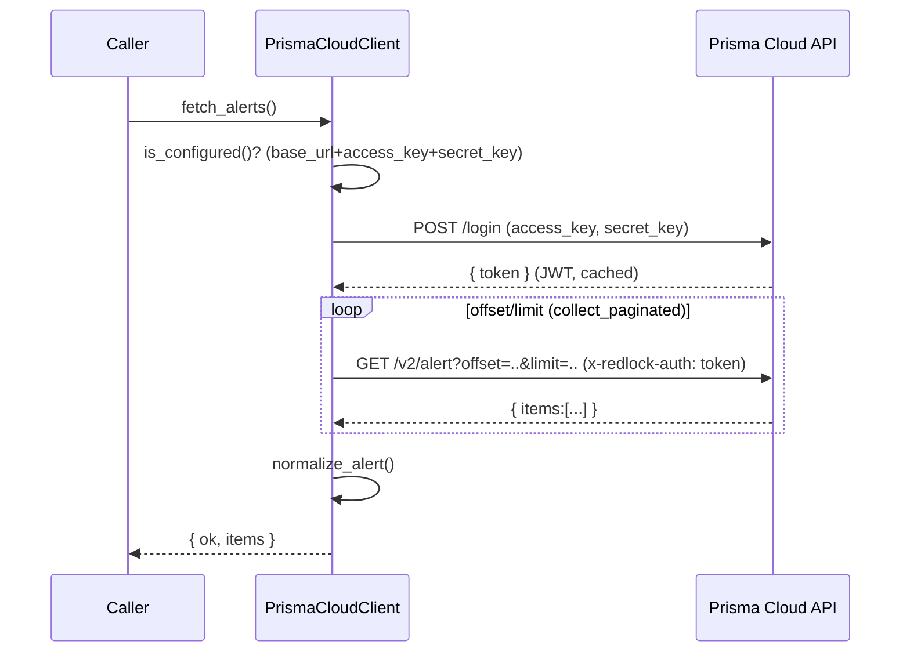

### 3.7 ServiceNow fetch

```mermaid
sequenceDiagram
    participant Caller
    participant SN as ServiceNowAdapter
    participant AUTH as ServiceNow OAuth (oauth_token.do)
    participant T as ServiceNow Table API
    Caller->>SN: fetch_servers(sysparm_query)
    SN->>SN: is_configured()? (base_url + OAuth or Basic)
    alt auth_mode=oauth
        SN->>AUTH: POST /oauth_token.do (client_credentials)
        AUTH-->>SN: { access_token } (cached; Bearer)
    else auth_mode=basic
        SN->>SN: basic_auth_header(username,password)
    end
    loop sysparm_limit/offset (collect_paginated)
        SN->>T: GET /api/now/table/cmdb_ci_server?sysparm_limit=..&sysparm_offset=..
        T-->>SN: { result:[...] }
    end
    SN->>SN: normalize_ci() (evidence_type=cmdb_ci)
    SN-->>Caller: { ok, items }
```

### 3.8 Scheduler batch run

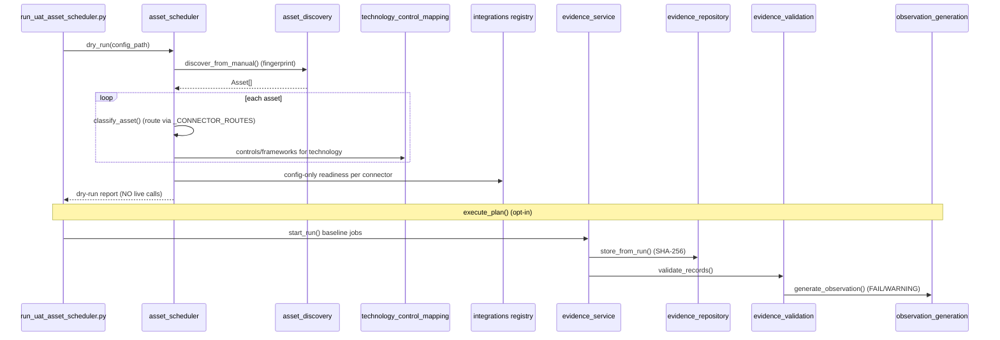

### 3.9 Evidence reuse

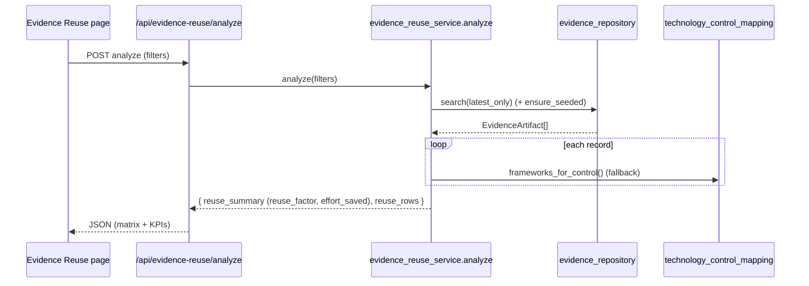

### 3.10 Observation creation

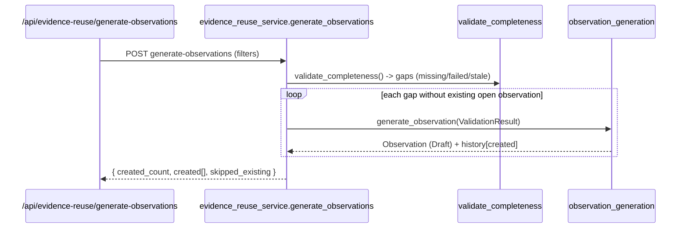

### 3.11 Observation closure

```mermaid
sequenceDiagram
    participant API as /api/evidence-reuse/check-closure
    participant SVC as evidence_reuse_service.check_closure
    participant REPO as evidence_repository
    participant OBS as observation_generation
    API->>SVC: POST check-closure (require_approval)
    SVC->>REPO: records() -> satisfied controls
    loop each open observation with satisfying evidence
        alt require_approval=true (maker-checker)
            SVC->>OBS: transition(Draft->Submitted) (READY FOR CLOSURE; not closed)
        else require_approval=false
            SVC->>OBS: transition(... -> Closed)
        end
        OBS-->>SVC: updated Observation (+history)
    end
    SVC-->>API: { ready_for_closure[], closed[], not_eligible[] }
```

### 3.12 Audit LLM query

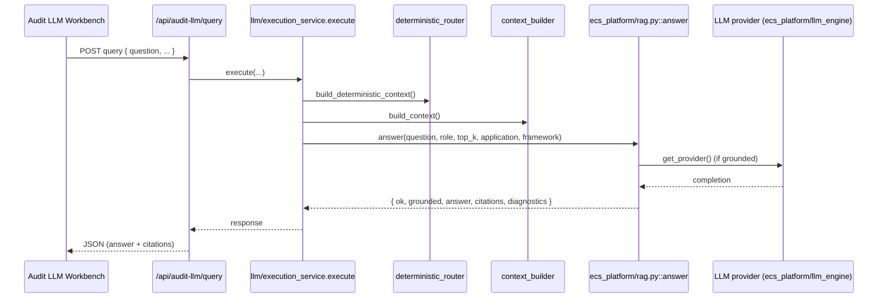

> Note: `answer()` returns `grounded=false` with `mode='fallback'` when no LLM key
> is configured (deterministic assistant is used instead).

---

## 4. Related documentation

- `docs/03-development/developer-manual/connectors/enterprise_connector_api_reference.md`
- `docs/03-development/developer-manual/connectors/microsoft_graph_connector_api_reference.md`
- `docs/03-development/developer-manual/connectors/connector_test_workbench_design.md`
- `docs/03-development/developer-manual/phase1/scheduler/scheduler_runtime_flow.md`
- `docs/03-development/developer-manual/phase1/scheduler/test_workbench_vs_scheduler.md`
- `docs/03-development/evidence-management/evidence_reuse_lifecycle_functional_design.md`
