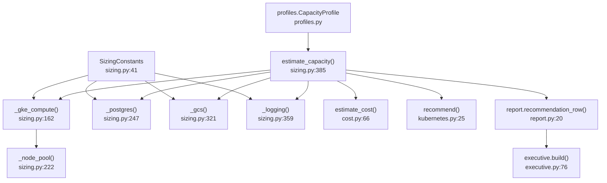
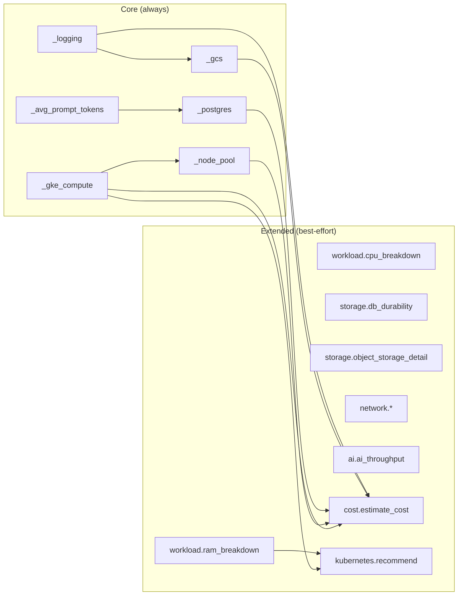

# ECS Benchmark — Calculation Traceability

Calculation-level traceability: which file and function produces each number, how
profile fields and constants combine, and a numeric worked trace.

> For the engineering-level flow diagram see
> [`BENCHMARK_TRACEABILITY.md`](BENCHMARK_TRACEABILITY.md) (do not duplicate — this
> document adds **calculation** detail: file paths, function names, numeric steps).

## Calculation traceability flow

## Estimator dependency flow

## Module / file mapping

| Calculation output | Function | File | Estimate key |
|--------------------|----------|------|--------------|
| Profile dict | `CapacityProfile.to_dict()` | `profiles.py` | `profile` |
| Token feed | `_avg_prompt_tokens()` | `sizing.py:124` | `token_feed` |
| Peak cores, replicas, pod sizing | `_gke_compute()` | `sizing.py:162` | `gke_compute` |
| Node count, machine type | `_node_pool()` | `sizing.py:222` | `node_pool` |
| Cloud SQL tier, DB GiB | `_postgres()` + `_cloud_sql_tier()` | `sizing.py:247,303` | `postgres_pgvector` |
| GCS GiB year-1/5 | `_gcs()` | `sizing.py:321` | `gcs_object_storage` |
| Logging GiB/day | `_logging()` | `sizing.py:359` | `logging_monitoring` |
| Per-op CPU core-hours | `cpu_breakdown()` | `workload.py` | `cpu_breakdown` |
| Per-consumer RAM | `ram_breakdown()` | `workload.py` | `ram_breakdown` |
| WAL, backup, QPS | `db_durability()` | `storage.py` | `db_durability` |
| Size distribution, retention | `object_storage_detail()` | `storage.py` | `object_storage_detail` |
| Bandwidth, cross-cloud | `network_bandwidth()` | `network.py` | `network` |
| Monthly/5yr cost | `estimate_cost()` | `cost.py:66` | `cost` |
| HPA, PDB, eviction | `recommend()` | `kubernetes.py:25` | `kubernetes` |
| Executive table row | `recommendation_row()` | `report.py:20` | (report) |
| Top-5 lists | `top_bottlenecks/risks/optimizations()` | `executive.py:27-73` | (report) |

## Numeric worked trace — `phase1`

| Step | Input | Calculation | Output |
|------|-------|-------------|--------|
| 1. Profile | `phase1` | `get_profile("phase1")` | 3 apps, 5k API/day, 200 KB evidence |
| 2. CPU-ms | activity × constants | `5000×40 + 50×800 + 20×200 + 30×1500` | 289,000 ms/day |
| 3. Peak cores | ÷ work_seconds × 3 | `289000/1000 / 32400 × 3` | ~0.035 cores |
| 4. Replicas | peak / (0.5×0.6), min 2 | `max(2, int(...)+1)` | **2** |
| 5. Nodes | 2×0.5 CPU / 3 alloc + headroom | `max(2, 0+1)` | **2 × e2-standard-4** |
| 6. DB year-1 | rows × bytes × 1.35 | controls + evidences + vectors + growth | **0.12 GiB** → `db-custom-2-7680` |
| 7. GCS year-1 | evidence + versions + growth | 3 apps × evidence sizes | **2.67 GiB** |
| 8. Cost monthly | nodes×rates + sql + gcs + logs | `cost.estimate_cost()` | **~$559** |
| 9. Executive row | flatten gke/pg/gcs/cost | `recommendation_row()` | table row in `executive.md` |

Full formulas: [`CAPACITY_PLANNING_FORMULAS.md`](CAPACITY_PLANNING_FORMULAS.md).

## Trace any output number

1. Find the key in `capacity.json` under `estimates[0]`.
2. Look up the function in the table above.
3. Read `_basis` or `_meta.provenance` on that section.
4. Trace inputs to `profile` fields or `constants` dict.
5. Override via `SizingConstants.from_overrides()` or profile edits; re-run CLI.

## Related
- [`BENCHMARK_TRACEABILITY.md`](BENCHMARK_TRACEABILITY.md) · [`BENCHMARK_METHODOLOGY.md`](BENCHMARK_METHODOLOGY.md) · [`BENCHMARK_ASSUMPTIONS_AND_LIMITATIONS.md`](BENCHMARK_ASSUMPTIONS_AND_LIMITATIONS.md) · [`CALIBRATION_GUIDE.md`](CALIBRATION_GUIDE.md)
