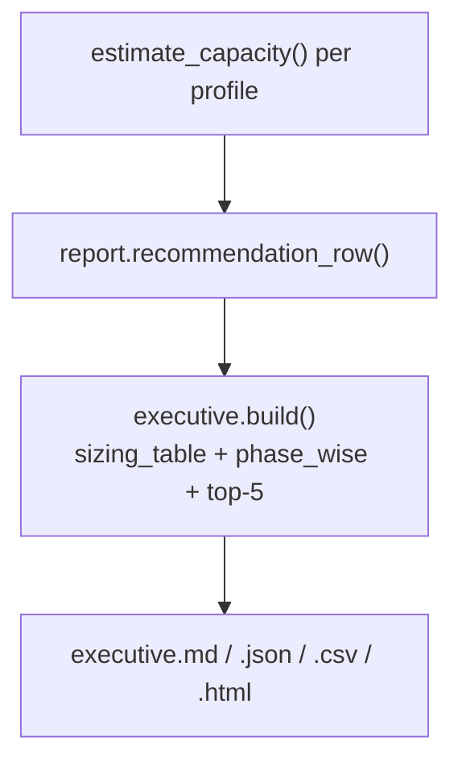

# ECS Benchmark — Executive Report Explanation

Why each recommendation in the executive capacity planner appears, with input,
formula, reasoning, result, confidence, and calibration method.

> For report structure and CLI usage see
> [`EXECUTIVE_CAPACITY_PLANNER_GUIDE.md`](EXECUTIVE_CAPACITY_PLANNER_GUIDE.md).
> For formulas see [`CAPACITY_PLANNING_FORMULAS.md`](CAPACITY_PLANNING_FORMULAS.md).
> Sample output: [`SAMPLE_EXECUTIVE_CAPACITY_REPORT.md`](SAMPLE_EXECUTIVE_CAPACITY_REPORT.md).

## Report sections

| Section | Source module | Purpose |
|---------|---------------|---------|
| Recommended sizing table | `executive.build()` ← `report.recommendation_row()` | Headline infra per profile |
| Phase-wise sizing | `executive.build()` — keys `demo`, `phase1`, `enterprise`, `pan-bank`, `large` | Rollout roadmap for leadership |
| Top 5 bottlenecks | `executive.top_bottlenecks()` | Where capacity will bind first |
| Top 5 risks | `executive.top_risks()` | Operational/deployment risks |
| Top 5 cost optimizations | `executive.top_optimizations()` | Where to save without losing capability |

## Recommendation justifications

### GKE node count

| Field | Value |
|-------|-------|
| **Input** | `recommended_replicas`, `pod_cpu_request_ms`, `pod_ram_request_mib`, `node_vcpu`, `node_ram_gib`, `node_allocatable_factor` (0.75) |
| **Formula** | `nodes = max(2, int(max(total_cpu/alloc_cpu, total_ram/alloc_ram)) + 1)` where `total_cpu = replicas × pod_cpu_request`, `alloc_cpu = node_vcpu × 0.75` |
| **Reasoning** | Sum pod requests across replicas; divide by allocatable node capacity; add +1 headroom; floor at 2 for multi-AZ HA |
| **Result** | `node_pool.recommended_nodes` × `e2-standard-{vcpu}` |
| **Confidence** | Medium — depends on pod request constants, not measured pod usage |
| **Calibration** | Override `SizingConstants.pod_cpu_request_ms` / `node_allocatable_factor`; or calibrate from K8s metrics (`kubectl top pods`) |

### Replica count

| Field | Value |
|-------|-------|
| **Input** | Daily API/connector/scheduler/prompt activity, per-op CPU-ms, `peak_to_average_factor`, `target_cpu_utilization`, `min_replicas` |
| **Formula** | `peak_cores = avg_cores × 3`; `replicas = max(2, int(peak_cores / (pod_cpu_request × 0.6)) + 1)` |
| **Reasoning** | Convert daily CPU-ms to peak cores during working hours; size replicas so each pod runs at ~60% CPU at peak; HA floor of 2 |
| **Result** | `gke_compute.recommended_replicas` |
| **Confidence** | Low–Medium — CPU-ms constants are planning defaults |
| **Calibration** | Measure real CPU % at peak RPS; adjust `cpu_ms_per_*` via `calibration.calibrate()` |

### Pod CPU / RAM requests and limits

| Field | Value |
|-------|-------|
| **Input** | `SizingConstants.pod_cpu_request_ms` (500m), `pod_cpu_limit_ms` (1000m), `pod_ram_request_mib` (1024), `pod_ram_limit_mib` (2048) |
| **Formula** | Fixed defaults in `SizingConstants` (not derived per profile in coarse model); `kubernetes.recommend()` may flag if `ram_breakdown.peak_total_mib / replicas` exceeds request |
| **Reasoning** | Conservative starting point for a stateless web tier; limits = 2× request for burst |
| **Result** | `gke_compute.recommended_pod` → shown as `500m/1024Mi` in executive table |
| **Confidence** | Medium for small profiles; Low for large (may need bump) |
| **Calibration** | Compare `ram_breakdown` peak/replica vs request; override constants |

### Cloud SQL tier

| Field | Value |
|-------|-------|
| **Input** | Row counts (controls, evidences, observations, prompt history), bytes/row, index overhead (+35%), vector chunks, retention years |
| **Formula** | `year1_gib = (base_rows + yearly_growth) × bytes × 1.35`; tier from `_cloud_sql_tier(year1_gib)` thresholds (≤20 → db-custom-2-7680, etc.) |
| **Reasoning** | Size DB for year-1 projected storage + headroom; map GiB band to a starting Cloud SQL machine type |
| **Result** | `postgres_pgvector.recommended_cloud_sql.tier` |
| **Confidence** | Medium for row-size assumptions; Low for tier mapping (needs real query load) |
| **Calibration** | Measure `pg_total_relation_size`; override `bytes_per_*_row`; validate QPS via `db_durability.performance` |

### GCS / object storage sizing

| Field | Value |
|-------|-------|
| **Input** | `total_evidences`, `avg_evidence_size_kb`, `evidence_versions_per_year`, `new_evidence_per_app_per_month`, `retention_years`, log export fraction |
| **Formula** | `year1 = evidence_bytes + (new + versions + exports + reports + log_archive)`; `year5 = base + growth × retention_years` |
| **Reasoning** | Evidence is the dominant object; versions and new evidence accumulate yearly; retention multiplies total |
| **Result** | `gcs_object_storage.year_1_total_gib`, `year_5_total_gib` |
| **Confidence** | Medium for evidence size; Low for version/dedup rates |
| **Calibration** | Bucket inventory stats; override profile `avg_evidence_size_kb` and `ObjectStorageConstants` |

### Monthly cost

| Field | Value |
|-------|-------|
| **Input** | Node count × vCPU/RAM hours, Cloud SQL vCPU/RAM/storage, GCS GiB (blended tiers), logging GiB, egress GiB, fixed LB/monitoring |
| **Formula** | `monthly_total = Σ(component_monthly)` — see [`CAPACITY_PLANNING_FORMULAS.md`](CAPACITY_PLANNING_FORMULAS.md) § Cost |
| **Reasoning** | Apply illustrative GCP unit rates (`CostRates`) to sizing outputs for budget-direction numbers |
| **Result** | `cost.monthly_total` |
| **Confidence** | **Very Low** — rates are illustrative, not a quote |
| **Calibration** | Replace `CostRates` with a current GCP quote or billing export |

### 5-year cost

| Field | Value |
|-------|-------|
| **Input** | Monthly breakdown + storage/logging growth curve |
| **Formula** | For years 1–5: `yr_monthly = fixed_compute_sql + (storage + logging + egress) × (1 + 0.6×(yr-1))`; `five_year_total = Σ annual` |
| **Reasoning** | Storage and logging grow with data; compute/SQL held flat (conservative); models cumulative TCO |
| **Result** | `cost.five_year_total`, `cost.growth_curve` |
| **Confidence** | Very Low — growth factor (60%/yr cumulative) is illustrative |
| **Calibration** | Replace growth curve with actual data-growth telemetry |

### Top bottlenecks (why they appear)

Derived from the **largest profile** (`max(apps)`) in `executive.top_bottlenecks()`:

| Bottleneck | Trigger | Reasoning |
|------------|---------|-----------|
| GKE compute | `peak_cores` and `recommended_replicas` | Highest CPU consumer at scale |
| Cloud SQL | `recommended_cloud_sql.tier` | Connection limits + query load ceiling |
| AI/RAG throughput | `ai_throughput.prompts_per_second_single_stream` | Prompt concurrency is RAM-bound |
| Cross-cloud egress | `network.cross_cloud_aws_gcp_gib_per_month` | AWS Net Banking ↔ GCP bandwidth + cost |
| Cloud Logging | `logging_monitoring.per_day_gib.total` | Ingestion volume at scale |

### Top risks (why they appear)

| Risk | Source | Reasoning |
|------|--------|-----------|
| Pod eviction/OOM | `kubernetes.eviction_risk` | RAM request < working set |
| DB slow queries | `db_durability.performance.slow_query_risk` | Storage growth degrades query latency |
| In-memory state | Static (architecture) | `ecs_state` blocks safe multi-replica scaling |
| Cross-cloud IAM | Static (operations) | Least-privilege + monitoring required |
| Backup/PITR | Static (banking) | Retention/DR compliance |

### Top cost optimizations (why they appear)

| Optimization | Source | Reasoning |
|--------------|--------|-----------|
| GCS lifecycle tiering | `object_storage_detail` tiers | Cold evidence → Nearline/Coldline/Archive |
| Compression | `object_storage_detail.throughput.compression_savings_pct` | Compressible evidence reduces GiB |
| Committed-use / autoscaling | Static (FinOps) | Match compute to real demand |
| PgBouncer + read replicas | `db_durability.performance` | Right-size SQL vCPU |
| Batch/multipart uploads | `object_storage_detail.throughput` | Reduce GCS operation costs |

## Executive report production flow

## Related
- [`BENCHMARK_METHODOLOGY.md`](BENCHMARK_METHODOLOGY.md) · [`BENCHMARK_RESULT_INTERPRETATION.md`](BENCHMARK_RESULT_INTERPRETATION.md) · [`CALIBRATION_GUIDE.md`](CALIBRATION_GUIDE.md) · [`BENCHMARK_ASSUMPTIONS_AND_LIMITATIONS.md`](BENCHMARK_ASSUMPTIONS_AND_LIMITATIONS.md)
