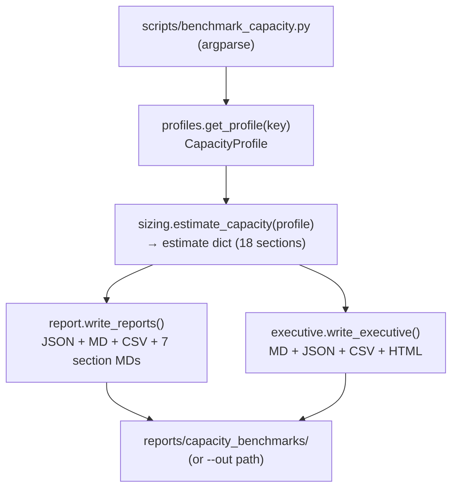
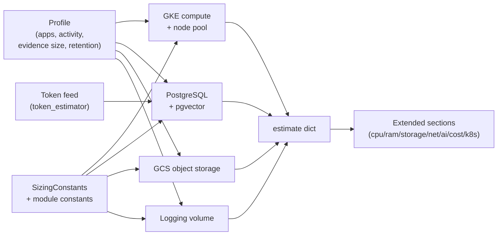
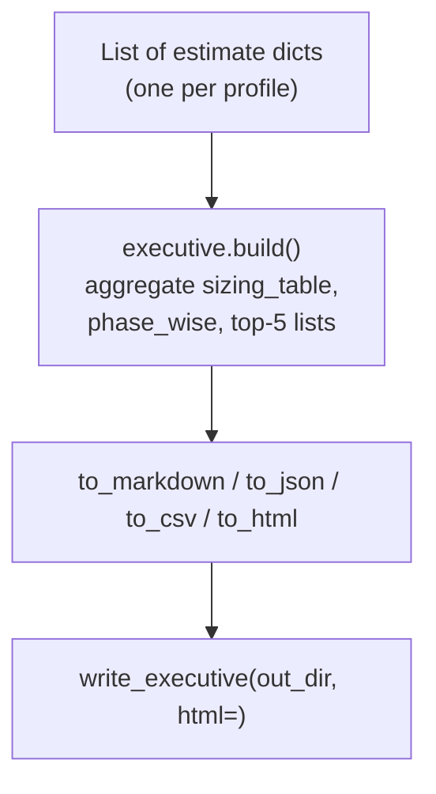

# ECS Benchmark — Methodology

How the Infrastructure Benchmark Workbench generates reports, why recommendations
appear, and how calculations flow from profiles to outputs.

> This document describes **methodology and architecture** — not the formulas
> themselves (see [`CAPACITY_PLANNING_FORMULAS.md`](CAPACITY_PLANNING_FORMULAS.md))
> or the assumption catalogue
> ([`BENCHMARK_ASSUMPTIONS_AND_LIMITATIONS.md`](BENCHMARK_ASSUMPTIONS_AND_LIMITATIONS.md)).

## 1. Benchmark architecture

The workbench is a **deterministic, offline estimation pipeline**:

| Layer | Location | Role |
|-------|----------|------|
| **Profiles** | `benchmarks/capacity/profiles.py` | Scenario workload drivers (apps, activity, evidence size, retention) |
| **Constants** | `sizing.py`, `workload.py`, `storage.py`, `network.py`, `ai.py`, `cost.py` | Documented per-unit assumptions (overridable) |
| **Estimators** | `sizing.py` + optional modules | Pure arithmetic: profile × constants → sizing dict |
| **Reports** | `report.py`, `executive.py` | Formatting only — no estimation logic |
| **CLI** | `scripts/benchmark_capacity.py` | User interface; orchestrates estimate + write |

Design principles:
- **Inspect, don't measure** — default mode is estimate-only (no network, no ECS/LLM calls).
- **Transparent** — every number traces to a profile field or constant (see [`BENCHMARK_CALCULATION_TRACEABILITY.md`](BENCHMARK_CALCULATION_TRACEABILITY.md)).
- **Additive** — extended sections (CPU breakdown, network, cost, k8s) are best-effort imports; core estimate never breaks.
- **Backward compatible** — new CLI flags and sections do not change existing outputs.

## 2. Report generation flow



### Step-by-step

1. **CLI parses flags** (`--profile`, `--all`, `--executive`, `--html`, section flags, etc.).
2. **Profile loaded** — `get_profile(key)` returns a frozen `CapacityProfile` dataclass.
3. **Estimate computed** — `estimate_capacity(profile)` runs the estimator pipeline (below).
4. **Reports formatted** — `report.to_json/to_markdown/to_csv` and section generators read the estimate dict only.
5. **Files written** — unless `--dry-run`; executive reports written when `--executive` is set.

Optional paths (same estimate dict, different formatters):
- `--telemetry` wraps step 3 in `RuntimeTelemetry` (observed, not estimated).
- `--kubernetes` / `--stress` / `--calibrate` print additional JSON to stdout.
- Section flags (`--cpu`, `--ram`, etc.) print one section report to stdout.

## 3. Estimator pipeline (profile → assumptions → sizing)



Core estimators (always run) in `sizing.estimate_capacity()`:
1. `_avg_prompt_tokens()` — token feed for DB/AI sections
2. `_gke_compute()` — CPU/RAM → replicas, pod sizing
3. `_node_pool()` — replicas → node count
4. `_logging()` — log volume per day/year
5. `_postgres()` — row/vector growth → Cloud SQL tier
6. `_gcs()` — evidence + versions + exports → GCS GiB

Extended estimators (best-effort, additive):
- `workload.cpu_breakdown` / `ram_breakdown`
- `storage.db_durability` / `object_storage_detail`
- `network.connector_benchmark` / `db_agent_benchmark` / `network_bandwidth`
- `ai.ai_throughput`
- `cost.estimate_cost`
- `kubernetes.recommend`

## 4. CPU / RAM / storage / database / network / cost pipeline

| Dimension | Coarse estimator | Detailed estimator | Report key |
|-----------|------------------|-------------------|------------|
| CPU | `sizing._gke_compute` | `workload.cpu_breakdown` | `gke_compute`, `cpu_breakdown` |
| RAM | `sizing._gke_compute` (peak) | `workload.ram_breakdown` | `gke_compute`, `ram_breakdown` |
| Database | `sizing._postgres` | `storage.db_durability` | `postgres_pgvector`, `db_durability` |
| Object storage | `sizing._gcs` | `storage.object_storage_detail` | `gcs_object_storage`, `object_storage_detail` |
| Network | — | `network.network_bandwidth` | `network`, `connector_benchmark` |
| Cost | — | `cost.estimate_cost` | `cost` |
| Kubernetes | `sizing._node_pool` | `kubernetes.recommend` | `node_pool`, `kubernetes` |

Coarse estimators drive **headline recommendations** (replicas, nodes, Cloud SQL tier, GCS GiB).
Detailed estimators enrich **section reports** and executive top-5 lists.

## 5. Executive report production flow



`executive.build()` does **not** recompute sizing — it reads keys from each estimate
(`gke_compute`, `postgres_pgvector`, `cost`, `network`, etc.) and derives top-5
bottlenecks/risks/optimizations from the largest profile.

## 6. Estimated vs measured vs calibrated

| Mode | How | Where documented |
|------|-----|------------------|
| **Estimated** (default) | constants × profile | All reports tagged `ESTIMATE` in `_meta.provenance` |
| **Measured** | `measured_tokens`, `RuntimeTelemetry`, audit-LLM benchmark | [`RUNTIME_TELEMETRY_GUIDE.md`](RUNTIME_TELEMETRY_GUIDE.md) |
| **Calibrated** | `calibration.calibrate()` → recommended constant overrides | [`CALIBRATION_GUIDE.md`](CALIBRATION_GUIDE.md) |

## 7. Reproducibility commands

```bash
python3 scripts/benchmark_capacity.py --help
python3 scripts/benchmark_capacity.py --list
python3 scripts/benchmark_capacity.py --profile phase1 --executive --telemetry
python3 scripts/benchmark_capacity.py --profile enterprise --kubernetes --stress --executive --html
python3 scripts/benchmark_capacity.py --all --executive --html
python3 -m compileall benchmarks/capacity scripts tests
PYTHONPATH=. python3 -m pytest tests/test_capacity_benchmark.py
open reports/capacity_benchmarks/executive.html
```

See also [`BENCHMARK_REPRODUCIBILITY_GUIDE.md`](BENCHMARK_REPRODUCIBILITY_GUIDE.md).

## Related
- [`CAPACITY_PLANNING_FORMULAS.md`](CAPACITY_PLANNING_FORMULAS.md) · [`BENCHMARK_CALCULATION_TRACEABILITY.md`](BENCHMARK_CALCULATION_TRACEABILITY.md) · [`BENCHMARK_EXECUTIVE_REPORT_EXPLANATION.md`](BENCHMARK_EXECUTIVE_REPORT_EXPLANATION.md) · [`BENCHMARK_RESULT_INTERPRETATION.md`](BENCHMARK_RESULT_INTERPRETATION.md) · [`INFRASTRUCTURE_BENCHMARK_GUIDE.md`](INFRASTRUCTURE_BENCHMARK_GUIDE.md)
