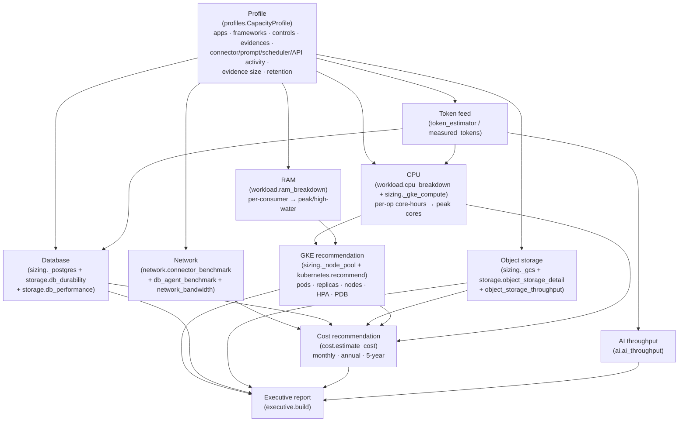

# ECS Benchmark — Engineering Traceability

End-to-end traceability of how a scenario **profile** flows through the estimators
to the final **GKE + cost** recommendation. Every arrow maps to a function so any
output number can be traced back to its inputs and constants.

## Data flow

## Stage → module → constants map

| Stage | Function | Constants | Output key in `estimate_capacity()` |
|-------|----------|-----------|-------------------------------------|
| Profile | `profiles.get_profile()` | — | `profile` |
| Token feed | `sizing._avg_prompt_tokens()` → `token_estimator.estimate_prompt()` | (config `chars_per_token`) | `token_feed` |
| CPU (coarse) | `sizing._gke_compute()` | `SizingConstants` | `gke_compute` |
| CPU (detailed) | `workload.cpu_breakdown()` | `WorkloadConstants` | `cpu_breakdown` |
| RAM | `workload.ram_breakdown()` | `WorkloadConstants` | `ram_breakdown` |
| Object storage | `sizing._gcs()`, `storage.object_storage_detail()`, `object_storage_throughput()` | `SizingConstants`, `ObjectStorageConstants`, `ThroughputConstants` | `gcs_object_storage`, `object_storage_detail` |
| Database | `sizing._postgres()`, `storage.db_durability()`, `db_performance()` | `SizingConstants`, `DbDurabilityConstants` | `postgres_pgvector`, `db_durability` |
| Network | `network.connector_benchmark()`, `db_agent_benchmark()`, `network_bandwidth()` | `NetworkConstants`, `_CONNECTOR_PROFILE` | `connector_benchmark`, `db_agent_benchmark`, `network` |
| AI throughput | `ai.ai_throughput()` | `AiThroughputConstants` | `ai_throughput` |
| GKE recommendation | `sizing._node_pool()`, `kubernetes.recommend()` | `SizingConstants` | `node_pool`, `kubernetes` |
| Cost | `cost.estimate_cost()` | `CostRates` | `cost` |
| Executive | `executive.build()` | (aggregates all above) | (report) |
| Telemetry (observed) | `telemetry.RuntimeTelemetry` | — | (feeds calibration) |
| Calibration | `calibration.calibrate()` | compares observed ↔ estimate | (recommended constants) |
| Stress | `stress.run_scenario()` | multipliers | (impact/bottleneck/mitigation) |

## Worked trace (example)

For `enterprise` (100 apps):
1. **Profile** → 100 apps, 120 controls/app, 150 evidences/app, 120,000 API req/day, 1,200 connector + 1,500 prompt + 800 scheduler /day.
2. **Token feed** → representative prompt via `token_estimator` (or `measured_tokens`).
3. **CPU** → Σ(activity × per-op CPU-ms) → peak cores → **replicas**.
4. **RAM** → per-consumer peak → pod memory + eviction risk.
5. **DB** → rows × bytes × (1+index) + vectors → year-1/5 GiB → **Cloud SQL tier**.
6. **Storage** → evidences × size × versions × retention → **GCS GiB**.
7. **Network** → per-connector payloads (cross-cloud flagged) → egress.
8. **GKE** → pods/replicas/nodes + HPA/PDB (`kubernetes.recommend`).
9. **Cost** → all of the above × `CostRates` → monthly/annual/5-year.
10. **Executive** → headline sizing + top-5 + phase-wise.

Change any input (profile field or constant) and the entire chain re-derives —
see [`CALIBRATION_GUIDE.md`](CALIBRATION_GUIDE.md) to feed real observations back in.

## Related
- [`INFRASTRUCTURE_BENCHMARK_GUIDE.md`](INFRASTRUCTURE_BENCHMARK_GUIDE.md) · [`BENCHMARK_ASSUMPTIONS_AND_LIMITATIONS.md`](BENCHMARK_ASSUMPTIONS_AND_LIMITATIONS.md) · [`ADVANCED_INFRASTRUCTURE_BENCHMARK_GUIDE.md`](ADVANCED_INFRASTRUCTURE_BENCHMARK_GUIDE.md)
