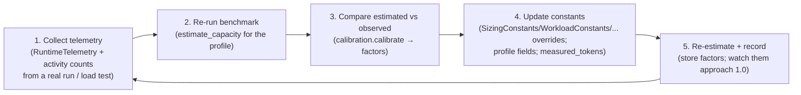

# ECS Benchmark Calibration Guide

`benchmarks/capacity/calibration.py` compares **observed** telemetry (from a real
run) to the model **estimate** and recommends adjusted constants — **without**
changing anything automatically.

## Input (observed JSON; any subset)
```json
{
  "observed_cpu_cores": 1.2,
  "observed_ram_mib": 900,
  "observed_runtime_s": 4.5,
  "observed_files_uploaded": 320,
  "observed_evidence_size_kb": 300,
  "observed_prompt_tokens": 1800,
  "observed_connector_count": 19,
  "observed_db_query_count": 900
}
```
Capture these with [`RuntimeTelemetry`](RUNTIME_TELEMETRY_GUIDE.md) + your run's
activity counts.

## Output (per metric)
- `old_estimate`, `observed`, `calibration_factor` (observed ÷ estimate)
- `constant` + `current_constant` + `recommended_new_constant`
- `confidence` (medium / low / very_low — single-sample capped at medium)
- `notes` + an `overall_calibration_factor`

## CLI
```bash
python scripts/benchmark_capacity.py --calibrate reports/sample_observed.json --profile phase1
```
Prints the calibration report JSON. Nothing is written or applied.

## Applying (explicit, manual)
```python
from benchmarks.capacity import SizingConstants, estimate_capacity, get_profile
c = SizingConstants.from_overrides({"cpu_ms_per_api_request": 1371.4})  # from the report
est = estimate_capacity(get_profile("phase1"), constants=c,
                        measured_tokens={"avg_total_tokens": 1800})
```

## Guidance
- **Average several runs** before applying — one observation is indicative only.
- Large factors usually mean a workload-mix mismatch (investigate before trusting).
- Update profile fields (e.g. `avg_evidence_size_kb`) and pass `measured_tokens`
  for the most accurate calibration.

## Improving accuracy over time (closed loop)

Calibration is a **repeatable loop**, not a one-off. Each cycle tightens the
estimate toward observed reality:



### 1. Collect telemetry
Wrap the real workload with [`RuntimeTelemetry`](RUNTIME_TELEMETRY_GUIDE.md) and
record the run's activity counts (files uploaded, DB queries, connector count).
For tokens, run `scripts/run_audit_llm_benchmark.py --mode live` and capture
`avg_input/output/total_tokens`. For DB, pull `pg_total_relation_size`,
`pg_stat_wal`. For storage, pull bucket stats; for network, VPC flow logs.

### 2. Re-run the benchmark
`estimate_capacity(get_profile(<profile>))` (or pass current overrides) to get the
model's current estimate for the same profile you measured.

### 3. Compare estimated vs observed
`calibration.calibrate(profile, observed, estimate)` returns, per metric, the
`calibration_factor = observed ÷ estimate`. A factor near **1.0** means the model
matches reality; far from 1.0 means the constant needs adjustment (or the
workload differs from the profile).

### 4. Update constants (explicitly)
Apply the `recommended_new_constant` values via `from_overrides(...)` — never
automatically. Update profile fields (e.g. `avg_evidence_size_kb`) and pass
`measured_tokens`. Keep the overrides in version control (e.g. a small
`calibration_overrides.json`) so the calibrated model is reproducible.

### 5. Track convergence
Record the `overall_calibration_factor` each cycle. As you average more runs and
apply overrides, factors should trend toward 1.0 and confidence rises from
`very_low`/`low` to `medium`+. **Average several runs** before trusting a factor —
one observation is indicative only.

### Confidence & cadence
- Re-calibrate after major workload/model changes, and at least once per
  environment (UAT, then production).
- The model is honest about provenance: outputs stay tagged `ESTIMATE` until
  calibrated against production telemetry (see
  [`BENCHMARK_ASSUMPTIONS_AND_LIMITATIONS.md`](BENCHMARK_ASSUMPTIONS_AND_LIMITATIONS.md) §4).

## Related
- [`RUNTIME_TELEMETRY_GUIDE.md`](RUNTIME_TELEMETRY_GUIDE.md)
- [`ADVANCED_INFRASTRUCTURE_BENCHMARK_GUIDE.md`](ADVANCED_INFRASTRUCTURE_BENCHMARK_GUIDE.md)
- [`BENCHMARK_ASSUMPTIONS_AND_LIMITATIONS.md`](BENCHMARK_ASSUMPTIONS_AND_LIMITATIONS.md)
- [`BENCHMARK_MATURITY_ASSESSMENT.md`](BENCHMARK_MATURITY_ASSESSMENT.md)
