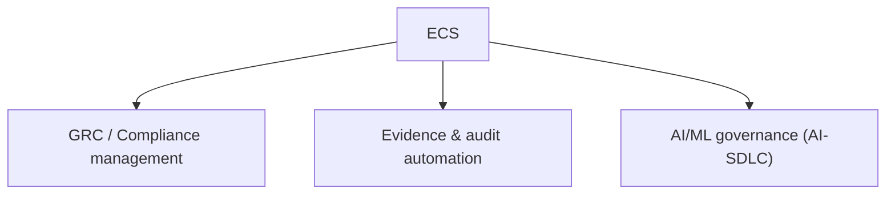

# ECS Executive Technology Dossier

> Executive-ready overview of the ECS (Evidence & Compliance System) platform. All capability claims
> are grounded in the implemented codebase at `/Users/nikhil/Documents/ECS`. Forward-looking items are
> tagged **[ROADMAP]**.

---

## 1. Platform Overview

**ECS is a banking compliance evidence governance platform.** It centralizes how a bank collects,
validates, audits, and reports control evidence across regulatory frameworks and its application
portfolio — and extends that governance to AI/ML systems through a dedicated AI-SDLC governance suite.

**What it does today (implemented):**

- **Evidence lifecycle management** — upload, version, submit, review, approve/reject, request re-upload,
  and close observations, with a full owner↔auditor workflow (`evidence_workflow_engine.py`).
- **Framework assessment** across **15+ standards** including PCI DSS, RBI Cyber Security, DPSC, CSITE,
  ITPP, ITDRM, SOC2, ISO 27001, VAPT, AppSec, and OS/DB/Nginx baselining
  (`modules/frameworks/engines/framework_catalog.py`).
- **AI-SDLC governance** — stage gates from Requirements → Design → Development → Testing → Go-Live,
  plus evidence collection, findings & remediation, and an AI control tower
  (`modules/ai_sdlc/`).
- **Enterprise GRC** — risk register, exceptions/technical-debt, regulatory mapping, heatmaps, and
  governance analytics (`modules/enterprise_grc/`).
- **Executive analytics** — role-based dashboards, enterprise & Pan-India compliance posture, trends,
  and a quantified ROI center (`modules/executive_overview/`, `app/roi/`).
- **Reporting & audit packaging** — a 30-report catalog with PDF/Excel/CSV export and audit-package
  generation (`reporting_module.py`, `/audit/package/*`).
- **Universal drill-down explainability** — every KPI, chart, row, heatmap cell, and workflow metric
  drills into the underlying records with a metric trace (`drilldown_engine.py`).

**Technology:** FastAPI (Python 3.12), server-rendered Jinja2 UI, Azure AD / OIDC authentication, with
an optional PostgreSQL + pgvector + MinIO + Redis + LLM-RAG infrastructure tier.

---

## 2. Strategic Positioning

ECS sits at the intersection of three normally-separate tool categories, unified for banking:

- **Domain-native:** the framework catalog and application portfolio are pre-modeled for **Indian
  banking** (RBI Cyber Security, CSITE, ITPP, Pan-India regional posture) rather than generic GRC.
- **Evidence-first:** unlike checklist GRC tools, ECS treats **evidence** as a first-class, versioned,
  lifecycle-managed artifact with auditor workflow and observation closure.
- **AI-governance-ready:** a built-in AI-SDLC governance suite positions ECS ahead of traditional GRC
  platforms as banks adopt AI under emerging regulatory scrutiny.

---

## 3. Competitive Differentiation

| Differentiator | Evidence in ECS |
|---|---|
| **Unified drilldown explainability** | Single `{rows, columns, sections, metric_trace}` contract across all KPIs/charts/workflows with guaranteed non-empty fallback (`drilldown_engine.py`) |
| **Banking framework depth** | 15+ frameworks incl. RBI/CSITE/ITPP/DPSC pre-modeled (`framework_catalog.py`) |
| **Native AI-SDLC governance** | Stage gates + AI application registry + control tower (`modules/ai_sdlc/`) |
| **Persona-tailored experience** | Role→KPIs→tabs→data-scope wiring for 12+ personas (`demo_metrics.py`, `persona_display.py`, `role_filter_scope.py`) |
| **Quantified ROI** | Dedicated ROI engine: hours/cost saved, FTE-equivalent, payback, waterfall (`app/roi/models.py`) |
| **Connector breadth** | Linux, PostgreSQL, SonarQube, Trivy, Gitleaks connectors + SaaS/Graph scaffolding (`modules/operations/engines/`) |
| **Demo-grade reliability** | Self-seeding, self-healing deterministic state for zero-dependency demos (`demo_seed.py`, `self_heal_governance`) |

---

## 4. Governance Capabilities

- **Evidence governance:** quality scoring (completeness, freshness, metadata quality, control match),
  health scoring, expiry tracking, resubmission handling, and audit trails
  (`evidence_approval_engine.py`, `evidence_health_engine.py`).
- **Framework governance:** control-to-evidence mapping, control validation, per-framework dashboards,
  and onboarding/loading of new frameworks (`control_validation_engine.py`,
  `framework_onboarding_engine.py`).
- **Workflow governance:** explicit state machine (Draft → Submitted → Under Review →
  Approved/Rejected/Re-upload → Closed) with owner/auditor segregation
  (`evidence_workflow_engine.py`, `workflow_module.py`).
- **Audit governance:** audit scheduling, readiness scoring, blockers, and audit-package export
  (`audit_schedule_engine.py`, `/audit/package/*`).

---

## 5. AI Governance Capabilities

- **AI-SDLC stage gates:** Requirements, Design, Development, Testing, Go-Live governance with required
  artifacts per stage (`ai_sdlc_workflow_engine.py`).
- **AI application registry:** model, use case, risk tier, compliance score, hallucination counts,
  unsafe-blocked counts, token usage, last review (`ai_sdlc_governance_mock.py` `AI_APPLICATIONS`).
- **AI control tower:** consolidated posture, readiness and framework drills
  (`ai_sdlc_control_tower_engine.py`).
- **AI-relevant frameworks:** AI Governance Controls alongside VAPT, DPSC, baselining, CSITE
  (`SUPPORTED_FRAMEWORKS`).
- **Governance quality / self-heal:** governance QA scanning and remediation
  (`ecs_governance_qa_engine.py`).

---

## 6. Operational Governance Capabilities

- **Evidence collection scheduler** with run/retry/pause/resume and scheduling intelligence
  (`scheduler_module.py`, `scheduler_intelligence.py`).
- **Connector/integration health** with sync triggers and health dashboards
  (`integration_health_engine.py`, `/api/platform/health`).
- **Bulk upload & onboarding** for applications and frameworks (`onboarding_engine.py`,
  `framework_loader_service.py`).
- **Predefined query library** producing evidence and audit outputs (`predefined_queries_engine.py`).
- **AI ops assistant** and **LLM-RAG governance assistant** for operational Q&A
  (`ai_ops_assistant_engine.py`, `ecs_platform/rag.py`).

---

## 7. Risk Reduction Capabilities

- **Continuous evidence freshness/expiry tracking** reduces audit-time scramble
  (`evidence_health_engine.py`).
- **Observation closure tied to approval** ensures findings are demonstrably remediated
  (`close_observations_for_control`).
- **Risk register with inherent/residual risk, aging, and control linkage**
  (`grc_module_demo._generate_risk_rows`).
- **Pan-India posture visibility** surfaces regional gaps (`PAN_INDIA_REGIONS`).
- **Quantified ROI / risk-reduction %** for investment justification (`app/roi/models.py`).
- **Cross-browser/cache hardening** ensures executives see correct, current data (no stale-UI defects).

---

## 8. Future Roadmap **[ROADMAP]**

Derived from the current-state gaps documented in the Enterprise Architecture Review:

1. **Durable system of record** — externalize in-process `ecs_state` to the existing PostgreSQL/Redis
   tier for persistence, multi-replica scaling, and tamper-evident audit trails.
2. **End-to-end RBAC enforcement** — fully wire canonical roles and segregation of duties.
3. **Immutable audit logging & evidence retention** — leverage `EvidenceVersion.hash` + object-store
   versioning for regulatory retention.
4. **Cloud-native HA/DR** — multi-AZ stateless replicas, managed PostgreSQL/Redis, secret manager
   (see `docs/02-architecture/architecture/ecs_deployment_architecture.md`).
5. **Live connector rollout** — graduate Linux/SonarQube/Trivy/Gitleaks/SaaS connectors from demo to
   production evidence ingestion.
6. **Supply-chain hardening** — pin/hash dependencies, add CI security gates.

**Executive takeaway:** ECS already delivers a **broad, banking-specific compliance and AI-governance
feature set** with strong explainability and persona tailoring. The next investment phase is
**infrastructure maturation** (durable storage, enforced RBAC, HA/DR) to convert a demo-ready platform
into a regulated-production system of record.
