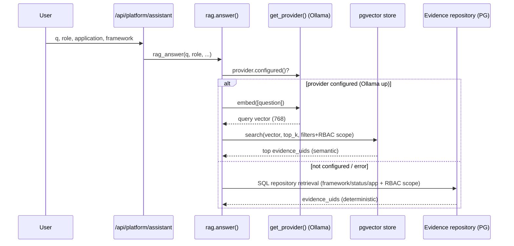
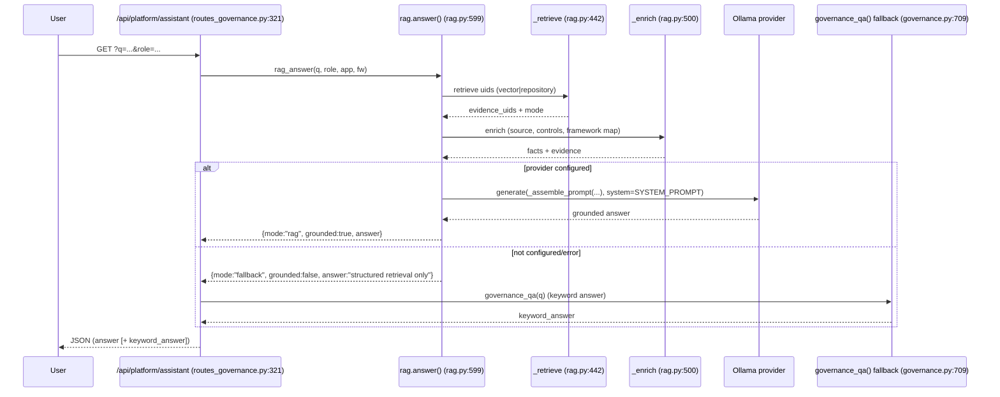
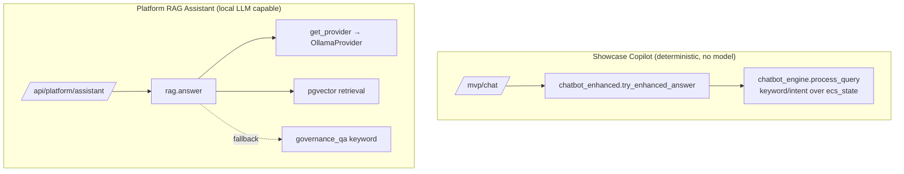
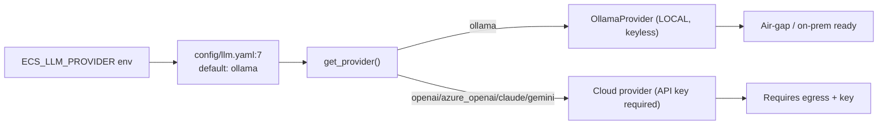

# ECS Local LLM Developer Guide (Phase 1 — Current Architecture)

**Release tag:** `ecs-local-llm-readiness-enterprise-v1`
**Scope:** Documentation only. No production code modified. All claims are file:line grounded.

This guide documents how ECS's AI stack actually works today and how it runs on **local LLMs (Ollama)**.

---

## 1. Provider abstraction (current)

`ecs_platform/llm_engine/provider.py` defines an abstract `LLMProvider` with `generate()` + `embed()`,
and five concrete providers selected by config. The default is **local Ollama (keyless)**.

```30:50:ecs_platform/llm_engine/provider.py
class LLMProvider(ABC):
    ...
    def configured(self) -> bool:
        return bool(self.api_key())
    @abstractmethod
    def generate(self, prompt: str, *, system: str = "") -> str: ...
    @abstractmethod
    def embed(self, texts: list[str]) -> list[list[float]]: ...
```

```230:242:ecs_platform/llm_engine/provider.py
_PROVIDERS = {
    "gemini": GeminiProvider, "openai": OpenAIProvider,
    "azure_openai": AzureOpenAIProvider, "claude": ClaudeProvider,
    "ollama": OllamaProvider,
}
def get_provider(config=None):
    cfg = (config or load_llm_config()).get("llm", {})
    name = cfg.get("provider", "gemini")    # YAML default = ollama
```

| Provider | Class | Local? | Lines |
|---|---|---|---|
| Ollama (default) | `OllamaProvider` | **Yes (keyless)** | `provider.py:157-227` |
| OpenAI | `OpenAIProvider` | No | `provider.py:96-119` |
| Azure OpenAI | `AzureOpenAIProvider` | Private | `provider.py:122-134` |
| Anthropic | `ClaudeProvider` | No | `provider.py:137-154` |
| Gemini | `GeminiProvider` | No | `provider.py:63-93` |

> Inference uses stdlib `urllib.request` (no SDKs). Providers are **credential-optional** — importing
> the module never requires keys, so air-gapped startup never breaks (`provider.py:1-6`).

## 2. Ollama integration

`OllamaProvider` calls the local Ollama REST API: `POST /api/chat` (generation) and
`POST /api/embeddings` (embeddings). It is keyless and keeps models warm via `keep_alive`.

```179:206:ecs_platform/llm_engine/provider.py
    def generate(self, prompt: str, *, system: str = "") -> str:
        ...
        data = self._post_json(f"{self._base()}/api/chat", payload, {})
        content = (data.get("message", {}) or {}).get("content", "")
        ...
        return _strip_think(content)

    def embed(self, texts: list[str]) -> list[list[float]]:
        model = self.embedding_model or self.model
        ...
        data = self._post_json(f"{self._base()}/api/embeddings",
                               {"model": model, "prompt": text, ...}, {})
```

Reasoning-model output (`<think>…</think>` from qwen3/deepseek-r1) is stripped (`provider.py:18-23`).
A `warm()` method preloads chat + embedding models (`provider.py:208-227`).

## 3. Supported models (served via Ollama — model is a config value)

| Model | `ECS_LLM_MODEL` | Notes |
|---|---|---|
| Qwen3 8B (default) | `qwen3:8b` | `config/llm.yaml:8`; `<think>` stripped |
| Llama 3 8B | `llama3` / `llama3:8b` | config only |
| Mistral 7B | `mistral` | config only |
| Phi-3 | `phi3` | config only |
| Gemma 2 | `gemma2:9b` | config only |
| DeepSeek-R1 | `deepseek-r1` | reasoning stripped |

> No code change is needed to switch model — only `ECS_LLM_MODEL`. Qwen/Llama/Mistral/Phi/Gemma/
> DeepSeek are all **Ollama-served models**, not separate providers.

## 4. Embedding models & pgvector

- Default embedding model: **`nomic-embed-text`** (768-dim) — `config/llm.yaml:9`.
- Vector store: **pgvector** (Postgres), table `evidence_embeddings`, cosine `<=>` search.

```97:101:ecs_platform/vectorstore/pgvector_store.py
        sql = (
            f"SELECT chunk_id, evidence_uid, text, metadata, "
            f"1 - (embedding <=> %s::vector) AS score "
            f"FROM {self._table} {filter_clause} "
            f"ORDER BY embedding <=> %s::vector LIMIT %s"
```

`ECS_VECTOR_DIM` (default 768) **must match** the embedding model's dimension (`config/vectorstore.yaml:5`).

## 5. Vector search flow



Source: `ecs_platform/rag.py:442-497` (vector then repository fallback, RBAC-scoped).

## 6. RAG flow (end-to-end)



Source: `ecs_platform/rag.py:599-653`; assistant route `app/routes_governance.py:321-332`; fallback
`ecs_platform/governance.py:709-743`.

## 7. AI Copilot architecture (two stacks)



- Showcase Copilot: `modules/shared/services/chatbot_engine.py:683-707`, `chatbot_enhanced.py:102-113`
  — **no model call**, pure keyword routing over in-memory state.
- Platform RAG Assistant: `ecs_platform/rag.py` — **uses the local provider** (Ollama) when configured,
  deterministic fallback otherwise.

## 8. Local vs Cloud provider selection



| Selector | Default | Source |
|---|---|---|
| `ECS_LLM_PROVIDER` | `ollama` | `config/llm.yaml:7` |
| `ECS_LLM_MODEL` | `qwen3:8b` | `config/llm.yaml:8` |
| `ECS_EMBEDDING_MODEL` | `nomic-embed-text` | `config/llm.yaml:9` |
| `OLLAMA_URL` | `http://host.docker.internal:11434` | `config/llm.yaml:20` |
| `ECS_VECTOR_DIM` | `768` | `config/vectorstore.yaml:5` |

> **Developer note:** the in-code fallback in `get_provider` is `"gemini"` (`provider.py:241`) but the
> YAML default is `ollama`. With config present, ECS runs local. (Recommend aligning the code default
> to `ollama`; see migration plan.)

## 9. Status / health endpoints (for local validation)

| Endpoint | Purpose | Source |
|---|---|---|
| `GET /api/platform/rag/status` | RAG configured + index status | `routes_governance.py:334-337` |
| `GET /api/platform/rag/llm` | Generic LLM connectivity | `:344-347` |
| `GET /api/platform/rag/gemini` | Gemini connectivity (cloud) | `:339-342` |
| `POST /api/platform/rag/warm` | Warm Ollama models (admin) | `:349-357` |
| `POST /api/platform/rag/reindex` | Rebuild pgvector index (admin) | `:359-367` |
| `GET /api/platform/assistant?q=...` | Ask the RAG assistant | `:321-332` |

## 10. Developer quick reference (run ECS on local LLM)

```bash
export ECS_LLM_PROVIDER=ollama
export ECS_LLM_MODEL=qwen3:8b
export ECS_EMBEDDING_MODEL=nomic-embed-text
export OLLAMA_URL=http://localhost:11434
export ECS_VECTOR_DIM=768
# Ollama + pgvector must be running (see Deployment Guide).
```

Then: `GET /api/platform/rag/status` → expect configured; `GET /api/platform/assistant?q=...` → expect
`"mode":"rag","grounded":true`. See the Testing Guide for full validation.

## 11. Prompt testing & benchmarking

This guide covers the **provider/RAG** stack. For testing the **audit prompts**
themselves — execution, benchmark datasets, replay, comparison, grounding /
hallucination checks, and the latency/token metrics they produce (the
`/api/audit-llm/*` surface + `/mvp/audit/llm-workbench`) — see the
[Prompt Testing Guide](../testing/PROMPT_TESTING_GUIDE.md). RAM-profile benchmark
planning (16 GB / 20 GB) is in
[`docs/benchmarks/audit_llm_16gb_20gb_testing_guide.md`](../benchmarks/audit_llm_16gb_20gb_testing_guide.md).
