# ECS Workflow Orchestration Guide

**Type:** Enterprise / auditor / architecture-grade documentation. No code modified.
**Date:** 2026-06-17
**Grounding:** `modules/shared/services/evidence_workflow_engine.py`,
`modules/frameworks/engines/framework_workflow_engine.py`, `config/rbac.yaml`,
`modules/shared/services/audit_trail.py`, `app/audit/workflow.py`,
`modules/operations/engines/*` (predefined queries). Workflows not fully
implemented in code are labelled **"Inferred Enterprise Workflow."**

**Navigation:** [Role Action Matrix](ECS_ROLE_ACTION_MATRIX.md) ·
[State Transition Matrix](ECS_STATE_TRANSITION_MATRIX.md) ·
[SLA & Escalation Matrix](ECS_SLA_ESCALATION_MATRIX.md) ·
[Notification Matrix](ECS_NOTIFICATION_MATRIX.md) ·
[Business Process Model](ECS_BUSINESS_PROCESS_MODEL.md) ·
[Sequence Diagrams](ECS_SEQUENCE_DIAGRAMS.md) ·
[Predefined Query Execution Workflow](../operations/ECS_PREDEFINED_QUERY_EXECUTION_WORKFLOW.md) ·
[Predefined Query Execution Guide](../operations/ECS_PREDEFINED_QUERY_EXECUTION_GUIDE.md) ·
[Control & Evidence Reuse](../evidence-management/ECS_CONTROL_AND_EVIDENCE_REUSE_GUIDE.md) ·
[Framework Reference](../product/ECS_FRAMEWORK_REFERENCE.md)

---

## Canonical workflow vocabulary (grounded)

ECS state labels come directly from `evidence_workflow_engine.OWNER_STATES` /
`AUDITOR_STATES` and the `ecs_state` registries:

- Owner states: `Draft → Uploaded → Pending App Owner Approval → Pending Auditor
  Approval → Needs Rework → Rejected → Closed`.
- Auditor states: `Pending Auditor Approval → Closed | Rejected By Auditor |
  Needs Rework | Escalated | Exception Raised`.
- Action→status map (`record_transition` / `_action_to_status`): `submitted →
  Pending Auditor Approval`, `approved → Closed`, `rejected → Rejected By
  Auditor`, `reupload → Needs Rework`, `owner_approved → Pending Auditor
  Approval`, `owner_rejected → Rejected By App Owner`.
- Capability gates (`config/rbac.yaml` `rbac_legacy_compat.capabilities`):
  `can_upload_evidence`, `can_submit_to_auditor`, `can_review_evidence`,
  `can_request_reupload`, `can_escalate`, `can_raise_exception`,
  `can_assign_owner`, `can_export_reports`, `can_manage_frameworks`.

Every audited mutation is logged via `audit_trail.log_event` and (flag-gated)
`app/audit/workflow.audit_workflow_action`.

---

## 1. End-to-end ECS business workflow

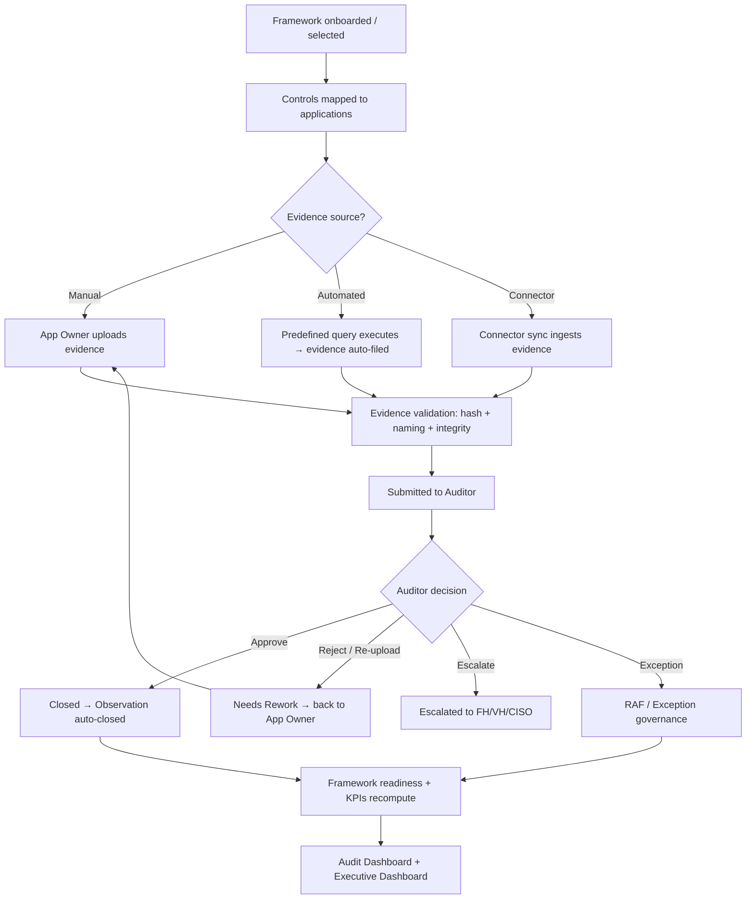

## 2. Evidence submission workflow

`App Owner → Upload → Validation → Auditor Review → Approval/Rejection`
(grounded in `register_upload`, `resolve_state`, `record_transition`,
`close_observations_for_control`).

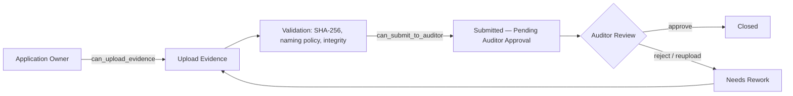

Swimlane:

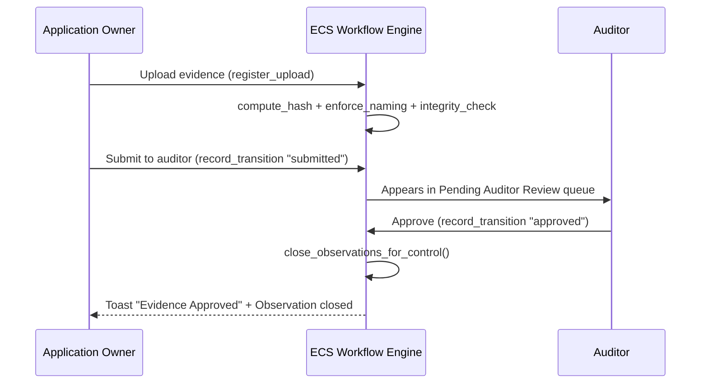

## 3. Evidence rejection workflow

`Submit → Auditor Reject → Comments → Resubmission → Re-review`
(grounded: `rejected_controls`, `clarification_controls` `reupload_requested`,
`toast_payload("reupload")`).

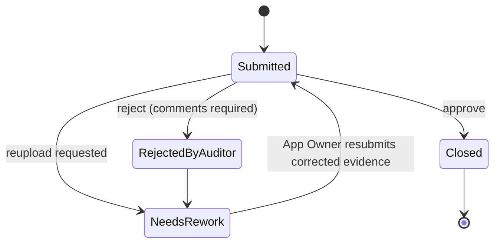

Auditor comments are persisted on the transition (`detail`/`comments` in
`record_transition`) and surfaced in the approval trail.

## 4. Function Head approval workflow — **Inferred Enterprise Workflow**

`functional_head` is read/analytics/export scoped to its function
(`role_scope: function`). The approval gate is an enterprise overlay:

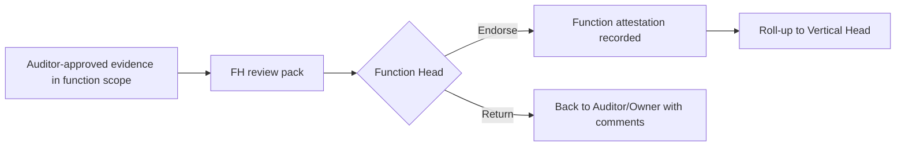
*Inferred:* code grants FH read/export + escalation; sign-off is a governance
attestation (recommended Phase 2 enforcement).

## 5. Vertical Head approval workflow — **Inferred Enterprise Workflow**

`vertical_head` (`role_scope: vertical`) aggregates across owned vertical.

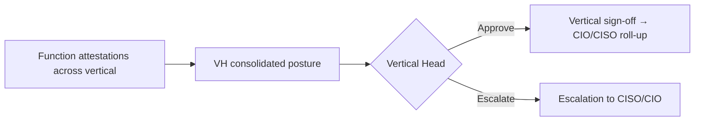

## 6. CIO approval workflow — **Inferred Enterprise Workflow**

`cio` has enterprise scope + `exception.approve` (`rbac_catalog`).

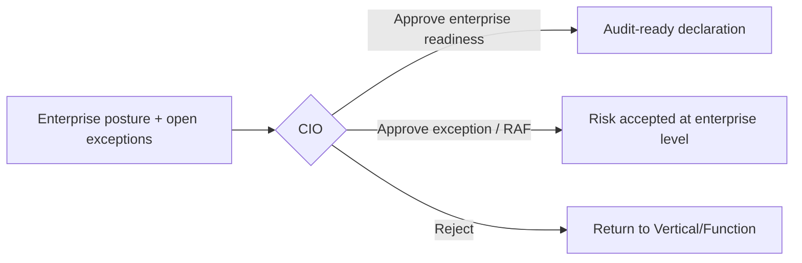

## 7. CISO approval workflow — **Inferred Enterprise Workflow**

CISO maps to `security_officer` (security scope) with governance escalation
authority. Approves security exceptions, compensating controls, and risk
acceptance for security findings.

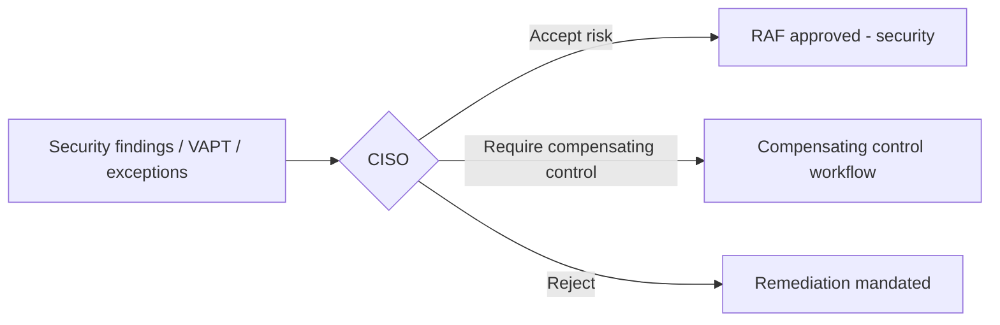

## 8. Risk acceptance workflow (RAF)

`Observation → RAF Raised → ISG Review → Approval → Expiry → Monitoring`
(grounded: `exception.raise`/`exception.approve`, `can_raise_exception`,
`active_exceptions`, `Exception Raised` auditor state; RAF naming is **Inferred
Enterprise Workflow** = exception governance).

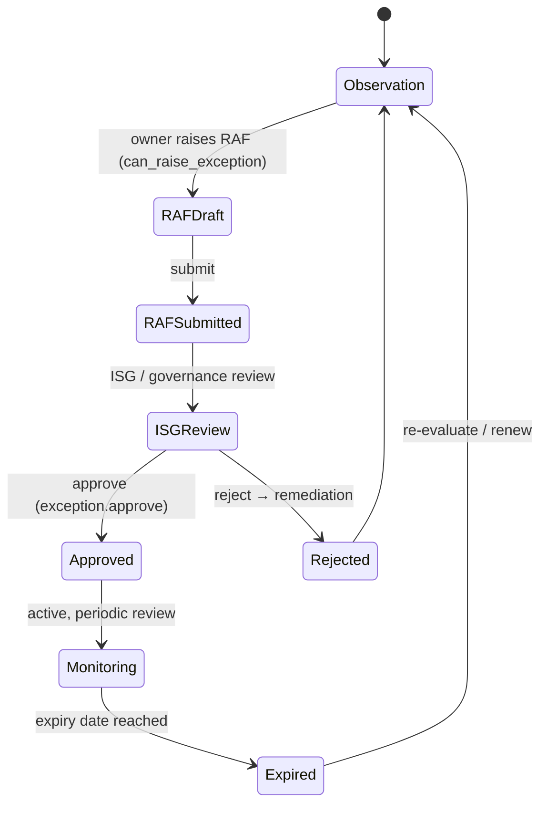

## 9. Observation closure workflow

Grounded in `close_observations_for_control` (auto-close on approval) and
`can_close_observation`.

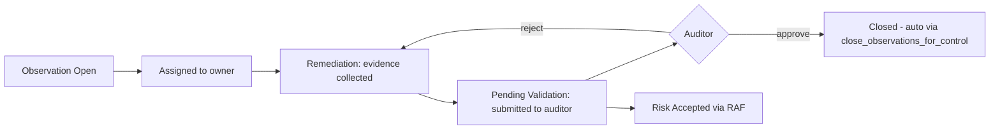

## 10. Framework assessment workflow

Grounded in `framework_workflow_engine._framework_metrics` (readiness =
0.45×implementation + 0.35×evidence + 0.20×risk component).

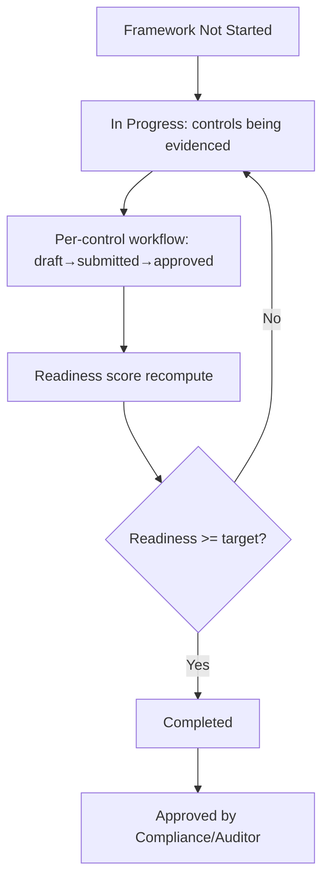

## 11. Control assessment workflow

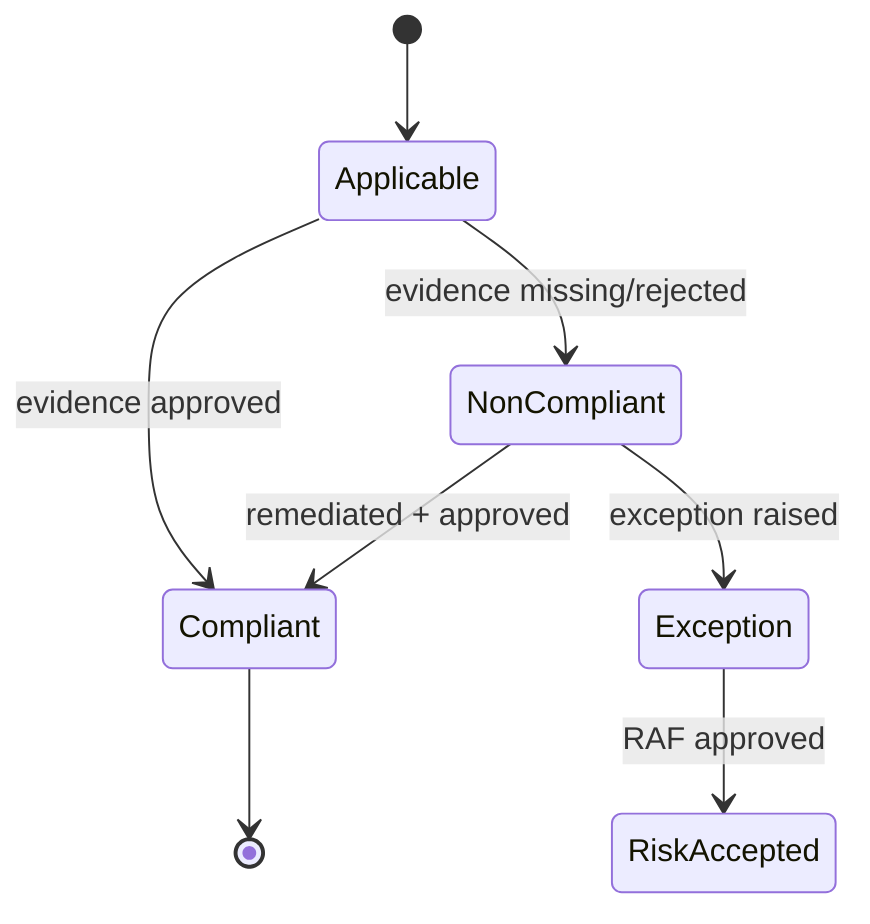

## 12. Evidence reuse workflow

Grounded in `evidence_repository._link_reuse` / `get_reuse_graph`.

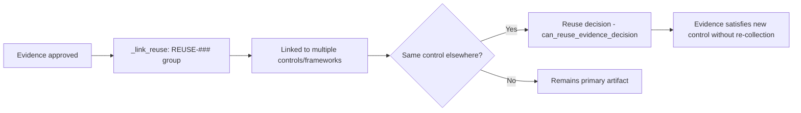

## 13. Control reuse workflow

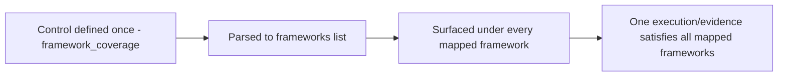
See [Control & Evidence Reuse Guide](../evidence-management/ECS_CONTROL_AND_EVIDENCE_REUSE_GUIDE.md).

## 14. Predefined query execution workflow

Grounded in `predefined_queries_engine`, `connector_common`,
`predefined_query_evidence`, `predefined_query_audit`.

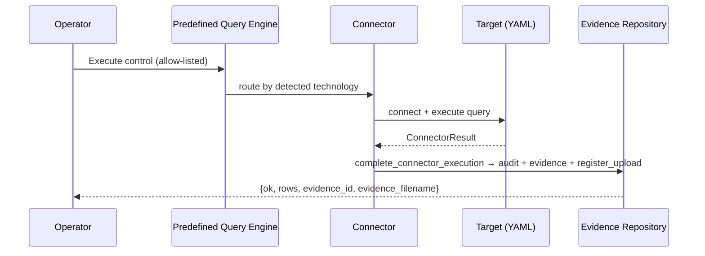
Full detail: [Predefined Query Execution Workflow](../operations/ECS_PREDEFINED_QUERY_EXECUTION_WORKFLOW.md).

## 15. Exception management workflow

Grounded: `exception.raise`/`exception.approve`, `active_exceptions`,
exception drivers in framework metrics.

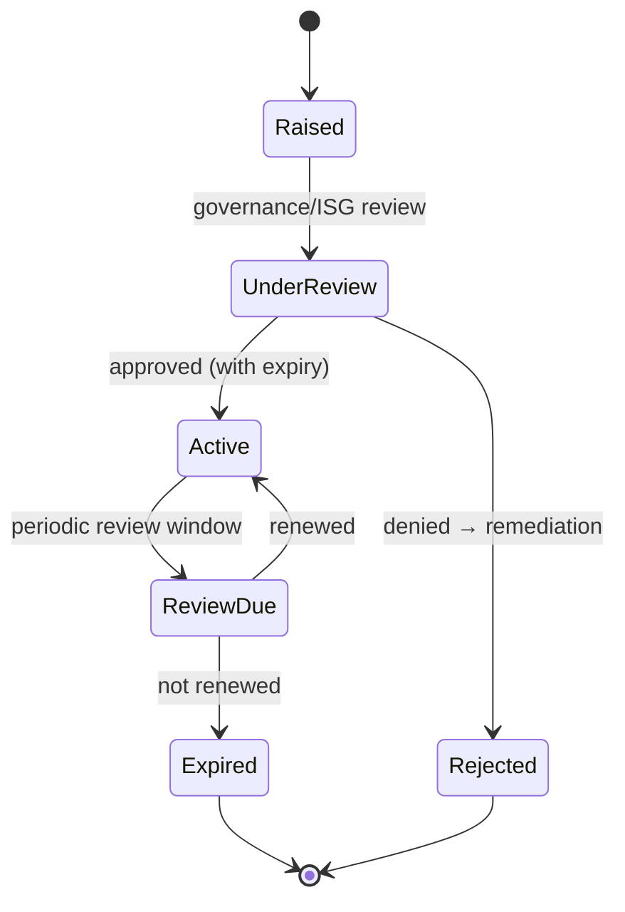

## 16. Compensating control workflow — **Inferred Enterprise Workflow**

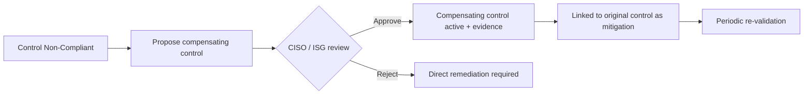

## 17. Audit lifecycle workflow

Grounded: `audit_trail.log_event`, `app/audit/workflow`, audit-prep engines.

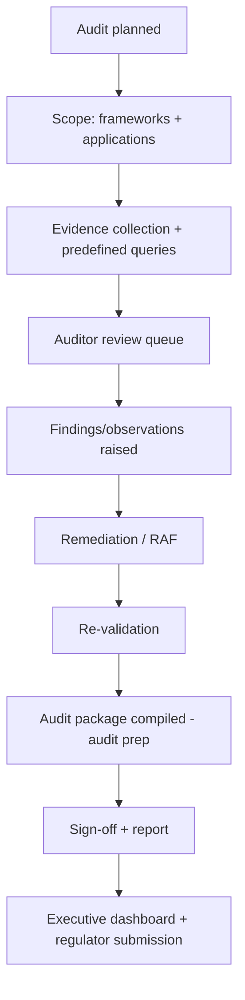

## 18. Regulatory examination workflow — **Inferred Enterprise Workflow**

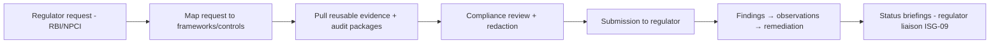

## 19. Internal audit workflow

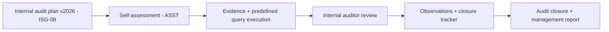

## 20. External audit workflow

```mermaid
flowchart LR
    A[External auditor engaged - KPMG/PCI ASV] --> B[Read-only auditor access - scope enterprise]
    B --> C[Evidence export - export_evidence]
    C --> D[Sampling + testing]
    D --> E[Findings + remediation validation letters]
    E --> F[Attestation / certification]
```

---

## Cross-references
- Roles & permissions per action: [ECS_ROLE_ACTION_MATRIX.md](ECS_ROLE_ACTION_MATRIX.md)
- Valid state transitions: [ECS_STATE_TRANSITION_MATRIX.md](ECS_STATE_TRANSITION_MATRIX.md)
- SLA timers & escalation: [ECS_SLA_ESCALATION_MATRIX.md](ECS_SLA_ESCALATION_MATRIX.md)
- Notifications: [ECS_NOTIFICATION_MATRIX.md](ECS_NOTIFICATION_MATRIX.md)
- BPMN-style model: [ECS_BUSINESS_PROCESS_MODEL.md](ECS_BUSINESS_PROCESS_MODEL.md)
- Sequence diagrams: [ECS_SEQUENCE_DIAGRAMS.md](ECS_SEQUENCE_DIAGRAMS.md)
