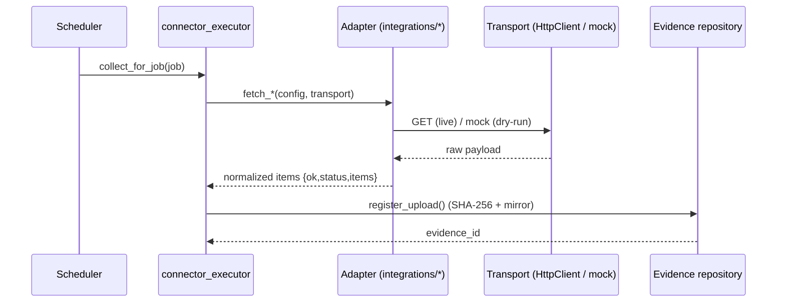

# ECS Low-Level Design

Navigator for the low-level design of ECS core services: per-module components,
APIs/classes, and sequence diagrams. The detailed content already exists in the
files linked below — this page unifies the entry point.

> **Reuse note.** Do not duplicate: module-level LLD lives in [`ecs_lld.md`](ecs_lld.md),
> and the sequence libraries are [`ECS_SEQUENCE_DIAGRAMS.md`](ECS_SEQUENCE_DIAGRAMS.md)
> (10 auditor-grade lifecycle sequences) and [`../diagrams/ecs_sequence_diagrams.md`](../diagrams/ecs_sequence_diagrams.md)
> (route/engine-grounded sequences). APIs: [`../developer-manual/ECS_API_REFERENCE.md`](../developer-manual/ECS_API_REFERENCE.md).

---

## Core services (code map)

| Service | Code | LLD reference |
|---------|------|---------------|
| Evidence repository | `modules/operations/engines/evidence_repository.py`, `ecs_platform/repository/*` | [`ecs_lld.md`](ecs_lld.md), [`ECS_DATA_ARCHITECTURE_REFERENCE.md`](ECS_DATA_ARCHITECTURE_REFERENCE.md) |
| Evidence validation | `modules/audit_intelligence/engines/evidence_validation.py`, `app/evidence_analytics/*` | [`ecs_lld.md`](ecs_lld.md) |
| Evidence reuse / lifecycle | `modules/operations/engines/evidence_reuse_story_engine.py`, `modules/audit_intelligence/services/evidence_reuse_service.py` | [`../evidence-management/evidence_reuse_lifecycle_functional_design.md`](../evidence-management/evidence_reuse_lifecycle_functional_design.md) |
| Observation lifecycle | observation engine + `app/observations/store.py` | [`ECS_SEQUENCE_DIAGRAMS.md`](ECS_SEQUENCE_DIAGRAMS.md) (§ observation) |
| Connector framework | `modules/operations/integrations/*`, `_platform_bridge.py` | [`../connectors/INTEGRATION_ADAPTERS_GUIDE.md`](../connectors/INTEGRATION_ADAPTERS_GUIDE.md) |
| Connector workbench / executor | `modules/audit_intelligence/services/connector_workbench.py`, `connector_executor.py` | [`../connectors/connector_test_workbench_design.md`](../connectors/connector_test_workbench_design.md) |
| Scheduler | `modules/audit_intelligence/services/asset_scheduler.py`, `scheduler_execution.py` | [`../scheduler/runtime_call_graph.md`](../scheduler/runtime_call_graph.md) |
| Predefined queries | `modules/operations/engines/predefined_queries_engine.py` + connectors | [`../developer-manual/PREDEFINED_DATABASE_QUERY_MODULE.md`](../developer-manual/PREDEFINED_DATABASE_QUERY_MODULE.md) |
| RAG / LLM | `ecs_platform/rag.py`, `ecs_platform/llm_engine/*`, `modules/audit_intelligence/llm/*` | [`../ai-sdlc/ECS_AI_ARCHITECTURE_REFERENCE.md`](../ai-sdlc/ECS_AI_ARCHITECTURE_REFERENCE.md) |
| Auth / RBAC / security mode | `app/auth/*`, `app/security_mode.py` | [`../production/ECS_SECURITY_REFERENCE.md`](../production/ECS_SECURITY_REFERENCE.md) |

---

## Representative sequence — connector evidence collection

More sequences (evidence, audit, observation, reuse, predefined query, login,
dashboard): [`ECS_SEQUENCE_DIAGRAMS.md`](ECS_SEQUENCE_DIAGRAMS.md) and
[`../diagrams/ecs_sequence_diagrams.md`](../diagrams/ecs_sequence_diagrams.md).

## See also
- [`HIGH_LEVEL_DESIGN.md`](HIGH_LEVEL_DESIGN.md) · [`SOLUTION_ARCHITECTURE.md`](SOLUTION_ARCHITECTURE.md) · [`ecs_lld.md`](ecs_lld.md) · [`../developer-manual/DEVELOPER_MANUAL.md`](../developer-manual/DEVELOPER_MANUAL.md)
