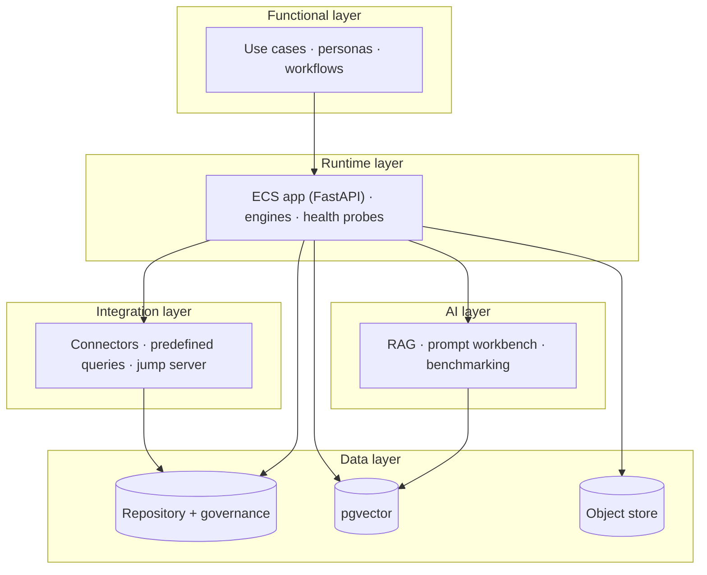

# ECS Solution Architecture

A single entry point that ties the ECS solution together across five layers —
functional, runtime, integration, data, and AI — by linking the authoritative
per-layer documents (which already exist). This is a **navigator**, not a
duplicate.

> **Reuse note.** Each layer below has a detailed source doc. This page exists so
> "solution architecture" resolves to one place; it summarizes and links.

---

## Layer map

| Layer | What it covers | Authoritative doc(s) |
|-------|----------------|----------------------|
| **Functional** | Business capabilities, personas, workflows, use cases | [`ecs_hld.md`](ecs_hld.md), [`ECS_BUSINESS_PROCESS_MODEL.md`](ECS_BUSINESS_PROCESS_MODEL.md), [`../product/ECS_MASTER_USE_CASE_CATALOG.md`](../product/ECS_MASTER_USE_CASE_CATALOG.md) |
| **Runtime** | Process/container model, request path, startup, health | [`ecs_deployment_architecture.md`](ecs_deployment_architecture.md), [`ecs_lld.md`](ecs_lld.md) |
| **Integration** | Connector framework, predefined queries, Graph, jump server | [`../connectors/INTEGRATION_ADAPTERS_GUIDE.md`](../connectors/INTEGRATION_ADAPTERS_GUIDE.md), [`../connectors/ECS_MASTER_INTEGRATION_MATRIX.md`](../connectors/ECS_MASTER_INTEGRATION_MATRIX.md), [`ENTERPRISE_ARCHITECTURE.md`](ENTERPRISE_ARCHITECTURE.md) |
| **Data** | Repository, governance schema, vectors, object store, lineage | [`ECS_DATA_ARCHITECTURE_REFERENCE.md`](ECS_DATA_ARCHITECTURE_REFERENCE.md), [`../diagrams/ecs_er_diagrams.md`](../diagrams/ecs_er_diagrams.md) |
| **AI** | RAG, prompt library/workbench, grounding, benchmarking, model abstraction | [`../ai-sdlc/ECS_AI_ARCHITECTURE_REFERENCE.md`](../ai-sdlc/ECS_AI_ARCHITECTURE_REFERENCE.md), [`../developer-manual/PROMPT_TESTING_GUIDE.md`](../developer-manual/PROMPT_TESTING_GUIDE.md) |

---

## Solution overview

---

## Cross-cutting concerns
- **Security:** [`../production/ECS_SECURITY_REFERENCE.md`](../production/ECS_SECURITY_REFERENCE.md), [`../operations/PROTOTYPE_DEMO_RUN_MODE.md`](../operations/PROTOTYPE_DEMO_RUN_MODE.md)
- **Configuration:** [`../operations/environment-configuration/00_ENVIRONMENT_CONFIGURATION_GUIDE.md`](../operations/environment-configuration/00_ENVIRONMENT_CONFIGURATION_GUIDE.md)
- **Deployment:** [`../deployment/GCP_DEPLOYMENT_GUIDE.md`](../deployment/GCP_DEPLOYMENT_GUIDE.md)
- **Operations:** [`../operations/OPERATIONS_MANUAL.md`](../operations/OPERATIONS_MANUAL.md) · [`../runbooks/README.md`](../runbooks/README.md)

## See also
- [`HIGH_LEVEL_DESIGN.md`](HIGH_LEVEL_DESIGN.md) (C4) · [`LOW_LEVEL_DESIGN.md`](LOW_LEVEL_DESIGN.md) · [`ARCHITECTURE_INDEX.md`](ARCHITECTURE_INDEX.md)
