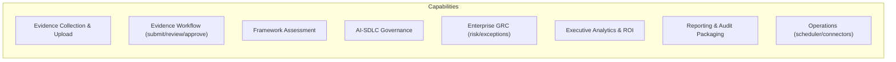
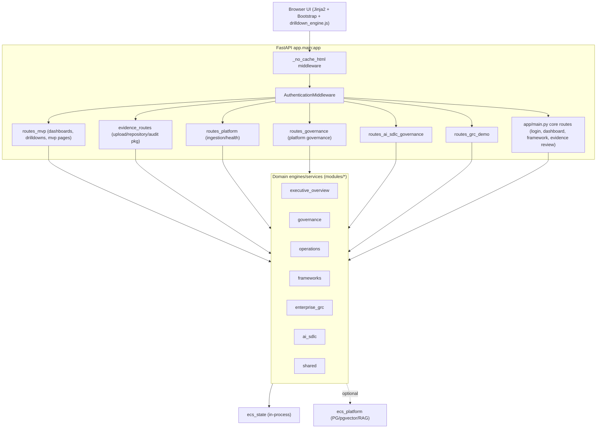
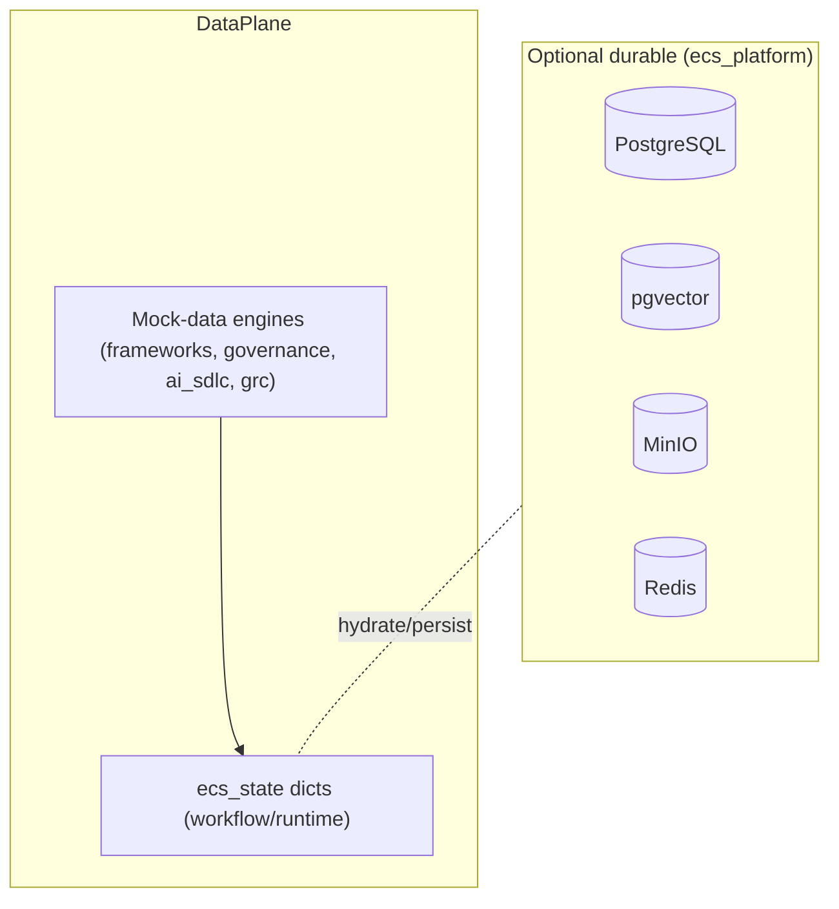
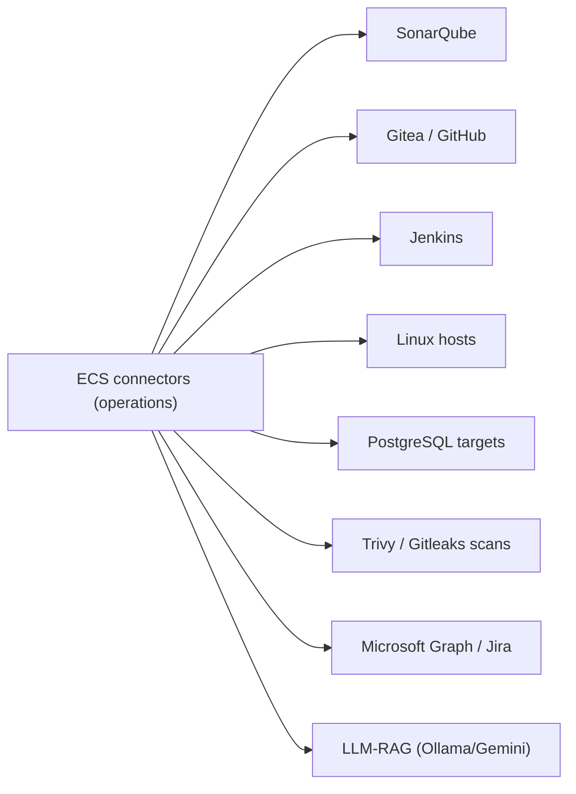
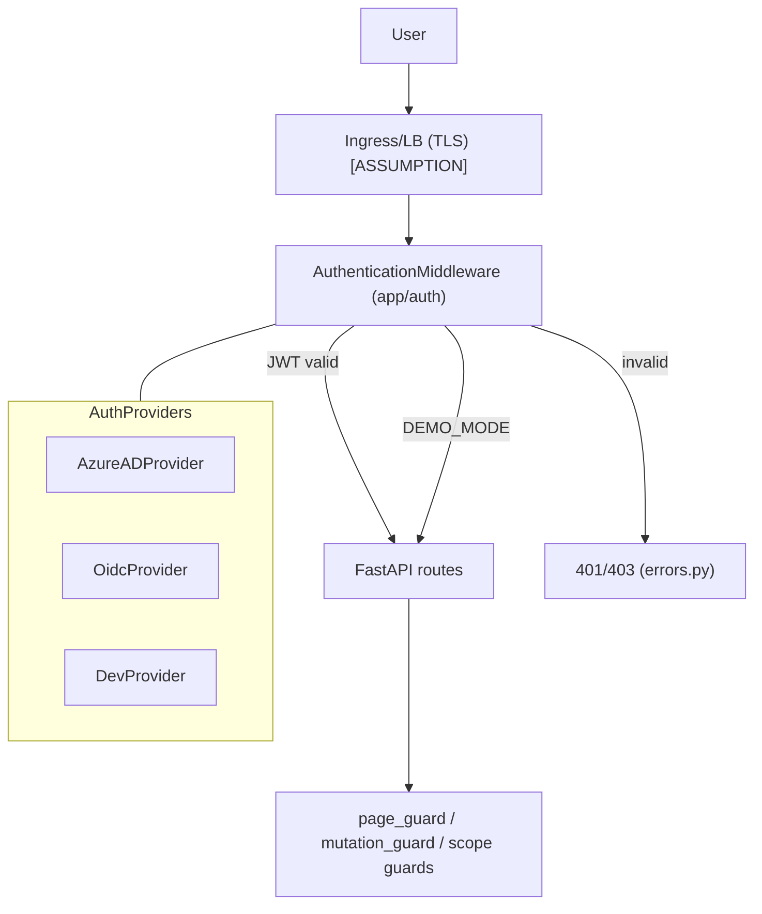
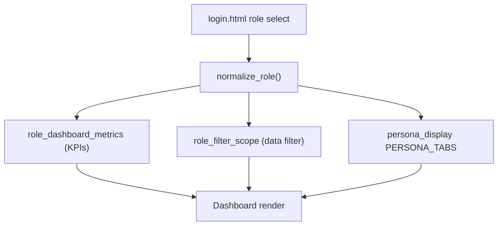
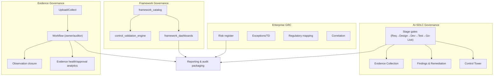

# ECS High-Level Design (HLD)

> Sourced from `/Users/nikhil/Documents/ECS`. **[ASSUMPTION]** / **[RECOMMENDATION]** tags mark
> anything beyond what is in code.

---

## 1. Business Architecture

ECS digitizes **compliance evidence governance for a bank**: collecting, validating, and auditing
control evidence across regulatory frameworks and banking applications, with executive analytics and
AI/SDLC governance.

**Business capabilities (implemented):**

| Capability | Primary module | Entry points |
|---|---|---|
| Evidence collection/upload | operations, shared | `/evidence/upload`, `/mvp/upload`, `/mvp/scheduler` |
| Evidence workflow | shared, governance | `/evidence/review/*`, `/api/evidence-workflow/summary` |
| Framework assessment | frameworks | `/framework/{name}`, `/api/framework/*-drill` |
| AI-SDLC governance | ai_sdlc | `/mvp/ai-sdlc*`, `/api/ai-sdlc/*` |
| Enterprise GRC | enterprise_grc | `/mvp/risk-register`, `/mvp/exceptions`, `/api/grc-demo/*` |
| Executive analytics & ROI | executive_overview | `/dashboard*`, `/mvp/enterprise`, `/mvp/pan-india`, `/mvp/roi` |
| Reporting & audit packaging | executive_overview, governance | `/mvp/reports*`, `/audit/package/*` |
| Operations | operations | `/mvp/integrations`, `/mvp/platform/sync*` |

---

## 2. Application Architecture

Modular monolith; FastAPI app composes domain modules.

**Route registration** (`app/main.py` lines 1477–1494): `register_authentication`,
`register_mvp_routes`, `register_evidence_routes`, `register_platform_routes`,
`register_governance_routes`, `register_ai_sdlc_routes`, `register_grc_demo_routes`.

**Cross-cutting (shared):** `ecs_state`, `evidence_workflow_engine`, universal drilldown
(`drilldown_engine.py` + `drilldowns/ecs_universal_drill_engine.py`), `role_permissions`,
`role_filter_scope`, `persona_display`, `module_capabilities`.

---

## 3. Data Architecture

**Two coexisting planes:**

1. **In-process demo state (default):** `modules/shared/services/ecs_state.py` holds workflow dicts
   (`submitted_controls`, `approved_controls`, `rejected_controls`, `missing_evidence_registry`,
   `closed_observations`, `export_history`, `exception_registry`, etc.), seeded by `demo_seed.py`.
2. **Durable infrastructure (optional):** PostgreSQL (`ecs_demo`, `ecs_repository`), pgvector
   (`ecs_vectors`), MinIO object store, Redis — defined in `docker-compose.yml`, wired through
   `ecs_platform/` (`ingestion.py`, `governance.py`, `vectorstore`, `rag.py`).

**Typed models** live in `app/evidence_intel/models.py` (`EvidenceVersion`, `LineageGraph`,
`SufficiencyAssessment`, `EvidenceStatus`), `app/evidence_analytics/models.py`
(`EvidenceTimeline`, `EvidenceQualityReport`, `DSLQuery`), `app/roi/models.py`,
`app/connectivity/models.py`, `app/auth/` (`AuthenticatedUser`, `RoleDef`).

Entity attributes and relationships: see `docs/diagrams/ecs_er_diagrams.md`.

---

## 4. Integration Architecture

**Evidence-source connectors** (`modules/operations/engines/`): `linux_connector.py`,
`postgresql_connector.py`, `sonarqube_connector.py`, `trivy_connector.py`, `gitleaks_connector.py`,
plus `query_connectors.py` and `integrations_module.py`. Health/sync via `integration_health_engine.py`
and routes `/mvp/platform/sync/{connector}`, `/api/platform/sync/{connector}`, `/api/platform/health`.

**External demo systems** (docker-compose profiles): SonarQube, Gitea, Jenkins, Ubuntu connector host;
SaaS connector env (Jira, GitHub, Microsoft Graph) and LLM/RAG (`OLLAMA_URL`, `ECS_LLM_PROVIDER`).

---

## 5. Security Architecture

- **Providers:** Azure AD, generic OIDC, dev-bypass (`app/auth/providers.py`); RS256 JWT via JWKS
  (`jwt_validator.py`).
- **Config:** `config/auth.yaml` (`auth.enabled` default true; public paths). `config/rbac.yaml`
  holds RBAC catalog + legacy aliases.
- **Authorization:** `page_guard.py`, `mutation_guard.py`, `scope.py`; canonical roles in
  `roles.py` **[note: not fully wired into enforcement]**.
- **Hardening present:** HTML `no-cache` middleware, `_safe_count` input parsing, HTML escaping in JS.

---

## 6. Deployment Architecture (overview)

Container image `python:3.12-slim` runs `uvicorn app.main:app` on port 8000 (`Dockerfile`).
`docker-compose.yml` provides the app plus PostgreSQL×3, pgvector, Redis, MinIO, and optional
connector/source services (SonarQube, Gitea, Jenkins) behind compose profiles.

Detailed current/target/HA/DR deployment: `docs/architecture/ecs_deployment_architecture.md`.

---

## 7. Persona Architecture

Roles drive dashboards, KPIs, tabs, and data scope.

- **Login-selectable roles** (`login.html`): owner, auditor, cio, vertical_head, compliance_head,
  compliance_officer, functional_head, security_officer, operations_owner, ai_governance_owner,
  ai_sdlc_owner, framework_owner.
- **Canonical roles** (`app/auth/roles.py`): cio, auditor, application_owner, compliance_officer,
  security_officer, vertical_head, functional_head, control_owner, system_admin (+aliases).
- **Alias normalization** (`role_permissions.normalize_role`, `config/rbac.yaml`): e.g.
  operations_owner→owner, ai_governance_owner→cio, framework_owner→compliance_head.
- **Per-role KPIs/dashboards** (`demo_metrics.role_dashboard_metrics`): distinct KPI profiles for
  auditor, owner, cio, security_officer, operations_owner, governance_lead, framework_owner,
  ai_governance_owner, ai_sdlc_owner, etc.
- **Role-scoped data filtering** (`role_filter_scope.py`): e.g. owner → {Net Banking, Mobile Banking,
  Payments}; compliance_head → {PCI DSS, DPSC, VAPT, AppSec, CSITE, ITPP}.

**Note:** `risk_manager` is **not** implemented as a persona in the repo; `governance_lead` appears
only in KPI branching (`demo_metrics.py`).

---

## 8. Governance Architecture

- **Evidence governance:** `evidence_workflow_engine.py`, `evidence_approval_engine.py`,
  `evidence_health_engine.py`, `missing_evidence_engine.py`.
- **Framework governance:** `framework_catalog.py`, `control_validation_engine.py`,
  `framework_dashboards.py`, `framework_workflow_engine.py`.
- **AI-SDLC governance:** `ai_sdlc_workflow_engine.py`, `ai_sdlc_control_tower_engine.py`,
  `ai_sdlc_governance_service.py`.
- **Enterprise GRC:** `grc_module_demo.py`, `correlation_engine.py`, `ecs_governance_framework.py`,
  `ecs_governance_qa_engine.py` (startup `self_heal_governance`).
- **Reporting:** `reporting_module.py` (catalog/export), `gap_export_engine.py` (PDF/Excel).
