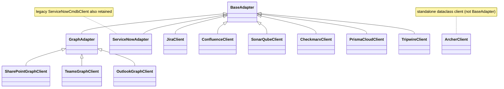
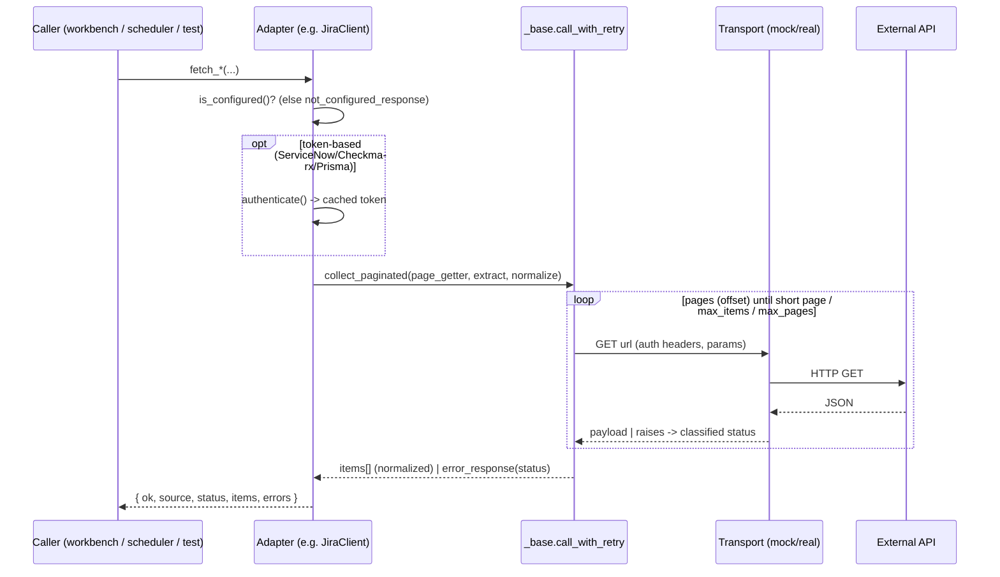

# Enterprise Connector — API Reference

**Status:** Current · **Owner:** Platform / Integrations
**Scope:** All 11 registered ECS enterprise evidence connectors.

> Derived entirely from repository inspection. Sources:
> `modules/operations/integrations/*.py` (`_base.py`, `ms_graph_base.py`, and one
> module per connector), `modules/operations/integrations/__init__.py` (registry),
> and the tests under `tests/`.

---

## 1. Common architecture (all connectors)

Every adapter reuses the shared machinery in `_base.py` and exposes a **consistent
module-level interface**: `get_config()`, `is_configured()`, `masked_config()`,
`health_check()`, plus a client class with `fetch_*` / `normalize_*` methods. The
HTTP transport is **injectable** (mocked in tests; the default transport refuses
live calls).

**Registry** (`modules/operations/integrations/__init__.py`):
- `list_adapters()` → the 11 adapter module names (`ADAPTER_MODULES`).
- `masked_config_all()` → secret-safe config for all adapters.
- `health_check_all()` → `{adapters, total, configured, not_configured}`.

**Standard response shape** (`_base.ok_response` / `error_response`):

```json
{ "ok": true, "source": "<adapter>", "status": "ok|empty|not_configured|auth_error|timeout|connection_error|http_error|transport_error", "items": [ ... ], "errors": [ ... ] }
```

**Shared strategies (`_base.py`):**
- **Retry:** `call_with_retry` — attempts = `1 + max_retries` (default 2); backoff
  `backoff_base * 2**i`; `auth_error`/`not_configured` not retried.
- **Timeout:** `timeout_sec` (default 30) forwarded to transports that accept it.
- **Pagination:** `collect_paginated` (offset) for REST connectors;
  `GraphAdapter.graph_collect` (`@odata.nextLink`) for Graph connectors.
- **Secret masking:** `mask_secret` → `SET`/`MISSING`; secret-safe `__repr__`.
- **Auth headers:** `basic_auth_header`, `bearer_auth_header` (assembled per
  request, never logged, never in query params).
- **Error handling:** `classify_exception` → status vocabulary; adapters never
  raise to callers.

**Logging:** the ECS logging subsystem (`modules/shared/services/ecs_logging.py`)
is used platform-wide; adapters never log secrets or tokens (only masked config /
classified statuses surface).



**Common REST + entry points for every connector:**

| Surface | Path / call |
| --- | --- |
| Masked config (all) | `GET /api/audit/integrations` |
| Health (all) | `GET /api/audit/integrations/health` |
| Health (one) | `GET /api/audit/integrations/{name}/health` |
| Workbench list | `GET /api/connectors` |
| Workbench config status | `GET /api/connectors/{name}/config-status` |
| Workbench health | `POST /api/connectors/{name}/health-check` |
| Workbench dry-run | `POST /api/connectors/{name}/dry-run` |
| Workbench parser test | `POST /api/connectors/{name}/parser-test` |
| Workbench UI | `GET /connectors/test-workbench` |
| Scheduler routing | `asset_scheduler._CONNECTOR_ROUTES` → adapter |

Evidence/observation interaction (shared): connector output is normalized
metadata; when persisted it flows into the **Evidence Repository**
(`evidence_repository.store_evidence`, SHA-256 `content_hash` + `checksum`),
is validated (`evidence_validation`), and failing controls become **Observations**
(`observation_generation`). See `docs/scheduler/scheduler_runtime_flow.md`.

---

## 2. Per-connector reference

For each connector: purpose, adapter class, auth, `is_configured()` requirement,
`fetch_*` methods + Graph/REST endpoints, normalizers (`evidence_type`), config
env vars, and tests. Retry/timeout/error/logging are the shared strategy in §1.

### 2.1 SharePoint (`sharepoint_graph.py`)
- **Purpose:** SharePoint sites, document libraries (drives), and document
  metadata as evidence.
- **Adapter class:** `SharePointGraphClient` (extends `GraphAdapter`). Source id `sharepoint_graph`.
- **Auth:** OAuth2 client-credentials (Microsoft Graph). See
  `docs/graph-api/microsoft_graph_connector_api_reference.md`.
- **Configured when:** tenant + client + secret + `site_id`.
- **Methods / endpoints:** `fetch_sites` `GET /sites`; `resolve_site_by_path`
  `GET /sites/{hostname}:/{site_path}`; `fetch_drives` `GET /sites/{site_id}/drives`;
  `fetch_drive_items` `GET /drives/{drive_id}/root/children`; `fetch_folder_items`
  `GET /drives/{drive_id}/root:/{folder_path}:/children`; `fetch_file_metadata`
  `GET /drives/{drive_id}/items/{item_id}`; `fetch_documents` (legacy).
- **Normalizers / evidence_type:** `normalize_site` (`sharepoint_site`),
  `normalize_drive` (`sharepoint_drive`), `normalize_item` (`sharepoint_document`),
  `normalize_document` (legacy).
- **Env:** `ECS_GRAPH_*`, `ECS_GRAPH_SITE_ID`, `ECS_GRAPH_DRIVE_ID`,
  `ECS_SHAREPOINT_SITE_HOSTNAME/SITE_PATH/FOLDER_PATH`.
- **Tests:** `tests/test_sharepoint_graph_connector.py`, `tests/test_ms_graph_connectors.py`.

### 2.2 Teams (`teams_graph.py`)
- **Purpose:** Teams, channels, channel messages/tabs as collaboration evidence.
- **Adapter class:** `TeamsGraphClient` (extends `GraphAdapter`). Source id `teams_graph`.
- **Auth:** OAuth2 client-credentials (Graph).
- **Configured when:** Graph creds present (tenant + client + secret).
- **Methods / endpoints:** `fetch_teams` `GET /teams`; `fetch_team`
  `GET /teams/{team_id}`; `fetch_channels` `GET /teams/{team_id}/channels`;
  `fetch_channel_messages` `GET /teams/{team_id}/channels/{channel_id}/messages`;
  `fetch_channel_tabs` `GET /teams/{team_id}/channels/{channel_id}/tabs`.
- **Normalizers / evidence_type:** `normalize_team` (`teams_team`),
  `normalize_channel` (`teams_channel`), `normalize_message` (`teams_message`),
  `normalize_tab` (`teams_tab`).
- **Env:** `ECS_GRAPH_*`, `ECS_TEAMS_TEAM_ID`, `ECS_TEAMS_CHANNEL_ID`,
  `ECS_TEAMS_MESSAGE_LIMIT`.
- **Tests:** `tests/test_teams_graph_connector.py`, `tests/test_ms_graph_connectors.py`.

### 2.3 Outlook (`outlook_graph.py`)
- **Purpose:** Mailbox folders, messages, and attachment metadata as evidence.
- **Adapter class:** `OutlookGraphClient` (extends `GraphAdapter`). Source id `outlook_graph`.
- **Auth:** OAuth2 client-credentials (Graph).
- **Configured when:** Graph creds present **+ `user_id`** (target mailbox).
- **Methods / endpoints:** `fetch_mail_folders` `GET /users/{user_id}/mailFolders`;
  `fetch_messages` `GET /users/{user_id}/mailFolders/{folder}/messages`;
  `fetch_message` `GET /users/{user_id}/messages/{message_id}`;
  `fetch_attachments_metadata` `GET /users/{user_id}/messages/{message_id}/attachments`
  (`$select` excludes `contentBytes` — metadata only).
- **Normalizers / evidence_type:** `normalize_folder` (`outlook_folder`),
  `normalize_message` (`outlook_message`), `normalize_attachment_metadata`
  (`outlook_attachment`).
- **Env:** `ECS_GRAPH_*`, `ECS_OUTLOOK_USER_ID`, `ECS_OUTLOOK_MAIL_FOLDER`,
  `ECS_OUTLOOK_MESSAGE_LIMIT`.
- **Tests:** `tests/test_outlook_graph_connector.py`, `tests/test_ms_graph_connectors.py`.

### 2.4 ServiceNow CMDB (`servicenow_cmdb.py`)
- **Purpose:** CMDB Configuration Items (servers, applications, databases) as
  asset/evidence records.
- **Adapter classes:** `ServiceNowAdapter` (modern, extends `BaseAdapter`) and the
  retained legacy `ServiceNowCmdbClient`. Source id `servicenow_cmdb`.
- **Auth:** OAuth client-credentials (`POST {base}/oauth_token.do`) with a
  **Basic-auth fallback** (`auth_mode` = `oauth` | `basic`).
- **Configured when:** `base_url` + (OAuth pair or Basic pair) present.
- **Methods / endpoints (Table API, offset pagination):** `fetch_cis`
  `GET /api/now/table/{ci_class}`; `fetch_servers` (`cmdb_ci_server`);
  `fetch_applications` (`cmdb_ci_appl`); `fetch_databases` (`cmdb_ci_database`).
  Params: `sysparm_query`, `sysparm_limit`, `sysparm_offset`.
- **Normalizer / evidence_type:** `normalize_ci` (`cmdb_ci`) — keys include
  `sys_id, name, fqdn, ip_address, class_name, environment, owner, application,
  criticality, operational_status, support_group, assignment_group,
  discovery_source`. Legacy `map_ci_to_asset` retained.
- **Env:** `ECS_SERVICENOW_BASE_URL`, `ECS_SERVICENOW_CLIENT_ID/CLIENT_SECRET`,
  `ECS_SERVICENOW_USERNAME/PASSWORD`, `ECS_SERVICENOW_AUTH_MODE`,
  `ECS_SERVICENOW_TIMEOUT_SECONDS`, `ECS_SERVICENOW_MAX_RETRIES`.
- **Tests:** `tests/test_integration_connectors_deepening.py`,
  `tests/test_integration_adapters_mocked.py`, `tests/test_enterprise_connector_auth_headers.py`.

### 2.5 Jira (`jira.py`)
- **Purpose:** Projects, issues (remediation/audit tickets), comments as evidence.
- **Adapter class:** `JiraClient` (extends `BaseAdapter`). Source id `jira`.
- **Auth:** HTTP Basic (email + API token).
- **Configured when:** `base_url` + `username` + `api_token`.
- **API version:** configurable; **defaults to v2** for backward compatibility
  (`ECS_JIRA_API_VERSION=3` for v3).
- **Methods / endpoints (startAt/maxResults pagination):** `fetch_projects`
  `GET /rest/api/{v}/project/search`; `fetch_issues`
  `GET /rest/api/{v}/search` (`jql`); `fetch_issue`
  `GET /rest/api/{v}/issue/{key}`; `fetch_issue_comments`
  `GET /rest/api/{v}/issue/{key}/comment`.
- **Normalizers / evidence_type:** `normalize_project` (`jira_project`),
  `normalize_issue` (`jira_issue`), `normalize_comment` (`jira_comment`).
- **Env:** `ECS_JIRA_BASE_URL`, `ECS_JIRA_USERNAME`, `ECS_JIRA_API_TOKEN`,
  `ECS_JIRA_PROJECT_KEY`, `ECS_JIRA_JQL`, `ECS_JIRA_API_VERSION`,
  `ECS_JIRA_TIMEOUT_SECONDS`, `ECS_JIRA_MAX_RETRIES`.
- **Tests:** `tests/test_integration_connectors_deepening.py`,
  `tests/test_integration_adapters_mocked.py`.

### 2.6 Confluence (`confluence.py`)
- **Purpose:** Spaces, pages, and page attachments (policy/procedure evidence).
- **Adapter class:** `ConfluenceClient` (extends `BaseAdapter`). Source id `confluence`.
- **Auth:** HTTP Basic (email + API token).
- **Configured when:** `base_url` + `username` + `api_token`.
- **Methods / endpoints:** `fetch_spaces` `GET /wiki/rest/api/space`; `fetch_pages`
  `GET /wiki/rest/api/content`; `fetch_page` `GET /wiki/rest/api/content/{page_id}`;
  `fetch_attachments` `GET /wiki/rest/api/content/{page_id}/child/attachment`.
- **Normalizers / evidence_type:** `normalize_space` (`confluence_space`),
  `normalize_page` (`confluence_page`), `normalize_attachment_metadata`
  (`confluence_attachment`).
- **Env:** `ECS_CONFLUENCE_BASE_URL`, `ECS_CONFLUENCE_USERNAME`,
  `ECS_CONFLUENCE_API_TOKEN`, `ECS_CONFLUENCE_SPACE_KEY`,
  `ECS_CONFLUENCE_TIMEOUT_SECONDS`, `ECS_CONFLUENCE_MAX_RETRIES`.
- **Tests:** `tests/test_integration_connectors_deepening.py`,
  `tests/test_integration_adapters_mocked.py`.

### 2.7 SonarQube (`sonarqube.py`)
- **Purpose:** Projects, quality gates, measures, and issues (AppSec evidence).
- **Adapter class:** `SonarQubeClient` (extends `BaseAdapter`). Source id `sonarqube`.
- **Auth:** Token (Bearer).
- **Configured when:** `base_url` + token.
- **Methods / endpoints:** `fetch_projects` `GET /api/projects/search` (`p`/`ps`);
  `fetch_issues` `GET /api/issues/search`; `fetch_quality_gate`
  `GET /api/qualitygates/project_status`; `fetch_measures`
  `GET /api/measures/component`. Health path `GET /api/system/status`.
- **Normalizers / evidence_type:** `normalize_project` (`sonarqube_project`),
  `normalize_issue`, `normalize_quality_gate`, `normalize_measure`
  (`sonarqube_measures`).
- **Env:** `ECS_SONARQUBE_BASE_URL`, `ECS_SONARQUBE_TOKEN`,
  `ECS_SONARQUBE_PROJECT_KEY`, `ECS_SONARQUBE_TIMEOUT_SECONDS`,
  `ECS_SONARQUBE_MAX_RETRIES`.
- **Tests:** `tests/test_integration_connectors_deepening.py`,
  `tests/test_integration_adapters_mocked.py`.

### 2.8 Checkmarx (`checkmarx.py`)
- **Purpose:** SAST scans and severity summaries (AppSec evidence).
- **Adapter class:** `CheckmarxClient` (extends `BaseAdapter`). Source id `checkmarx`.
- **Auth:** OAuth client-credentials (token URL defaults to
  `{base}/auth/realms/checkmarx/protocol/openid-connect/token`).
- **Configured when:** `base_url` + client id/secret.
- **Methods / endpoints:** `fetch_scans` `GET /api/scans` (offset/limit). Health
  path `GET /api/scans`.
- **Normalizer:** `normalize_scan` (keys: `scan_id, project_id, status, high,
  medium, low, source`; sets `source=checkmarx`, no `evidence_type` key).
- **Env:** `ECS_CHECKMARX_*` (base URL, client id/secret, timeouts/retries).
- **Tests:** `tests/test_integration_connectors_deepening.py`,
  `tests/test_integration_adapters_mocked.py`.

### 2.9 Prisma Cloud (`prisma_cloud.py`)
- **Purpose:** Cloud accounts, alerts, resources, compliance posture (CSPM evidence).
- **Adapter class:** `PrismaCloudClient` (extends `BaseAdapter`). Source id `prisma_cloud`.
- **Auth:** Access key / secret key exchanged for a JWT via `POST {base}/login`.
- **Configured when:** `base_url` + access/secret key.
- **Methods / endpoints (configurable paths):** `fetch_alerts` `GET /v2/alert`
  (offset/limit); `fetch_cloud_accounts` `GET /cloud`; `fetch_resources`
  `GET /resource`; `fetch_compliance_posture` `GET /compliance/posture`. Health
  path `GET /check`.
- **Normalizers / evidence_type:** `normalize_alert`, `normalize_cloud_account`
  (`prisma_cloud_account`), `normalize_resource` (`prisma_cloud_resource`),
  `normalize_compliance` (`prisma_cloud_compliance`).
- **Env:** `ECS_PRISMA_CLOUD_BASE_URL`, `ECS_PRISMA_CLOUD_ACCESS_KEY`,
  `ECS_PRISMA_CLOUD_SECRET_KEY`, `ECS_PRISMA_CLOUD_TIMEOUT_SECONDS`,
  `ECS_PRISMA_CLOUD_MAX_RETRIES`.
- **Tests:** `tests/test_integration_connectors_deepening.py`,
  `tests/test_integration_adapters_mocked.py`.

### 2.10 Tripwire (`tripwire.py`)
- **Purpose:** File-integrity-monitoring policy results (FIM evidence).
- **Adapter class:** `TripwireClient` (extends `BaseAdapter`). Source id `tripwire`.
- **Auth:** HTTP Basic (username + password).
- **Configured when:** `base_url` + username + password.
- **Methods / endpoints:** `fetch_policy_results` `GET /api/v1/policies/results`
  (offset/limit). Health path `GET /api/v1/version`.
- **Normalizer:** `normalize_policy_result` (keys: `policy_id, policy_name, node,
  status, score, source`; sets `source=tripwire`, no `evidence_type` key).
- **Env:** `ECS_TRIPWIRE_*` (base URL, username/password, timeouts/retries).
- **Tests:** `tests/test_integration_connectors_deepening.py`,
  `tests/test_integration_adapters_mocked.py`.

### 2.11 Archer (`archer.py`)
- **Purpose:** GRC controls and frameworks (mapped control evidence).
- **Adapter class:** `ArcherClient` (standalone config-driven dataclass client;
  not `BaseAdapter`). Source id `archer`.
- **Auth:** API token (config-driven).
- **Configured when:** `base_url` + token (see `is_configured`).
- **Methods / endpoints:** `fetch_controls` `GET /api/core/content/controls`;
  `fetch_frameworks` `GET /api/core/content/frameworks`; `fetch_mapped_controls`
  (maps controls).
- **Normalizers / evidence_type:** `normalize_control` / `map_archer_control`,
  `normalize_framework` / `map_archer_framework` (source `archer`).
- **Env:** `ECS_ARCHER_*` (base URL, token) resolved via the `archer` YAML block.
- **Tests:** `tests/test_enterprise_integrations_skeleton.py`,
  `tests/test_integration_adapters_mocked.py`.

---

## 3. Generic fetch sequence (REST connectors)



---

## 4. Related documentation

- Microsoft Graph specifics: `docs/graph-api/microsoft_graph_connector_api_reference.md`
- Workbench runtime: `docs/connectors/connector_test_workbench_design.md`
- Scheduler runtime: `docs/scheduler/scheduler_runtime_flow.md`
- Workbench vs scheduler: `docs/scheduler/test_workbench_vs_scheduler.md`
- Call graph: `docs/scheduler/runtime_call_graph.md`
- Developer guides: `docs/connectors/INTEGRATION_ADAPTERS_GUIDE.md`,
  `docs/connectors/ENTERPRISE_CONNECTOR_UAT_SETUP.md`
- Frontend testing: `docs/connectors/connector_frontend_testing_matrix.md`,
  `docs/connectors/connector_frontend_manual_testing.md`
