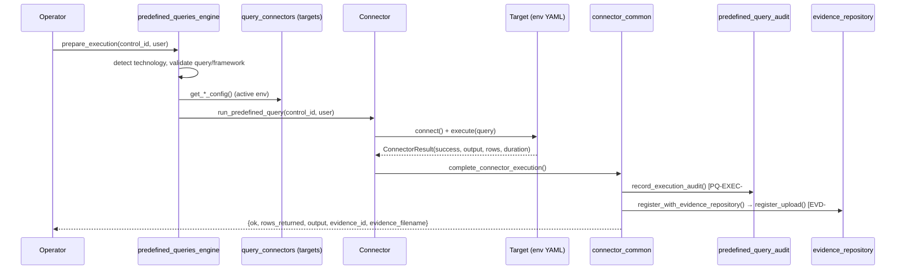

# ECS Predefined Query Execution Workflow

**Type:** Operations / auditor-grade workflow reference. No code modified.
**Date:** 2026-06-17
**Grounding:** `modules/operations/engines/predefined_queries_engine.py`,
`query_connectors.py`, `connector_common.py`, `postgresql_connector.py`,
`linux_connector.py`, `sonarqube_connector.py`, `trivy_connector.py`,
`gitleaks_connector.py`, `predefined_query_evidence.py`,
`predefined_query_audit.py`, `config/environments/*.yaml`. Technologies without a
live connector today are config-ready and marked **(Inferred / Phase 2)**.

**Navigation:** [Predefined Query Execution Guide](ECS_PREDEFINED_QUERY_EXECUTION_GUIDE.md) ·
[Control & Evidence Reuse](ECS_CONTROL_AND_EVIDENCE_REUSE_GUIDE.md) ·
[Workflow Orchestration Guide](../WORKFLOWS/ECS_WORKFLOW_ORCHESTRATION_GUIDE.md) ·
[Framework Reference](../FRAMEWORKS/ECS_FRAMEWORK_REFERENCE.md)

---

## 1. End-to-end execution chain

```
Framework → Control → Query → Connector → Target Server → Execution →
Evidence Capture → Validation → Repository → Approval → Reuse
```



```mermaid
flowchart LR
    FW[Framework] --> CT[Control]
    CT --> Q[Query / Command]
    Q --> DET[Technology detection - TECHNOLOGY_RULES]
    DET --> CN[Connector]
    CN --> TG[Target Server - YAML predefined_query_targets]
    TG --> EX[Execution → ConnectorResult]
    EX --> EC[Evidence Capture - prepare_evidence_record]
    EC --> VAL[Validation - SHA256 + naming + integrity]
    VAL --> REP[Repository - register_upload]
    REP --> AP[Auditor Approval]
    AP --> RU[Reuse - _link_reuse]
```

## 2. Per-technology execution model

| # | Technology | Connector (status) | Target source (YAML) | Representative check |
|---|-----------|--------------------|----------------------|----------------------|
| 1 | PostgreSQL | `postgresql_connector` ✅ live (allow-listed) | `predefined_query_targets.postgresql` + `db_servers` | `SHOW ssl`, `password_encryption`, `pg_stat_replication` |
| 2 | Linux | `linux_connector` ✅ live (container) | `predefined_query_targets.linux` + `os_servers` | OS hardening / config reads |
| 3 | Nginx | NGINX rule → Linux exec ◐ | `middleware_servers` | `nginx -t` / `nginx -T` |
| 4 | Tomcat (App Server) | **(Inferred / Phase 2)** | `middleware_servers` | server.xml / TLS connector config |
| 5 | Oracle | **(Inferred / Phase 2)** config slot | `db_servers` | TDE / audit settings |
| 6 | MySQL | **(Inferred / Phase 2)** config slot | `db_servers` | `have_ssl`, audit log |
| 7 | SQL Server | **(Inferred / Phase 2)** config slot | `db_servers` | TDE / login audit |
| 8 | Windows | **(Inferred / Phase 2)** interface | `os_servers` | GPO / WinRM PowerShell baseline |
| 9 | SonarQube | `sonarqube_connector` ✅ live | `predefined_query_targets.sonarqube` | quality gate / issues API |
| 10 | Trivy | `trivy_connector` ✅ live | `predefined_query_targets.trivy` | image vuln scan |
| 11 | Gitleaks | `gitleaks_connector` ✅ live | `predefined_query_targets.gitleaks` | secrets scan |
| 12 | Application Connectors | `ecs_platform/connectors/*` ◐ | `connectors.*` / `applications.*` | API posture pulls |

Technology detection is deterministic via `TECHNOLOGY_RULES`; routing via
`connector_for_technology`. Live execution is gated by `LIVE_CONTROL_IDS` and, for
PostgreSQL, `ALLOWED_POSTGRESQL_QUERIES` (read-only safety allow-list).

## 3. Execution sequence (grounded)



Failure path: `connect_error` or `result.success == false` →
`record_execution_audit(status="Failed")` + structured `{ok:false, error,
error_type}` (never crashes the page).

## 4. Environment execution demonstration

The same control library runs unchanged across environments; only YAML targets
change (`ECS_ENV` selects the file; `_base ⊕ <env>` merged by
`environment_loader`).

### 4.1 UAT execution
- `ECS_ENV=uat` → `uat.yaml`: `os_servers [10.10.10.1-2]`, `db_servers
  [10.10.20.1-2]`, `middleware_servers [10.10.30.1-2]`, `appsec_targets
  [netbanking.uat…, payments.uat…]`.
- Predefined queries connect to UAT hosts; evidence filed with UAT provenance.
- Startup config validation is **strict** (UAT) — invalid targets fail startup.

### 4.2 Performance / SIT execution
- `ECS_ENV=sit` → `sit.yaml`: `os_servers [10.20.10.1-3]`, `db_servers
  [10.20.20.1-2]`, `middleware_servers [10.20.30.1-2]`; ServiceNow enabled.
- Used for integration & performance validation; batch framework runs fan out
  across `framework_targets.<fw>.target_groups` **(Inferred — batch fan-out is the
  forward capability; today live exec is per allow-listed control).**

### 4.3 Production execution
- `ECS_ENV=prod` → `prod.yaml`: `os_servers [172.16.10.1-2]`, `db_servers
  [172.16.20.1-2]`, `middleware_servers [172.16.30.1-2]`, `appsec_targets
  [netbanking.bank.com, payments.bank.com]`; SSO + secure object store.
- Secrets resolved by env-var name only (`password_env`, `token_env`); strict
  config gate; all executions audited with prod provenance.

## 5. Evidence capture, validation, approval, reuse
- **Capture:** `prepare_evidence_record` (PQ-EVD-######) → `register_upload`
  (EVD-#####, `PREDEFINED_QUERY_<control>.txt`).
- **Validation:** SHA-256 + `integrity_check` + naming policy.
- **Approval:** filed evidence enters the auditor review queue (see
  [Workflow Orchestration Guide](../WORKFLOWS/ECS_WORKFLOW_ORCHESTRATION_GUIDE.md)).
- **Reuse:** `_link_reuse` groups results into REUSE-### across controls/frameworks.

## 6. Framework → control → query coverage (representative)

| Framework | Control | Technology | Target group |
|-----------|---------|-----------|--------------|
| DB Baselining / PCI Req3 | DB-001/002/003 | PostgreSQL | db_servers |
| OS Baselining | OS-001/002 | Linux | os_servers |
| AppSec | APP-001/002 | SonarQube | appsec_targets |
| AppSec/VAPT | APPSEC-001/002 | Trivy/Gitleaks | appsec_targets |
| Nginx Baselining | NGX checks | Nginx | middleware_servers |

## 7. Current vs inferred vs recommended
- **Current:** PostgreSQL, Linux, SonarQube, Trivy, Gitleaks live (allow-listed).
- **Inferred/Phase 2:** Tomcat, Oracle, MySQL, SQL Server, Windows live connectors;
  per-framework batch fan-out across `target_groups`.
- **Recommended:** enable framework-level batch runs in UAT/PROD with persisted
  version chains and object-store artifacts.
