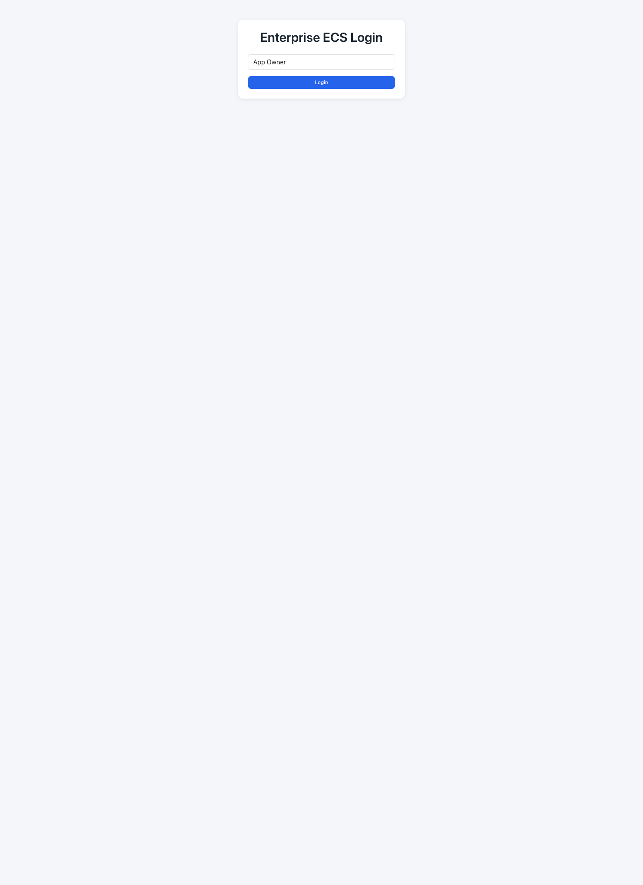
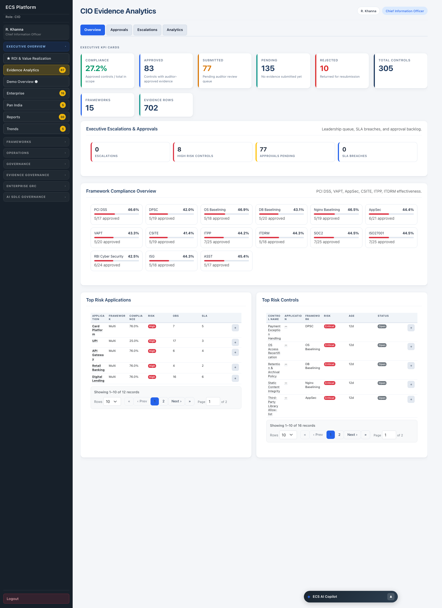
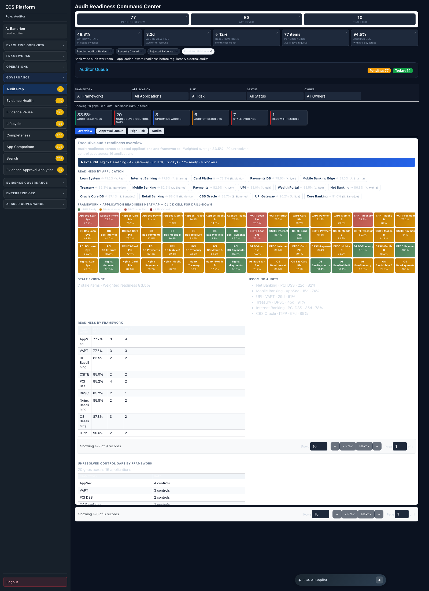
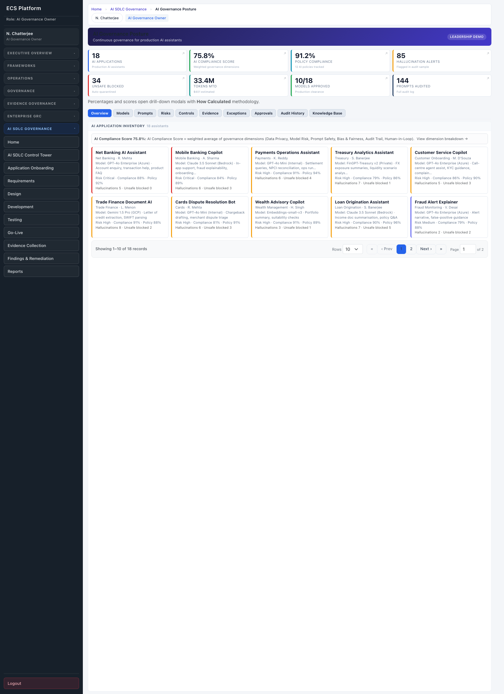

# ECS Product Operations Manual

**Evidence Collection System (ECS)** — the definitive functional manual for new joiners, product managers, auditors, governance teams, application owners, platform administrators, solution architects, and demo teams. Assumes you have never seen ECS before.

This is the master document. It links to the companion references:

| Document | What it covers |
|---|---|
| **`ECS_MODULE_REFERENCE.md`** | Every module, engine, and the navigation map |
| **`ECS_PERSONA_GUIDE.md`** | Every role/persona, capabilities, and landing pages |
| **`ECS_SCREEN_CATALOG.md`** | Every screen — URL, purpose, inputs, actions, charts, KPIs |
| **`ECS_KPI_DICTIONARY.md`** | Every KPI (formulas, thresholds) + the chart guide |
| **`ECS_FEATURE_REFERENCE.md`** | Every action, report, export, and API/drill endpoint |
| **`ECS_USER_JOURNEYS.md`** | Every end-to-end workflow |
| **`ECS_SCREENSHOTS_INDEX.md`** | Index of all captured screenshots |

> All facts in this manual are derived from the ECS repository (routes, templates, engines, configs). Where ECS computes values deterministically for demos, this is stated explicitly.

---

# Section 1 — ECS Overview

## What ECS is

ECS (Evidence Collection System) is a **banking governance, risk & compliance (GRC) evidence platform**. It automatically **collects, validates, governs, and reports** the evidence that proves an organization's applications comply with regulatory and security frameworks. It is built as a **modular monolith**: a single FastAPI application with server-rendered Jinja2 UI, backed (in production) by PostgreSQL, pgvector, MinIO, and Redis, with a citation-grounded LLM-RAG assistant.

ECS ships with **15 compliance frameworks, 305 controls, and 702 evidence records** in its catalog (`framework_catalog.catalog_stats()`), **12 source-system connectors**, **9 RBAC roles**, and roughly **79 screens** across 7 functional areas.

## Why ECS exists / problems it solves

Traditional compliance is manual: teams chase screenshots and logs across dozens of tools before every audit, evidence goes stale, the same control is re-proven for every framework, and leadership has no real-time view of readiness. ECS solves:

- **Manual evidence chasing** → automated connector collection + scheduler.
- **Evidence staleness** → lifecycle governance (draft → active → expiring → archived) and freshness scoring.
- **Duplicate work across frameworks** → cross-framework **evidence reuse** (map once, satisfy many controls; 18 canonical control themes).
- **Audit scramble** → continuous **Audit Readiness Score** and one-click audit packages.
- **No leadership visibility** → executive dashboards, heatmaps, trends, and ROI.
- **Ungoverned AI** → AI SDLC gates and AI governance posture (prompt audit, hallucination/unsafe-prompt signals, model registry).

## The unifying chain: Framework → Control → Evidence → Validation → Audit → Reporting

This is how ECS actually works, end to end:

1. **Framework** — a regulation/standard (e.g. PCI DSS, RBI Cyber Security, ISO 27001) loaded into the catalog (`framework_catalog.py`). Frameworks own controls.
2. **Control** — a specific requirement. Controls are assigned to applications during onboarding. The catalog holds 305 controls.
3. **Evidence** — artefacts proving a control is met, collected by connectors or uploaded, stored in the repository (`ecs_platform/repository`) with metadata + hashes. 702 records in the catalog.
4. **Validation** — `control_validation_engine.py` runs config/file/policy/reuse/SLA checks → effectiveness %; lifecycle governs freshness.
5. **Audit** — auditors review/approve evidence (`/evidence/review`), close observations, and assemble audit packages (`/mvp/audit-prep`). Readiness is scored continuously.
6. **Reporting** — 30 executive audit packs + 5 interactive reports + 6 AI SDLC reports + gap/audit-bundle exports.

## The five governance lifecycles

| Lifecycle | What ECS does | Primary screens |
|---|---|---|
| **Evidence Collection** | connectors + scheduler + bulk upload → repository → auto-map to controls | Scheduler, Integrations, Bulk Upload, Evidence Explorer |
| **Audit** | submit → review → approve/reject → close observation → package | Dashboard, Evidence Review, Audit Prep |
| **Governance** | health, reuse, lifecycle, completeness, exceptions, analytics | Evidence Health, Reuse, Lifecycle, Completeness, Governance Analytics |
| **Compliance** | framework coverage, control validation, regulatory mapping | Framework pages, Control/Framework Coverage, Regulatory |
| **Risk** | risk register, treatment, heatmaps, correlation | Risk Register, Heatmaps, Cross-Tool Correlation |

## How ECS differs

- **vs. GRC tools (Archer/ServiceNow GRC):** those are systems of record you feed manually; ECS **collects evidence automatically** from engineering/ops tools and scores readiness continuously, with cross-framework reuse built in.
- **vs. Audit tools:** audit tools manage findings and workpapers; ECS manages the **full evidence lifecycle** that *produces* audit-ready packages, plus continuous readiness — not just point-in-time audit administration.
- **vs. Evidence repositories (SharePoint/Confluence):** a repository is passive storage; ECS adds **validation, freshness/lifecycle governance, control mapping, reuse intelligence, RBAC scoping, and reporting** on top of storage.

---

# Section 2 — Personas (summary)

ECS recognizes **12 login personas** plus System Admin and Control Owner. Full detail (capabilities, what each can/can't see, daily workflow, KPIs) is in **`ECS_PERSONA_GUIDE.md`**. Headline:

| Persona | Lands on | Core job |
|---|---|---|
| Application Owner | `/dashboard` | collect & submit evidence |
| Auditor | `/dashboard` | review/approve, run audits |
| CIO | `/dashboard/cio` | enterprise posture, exceptions |
| Vertical / Functional Head | `/dashboard/vertical-head` `/functional-head` | aggregated posture, escalate |
| Compliance Head / Officer | `/dashboard/compliance-head` | framework/control oversight, onboarding |
| Security Officer | `/dashboard/compliance-head` | vulnerabilities, findings |
| Operations Owner | `/mvp/onboarding` | collection ops, connectors |
| AI Governance Owner | `/mvp/ai-governance` | AI posture |
| AI SDLC Owner | `/mvp/ai-sdlc` | SDLC gates |
| Framework Owner | `/mvp/framework-admin` | framework administration |

---

# Section 3 — Modules (summary)

ECS has 7 nav groups powered by 7 code packages and a 28-entry module registry. Full chapters in **`ECS_MODULE_REFERENCE.md`**:

Executive Overview · Frameworks · Operations · Governance · Evidence Governance (platform) · Enterprise GRC · AI SDLC Governance.

---

# Section 4 — Screens (summary)

~79 screens. Full catalog with URL/purpose/actions/charts/KPIs in **`ECS_SCREEN_CATALOG.md`**. The product surface is the `/mvp/*` namespace; the system of record is the `/mvp/platform/*` (Evidence Governance) namespace.

---

# Section 5 — KPIs (summary)

Every KPI, formula, and threshold is in **`ECS_KPI_DICTIONARY.md`**. The single most important KPI:

> **Audit Readiness Score** = `0.5 × Control Coverage + 0.3 × Approved-Evidence % + 0.2 × Freshness %` (`ecs_platform/governance.py:552`). Bands: **90–100 Audit Ready · 70–89 Needs Attention · <70 High Audit Risk**.

---

# Section 6 — Charts (summary)

ECS uses **no Chart.js** — all charts are CSS bars, SVG sparklines, and HTML heatmap grids rendered by `executive_charts_system.html`. Full chart-by-chart guide (axes, data source, interpretation, common mistakes) is in **`ECS_KPI_DICTIONARY.md` Part 2**. Reading rules in brief:

- **% bars/gauges:** ≥80 good · 55–79 watch · <55 critical (Completeness uses 80/65; Audit Prep uses 75).
- **Heatmaps:** green→ready, amber→watch, red→risk; scan for red clusters.
- **Closure rate >100%** = backlog shrinking (good).
- For **findings/gaps/deviations** bars, lower is better.

---

# Section 7 — Workflows (summary)

12 end-to-end workflows (trigger/actors/inputs/steps/outputs/success/failure) are documented in **`ECS_USER_JOURNEYS.md`**: Application onboarding, Framework onboarding, Evidence collection, Evidence approval, Audit prep, Control validation, Exception handling, Risk management, Findings remediation, Report generation, AI SDLC review, ROI measurement.

---

# Section 8 — Screenshots

**66 screenshots** of the running platform (demo mode) are captured under `docs/product/screenshots/`. The full index with descriptions and section references is in **`ECS_SCREENSHOTS_INDEX.md`**. A few anchors:

**Login (persona picker):**

**CIO Executive Dashboard:**

**Audit Prep cockpit:**

**AI Governance Posture:**

---

# Section 9 — New Joiner Learning Path (7 days)

A structured plan to go from zero to self-sufficient. Each day: read, then *do* in demo mode (`DEMO_MODE=true`, see `docs/00-start-here/DEMO_MODE_SETUP.md`).

### Day 1 — Platform overview & navigation
- Read: this manual Section 1; `ECS_MODULE_REFERENCE.md` (nav map).
- Do: log in as each persona on `/`; explore the 7 nav groups; open `/mvp/demo-overview`.
- Outcome: you can explain what ECS is and navigate every group.

### Day 2 — Framework management
- Read: `ECS_MODULE_REFERENCE.md` (Frameworks); `ECS_KPI_DICTIONARY.md` §G.
- Do: open 3–4 framework pages (`/framework/PCI DSS`, `/framework/RBI Cyber Security`, `/framework/ISO27001`); read the 6 KPI tiles; walk the Framework Loader and Framework Admin wizard.
- Outcome: you understand Framework → Control mapping and the 15 frameworks.

### Day 3 — Evidence lifecycle
- Read: `ECS_USER_JOURNEYS.md` §3–4.
- Do: as Owner, upload evidence (`/mvp/upload`) and `/submit`; as Auditor, review/approve/reject in `/evidence/review`; watch `/mvp/evidence-health`.
- Outcome: you can run a piece of evidence through the full state machine.

### Day 4 — Governance
- Read: `ECS_MODULE_REFERENCE.md` (Governance, Enterprise GRC).
- Do: `/mvp/completeness` (close a gap), `/mvp/reuse`, `/mvp/lifecycle`, `/mvp/risk-register`, `/mvp/exceptions`.
- Outcome: you can find gaps, reuse evidence, and manage risks/exceptions.

### Day 5 — Audit readiness
- Read: `ECS_USER_JOURNEYS.md` §5; KPI dictionary A1.
- Do: `/mvp/audit-prep` → drill the heatmap → run a mock audit → generate an audit package.
- Outcome: you can prepare for and explain audit readiness.

### Day 6 — Reporting
- Read: `ECS_FEATURE_REFERENCE.md` §8.
- Do: `/mvp/reports` → view an interactive report → download PDF/Excel/CSV; export a gap analysis.
- Outcome: you can produce any regulator/executive report.

### Day 7 — Advanced workflows
- Read: `ECS_USER_JOURNEYS.md` §11–12; `ECS_FEATURE_REFERENCE.md` §6–7.
- Do: walk the AI SDLC gates (`/mvp/ai-sdlc`), AI Governance Posture, ROI center; query the AI Assistant (`/mvp/ai-assistant`).
- Outcome: you can demo ECS end to end and answer stakeholder questions.

---

# Section 10 — Executive Cheat Sheet

## Top KPIs (the ones executives ask about)

1. **Audit Readiness Score** — `0.5·coverage + 0.3·approval + 0.2·freshness` (Platform Audit Readiness)
2. **Enterprise Compliance %** — approved/total controls (CIO)
3. **Implementation Coverage** — implemented/total controls (Trends)
4. **Control Coverage %** — controls with evidence / total
5. **Framework Coverage %** — per-framework via crosswalk
6. **Control Maturity %** — Completeness
7. **Dynamic Completeness %** — Completeness (weighted, penalty-adjusted)
8. **Approval Success %** / **9. Rejection Rate %** — Evidence Approval
10. **Avg Validation Time** — reviewer throughput
11. **Evidence Health Score** — freshness/quality
12. **Reuse %** — cross-framework reuse (≈34.5% demo)
13. **AI Compliance Score** — 6 weighted dimensions (target 90%)
14. **SDLC Release Readiness** — mean of stage scores
15. **ROI Audit Readiness Score** — `min(99, 70 + frameworks)`
16. **National / Pan-India Score** — mean regional score
17. **Observations Net / Closure Rate** — closing vs opening
18. **Remediation SLA Compliance %**
19. **Risk severity / aging** — Risk Register
20. **Exceptions Active / Expiring / High-Risk Open TDs**
21–26. **Role strips:** owner pending/resubmits/SLA breaches; auditor pending/approvals-today; security critical vulns/VAPT/MTTR; ops jobs/connector-health; governance open-risks/score; framework coverage/gaps.
27–40. **Framework tiles** (6 each): e.g. PCI Maturity, QSA Readiness, Encryption Coverage; ISO ISMS Maturity, SoA Coverage; SOC2 Trust Criteria; RBI Maturity, Cyber Resilience; VAPT Open Vulns/Critical CVEs; AppSec SAST/DAST; OS Patch Compliance/Hardening; DB Backup/Encryption; Nginx TLS Posture; ITPP DR Test Compliance; ITDRM DR Coverage; DPSC Encryption Compliance.
41–50. **Demo overview tiles:** Banking Applications, Frameworks, Controls, Evidence Records, ServiceNow Tickets, AI Prompts Audited, Hallucination Alerts, Open VAPT, Critical Drift, Audit Closure Velocity.

(Full formulas/thresholds: `ECS_KPI_DICTIONARY.md`.)

## Top 25 dashboards/screens to know

Main Dashboard (owner/auditor) · CIO Dashboard · Vertical/Functional/Compliance Head dashboards · ROI Center · Demo Overview · Enterprise · Pan India · Reports · Trends · Framework page · Framework Admin · Scheduler · Integration Health · Audit Prep · Evidence Health · Completeness · Evidence Approval · App Comparison · Search · Platform Scorecard · Platform Audit Readiness · Risk Register · Governance Analytics · AI SDLC Control Tower · AI Governance Posture.

## Top workflows
Evidence collection · Evidence approval · Audit preparation · Application/framework onboarding · Exception handling · Findings remediation · Report generation · AI SDLC review.

## Most important reports
PCI DSS Executive Audit Pack · Audit Readiness Scorecard · CIO Enterprise Governance Pack · RBI Cyber Security Summary · Cross-Framework Coverage Summary · VAPT External Pen Test Closure · Rejection Analysis · plus the gap-analysis export and audit package.

## Most common user journeys
Owner: upload → submit → fix rejections. Auditor: review → approve → audit package. CIO: posture → heatmaps → ROI. Compliance: completeness → onboarding → reports. AI SDLC Owner: control tower → stages → findings.

---

## Glossary

| Term | Meaning |
|---|---|
| **Control** | A specific requirement within a framework |
| **Evidence** | An artefact proving a control is met |
| **Observation** | An audit finding requiring closure |
| **Exception / TD** | Approved technical debt / compensating control with expiry |
| **Reuse** | One evidence artefact satisfying multiple controls/frameworks |
| **Readiness** | Weighted measure of audit preparedness (0–100) |
| **Connector** | An integration that pulls evidence from a source system |
| **Drilldown** | Click a KPI/chart to see contributing rows (`/api/ecs/universal-drill`) |
| **Demo mode** | `DEMO_MODE=true` — bypasses auth/RBAC, uses synthetic data |

This manual, together with the seven companion documents, is the complete ECS Product Operations Manual.
