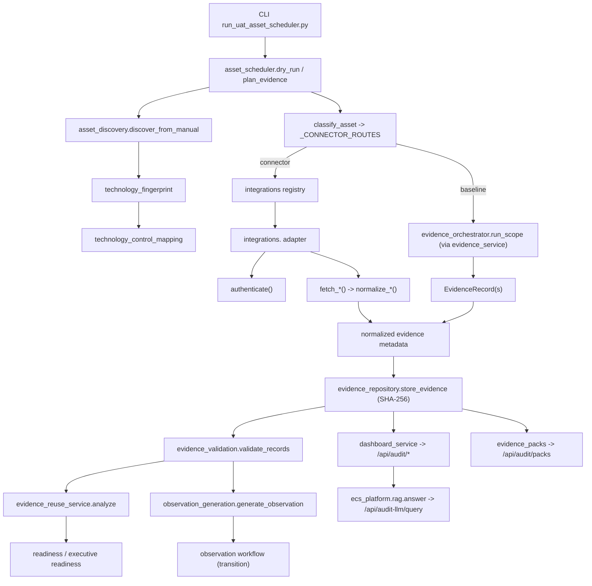

# Scheduler Runtime Flow

**Status:** Current · **Owner:** Audit Intelligence
**Scope:** The UAT asset-driven scheduler lifecycle, from trigger through evidence
collection, validation, reuse, observations, dashboards, and the LLM/RAG index.

> Derived from repository inspection. Sources:
> `modules/audit_intelligence/services/asset_scheduler.py`,
> `modules/audit_intelligence/engines/asset_discovery.py`,
> `modules/audit_intelligence/engines/technology_fingerprint.py`,
> `modules/audit_intelligence/engines/technology_control_mapping.py`,
> `modules/audit_intelligence/engines/evidence_orchestrator.py`,
> `modules/audit_intelligence/engines/evidence_validation.py`,
> `modules/audit_intelligence/engines/evidence_repository.py`,
> `modules/audit_intelligence/engines/observation_generation.py`,
> `modules/audit_intelligence/services/evidence_service.py`,
> `modules/audit_intelligence/services/evidence_reuse_service.py`,
> `modules/operations/integrations/*`, `ecs_platform/rag.py`,
> `scripts/run_uat_asset_scheduler.py`. Tests: `tests/test_uat_asset_scheduler.py`.

---

## 1. Lifecycle overview

```
Scheduler Trigger  (CLI: scripts/run_uat_asset_scheduler.py [--dry-run|--json|--strict])
        ↓
Asset Scheduler    (asset_scheduler.load_assets / dry_run / plan_evidence)
        ↓
Technology Fingerprinting  (asset_discovery.discover_from_manual -> technology_fingerprint)
        ↓
Technology Rules   (technology_control_mapping — controls/frameworks per technology)
        ↓
Connector Selection (asset_scheduler.classify_asset -> _CONNECTOR_ROUTES)
        ↓
Connector Registry (modules.operations.integrations.__init__)
        ↓
Connector Adapter  (integrations.<name>; or baseline predefined-query collector)
        ↓
Authentication     (adapter authenticate(); Graph OAuth / Basic / token)
        ↓
Evidence Fetch     (adapter fetch_*() via injected transport)  |  baseline: evidence_service.start_run
        ↓
Parser             (adapter normalize_*())
        ↓
Metadata           (normalized evidence records)
        ↓
Hash Generation    (evidence_repository.store_evidence -> SHA-256 content_hash + checksum)
        ↓
Evidence Repository (evidence_repository — versioned store + timeline)
        ↓
Evidence Validation (evidence_validation.validate_records -> ValidationResult)
        ↓
Evidence Reuse     (evidence_reuse_service.analyze — reuse across frameworks)
        ↓
Observation Generation (observation_generation.generate_observation for FAIL/WARN)
        ↓
Observation Workflow (Draft -> Submitted -> Approved -> Remediated -> Closed)
        ↓
Dashboard          (dashboard_service; /api/audit/* + /mvp/audit/* pages)
        ↓
Reports            (evidence_packs; /api/audit/packs)
        ↓
LLM/RAG Index      (ecs_platform/rag.py — answer(); /api/audit-llm/query)
        ↓
Audit Readiness    (evidence_reuse_service.readiness / executive readiness)
```

> **Important (accuracy):** the scheduler is exposed through the **CLI + service
> API** (`asset_scheduler.dry_run` / `plan_evidence` / `execute_plan`). There is
> **no** dedicated `/api/audit/scheduler` REST route in the repository. The
> dry-run path performs **no** query execution and **no** connector calls — it
> only classifies, plans, and reports config-only connector readiness.

---

## 2. Stage-by-stage detail

### 2.1 Trigger
`scripts/run_uat_asset_scheduler.py` (CLI). Flags: `--config <path>` (default
`config/uat_assets.local.yaml`), `--dry-run`, `--json`, `--strict`. It calls
`asset_scheduler.dry_run(...)`.

### 2.2 Asset loading + fingerprinting
`asset_scheduler.load_assets(path)` → `load_asset_config()` (YAML, `${VAR}`
expansion, never raises) → `assets_from_config()` →
`asset_discovery.discover_from_manual(records)`. This flows assets through the same
normalization + `technology_fingerprint` pipeline as every other source, yielding
`Asset` objects with `technology`, `confidence_score`, and `raw` (retaining
`asset_type`).

### 2.3 Technology rules / control scope
`technology_control_mapping` provides `controls_for_technology(tech)` and
`frameworks_for_technology(tech)` — the applicable predefined controls + frameworks
used to scope a baseline job.

### 2.4 Connector selection (routing)
`asset_scheduler.classify_asset(asset)` decides the route (precedence):

1. **Enterprise connector** — `asset_type`/technology matches `_CONNECTOR_ROUTES`
   (e.g. `sharepoint→sharepoint_graph`, `servicenow→servicenow_cmdb`,
   `jira→jira`, `prisma→prisma_cloud`, …) → `route=enterprise_connector`.
2. **Baseline collector** — technology has predefined-query controls →
   `route=baseline_collector`, `scope_kind=technology`.
3. **Unsupported** — neither → flagged for manual review (never crashes).

Returns an `AssetClassification` (`asset_id, technology, confidence, route,
connector, scope_kind, scope_value, control_ids, frameworks, reasons`).

### 2.5 Planning
`asset_scheduler.plan_evidence(assets)` → `EvidencePlan` of `PlannedJob`s
(deterministically ordered: connectors first, then technology, then asset_id),
plus an `unsupported` list. `EvidencePlan.to_dict()` summarizes `planned_jobs`,
`unsupported_assets`, `total_planned_controls`, `by_route`, `by_technology`.

### 2.6 Dry-run
`asset_scheduler.dry_run(config_path=..., cfg=..., include_diagnostics=True)`
returns a JSON-safe report: `config`, `assets`, `classifications`, `plan`, and
`connector_readiness` (config-only `is_configured()` + `masked_config()` per
distinct connector — **no live calls**). This is what the CLI and
`tests/test_uat_asset_scheduler.py` assert against.

### 2.7 Execution (opt-in; not in dry-run)
`asset_scheduler.execute_plan(plan, executor=..., requested_by=...)` runs only the
**baseline** jobs through the unchanged `evidence_service.start_run(...)`
(→ `evidence_orchestrator.run_scope`). Connector execution remains the connector
layer's path (adapters with an injected production transport). An `executor` must
be injected outside production so nothing live is hit implicitly.

### 2.8 Evidence collection + parsing
- **Baseline:** `evidence_orchestrator.run_scope` resolves controls
  (`resolve_scope`) and produces `EvidenceRun` + `EvidenceRecord`s.
- **Connector:** adapter `fetch_*()` → `normalize_*()` → normalized evidence items.

### 2.9 Hash generation + repository
`evidence_repository.store_evidence(...)` (or `store_from_run(run, ...)`) writes a
versioned `EvidenceArtifact` with a SHA-256 `content_hash` + short `checksum`,
frameworks, verdict, and a timeline event. Metadata only — never contents/secrets.

### 2.10 Validation
`evidence_validation.validate_records(records, controls_by_id)` →
`ValidationResult` per control (verdict `PASS`/`FAIL`/`WARNING`/`NOT APPLICABLE`)
and `compliance_summary(results)`.

### 2.11 Reuse
`evidence_reuse_service.analyze(...)` computes the reuse matrix (one evidence
record satisfying multiple framework obligations), reuse factor, frameworks/
controls covered, and effort saved. See
`docs/evidence_reuse_lifecycle_functional_design.md`.

### 2.12 Observations + workflow
`observation_generation.generate_observation(ValidationResult, ...)` creates
observations for FAIL/WARNING results (deterministic severity). Workflow via
`transition()`: `Draft → Submitted → Approved → Remediated → Closed`
(`Rejected` branch supported). `evidence_reuse_service.check_closure()` advances
satisfied observations (maker-checker safe).

### 2.13 Dashboards + reports
`dashboard_service` powers `/api/audit/dashboard` + `/mvp/audit/*` pages; caches
are invalidated on repository/observation change. Packs via
`audit_repository_service.build_pack(...)` and `/api/audit/packs`.

### 2.14 LLM / RAG index + audit readiness
`ecs_platform/rag.py::answer(question, role=..., top_k=..., application=...,
framework=...)` is the RAG pipeline (surfaced by `POST /api/audit-llm/query` via
`modules/audit_intelligence/llm/execution_service.py`). Audit readiness is
computed by `evidence_reuse_service.readiness(...)` and the executive-readiness UI.

---

## 3. Runtime flow diagram



---

## 4. Scheduler batch sequence

```mermaid
sequenceDiagram
    participant CLI as run_uat_asset_scheduler.py
    participant SCH as asset_scheduler
    participant DISC as asset_discovery
    participant MAP as technology_control_mapping
    participant REG as integrations registry
    participant EVS as evidence_service / orchestrator
    participant REPO as evidence_repository
    participant VAL as evidence_validation
    participant OBS as observation_generation
    CLI->>SCH: dry_run(config_path)
    SCH->>DISC: discover_from_manual(records)  %% fingerprint
    DISC-->>SCH: Asset[]
    loop each asset
        SCH->>SCH: classify_asset() (route + scope)
        SCH->>MAP: controls_for_technology / frameworks_for_technology
    end
    SCH->>REG: is_configured()/masked_config() per connector (config-only)
    SCH-->>CLI: dry-run report (plan + readiness; NO live calls)
    note over CLI,OBS: Execution (opt-in, not dry-run)
    CLI->>EVS: execute_plan() -> start_run() (baseline jobs)
    EVS->>REPO: store_from_run() (SHA-256)
    EVS->>VAL: validate_records()
    VAL->>OBS: generate_observation() for FAIL/WARNING
```

---

## 5. Services / routes / repositories / config / outputs

| Kind | Item |
| --- | --- |
| Scheduler service | `asset_scheduler` (`load_assets`, `classify_asset`, `plan_evidence`, `dry_run`, `execute_plan`) |
| CLI | `scripts/run_uat_asset_scheduler.py` |
| Fingerprint engine | `asset_discovery`, `technology_fingerprint` |
| Mapping engine | `technology_control_mapping` |
| Connector registry | `modules/operations/integrations/__init__` |
| Connector adapters | `modules/operations/integrations/<name>` |
| Orchestrator | `evidence_orchestrator` (`run_scope`, `resolve_scope`, `retry_failed`, `cancel_run`) |
| Evidence service | `evidence_service` (`start_run`, `validate_run`, `run_and_validate`) |
| Repository | `evidence_repository` (versioned, SHA-256) |
| Validation | `evidence_validation` |
| Reuse | `evidence_reuse_service` |
| Observations | `observation_generation` + `audit_repository_service` |
| Dashboards | `dashboard_service` → `/api/audit/dashboard`, `/mvp/audit/*` |
| Packs / reports | `evidence_packs` → `/api/audit/packs` |
| LLM / RAG | `ecs_platform/rag.py::answer` → `/api/audit-llm/query` |
| Config | `config/uat_assets.local.yaml` (+ `.env` / `config/environments/*.yaml`) |
| Output | dry-run report (JSON), evidence artifacts, validation results, observations, dashboards, packs |

---

## 6. Related documentation

- Connector references: `docs/enterprise_connector_api_reference.md`,
  `docs/microsoft_graph_connector_api_reference.md`
- Workbench vs scheduler: `docs/test_workbench_vs_scheduler.md`
- Call graph: `docs/runtime_call_graph.md`
- Evidence reuse lifecycle: `docs/evidence_reuse_lifecycle_functional_design.md`
- UAT config: `docs/uat_ip_configuration_guide.md`
