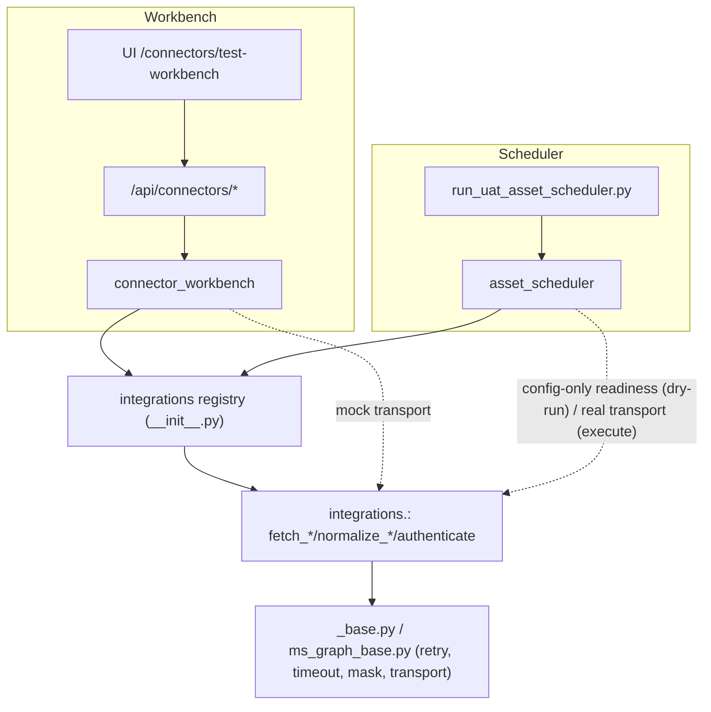

# Connector Test Workbench vs. Asset Scheduler

**Status:** Current · **Owner:** Audit Intelligence / Integrations

> Derived from repository inspection. Sources:
> `modules/audit_intelligence/services/connector_workbench.py`,
> `modules/audit_intelligence/services/asset_scheduler.py`,
> `modules/operations/integrations/*`.

Both the Connector Test Workbench and the Asset Scheduler drive the **same
connector adapters**. They differ in intent, scope, and execution model. The key
point: **the exact same connector code** (`fetch_*` / `normalize_*` / auth) is
reused by both — only the surrounding orchestration and the transport differ.

---

## 1. Side-by-side

| Aspect | Connector Test Workbench | Asset Scheduler |
| --- | --- | --- |
| **Purpose** | Manual testing / debugging of one connector | Batch evidence collection across many assets |
| **Scope** | Single connector, single action | Multiple assets, multiple connectors + baseline |
| **Execution** | Manual (button / API call) | Planned / batch (CLI / service) |
| **Technology detection** | Not needed (connector chosen explicitly) | Yes — fingerprinting classifies each asset |
| **Routing** | None (user picks the connector) | Yes — `_CONNECTOR_ROUTES` selects the adapter |
| **Evidence planning** | None | Yes — `plan_evidence` -> `EvidencePlan` |
| **Parallel / bulk fetch** | No (one call) | Yes — many planned jobs |
| **Health check** | Yes (`/api/connectors/{name}/health-check`) | Config-only readiness in dry-run |
| **Parser validation** | Yes (`parser-test`, mock transport) | Via real fetch on execution |
| **Dry run** | Yes (`/api/connectors/{name}/dry-run`) | Yes (`asset_scheduler.dry_run`) |
| **Repository update** | No | Yes (on execution) — `evidence_repository` |
| **Observation generation** | No | Yes (via validation) |
| **Dashboard refresh** | No | Yes (dashboard cache invalidation) |
| **Notification** | No | Downstream of execution |
| **Audit readiness** | No | Yes (reuse + readiness) |
| **Network calls** | None (mock transport) | None in dry-run; real on opt-in execution |
| **Entry point** | `routes_audit_intelligence.py` + `connector_workbench` | `scripts/run_uat_asset_scheduler.py` + `asset_scheduler` |

---

## 2. Connector Test Workbench (purpose recap)

- Single connector, manual execution, debugging.
- Health check, config validation, dry-run, parser validation.
- **No** scheduler, **no** batch, **no** orchestration.
- Always safe to click: parser-test uses an in-process mock transport; no secrets.

See `docs/connector_test_workbench_design.md`.

## 3. Asset Scheduler (purpose recap)

- Batch execution over many assets; technology detection; routing; evidence
  planning; (opt-in) parallelizable fetch; repository update; observation
  generation; dashboard refresh; audit readiness.

See `docs/scheduler_runtime_flow.md`.

---

## 4. The same connector code is reused

Both paths call the identical adapter surface in
`modules/operations/integrations/<name>`: `get_config()`, `is_configured()`,
`masked_config()`, `health_check()`, the client class, `authenticate()`,
`fetch_*()`, `normalize_*()`. Neither path re-implements connector logic.

### Code path — Workbench (parser test)
`POST /api/connectors/{name}/parser-test` → `connector_workbench.parser_test(name)`
→ import `integrations.<name>` → build client with an **in-process mock transport**
→ `authenticate()` (mock token) → `<primary fetch>()` → `normalize_*()` → preview.
No network, no secrets.

### Code path — Scheduler (routing → execution)
`asset_scheduler.classify_asset()` → `_CONNECTOR_ROUTES[asset_type|technology]`
= adapter module name. Dry-run reports config-only readiness
(`is_configured()`/`masked_config()`). Execution (opt-in) constructs the adapter
with a **real transport** and calls the same `fetch_*()`/`normalize_*()`, then
persists via `evidence_repository` and validates via `evidence_validation`.

**Difference in one line:** the *transport* (mock vs real) and the *orchestration*
(single manual call vs planned batch) differ; the *connector code* is identical.

---

## 5. When to use which

| Situation | Use |
| --- | --- |
| "Is my SharePoint config right? Does the parser work?" | Workbench (config-status, health-check, parser-test) |
| "Collect evidence for all UAT assets and refresh dashboards" | Scheduler (plan + execute) |
| "What would the scheduler do without touching anything?" | Scheduler `--dry-run` |
| "Debug a single connector's normalized output safely" | Workbench parser-test |

---

## 6. Related documentation

- `docs/connector_test_workbench_design.md`
- `docs/scheduler_runtime_flow.md`
- `docs/enterprise_connector_api_reference.md`
- `docs/runtime_call_graph.md`
