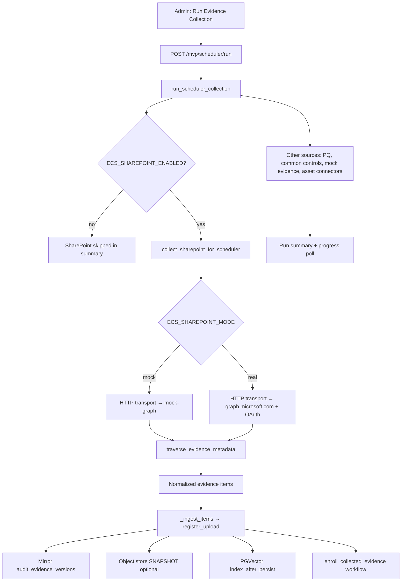
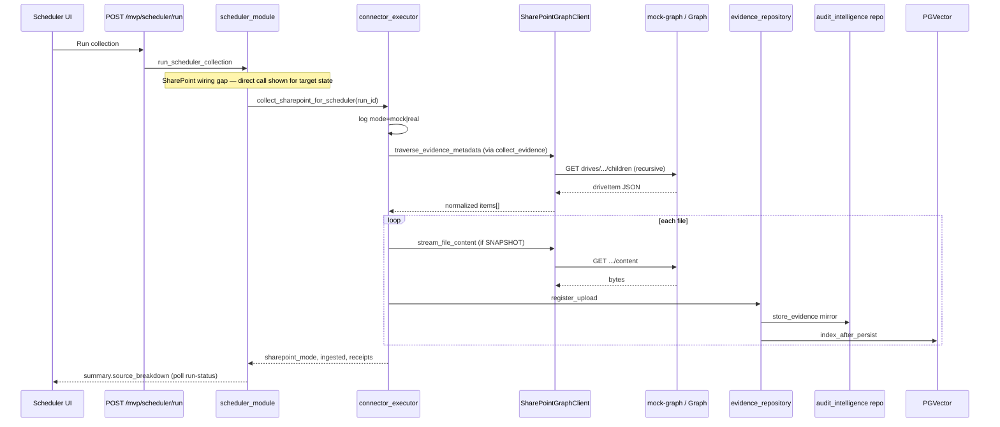

# Software Requirements Specification (SRS)

## Mock SharePoint Graph Evidence Collection

| Field | Value |
|-------|-------|
| **Document ID** | ECS-UC-P1-SPG-001 |
| **Version** | 1.0 |
| **Status** | Implementation-aligned (Phase 1) |
| **Last updated** | 2026-07-23 |
| **Primary UI** | Administration → Evidence Collection → **Run Evidence Collection** (`/mvp/scheduler`) |
| **Implementation maturity** | 🟡 **PARTIAL** — connector, mock Graph service, scheduler helper, and source-summary builders exist; full scheduler run wiring is incomplete (see §13, §25) |

---

## 1. Purpose

This use case enables ECS to collect compliance evidence from a SharePoint document library via the **existing Microsoft Graph SharePoint connector** (`sharepoint_graph`), using either:

1. **Mock mode** — a local Graph-compatible HTTP service (`mock_graph`) backed by deterministic fixtures under `data/mock-sharepoint/`, for offline/demo testing without Entra ID credentials; or  
2. **Real mode** — live Microsoft Graph with OAuth2 client-credentials against a configured tenant.

Collected files traverse the **existing** evidence pipeline: connector normalization → `register_upload()` → PostgreSQL mirror → optional MinIO snapshot custody → PGVector indexing → workflow enrollment. **No parallel scheduler or persistence pipeline is introduced.**

---

## 2. Business Objective

| Objective | Outcome |
|-----------|---------|
| Validate SharePoint folder contract locally | Prove `Application/Environment/Framework/Control/file` paths map to ECS metadata before UAT |
| Reduce UAT dependency on Azure | Run full ingest + hash + storage + indexing without tenant secrets in demo |
| Preserve production path | Same connector and persistence code serves real Graph when credentials are configured |
| Operational visibility | Scheduler run summary reports SharePoint mode, discovered/downloaded/ingested counts, duplicates, and failures |

---

## 3. Scope

### In scope (implemented or partially implemented)

- SharePoint Graph connector (`modules/operations/integrations/sharepoint_graph.py`)
- Shared Graph base (`modules/operations/integrations/ms_graph_base.py`)
- Evidence folder path parser (`modules/operations/integrations/sharepoint_evidence_path.py`)
- Connector → evidence bridge (`modules/audit_intelligence/services/connector_executor.py`)
- Scheduler-oriented SharePoint collector (`collect_sharepoint_for_scheduler`)
- Scheduler source summary builder (`build_sharepoint_source_summary` in `scheduler_module.py`)
- Mock Graph HTTP service (`mock_graph/main.py`)
- Deterministic fixtures (`data/mock-sharepoint/…`)
- Existing persistence: ops repo, audit-intelligence repo, object store, PGVector hook
- Connector Test Workbench and REST collect API (manual/operator path)
- Asset-scheduler connector jobs when `ECS_CONNECTOR_EXECUTION_ENABLED=true` (separate flag)

### Out of scope (not implemented)

- Writing back to SharePoint or Graph
- Delegated (user) OAuth flows
- Multi-site / multi-drive orchestration beyond configured `site_id` / `drive_id`
- Production `mock-graph` container in non-demo compose profiles (see §18)
- Dedicated SharePoint-only scheduler UI tab (uses shared Run Collection modal)

---

## 4. Actors

| Actor | Role |
|-------|------|
| **Operations Owner / Administrator** | Triggers Run Evidence Collection; selects applications/frameworks |
| **ECS Scheduler** | Background worker in `scheduler_module.run_scheduler_collection` / `start_scheduler_collection_async` |
| **SharePoint Graph Connector** | `SharePointGraphClient.traverse_evidence_metadata` |
| **Connector Executor** | `collect_sharepoint_for_scheduler`, `collect_evidence`, `_ingest_items` |
| **Evidence Repository** | `operations/engines/evidence_repository.register_upload` |
| **Audit Intelligence Repository** | `audit_intelligence/engines/evidence_repository.store_evidence` (mirror) |
| **PGVector Indexer** | `ecs_platform/evidence_indexing.index_after_persist` |
| **Mock Graph Service** | FastAPI app in `mock_graph/main.py` |
| **Microsoft Graph (real mode)** | External API at `https://graph.microsoft.com/v1.0` |

RBAC: scheduler page access follows existing MVP role capabilities (`modules/shared/services/module_capabilities.py` → `_scheduler_view`).

---

## 5. Preconditions

### Mock mode

| Precondition | Variable / artifact |
|--------------|---------------------|
| SharePoint collection enabled | `ECS_SHAREPOINT_ENABLED=true` |
| Mode set to mock | `ECS_SHAREPOINT_MODE=mock` (default when unset) |
| Graph base URL points to mock service | `ECS_GRAPH_BASE_URL=http://mock-graph:8080/v1.0` (or host-local equivalent) |
| Drive or site id present | `ECS_GRAPH_DRIVE_ID=test-drive` and/or `ECS_GRAPH_SITE_ID=test-site` |
| Mock service reachable | `GET /health` on mock-graph returns `status: ok` |
| Fixture tree present | Files under `data/mock-sharepoint/` |
| Snapshot custody (optional) | `ECS_EVIDENCE_SNAPSHOT_ENABLED=true` for file byte download + object storage |
| PGVector (optional) | `ECS_VECTOR_PG_*` configured; embedding provider available |

Mock mode **does not require** `ECS_GRAPH_TENANT_ID`, `ECS_GRAPH_CLIENT_ID`, or `ECS_GRAPH_CLIENT_SECRET`.

### Real mode

| Precondition | Variable |
|--------------|----------|
| `ECS_SHAREPOINT_MODE=real` | Never silently falls back to mock |
| Entra app credentials | `ECS_GRAPH_TENANT_ID`, `ECS_GRAPH_CLIENT_ID`, `ECS_GRAPH_CLIENT_SECRET` |
| Site configured | `ECS_GRAPH_SITE_ID` (and optionally hostname/path/folder vars) |
| Graph permissions + admin consent | `Sites.Read.All`, `Files.Read.All` (application) |
| Network egress to Graph and Entra token endpoint | HTTPS |

### Scheduler (general)

| Precondition | Notes |
|--------------|-------|
| User authenticated (non-demo) | `ECS_AUTH_ENABLED` per environment |
| Scheduler not paused | `scheduler_module.is_scheduler_paused()` |

---

## 6. Workflow

### 6.1 High-level flow



### 6.2 SharePoint folder traversal (connector)

1. Resolve config via `sharepoint_graph.get_config()` (env + YAML).
2. Authenticate: mock → static `mock-graph-token`; real → client-credentials POST to `{authority}/{tenant}/oauth2/v2.0/token`.
3. Start at drive root or `ECS_SHAREPOINT_FOLDER_PATH` if set.
4. Recursively list children via Graph paths:
   - `drives/{drive-id}/root/children`
   - `drives/{drive-id}/root:/{folder-path}:/children`
   - `drives/{drive-id}/items/{item-id}/children`
5. For each file, parse relative path with `parse_evidence_folder_path` (`Application/Environment/Framework/Control/file`).
6. Emit normalized records via `normalize_evidence_record` (metadata only during traversal).
7. On ingest, optionally `stream_file_content` → `drives/{drive-id}/items/{item-id}/content` when SNAPSHOT custody enabled.

### 6.3 Fixture paths (mock data)

| Relative path | Application | Environment | Framework | Control | File |
|---------------|-------------|-------------|-----------|---------|------|
| `NetBanking/UAT/ITPP/IT-C-03/access_review.json` | NetBanking | UAT | ITPP | IT-C-03 | access_review.json |
| `NetBanking/UAT/ASST/ASST-ENC-01/encryption_evidence.txt` | NetBanking | UAT | ASST | ASST-ENC-01 | encryption_evidence.txt |
| `Payments/PROD/MBSS/MBSS-LOG-01/audit_logging.csv` | Payments | PROD | MBSS | MBSS-LOG-01 | audit_logging.csv |

Supported environments include `UAT`, `Production`, `PROD`, `DR`, `SOC Production` (`sharepoint_evidence_path.SUPPORTED_ENVIRONMENTS`).

---

## 7. Functional Requirements

| ID | Requirement | Implementation | Status |
|----|-------------|----------------|--------|
| FR-01 | Enable/disable SharePoint scheduler collection | `ECS_SHAREPOINT_ENABLED`; `sharepoint_graph.sharepoint_enabled()` | ✅ |
| FR-02 | Select mock vs real mode | `ECS_SHAREPOINT_MODE=mock\|real`; `sharepoint_mode()` | ✅ |
| FR-03 | Configurable Graph base URL | `ECS_GRAPH_BASE_URL`; default mock `http://mock-graph:8080/v1.0` | ✅ |
| FR-04 | Mock mode without tenant/client/secret | `SharePointGraphClient.is_configured()` + `authenticate()` mock branch | ✅ |
| FR-05 | Real mode requires credentials; no mock fallback | `collect_sharepoint_for_scheduler` explicit failure when `real` + not configured | ✅ |
| FR-06 | Recursive folder traversal | `SharePointGraphClient.traverse_evidence_metadata` | ✅ |
| FR-07 | Evidence folder contract validation | `parse_evidence_folder_path` | ✅ |
| FR-08 | Persist via existing upload bridge | `connector_executor._ingest_items` → `register_upload` | ✅ |
| FR-09 | SHA-256 duplicate detection | `evidence_repository._register_search_index` + custody hash | ✅ |
| FR-10 | Metadata: `source_connector=sharepoint_graph`, `source_mode`, `graph_item_id` | `_ingest_items` metadata enrichment | ✅ |
| FR-11 | Log mode at collection start/end | `ecs_logging.info("SharePoint", f"mode={mode} …")` | ✅ |
| FR-12 | Scheduler run summary SharePoint row | `build_sharepoint_source_summary` | ✅ |
| FR-13 | Invoke SharePoint from full scheduler run alongside PQ/common controls | Wire `collect_sharepoint_for_scheduler` in `run_scheduler_collection` | 🟡 **Gap** — helper exists; run path missing `sp_result`/`sp_enabled` args |
| FR-14 | Mock Graph container in demo compose | `mock-graph` service on port 8080 | 🟡 **Gap** — `mock_graph/` code exists; compose still references `local-graph-poc:9100` |
| FR-15 | Proof script for end-to-end pipeline | `scripts/test_mock_sharepoint_pipeline.sh` | ⛳ **Future** (specified, not present) |

---

## 8. UI Requirements

| ID | Requirement | Location | Status |
|----|-------------|----------|--------|
| UI-01 | Run Evidence Collection action | `/mvp/scheduler` — modal `#schedRunModal` (`scheduler_modals.html`) | ✅ |
| UI-02 | Application/framework multi-select from canonical catalog | `#schedRunApps`, `#schedRunFw`; `get_scheduler_selection_catalog(role)` | ✅ |
| UI-03 | Async progress polling | `GET /mvp/scheduler/run-status?run_id=` | ✅ |
| UI-04 | Completion summary with per-source table | `#schedRunSummary`; `renderSourceBreakdown()` | ✅ (SharePoint row populated when `source_breakdown` includes `sharepoint_graph`) |
| UI-05 | Fetched Evidence tab with source_type filter | `/mvp/scheduler?tab=fetched_evidence`; columns include Source Type, Query/Connector | ✅ |
| UI-06 | SharePoint-specific mode badge in UI | Not implemented | ⛳ Future |
| UI-07 | Connector Test Workbench manual collect | `/mvp/connectors/test-workbench` | ✅ |

---

## 9. Backend APIs

### 9.1 Scheduler (primary operator path)

| Method | Path | Handler | Purpose |
|--------|------|---------|---------|
| `POST` | `/mvp/scheduler/run` | `routes_mvp.mvp_scheduler_run` | Start collection; form or JSON (`X-ECS-Scheduler-JSON: 1`) |
| `GET` | `/mvp/scheduler/run-status` | `mvp_scheduler_run_status` | Poll progress + `summary` |
| `GET` | `/mvp/scheduler` | `mvp_scheduler` | Dashboard, execution history, fetched evidence |
| `GET` | `/mvp/scheduler/fetched-evidence/view` | `mvp_scheduler_fetched_evidence_view` | View/download artifact |

**Service entry:** `modules/operations/engines/scheduler_module.run_scheduler_collection`

**SharePoint-specific service entry (callable, not yet wired into full run):**  
`modules/audit_intelligence/services/connector_executor.collect_sharepoint_for_scheduler`

### 9.2 Connector REST (workbench / automation)

| Method | Path | Purpose |
|--------|------|---------|
| `GET` | `/api/connectors` | List connectors |
| `GET` | `/api/connectors/sharepoint_graph/config-status` | Masked config + readiness |
| `POST` | `/api/connectors/sharepoint_graph/health-check` | Config health |
| `POST` | `/api/connectors/sharepoint_graph/parser-test` | Traversal/parser dry-run |
| `POST` | `/api/connectors/sharepoint_graph/collect` | Live collect + ingest (opt-in) |

### 9.3 Mock Graph (external to ECS app)

| Method | Path | Purpose |
|--------|------|---------|
| `GET` | `/health` | Service health |
| `POST` | `/{tenant}/oauth2/v2.0/token` | Mock token (`mock-graph-token`) |
| `GET` | `/v1.0/sites/{site-id}/drives` | List drives |
| `GET` | `/v1.0/drives/{drive-id}/root/children` | Root listing |
| `GET` | `/v1.0/drives/{drive-id}/root:/{path}:/children` | Path-based folder listing |
| `GET` | `/v1.0/drives/{drive-id}/items/{item-id}/children` | Recursive folder walk |
| `GET` | `/v1.0/drives/{drive-id}/items/{item-id}/content` | File bytes |

---

## 10. Database Design

ECS uses **two PostgreSQL databases** in demo compose plus an in-memory ops list.

### 10.1 Audit intelligence mirror (`ecs_repository` / SQLite in tests)

**Table:** `audit_evidence_versions`  
**Module:** `modules/audit_intelligence/services/sql_persistence.py`

| Column | Type | SharePoint usage |
|--------|------|------------------|
| `evidence_key` | TEXT PK (part) | `{asset_id}::{control_id}` |
| `version` | INTEGER PK (part) | Incremented per persist |
| `control_id` | TEXT | From folder path `control_or_observation` |
| `asset_id` | TEXT | From folder path `application` |
| `collected_at` | TEXT | Upload timestamp |
| `document` | JSON | Full `EvidenceArtifact` including `source_connector`, `metadata`, `sha256` |
| `source_item_id` | TEXT | Graph `item_id` / stable id |
| `content_hash` | TEXT | SHA-256 for dedup |

**Dedup index:** `ix_ev_source_hash (source_item_id, content_hash)`

### 10.2 Operations MVP list (in-process)

**Module:** `modules/operations/engines/evidence_repository.evidence_repository`  
Append-only list of upload records returned by `register_upload()` — used by scheduler fetched-evidence UI and PGVector registration hook.

### 10.3 Scheduler history (in-memory)

**Module:** `scheduler_module._execution_history`  
Each run stores `summary.source_breakdown[]` including optional `sharepoint_graph` row with `sharepoint_mode`, `discovered`, `downloaded`, `persisted`, etc.

---

## 11. Object Storage

| Component | Module | Behavior |
|-----------|--------|----------|
| Custody resolver | `modules/audit_intelligence/services/evidence_custody.py` | `REFERENCE_ONLY` default; `SNAPSHOT` when enabled |
| MinIO (demo) | `ecs_platform/storage/object_store.py` | `MINIO_ENDPOINT`, `MINIO_ACCESS_KEY`, `MINIO_SECRET_KEY` |
| Local fallback | `LocalObjectStore` | Used when MinIO unavailable |
| SharePoint snapshot | `SharePointGraphClient.stream_file_content` | GET `…/items/{id}/content` when SNAPSHOT + `sharepoint_graph` ingest |

Uploaded records expose `object_uri` / `metadata.object_key` on ops evidence rows.

---

## 12. Metadata

### 12.1 Normalized connector item (`normalize_evidence_record`)

| Field | Source |
|-------|--------|
| `source` | `sharepoint_graph` |
| `evidence_type` | `sharepoint_evidence` |
| `item_id` | Graph driveItem `id` |
| `drive_id` | Config / parent |
| `filename` | Parsed from path |
| `application`, `environment`, `framework`, `control_or_observation` | Path parser |
| `web_url`, `mime_type`, `modified_datetime` | Graph item |

### 12.2 Persisted upload metadata (`register_upload` / `_ingest_items`)

| Field | Value |
|-------|-------|
| `source_type` | `sharepoint_graph` |
| `source_connector` | `sharepoint_graph` (ops record) |
| `source_mode` | `mock` or `real` |
| `graph_item_id` | Same as `source_item_id` / Graph item id |
| `connector_id` | `sharepoint_graph` |
| `scheduler_run_id` | Set when collected via scheduler |
| `collection_source` | Connector fields preserved in metadata dict |

Workflow enrollment: `evidence_workflow_engine.enroll_collected_evidence(..., source_type="sharepoint_graph")`.

---

## 13. Scheduler Integration

| Component | Path | Notes |
|-----------|------|-------|
| Run entry | `scheduler_module.run_scheduler_collection` | Also `start_scheduler_collection_async` |
| SharePoint collector | `connector_executor.collect_sharepoint_for_scheduler` | Returns `sharepoint_mode`, `discovered`, `downloaded`, `ingested`, `duplicates`, `failed`, `receipts` |
| Summary builder | `build_sharepoint_source_summary` | Included in `build_run_source_breakdown` rows |
| Progress log | `SchedulerProgressLog` | SharePoint step **not yet appended** in run path |
| Coexistence | Same run executes predefined queries (`collect_scheduled_predefined_queries`), common controls, mock evidence, asset connectors | Independent failure domains intended |

**Known gap:** `run_scheduler_collection` currently calls `build_run_source_breakdown` without `sp_result` and `sp_enabled`, and does not invoke `collect_sharepoint_for_scheduler`. Operators can still collect SharePoint evidence via:

- Connector workbench `POST /api/connectors/sharepoint_graph/collect`
- Asset scheduler when `ECS_CONNECTOR_EXECUTION_ENABLED=true` and planned `sharepoint_graph` jobs exist

---

## 14. Connector Integration

| Layer | Module | Responsibility |
|-------|--------|----------------|
| Adapter | `sharepoint_graph.SharePointGraphClient` | Graph HTTP, normalization, traversal |
| Graph base | `ms_graph_base.GraphAdapter` | OAuth, pagination, `graph_collect` |
| Path rules | `sharepoint_evidence_path` | Folder contract + environment allow-list |
| Executor map | `connector_workbench._ADAPTER_TESTS["sharepoint_graph"]` | Client class + `traverse_evidence_metadata` |
| Ingestion bridge | `connector_executor._ingest_items` | `register_upload` + workflow |
| HTTP transport | `integrations.build_http_transport` | Real/mock HTTP; `ECS_GRAPH_VERIFY_SSL` for local HTTP |

**Separate activation flag:** `ECS_CONNECTOR_EXECUTION_ENABLED` controls asset-scheduler connector jobs; **`ECS_SHAREPOINT_ENABLED`** is the dedicated scheduler SharePoint flag (FR-01).

---

## 15. Evidence Repository

| Stage | Function | Output |
|-------|----------|--------|
| Register | `evidence_repository.register_upload` | Ops record with `evidence_id`, `sha256`, `version` |
| Mirror | `_mirror_to_audit_repository` → `ai_repo.store_evidence` | Versioned artifact in `audit_evidence_versions` |
| Version audit | `audit_trail.record_version` | Version row |
| Workflow | `enroll_collected_evidence` | App Owner queue via `evidence_workflow_engine` |
| Fetched UI | `_scheduler_fetched_evidence` | Filters `source_type=sharepoint_graph` |

Duplicate handling: same SHA-256 → `search_index.reason=duplicate_content`; receipt may carry `duplicate: true`.

---

## 16. Embeddings / PGVector

| Step | Module | Behavior |
|------|--------|----------|
| Post-persist hook | `evidence_repository._register_search_index` | Called from `register_upload` |
| Indexer | `ecs_platform/evidence_indexing.index_after_persist` | Chunks normalized text; embeds via configured provider |
| Vector store | `ecs_platform/vectorstore/pgvector_store.PgVectorStore` | Table `evidence_chunks` (default name from config): `chunk_id`, `evidence_uid`, `text`, `metadata`, `embedding vector(dim)` |
| Status in summary | `search_index.indexed`, `_classify_pgvector_status` | `indexed` / `skipped` / `failed` / `provider_unavailable` |

Indexable SharePoint files: JSON, CSV, plain text when SNAPSHOT custody provides bytes; otherwise metadata JSON fallback text is indexed.

---

## 17. Security

| Control | Implementation |
|---------|----------------|
| Secrets never logged | `mask_secret` in adapter configs; no secret fields in API responses |
| Mock mode isolation | No real credentials required; static mock token only |
| Real mode | Client secret from env/secret store only; TLS to Graph (verify SSL default true) |
| No silent downgrade | Real mode failure returns explicit configuration error — does not call mock-graph |
| RBAC | Scheduler and connector APIs respect existing role capabilities |
| Read-only Graph scopes | Documented in `docs/graph-api/MS_GRAPH_CONNECTOR_GUIDE.md` |

---

## 18. Configuration

| Variable | Default (demo) | Purpose |
|----------|----------------|---------|
| `ECS_SHAREPOINT_ENABLED` | `false` | Master enable for scheduler SharePoint path |
| `ECS_SHAREPOINT_MODE` | `mock` | `mock` or `real` |
| `ECS_GRAPH_BASE_URL` | mock: `http://mock-graph:8080/v1.0`; real: `https://graph.microsoft.com/v1.0` | Graph API root |
| `ECS_GRAPH_SITE_ID` | `test-site` (demo) | Site identifier |
| `ECS_GRAPH_DRIVE_ID` | `test-drive` (demo) | Document library drive |
| `ECS_GRAPH_TENANT_ID` | — | Required real mode |
| `ECS_GRAPH_CLIENT_ID` | — | Required real mode |
| `ECS_GRAPH_CLIENT_SECRET` | — | Required real mode |
| `ECS_GRAPH_ACCESS_TOKEN` | Optional bypass | Token broker / POC |
| `ECS_SHAREPOINT_SITE_HOSTNAME` | — | Optional site resolution |
| `ECS_SHAREPOINT_SITE_PATH` | — | Optional site path |
| `ECS_SHAREPOINT_FOLDER_PATH` | `ECS-Evidence` in compose (optional) | Evidence root folder within drive |
| `ECS_GRAPH_VERIFY_SSL` | `false` acceptable for local mock HTTP | |
| `ECS_EVIDENCE_SNAPSHOT_ENABLED` | env-specific | Download file content for object store |
| `ECS_CONNECTOR_EXECUTION_ENABLED` | Separate from SharePoint flag | Asset-scheduler connector jobs |
| `MINIO_*` / `ECS_VECTOR_PG_*` | See `docker-compose.yml` | Object store + vectors |

YAML overlays: `config/environments/_base.yaml`, `config/integrations.yaml` (`sharepoint_graph` block).

---

## 19. Error Handling

| Condition | Response | User-visible signal |
|-----------|----------|---------------------|
| `ECS_SHAREPOINT_ENABLED=false` | `status: skipped`, `skip_reason` set | Summary row `sharepoint_graph` skipped |
| Real mode, missing credentials | `status: failed`, explicit reason string | Summary + logs |
| Mock mode, missing drive/site | `status: failed` | Configuration error |
| Invalid folder path | Item in `rejected[]`; traversal continues | `rejection_code`: `incomplete_path`, `unsupported_environment` |
| Duplicate content hash | `search_index.reason=duplicate_content` | Summary `duplicates` counter |
| Graph HTTP failure | `error_response` from adapter; classified status | Summary `failed` |
| Ingest item exception | Per-item receipt `{error: …}`; run continues | Partial status |
| Mirror/index failure | Best-effort; `audit_repository_synced: false` | PGVector `skipped` / `mirror_failed` |

All connector/scheduler paths **never raise** to the HTTP caller (`collect_evidence`, `collect_sharepoint_for_scheduler`).

---

## 20. Logging

| Event | Logger | Example message |
|-------|--------|-----------------|
| SharePoint scheduled start | `ecs_logging.info("SharePoint", …)` | `mode=mock scheduled collection starting run_id=COLL-…` |
| SharePoint scheduled complete | Same | `mode=mock completed discovered=3 ingested=3 …` |
| Scheduler run | `log_scheduler` | `Evidence collection demo-mock; ingested=N; run_id=…` |
| Predefined query / other sources | `PredefinedQueries`, etc. | Independent per source |

Logs must include **`mode=mock`** or **`mode=real`** for SharePoint collection (FR-11).

---

## 21. Audit Trail

| Event | Module | Trigger |
|-------|--------|---------|
| `Evidence Uploaded` | `audit_trail.log_event` | Each successful `register_upload` |
| Version record | `audit_trail.record_version` | New evidence version |
| Scheduler run | `log_scheduler` / `_execution_history` | Manual collection completion |

SharePoint-specific audit fields live in evidence metadata (`source_mode`, `graph_item_id`, `scheduler_run_id`), not a separate audit table.

---

## 22. Sequence Flow



---

## 23. Acceptance Criteria

| ID | Criterion | Verification |
|----|-----------|--------------|
| AC-01 | Mock mode collects 3 fixture files without Azure credentials | Traverse returns 3 accepted items; 3 `register_upload` rows |
| AC-02 | Real mode with missing credentials fails with clear error | `collect_sharepoint_for_scheduler` returns `skip_reason` mentioning tenant/client/secret/site |
| AC-03 | Real mode never calls mock-graph URL | Network/log inspection; `ECS_GRAPH_BASE_URL` must point to Graph |
| AC-04 | Each persisted item has `source_connector=sharepoint_graph`, `source_mode`, `graph_item_id` | Ops metadata inspection |
| AC-05 | Re-run with unchanged files increments duplicate/skip, not new versions | SHA-256 dedup |
| AC-06 | Scheduler summary includes `sharepoint_graph` row with mode and counters | `GET /mvp/scheduler/run-status` → `summary.source_breakdown` |
| AC-07 | Other scheduler sources still run when SharePoint fails | PQ / common controls counters independent |
| AC-08 | PGVector hook invoked or skipped with reason | `search_index` on ops record |
| AC-09 | Object storage populated when SNAPSHOT enabled | `object_uri` / MinIO bucket object |
| AC-10 | Logs contain `mode=mock` or `mode=real` | Log grep |

---

## 24. Test Cases

### 24.1 Existing automated tests (run today)

| Test module | Coverage |
|-------------|----------|
| `tests/test_sharepoint_graph_connector.py` | Config, masking, traversal, pagination, path rejection, duplicate item ids, normalize shapes |
| `tests/test_evidence_repository_persistence.py` | SharePoint metadata via `register_upload`; connector executor ingest |
| `tests/test_connector_execution_ingestion.py` | Connector bridge (SharePoint tree noted separately) |
| `tests/test_enterprise_connectors_uat_config.py` | Env var wiring for Graph/SharePoint |
| `tests/test_scheduler_source_summary.py` | Scheduler summary shape (connectors dry-run; not SharePoint-specific yet) |

**Representative commands:**

```bash
.venv/bin/python -m pytest tests/test_sharepoint_graph_connector.py -q
.venv/bin/python -m pytest tests/test_evidence_repository_persistence.py -k sharepoint -q
.venv/bin/python -m pytest tests/test_enterprise_connectors_uat_config.py -k sharepoint -q
```

### 24.2 Planned tests (specified, not yet in repo)

| ID | Test | Expectation |
|----|------|-------------|
| TC-01 | Mock Graph folder listing | Graph-shaped JSON from `mock_graph` `/v1.0/drives/.../children` |
| TC-02 | Mock Graph file download | `/content` returns fixture bytes |
| TC-03 | `collect_sharepoint_for_scheduler` mock, no credentials | `ingested=3` against fixtures |
| TC-04 | Real mode rejects missing credentials | `status=failed`, no ingest |
| TC-05 | Scheduler invokes SharePoint + PQ in one run | Both rows in `source_breakdown` |
| TC-06 | Rerun idempotent | Second run `duplicates` ≥ 1, `ingested=0` |
| TC-07 | PGVector status reported | `pgvector_detail` not plain zero without reason |

### 24.3 Manual / integration

| Step | Action |
|------|--------|
| 1 | Start `mock-graph`: `uvicorn mock_graph.main:app --port 8080` |
| 2 | Set env: `ECS_SHAREPOINT_ENABLED=true`, `ECS_SHAREPOINT_MODE=mock`, `ECS_GRAPH_BASE_URL=http://127.0.0.1:8080/v1.0`, drive/site ids |
| 3 | Call `collect_sharepoint_for_scheduler(run_id=TEST)` from Python shell or workbench collect |
| 4 | Verify ops repo + fetched evidence UI |
| 5 | Administration → Run Evidence Collection (after scheduler wiring complete) |

---

## 25. Future Enhancements

| ID | Enhancement | Rationale |
|----|-------------|-----------|
| FE-01 | Wire `collect_sharepoint_for_scheduler` into `run_scheduler_collection` | Close FR-13 gap; pass `sp_result`/`sp_enabled` to `build_run_source_breakdown` |
| FE-02 | Add `mock-graph` service to `docker-compose.yml` (port 8080); migrate from `local-graph-poc:9100` | Align compose with `ECS_GRAPH_BASE_URL` default |
| FE-03 | Add `scripts/test_mock_sharepoint_pipeline.sh` | Operator proof script per pipeline validation |
| FE-04 | Add `tests/test_mock_sharepoint_scheduler.py` | Automated coverage for TC-01–TC-07 |
| FE-05 | Progress event `sharepoint` step in `SchedulerProgressLog` | Live modal feedback |
| FE-06 | Document `ECS_SHAREPOINT_MODE` in `.env.example` | Operator discoverability |
| FE-07 | SharePoint mode indicator in Fetched Evidence UI | Faster audit of mock vs real artifacts |
| FE-08 | Production compose profile without mock-graph | Real-only defaults for prod |

---

## Appendix A — Source file index

| Area | Path |
|------|------|
| SharePoint connector | `modules/operations/integrations/sharepoint_graph.py` |
| Graph base | `modules/operations/integrations/ms_graph_base.py` |
| Path parser | `modules/operations/integrations/sharepoint_evidence_path.py` |
| Connector executor | `modules/audit_intelligence/services/connector_executor.py` |
| Scheduler | `modules/operations/engines/scheduler_module.py` |
| Scheduler routes | `modules/shared/routes/routes_mvp.py` |
| Scheduler UI | `modules/operations/templates/mvp_scheduler.html`, `partials/scheduler_modals.html` |
| Evidence register | `modules/operations/engines/evidence_repository.py` |
| Audit mirror | `modules/audit_intelligence/engines/evidence_repository.py` |
| SQL persistence | `modules/audit_intelligence/services/sql_persistence.py` |
| PGVector | `ecs_platform/evidence_indexing.py`, `ecs_platform/vectorstore/pgvector_store.py` |
| Object store | `ecs_platform/storage/object_store.py` |
| Mock Graph | `mock_graph/main.py` |
| Fixtures | `data/mock-sharepoint/` |
| Legacy mock POC | `local_graph_poc/mock_graph.py` (superseded by `mock_graph/` for new fixtures) |
| Connector docs | `docs/graph-api/MS_GRAPH_CONNECTOR_GUIDE.md`, `docs/connectors/SHAREPOINT.md` |

---

## Appendix B — Mock vs real compatibility statement

| Aspect | Mock Graph (`mock_graph`) | Real Microsoft Graph |
|--------|---------------------------|----------------------|
| Authentication | Static token / optional token endpoint | OAuth2 client-credentials |
| HTTP API shape | Subset of Graph driveItem JSON | Full Graph v1.0 |
| SharePoint connector code path | **Same** `SharePointGraphClient` | **Same** |
| Persistence pipeline | **Same** `register_upload` → mirror → PGVector | **Same** |
| Proves | Folder contract, ingest, hash, storage, indexing | Entra auth, live site/drive ACLs, throttling |

Mock mode validates **Graph response compatibility and ECS ingest plumbing**. Real mode additionally validates **tenant authentication and production SharePoint permissions** — only real mode proves Entra integration.

---

*This document reflects the ECS codebase as inspected on 2026-07-23. It does not describe planned behaviour as implemented when code gaps are noted in §7, §13, and §25.*
