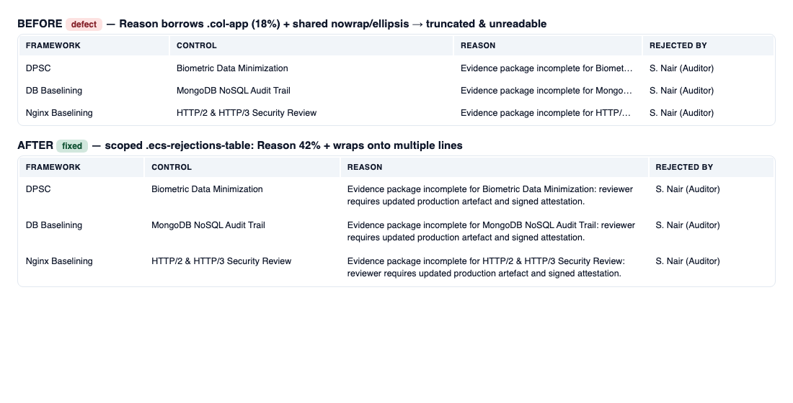
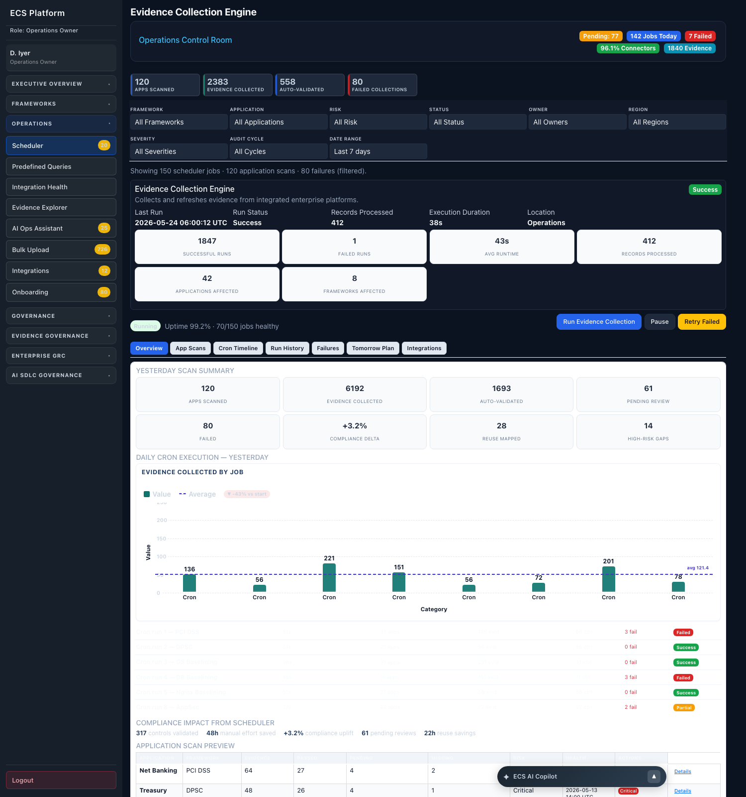
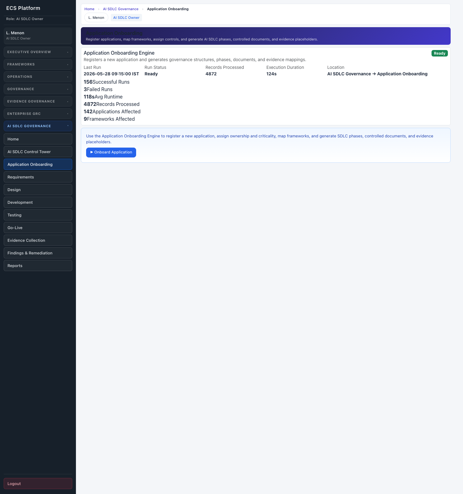
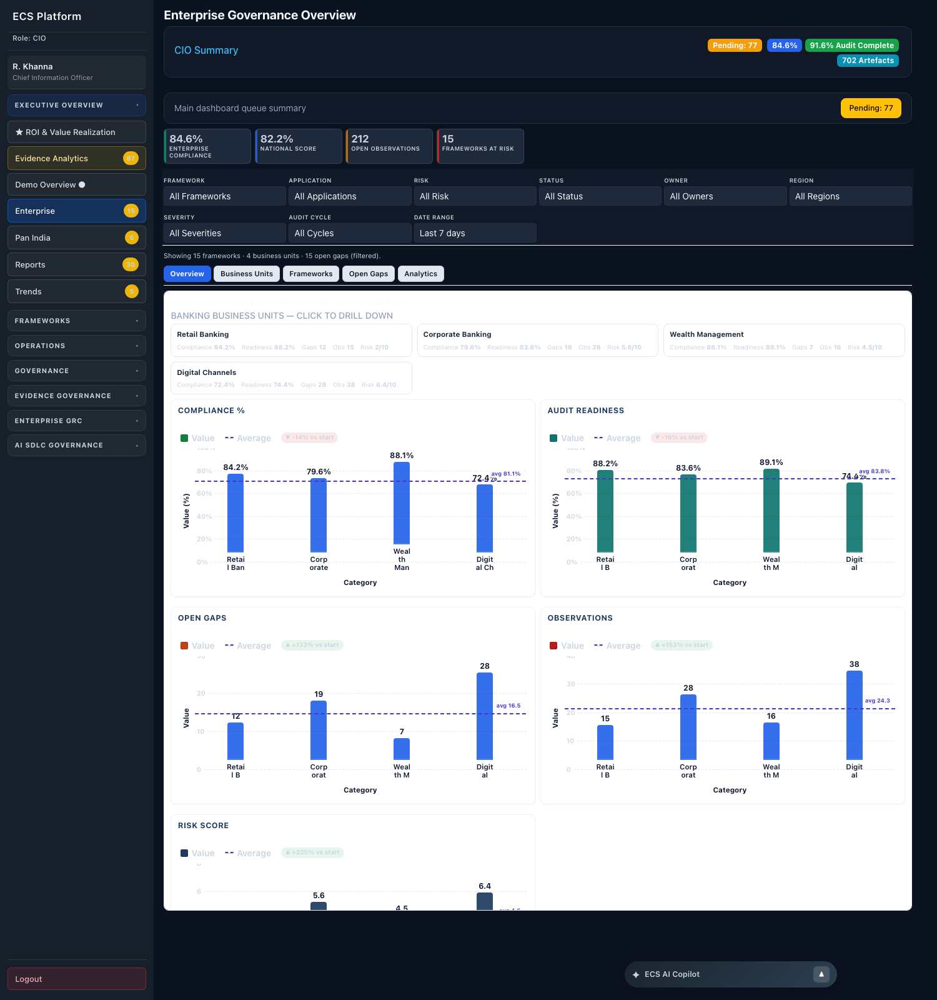

# Cross-Role Visual & Resiliency Audit — Propagation of Recent Demo Hotfixes

**Type:** Demo-only audit + minimal-propagation hotfix
**Date:** 2026-06-16
**Method:** Static template/CSS analysis + live rendering on the running demo server (`http://127.0.0.1:8000`, DEMO_MODE) + headless-Chrome screenshots.

---

## 0. Executive Summary

The four recently-fixed defects were audited role-by-role. **Three of the four
fixes were already global** (shared partials / backend) and required no
propagation. **One defect (Evidence Rejections "Reason" readability) was found to
exist identically in exactly one other template** — the CIO executive dashboard
(`cio_dashboard.html`, used by the **CIO** and **AI Governance Owner** roles) —
and was fixed with the *same scoped, minimal* CSS used on the primary dashboard.

**Net change: 1 file modified** (`modules/executive_overview/templates/cio_dashboard.html`).
The primary demo login (`/dashboard`, owner) and all shared assets are **untouched**.

---

## 1. What the "recent fixes" actually were (scope classification)

| # | Fix | Where it lives | Scope |
|---|---|---|---|
| A | Integration Health `Sync All Sources` 500 → structured failure | `ecs_platform/ingestion.py` (`sync_connector`/`sync_all`) | **Backend, global** — single endpoint `POST /mvp/platform/sync-all`, role-independent |
| B | Evidence Rejections "Reason" column truncated/unreadable | `modules/executive_overview/templates/dashboard.html` (scoped `.ecs-rejections-table`) | **Per-template** — only `/dashboard` (owner, auditor) was fixed |
| C | Scheduler metric/summary card labels faded in demo dark theme | `modules/operations/templates/partials/scheduler_styles.html` (scoped `.ecs-cap-scheduler .ecs-sched-card`) | **Per-page** — only the scheduler page |
| D | Compact bar charts crushed/clipped ("upside-down", top-anchored) | `modules/shared/templates/partials/{ecs_chart_standard,ecs_executive_table_system,enterprise_theme}.html` | **Shared, global** |
| E | Charts not self-describing (missing axes/titles/units) | `modules/shared/templates/partials/executive_charts_system.html` | **Shared, global** |

Because D and E live in `modules/shared/...` (the chart system every page imports)
and A is a single backend function, those three fixes apply to **every role
automatically**. The audit therefore concentrated on B and C, which are
template/page-scoped.

---

## 2. Roles & pages tested

**Roles exercised** (via login routing + `?role=` query param):
Application Owner, Auditor, CIO, AI Governance Owner (→cio template), Vertical Head,
Compliance Head, Compliance Officer (→compliance template), Security Officer
(→compliance template), Functional Head, Operations Owner, AI SDLC Owner,
Framework Owner (→compliance permissions), Admin, Control Owner (no dashboard).

**Pages loaded / inspected:** `/dashboard` (owner, auditor), `/dashboard/cio`,
`/dashboard/vertical-head`, `/dashboard/compliance-head`, `/dashboard/functional-head`,
`/mvp/enterprise`, `/mvp/scheduler`, `/mvp/integration-health`,
`/mvp/ai-sdlc/control-tower`, `/mvp/ai-sdlc/onboarding`, plus the governance/evidence
tables that also surface a "Reason" column (`mvp_evidence_approval`,
`mvp_exception_governance`, `mvp_governance_analytics`).

All 12 smoke-tested role pages returned **HTTP 200** after the change.

---

## 3. Audit Matrix

> Legend: **Root cause** = the exact mechanism fixed in the original hotfix.
> **Fix?** = whether the *identical* root cause + defect is present (per acceptance criteria).

### 3a. Fix B — Evidence Rejections "Reason" readability

| Role(s) | Page / Template | Issue found | Root cause | Fix? |
|---|---|---|---|---|
| Owner, Auditor | `/dashboard` → `dashboard.html` | — (already fixed) | `.ecs-risk-table` + `col-app`(18%) on long-text Reason | **Already fixed** |
| **CIO, AI Governance Owner** | `/dashboard/cio` → **`cio_dashboard.html`** | **"Active Rejections" Reason truncated to one ellipsized line** (10 rows of full-sentence reasons) | **Identical**: `.ecs-risk-table` + `col-app`(18%) + shared `td{white-space:nowrap;overflow:hidden;text-overflow:ellipsis}` | **YES** |
| Vertical Head | `/dashboard/vertical-head` → `dashboard_vertical_head.html` | No rejections table present | n/a | NO CHANGE REQUIRED |
| Compliance Head / Officer / Security Officer | `/dashboard/compliance-head` → `dashboard_compliance_head.html` | No rejections table present | n/a | NO CHANGE REQUIRED |
| Functional Head | `/dashboard/functional-head` → `dashboard_functional_head.html` | No rejections table present | n/a | NO CHANGE REQUIRED |
| Auditor | `mvp_evidence_approval.html` (Reason column) | Reason renders fine (wraps) | Different table system (`data-ecs-std-table`, auto-layout) — **not** `.ecs-risk-table` | NO CHANGE REQUIRED |
| Compliance Head | `mvp_exception_governance.html` (Reason column) | Reason renders fine | Different table system (`data-ecs-std-table`) | NO CHANGE REQUIRED |
| CIO | `mvp_governance_analytics.html` (Reason column) | Reason renders fine | Different table system (`ecs-fit-table`, auto-layout) | NO CHANGE REQUIRED |

### 3b. Fix C — Metric/summary card label contrast (demo dark theme span-wash)

Root cause recap: demo dark theme repaints `p,span,label,small…{color:#CBD5E1}`.
A faded label appears **only** when a tile has a **hardcoded light background** that
the dark theme does *not* repaint **AND** its label is a ``/`label`/`small`.
Onboarding is safe because its labels are `
` (`.ecs-onboard-kpi-lbl`).

| Role(s) | Page / Template | Issue found | Root cause present? | Fix? |
|---|---|---|---|---|
| Operations Owner | `/mvp/scheduler` → `.ecs-sched-card` | — (already fixed) | Yes (light tile `#f8fafc` + `` label + demo theme) | **Already fixed** |
| AI SDLC Owner | `/mvp/ai-sdlc/onboarding`, `/mvp/ai-sdlc/control-tower` (reuse `.ecs-sched-card` via `execution_engine_panel`) | Tiles lack card chrome but text is **dark-on-light, fully readable** | **No** — these pages do **not** load the demo dark theme (`demo_mode` not set) **and** do not load `scheduler_styles.html`, so neither the span-wash nor the light tile bg exists | NO CHANGE REQUIRED |
| CIO | `/mvp/enterprise` → `.exec-kpi` cards | KPI cards render dark with **readable** light values + labels | **No** — cards render on dark surface; labels are light-on-dark (correct contrast) | NO CHANGE REQUIRED |
| Auditor/Owner/etc. | widely-used `.ecs-exec-kpi` widget (pending approvals, framework grid, AI Ops, integration health) | Renders readable in demo mode | **No** — covered by the universal contrast engine / dark-surface rules | NO CHANGE REQUIRED |
| Owner, Auditor, CIO, Vertical/Compliance/Functional Head | executive dashboards | n/a | **No** — executive dashboards use `enterprise_theme.html`, not the demo dark theme; the span-wash rule is never loaded | NO CHANGE REQUIRED |

### 3c. Fix A (sync 500) & Fix D/E (charts) — global, verified

| Area | Verification | Fix? |
|---|---|---|
| Integration Health `Sync All Sources` | Backend `ingestion.py` returns structured per-connector results; endpoint role-independent (admin-gated) | Already global — NO CHANGE |
| Compact bar charts | `/mvp/enterprise` (CIO) charts render bars growing **up** from baseline with value labels, Y-axis scale, axis + category labels (see screenshot) | Already global — NO CHANGE |
| Chart axes/titles/units | Same screenshot shows "Value (%)", "Category", legends, benchmark line | Already global — NO CHANGE |

---

## 4. Issues NOT found (explicitly cleared)

- No faded card labels on AI SDLC, Enterprise, AI-Ops, Integration-Health, or any
  executive dashboard (Fix C does not generalize — root cause absent).
- No broken/clipped/inverted charts on any role page (shared chart fix already global).
- No additional `.ecs-risk-table` long-text-column squeeze in vertical/compliance/
  functional head dashboards or in the governance/evidence-approval Reason tables
  (those use different, auto-layout table systems).
- No 500s: all 12 audited role pages returned HTTP 200.

---

## 5. Files modified

| File | Change | Lines |
|---|---|---|
| `modules/executive_overview/templates/cio_dashboard.html` | Added scoped `.ecs-rejections-table` style block (head) + applied `rej-col-*` / `rej-reason-cell` classes to the "Active Rejections" table. **Byte-for-byte the same fix shipped in `dashboard.html`.** | +~24 (style) / 2 markup lines |

No other files changed. No shared partials, no backend, no RBAC, no navigation, no
data generation, no chart system, no themes touched.

---

## 6. Before / After evidence

**Fix B — CIO "Active Rejections" Reason cell** (rendered with the real shared
`.ecs-risk-table` CSS + the real scoped fix + real rejection data):

- **Before:** Reason crushed into the 18% `col-app` cell with `white-space:nowrap` →
  `Evidence package incomplete for Biomet…` (truncated, unreadable).
- **After:** scoped `.ecs-rejections-table` widens Reason to 42% and wraps → full
  sentence readable.

**Fix C reference — Scheduler (already fixed), readable dark-on-light tiles:**

**Fix C cleared — AI SDLC Onboarding reuses the same tiles but renders readable
(light theme, no demo span-wash); no defect to propagate:**

**Fix C/D/E cleared — Enterprise (CIO): KPI labels readable, charts render
correctly (bars up from baseline, axes/labels present):**

---

## 7. Regression Protection (primary demo role)

- **`dashboard.html` (primary demo / owner login) was NOT modified** — confirmed
  via `git status` (only `cio_dashboard.html` shows as modified).
- Shared chart partials, `enterprise_theme.html`, `ingestion.py`, RBAC, nav, and
  data generation are **untouched**, so Main Dashboard, Enterprise, Pan India,
  Reports, Trends, Operations Scheduler, Integration Health, Evidence Health, and
  Governance dashboards are byte-identical for every role except the single CIO
  rejections table.
- Post-change smoke test: `/dashboard` (owner & auditor), `/dashboard/cio`
  (cio & ai_governance_owner), `/dashboard/vertical-head`, `/dashboard/compliance-head`
  (compliance & security_officer), `/dashboard/functional-head`, `/mvp/scheduler`,
  `/mvp/enterprise`, `/mvp/ai-sdlc/control-tower`, `/mvp/integration-health` →
  **all HTTP 200**.
- The CIO fix is additive and strictly scoped to a class (`.ecs-rejections-table`)
  used by exactly one table; all other CIO-dashboard content is unchanged.

---

## 8. Risk Assessment

**Risk: LOW.**

- One template, one table; CSS scoped to a unique class. No shared/global selector
  introduced; no new design language (reuses the exact tokens/widths from the
  already-approved `dashboard.html` fix).
- No backend, RBAC, navigation, data, or chart-system changes.
- Primary demo login provably unchanged.
- Rollback = revert the single `cio_dashboard.html` change.

---

## 9. Final Regression Verdict

**PASS.** The Evidence-Rejections readability fix now also covers the CIO / AI
Governance Owner dashboard. All roles that already rendered correctly remain
untouched. The primary demo login is unchanged and safe. No visual differences
were introduced on any previously-correct page. No revert required.
